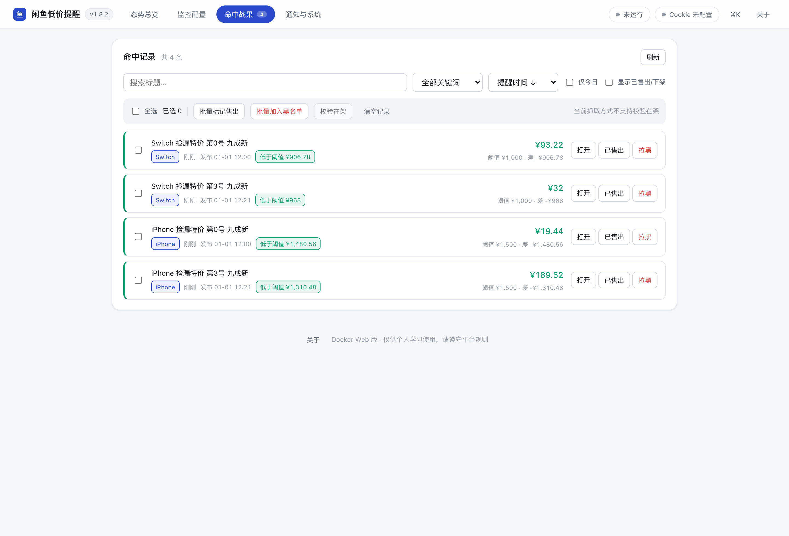
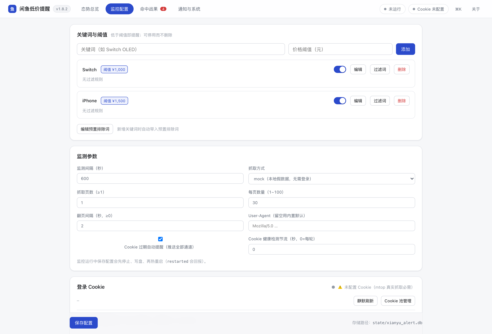
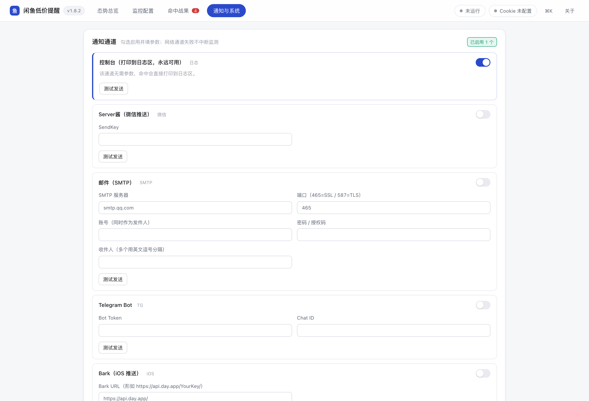

# 闲鱼低价提醒工具（xianyu-alert）

[](https://github.com/17funnyway8-ux/xianyu-low-price-alert/actions/workflows/ci.yml)
[](https://github.com/17funnyway8-ux/xianyu-low-price-alert/releases)
[](LICENSE)
[](https://www.python.org/)
[](https://hub.docker.com/r/17funnyway8/xianyu-alert)

**自托管的闲鱼「捡漏」监控**：按关键词周期性抓取最新商品，筛出**新出现且价格低于阈值**的，去重后推送到 控制台 / 微信 / 邮件 / Telegram / Bark / 企业微信。
提供 **Docker Web**（手机随时看）与 **Windows / macOS 桌面版**（本机 7×24 挂机）双形态，同一套配置与数据。

[English](README_EN.md) · [快速开始](#-docker-compose-快速开始推荐) · [常见问题](#-常见问题与排障) · [文档索引](#-文档索引) · [安全边界](#-安全边界)


---

## 📷 界面预览

Docker Web 版（下面的截图来自真实运行的实例，mock 数据）：

| 命中战果 | 监控配置 |
|---|---|
|  |  |

**通知与系统**（通道配置、Cookie 池、实时日志）



---

## ✨ 核心价值

- **双形态覆盖全部场景**：Docker Web（随时随地的手机 / 远程管理）+ Windows exe / macOS .app（本机 7×24 挂机），同一套配置与数据。
- **抓取路径主流且克制**：走闲鱼 mtop 签名接口（行业共识路线），纯 `requests` 轻量实现——镜像仅约 130MB，零外部 API 成本（对比 Playwright 重方案 1GB+）。
- **精确过滤，少打扰**：关键词 + 独立价格阈值，支持**排除词**（回收 / 置换等）与**必含词**（16G / DDR4 等），双重去重保证同一商品**永不重复提醒**。
- **多账号 Cookie 池**：按轮次轮换取用，过期自动停用并推送提醒；Cookie **Fernet 加密落盘**（`fernet1:`），磁盘无明文，全接口脱敏。
- **Web 全功能**：关键词 / 过滤词 / Cookie 池 / 6 种通知通道 / 运行监控（校验在架、售出撤销、黑名单、清空记录）/ SSE 实时日志；远程访问可开 `Bearer` token 认证。
- **开箱即用**：镜像已发布 **Docker Hub（amd64 + arm64 多架构）**，`docker run` 两条命令起服务，无需克隆仓库；也可从源码构建。
- **工程可靠**：**930+ 个全 mock 测试**（无外网依赖，20 秒跑完）+ CI 三平台矩阵（Linux/Windows/macOS）+ 覆盖率门槛 + 双平台自动构建发布 + 进程单实例锁（崩溃自动释放）+ SQLite 热备指引。

---

## 🚀 Docker Compose 快速开始（推荐）

Docker 版 = **FastAPI Web 界面（:8080）+ monitor 后台线程 + CLI 调试**三合一，一键常驻运行，数据全部落在宿主机卷，删容器不丢数据。

镜像地址：`17funnyway8/xianyu-alert`（标签 `latest` / `1.9.5` / `sha-<commit>`）

### 1. 部署（二选一）

**方式 A：直接用现成镜像（最快，不用克隆仓库）**

```bash
mkdir -p xianyu-data && sudo chown -R 1000:1000 xianyu-data   # ⚠️ 镜像以非 root(uid 1000) 运行

docker run -d --name xianyu-alert \
  -p 127.0.0.1:8080:8080 \
  -e XY_DATA_DIR=/app/data -e TZ=Asia/Shanghai \
  -v "$PWD/xianyu-data:/app/data" \
  --restart unless-stopped \
  17funnyway8/xianyu-alert:1.9.5
```

**方式 B：用 docker compose（含健康检查与资源限制，推荐长期使用）**

```yaml
# docker-compose.yml（精简可部署版；完整注释版见仓库根目录 docker-compose.yml）
services:
  xianyu-alert:
    image: 17funnyway8/xianyu-alert:1.9.5   # 想自己构建：保留下面这行并加 --build
    # build: .
    container_name: xianyu-alert
    restart: unless-stopped          # 宿主机重启 / 崩溃自动拉起
    environment:
      XY_DATA_DIR: /app/data         # 数据目录（config / 密钥 / SQLite 全部落卷）
      TZ: Asia/Shanghai              # 提醒记录时间正确
      # XY_WEB_TOKEN: "change-me-随机串"   # 远程访问时启用 Bearer 认证（见下文）
    ports:
      - "127.0.0.1:8080:8080"        # 默认仅本机访问；远程改 "8080:8080"
    volumes:
      - ./xianyu-data:/app/data      # ⚠️ 备份时 config.yaml / secret.key / state/ 三件套一起备
    healthcheck:
      test: ["CMD", "python", "-c",
        "import urllib.request;urllib.request.urlopen('http://127.0.0.1:8080/healthz', timeout=4)"]
      interval: 30s
      timeout: 5s
      retries: 3
      start_period: 10s
    deploy:
      resources:
        limits:
          memory: 256M
          cpus: "0.5"
```

### 2. 启动 / 使用

```bash
# 启动常驻 Web（拉取 Docker Hub 现成镜像）
docker compose -p xianyu-alert up -d

# 想从源码构建（改过代码 / 无外网时）：把 compose 里的 image 换成 build: .，然后
# docker compose -p xianyu-alert up -d --build

# 健康检查（HTTP /healthz，含 monitor 线程状态）
curl http://127.0.0.1:8080/healthz

# 打开 Web 界面
open http://127.0.0.1:8080/

# 查看日志 / 停止（SIGTERM 优雅退出）
docker compose -p xianyu-alert logs -f
docker compose -p xianyu-alert down
```

### 3. 远程访问（可选）

1. 把 `ports` 改为 `"8080:8080"`；
2. 设置 `XY_WEB_TOKEN` 为强随机串并重启容器；
3. 此后除 `/healthz`、`/`、`/static/*` 外，全部 API 要求 `Authorization: Bearer <token>`（前端首次访问会弹 token 输入框）；
4. 进阶：再用 Caddy `basic_auth` 反代或 Tailscale 组网做第二层保护。

未设 token 时默认仅 `127.0.0.1` 可访问。

> 容器内 CLI 调试：`docker compose -p xianyu-alert run --rm xianyu-alert cookie status --config config.example.yaml`。
> Web 运行中**不可**执行 `once` / `run`（会与 Web 进程抢单实例锁，返回退出码 2）。

### 4. 桌面版 → Docker 数据迁移

把桌面版三件套复制到卷对应位置即可（桌面版数据目录：Windows exe 同目录 / macOS `~/Library/Application Support/闲鱼低价提醒工具/`）：

```bash
cp <桌面版>/config.yaml                 ./xianyu-data/config.yaml
cp <桌面版>/secret.key                  ./xianyu-data/secret.key      # 缺失则存量 Cookie 无法解密
cp <桌面版>/state/xianyu_alert.db       ./xianyu-data/state/xianyu_alert.db
```

> ⚠️ 老版 Windows `dpapi1:` 密文跨平台不可解（预期降级），Web 里重新粘贴 Cookie 即可。

---

## 📦 桌面版（Windows / macOS）

无需 Docker 的轻量选择，双击即用：

- **Windows**：从 [GitHub Releases](https://github.com/17funnyway8-ux/xianyu-low-price-alert/releases) 下载 `xianyu-low-price-alert-win64-<tag>.exe`（onefile，无需安装 Python）。
- **macOS**：下载 `xianyu-low-price-alert-macos-arm64-<tag>.zip`（.app，M 系列芯片）。

使用要点：

1. 首次启动会生成 `config.yaml`；数据落在 **exe/.app 同目录 `state/`**（macOS 为 `~/Library/Application Support/闲鱼低价提醒工具/`）；
2. 在 GUI「监控配置」添加关键词与价格阈值，勾选通知通道，填入 Cookie 后点击**开始监控**；
3. 同数据目录下**只允许一个实例运行**（单实例锁，崩溃后 OS 自动释放，无需人工删锁）。

源码模式运行：

```bash
python -m venv .venv && .venv/bin/pip install -r requirements.txt
# macOS GUI 另需：.venv/bin/pip install -r requirements-macos.txt
.venv/bin/python -m xianyu_alert.cli run   --config config.yaml   # 持续监测
.venv/bin/python -m xianyu_alert.cli once  --config config.yaml   # 只跑一轮（适合 cron）
.venv/bin/python -m xianyu_alert.cli gui                          # 启动图形界面
```

---

## 🔑 获取闲鱼 Cookie

Cookie 是真实抓取的**必需前提**（保存前会自动校验：过期 / 缺 `_m_h5_tk` 会拒绝保存）。三种方式任选：

- **方式 A（推荐 · 半自动）**：安装可选依赖后自动打开浏览器登录并提取：

  ```bash
  pip install -r requirements-cookie.txt
  playwright install chromium
  python -m xianyu_alert.cli login --config config.yaml
  ```

- **方式 B（脚本 / 粘贴）**：浏览器登录后从开发者工具复制 Cookie 请求头，直接传入或粘贴：

  ```bash
  python -m xianyu_alert.cli login --config config.yaml \
    --cookie-string "cookie2=...; _m_h5_tk=..."
  ```

- **方式 C（Web 界面）**：Docker 版无需浏览器——打开「监控配置 → Cookie 管理（池）」添加 / 刷新条目，保存时自动校验并 **Fernet 加密落盘**。

> 巡检小工具：`python -m xianyu_alert.cli cookie status --config config.yaml` 只检测单值 + Cookie 池各条健康状态（脱敏回显、不写入配置），适合脚本 / SSH 远程巡检。

---

## ⚙️ 配置要点（config.yaml）

| 配置项 | 默认 | 说明 |
| --- | --- | --- |
| `keywords[].keyword` | 必填 | 搜索关键词，不可重复 |
| `keywords[].max_price` | 必填 | 价格阈值，`price < max_price` 才提醒 |
| `keywords[].exclude_keywords` | `[]` | 排除词：标题命中**任一**即跳过（回收 / 置换 / 收购…） |
| `keywords[].required_keywords` | 自动提取 | 必含词：标题必须**全部包含**（如 `16G`、`DDR4`）；`[]` = 不强制 |
| `monitor.interval_seconds` | 600 | 监测间隔秒数，生产建议 **600~900**（过短易触发风控） |
| `monitor.cookies` | `""` | 闲鱼 Cookie，保存时自动 Fernet 加密（`fernet1:`） |
| `monitor.cookie_pool` | `[]` | 多账号池：`[{name, cookie, enabled}]` 按轮次轮换（池优先、单值兜底） |
| `fetcher.type` | `mtop` | `mtop` 真实抓取（默认）/ `mock` 离线演示 |
| `fetcher.pages` | 1 | 多页抓取页数（翻页增加请求频率与风控风险） |
| `storage.path` | `state/xianyu_alert.db` | SQLite 路径，目录自动创建；`:memory:` 为内存库 |
| `notify.channels` | `[{type: console}]` | 通知通道列表，见下 |

通知通道：`console`（无参数）· `serverchan`（`sendkey`）· `email`（`smtp_host/smtp_port/username/password/to`）· `telegram`（`bot_token/chat_id`）· `bark`（`url`）· `webhook`（`url`，POST JSON，适配企业微信机器人）。

参数不完整的通道自动跳过并打 warning；所有通道都不可用时兜底为 `console`，保证提醒不静默丢失。完整模板见 `config.example.yaml`。

---

## 🧪 测试 / CI

全部测试使用 MockFetcher + 内存 SQLite + mock 网络请求，**不访问外网**：

```bash
python -m unittest discover -s tests
```

934 个测试覆盖模型校验、SQLite 去重持久化、通知构造、监控主链路、Cookie 加密 / 健康检测、多页抓取、路径与 GUI 逻辑。CI（`.github/workflows/release.yml`）在打 `v*` tag 时自动构建 Windows exe + macOS .app 并发布 GitHub Release（含 Docker 镜像构建）。

---

## 🧠 工作原理（30 秒版）

每轮对每个关键词：**抓取** → **关键词过滤**（排除词命中 / 必含词缺失即跳过）→ 与**上一轮结果**比对出「新出现」→ 新商品中 `price < max_price` 且未提醒过的 → 发送通知并标记。双保险去重：`prev_ids` 判断是否新出现（跨重启有效），`notified` 标志保证同一商品永不重复提醒（跨重启有效）。

---

## ⚠️ 注意事项

- **风控**：闲鱼是强反爬站点，接口带签名且需要登录态。请合理控制频率（间隔 ≥ 300 秒）、优先使用多 Cookie 池轮换；页面结构 / 签名随时可能变动，遇到 `RGV587` 或 `FAIL_SYS_*` 错误说明请求过频或 Cookie 失效，稍后再试 / 刷新 Cookie 即可。程序对抓取异常做了优雅降级（单轮失败不中断、不崩溃）。
- **备份三件套**：`config.yaml`（配置 + 密文 Cookie）+ `secret.key`（Fernet 密钥，**缺失则存量 Cookie 无法解密**）+ `state/xianyu_alert.db`（提醒记录）必须**一起备份**。SQLite 热备示例见 `docker-compose.yml` 注释 / [docs/v1.8_Docker化增量研判与执行方案.md](docs/dev/v1.8_Docker化增量研判与执行方案.md)。
- **免责声明**：本工具仅供个人学习与自用监测。请遵守目标站点 robots 协议与服务条款，合理控制请求频率，勿用于商业爬取或对站点造成压力；因使用本工具产生的账号风险由使用者自行承担。

---

## 🔐 安全边界

本工具会接触你的闲鱼登录态，请务必了解以下边界：

| 项 | 说明 |
| --- | --- |
| **默认无 Web 认证** | compose 默认只绑 `127.0.0.1`，且不启用认证。**一旦把端口暴露到公网，必须设置 `XY_WEB_TOKEN`**，否则任何人都能读写你的配置与 Cookie |
| **Cookie 加密落盘** | 落盘为 Fernet 密文（`fernet1:`），接口返回统一脱敏；但 `secret.key` 与 `config.yaml` 同卷，**密钥泄漏等同 Cookie 泄漏** |
| **备份三件套** | `config.yaml` + `secret.key` + `state/` 必须一起备份 / 迁移，缺一不可 |
| **容器运行身份** | 镜像以非 root（uid 1000）运行；挂载宿主目录前请先 `chown -R 1000:1000 ./xianyu-data` |
| **漏洞报告** | 请勿在公开 Issue 披露安全问题，走 [SECURITY.md](SECURITY.md) 的私密渠道 |

---

## ❓ 常见问题与排障

### 部署与运行

**Q：Docker 起来后打不开 8080？**
先看健康检查 `curl http://127.0.0.1:8080/healthz`。容器在跑但端口不通，多半是端口被占用（compose 默认只绑 `127.0.0.1`）。看日志：`docker compose logs -f`。

**Q：容器报 Permission denied / 写不进数据卷（v1.8.2 起）**
镜像已改为**非 root（uid 1000）**运行，首次部署或从旧版本升级时需让宿主目录属主对齐：

```bash
mkdir -p xianyu-data && sudo chown -R 1000:1000 xianyu-data
```

**Q：提示「已有实例运行中」？**
单实例锁生效：同一数据目录只能跑一个进程。Web 在跑时不要再执行 `cli once/run`（会抢锁）；要手动跑一轮，用界面上的「立即执行一轮」。

**Q：macOS 打开桌面版提示「无法验证开发者」？**
macOS 版是 ad-hoc 签名（自用），首次打开需在「系统设置 → 隐私与安全性」点「仍要打开」，或右键 → 打开。

### 抓取与 Cookie

**Q：出现 `RGV587_ERROR` / `FAIL_SYS_*`？**
风控命中：请求过频或 Cookie 失效。把间隔调到 ≥300 秒、启用多 Cookie 池轮换，或重新登录刷新 Cookie。

**Q：Cookie 会自己刷新吗？**
v1.8.2 起支持无感续期（服务端下发新令牌时自动吸收、节流落盘）。会话彻底失效时才需重新登录：Web 界面「通知与系统 → Cookie 池」粘贴新的 Cookie 字符串。

**Q：`secret.key` 丢了会怎样？**
**存量 Cookie 永久无法解密**（落盘是 Fernet 密文）。备份必须三件套一起：`config.yaml` + `secret.key` + `state/`。

**Q：想先离线试玩 / 抓不到商品？**
把 `fetcher.type` 设为 `mock`（见仓库根 `config.poc.yaml`），生成确定性假数据、完全不访问闲鱼，适合验证部署与通知链路。

### 通知与安全

**Q：通知没收到怎么排查？**
界面「通知与系统」里点测试发送；Bark / Telegram 检查 token 与网络出口；邮件通道用 SMTP 授权码而非登录密码。任何通道失败都只记日志，不会中断监控。

**Q：把 Web 暴露到公网安全吗？**
**默认不建议。** compose 默认只绑 `127.0.0.1` 且不启用认证。确需远程访问务必设置 `XY_WEB_TOKEN`，并放在反向代理 + HTTPS 之后，详见 [安全边界](#-安全边界)。

**Q：Windows exe 被杀软误报？**
PyInstaller 单文件打包的常见误报。可用仓库内 `build/*.spec` 自行重新构建，或添加信任。

---

## 📄 文档索引

完整的分层索引见 **[docs/README.md](docs/README.md)**。最常用的几份：

| 文档 | 内容 |
| --- | --- |
| [docs/user/维护交接文档.md](docs/user/维护交接文档.md) | 运维 / 排障 / 备份迁移（最全，使用者优先看这份） |
| [docs/dev/开发状态与续作指南.md](docs/dev/开发状态与续作指南.md) | 当前状态、架构地图、验证体系（接手开发先看这份） |
| [docs/dev/v1.8_Docker化增量研判与执行方案.md](docs/dev/v1.8_Docker化增量研判与执行方案.md) | Docker 部署细节、备份、迁移 |
| [docs/dev/macOS适配设计文档.md](docs/dev/macOS适配设计文档.md) | macOS Qt 适配与构建 |
| [CHANGELOG.md](CHANGELOG.md) · [SECURITY.md](SECURITY.md) · [LICENSE](LICENSE) | 版本历史 / 安全策略 / 许可证 |
| `config.example.yaml` · `docker-compose.yml` | 配置模板 · 部署编排 |

---

## 📄 许可证

本项目采用 [MIT License](LICENSE)。

免责声明见上方「注意事项」：本工具仅供个人学习与自用监测，请遵守目标站点的服务条款，使用风险由使用者自行承担。
