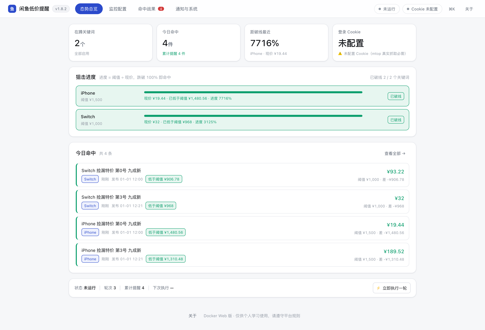

# xianyu-alert — self-hosted price-drop monitor for Xianyu (Goofish)

[](https://github.com/17funnyway8-ux/xianyu-low-price-alert/actions/workflows/ci.yml)
[](https://github.com/17funnyway8-ux/xianyu-low-price-alert/releases)
[](LICENSE)
[](https://www.python.org/)
[](https://hub.docker.com/r/17funnyway8/xianyu-alert)

**xianyu-alert** watches Xianyu (闲鱼 / Goofish, a Chinese second-hand marketplace) for **newly listed items that match your keywords and fall below your price threshold**, de-duplicates them, and pushes alerts to Console / WeChat / Email / Telegram / Bark / WeCom.

It ships in two forms sharing the same config and data:

- **Docker web app** — FastAPI + vanilla JS single-page UI, manage everything from your phone
- **Desktop build** — Windows `.exe` / macOS `.app` for always-on monitoring on your own machine



> 中文文档见 [README.md](README.md)（更完整）。This file is a condensed English overview.

## Features

- **Two form factors** — Docker web UI for remote/mobile use, native desktop app for 7×24 local monitoring; same `config.yaml` and SQLite state.
- **Lightweight fetching** — plain `requests` against the signed mtop API (the mainstream approach), container image ≈130 MB, no external API cost. Playwright-based alternatives routinely exceed 1 GB.
- **Precise filtering** — per-keyword price threshold, exclude-word and required-word lists, double de-duplication (new-this-round + never-notified) so the same listing never alerts twice.
- **Multi-account cookie pool** — round-robin rotation, auto-disable of expired cookies with a notification. Cookies are stored with **Fernet encryption** (`fernet1:` prefix), never in plaintext, and masked in every API response.
- **Full-featured web UI** — keywords, filters, cookie pool, 6 notification channels, shelf-status re-check, sold/blacklist management, SSE live logs, optional Bearer-token auth for remote access.
- **Engineering** — 930+ self-contained mock tests (no network, ~20 s), CI matrix on Linux/Windows/macOS, coverage gates, single-instance lock with crash-safe release, SQLite hot-backup guidance.

## Quick start (Docker)

Prebuilt multi-arch images (**linux/amd64 + linux/arm64**) are published on Docker Hub: [`17funnyway8/xianyu-alert`](https://hub.docker.com/r/17funnyway8/xianyu-alert).

**Option A — run the published image (no clone needed):**

```bash
# The container runs as non-root (uid 1000) since v1.8.2 — align the volume owner first
mkdir -p xianyu-data && sudo chown -R 1000:1000 xianyu-data

docker run -d --name xianyu-alert \
  -p 127.0.0.1:8080:8080 \
  -e XY_DATA_DIR=/app/data -e TZ=Asia/Shanghai \
  -v "$PWD/xianyu-data:/app/data" \
  --restart unless-stopped \
  17funnyway8/xianyu-alert:1.9.2
```

**Option B — docker compose (adds healthcheck & resource limits):**

```bash
git clone https://github.com/17funnyway8-ux/xianyu-low-price-alert.git
cd xianyu-low-price-alert
docker compose up -d              # pulls the published image
# To build from source instead: set build: . in docker-compose.yml, then:
# docker compose up -d --build
```

Health check: `curl http://127.0.0.1:8080/healthz`

Open <http://127.0.0.1:8080>. Data (config, Fernet key, SQLite) lives in `./xianyu-data`.

> The compose file binds to `127.0.0.1` and has **no authentication by default**. If you expose it beyond localhost, set `XY_WEB_TOKEN` and put it behind a reverse proxy with HTTPS.

## Desktop builds

Grab the latest `.exe` (Windows) or `.zip` (macOS arm64) from [Releases](https://github.com/17funnyway8-ux/xianyu-low-price-alert/releases). The macOS build is ad-hoc signed: on first launch use *System Settings → Privacy & Security → Open Anyway*.

## Getting your Xianyu cookie

The monitor needs a logged-in session cookie. In the web UI open **通知与系统 → Cookie 池** and paste a cookie string captured from your browser (or use `python -m xianyu_alert.cli login` for the guided flow). Cookies are validated before saving and encrypted on disk.

## Configuration

See [`config.example.yaml`](config.example.yaml) for every option with comments. The essentials:

| Key | Meaning |
| --- | --- |
| `keywords[].keyword` / `max_price` | what to watch and the price ceiling |
| `keywords[].exclude_keywords` / `required_keywords` | word-level filtering |
| `monitor.interval_seconds` | polling interval — keep ≥ 300 s to stay under the site's rate limits |
| `monitor.cookie_pool` | multiple accounts, rotated per round |
| `fetcher.type` | `mtop` (real) or `mock` (offline deterministic demo data) |
| `notify.channels` | console / wechat / email / telegram / bark / webhook |

## Testing & CI

```bash
pip install -r requirements.txt -r requirements-web.txt -r requirements-dev.txt
python -m unittest discover -s tests      # 930+ tests, all mocked, no network
scripts/quality_audit.sh                  # ruff + mypy + tests + coverage in one shot
```

CI (`.github/workflows/ci.yml`) runs ruff + mypy, the full test suite on Linux/Windows/macOS, and coverage gates (≥55% overall, ≥77% for the core packages). Tagging `v*` triggers the release pipeline (Windows exe + macOS app + multi-arch GHCR image).

## Security

- Cookies are encrypted at rest (Fernet); the key file (`secret.key`) is never committed.
- Back up `config.yaml` + `secret.key` + `state/` **together** — losing the key means the stored cookies can never be decrypted.
- No web authentication by default; enable `XY_WEB_TOKEN` before exposing it.
- Report vulnerabilities privately — see [SECURITY.md](SECURITY.md).

## Documentation

Chinese docs are split by audience in [`docs/`](docs/README.md): `user/` (operations & troubleshooting) and `dev/` (design docs, PRDs, architecture diagrams). Version history in [CHANGELOG.md](CHANGELOG.md).

## License & disclaimer

[MIT](LICENSE). This tool is intended for **personal, self-hosted monitoring only**. Respect the target site's terms of service and keep request rates reasonable; you are responsible for any account risk arising from its use.
