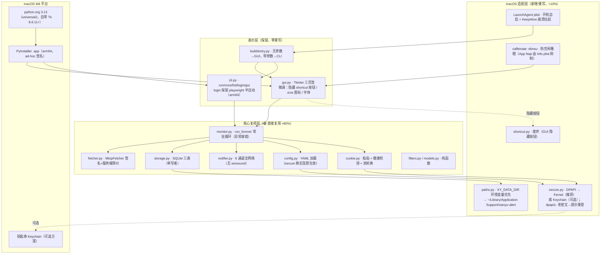
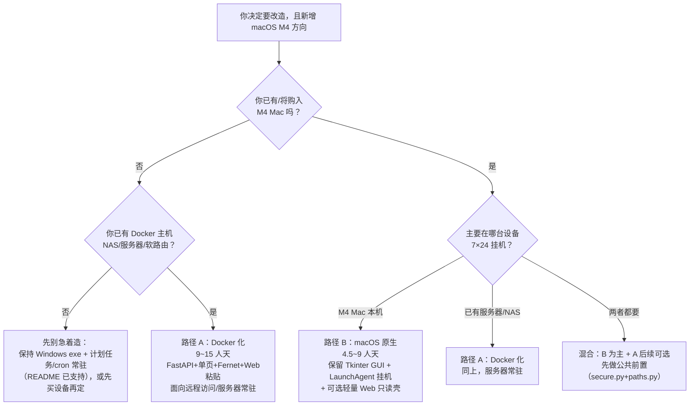

# 闲鱼低价提醒工具 · Docker 与 macOS M4 双路径可行性评估

> 评估人：架构师 高见远（Gao）　|　评估对象：xianyu-alert v1.7.0（Python 3.13 CLI + Tkinter GUI，673 tests）
> 评估基线：`docs/Docker化迁移可行性评估.md`（2025-08-06）、`README.md`、`xianyu_alert/*.py`（14 模块）、`build/*.spec`
> 日期：2025-08-07　|　性质：**纯分析评估**（仅新增本报告，未改动任何项目文件）
> 范围：路径 A（Docker 化，在上份报告基础上**补 7×24 细节 + 对比**）；路径 B（macOS M4 原生适配，**本次新增重点**）

---

## 0. 执行摘要（一屏结论）

| 项 | 路径 A：Docker 化 | 路径 B：macOS M4 原生 |
| --- | --- | --- |
| **可行性等级** | 🟡 **中**（技术可行，价值依赖「有无 Docker 主机/远程需求」） | 🟢 **高**（复用度 ~90%，无 GUI 重写，与现状架构最贴合） |
| **核心工作量** | GUI→Web 重写（≈6~8 人天）是绝对大头 | **无 GUI 重写**；只改安全层 + 打包 + 挂机外壳 |
| **预估工作量** | **9 ~ 15 人天**（引用上份报告，不变） | **4.5 ~ 9 人天**（阶段拆分见 §3.5） |
| **最大风险** | Web 重写质量、容器出口 IP 风控更敏感、首次迁移 Cookie 必重登 | 合盖睡眠（笔记本场景）、`.app` 内数据目录落点、Tk 在 macOS 的观感细节 |
| **关键前提** | 需已有/计划 Docker 主机（NAS/服务器/软路由） | **必须在 M4 Mac 上构建与运行**（PyInstaller 不支持跨平台交叉打包） |

**明确推荐（条件式）**：
- ✅ **若你拥有（或即将购入）M4 Mac——尤其 Mac mini 这类适合常开的设备，且主要自用 → 选路径 B**。工作量约为 A 的一半、无 Web 重写、风控出口 IP 与现状一致、GUI 使用习惯与 Windows exe 完全同构。
- ✅ **若你的目标是「已有 NAS/服务器常驻 + 手机/其它电脑远程访问」→ 选路径 A**（引用上份报告结论，技术路线不变）。
- 🟡 **混合方案最划算**：路径 B 为主 + 可选 P2「轻量 Web 只读壳」（本地浏览器看状态/提醒记录，约 1~2 人天），可覆盖 80% 的远程查看需求，见 §5.3。
- 🔧 **两条路径共用一个「公共前置改造」**：`secure.py` 换跨平台加密（推荐 Fernet）+ `paths.py` 支持数据目录环境变量。**无论最终选哪条，先做这两个改动都不浪费**（见 §1.2）。

**一句话**：从「工作量、复用度、用户画像（不懂命令行）、风控、7×24 目标」五个维度看，**macOS 原生路径整体优于 Docker 路径**；唯一致命前提是——你必须有 M4 Mac 用于构建和常驻。请先回答 §5.4 的三个决策前提问题，再拍板。

---

## 1. 现状与共同约束

### 1.1 当前架构分层（简版，详见上份报告 §1）

```
表示层    gui.py(3634行, Tkinter 三页签) / cli.py(argparse 6子命令) / build/entry.py
业务编排  monitor.py(394行, run_forever/run_once) / config.py(579行) / filters.py(157行)
协议适配  fetcher.py(1532行, MtopFetcher 签名+服务端筛价) / cookie.py(486行, playwright+粘贴+健康检测)
持久化    storage.py(575行, SQLite 三表) / paths.py(97行, frozen 路径解析)
通知      notifier.py(468行, 6 通道全网络)
安全      secure.py(212行, DPAPI via ctypes) / shortcut.py(182行, PowerShell 建 .lnk)
```

**行数实测**：`xianyu_alert/*.py` 共 8787 行；gui.py 3634 行占 41%。测试 673 个方法（`grep -c "def test_" tests/*.py` 实测）。

### 1.2 两条路径都要解决的共同问题（先做不浪费）

| # | 共同问题 | 现状证据 | 路径 A 方案 | 路径 B 方案 | 共用点 |
| --- | --- | --- | --- | --- | --- |
| 1 | **DPAPI→替代** | `secure.py:52-54` `_dpapi_available()` 硬编码 `sys.platform=="win32"`；非 Windows 降级明文（L160-162）或解密返回空（L186-188）——macOS/Linux **不崩但失去加密** | Fernet 对称加密 + 密钥文件（上份报告 §3.2） | Fernet（与 A 统一）**或** macOS Keychain（更原生） | **同一份 `secure.py` 改造**，对外四函数签名不变（`encrypt_text/decrypt_text/is_encrypted/mask_cookie`）→ config/cookie/gui 调用点零改动（config.py:328-330/404-407、cookie.py:326/369） |
| 2 | **Cookie 获取方式** | GUI v3.3 起已移除 playwright 自动登录（gui.py:2522-2526），**GUI 只走粘贴/Cookie 管理**（gui.py:2544+）；`cli login` 保留 playwright（cookie.py:392-462，延迟导入） | Web 粘贴为主（上份报告 §3.3） | **GUI 粘贴 + `cli login` playwright 均天然可用**（playwright 支持 macOS arm64 chromium） | GUI 粘贴链路已存在，两条路径都复用 `detect_cookie_health` 状态灯（cookie.py:174-208） |
| 3 | **7×24 挂机稳定性** | monitor `run_forever` 纯 Python 循环（monitor.py:343-389）；GUI 已内置：日志 2000 行裁剪（gui.py:100-101/1694-1695）、空闲轮询降频 500ms（gui.py:88-91）、优雅关闭 join 超时（gui.py:3545-3584） | `restart=unless-stopped` + HEALTHCHECK + 日志轮转（§2.2） | `launchd KeepAlive` + `caffeinate` + App Nap 抑制（§3.3） | monitor/storage/notifier 零改动直接复用 |
| 4 | **风控** | fetcher 纯 HTTP，对出口 IP 敏感（README:374-391） | 容器出口 IP（数据中心/NAT）风控风险**更高** | 家庭宽带出口 IP，**与现状一致**，风险最低 | 维持 interval≥600s + Cookie 池轮换（cookie.py:236-253） |

### 1.3 两条路径分道扬镳的地方

| 维度 | 路径 A：Docker | 路径 B：macOS 原生 |
| --- | --- | --- |
| 前端形态 | Web 浏览器三页签（重写 gui.py） | 原生 Tkinter GUI（保留） |
| 运行平台 | Linux 容器（amd64/arm64） | macOS arm64（M4） |
| 分发方式 | 镜像 + compose 文件 | PyInstaller `.app` bundle（arm64） |
| 数据目录 | 容器卷 `/app/data` | 需重定向到用户可写目录（`.app` 内不可写，见 §3.4） |
| 开机自启 | compose `restart` | LaunchAgent plist |
| 远程访问 | 天然支持（反代+认证） | 需额外 Web 壳（P2） |

---

## 2. 路径 A：Docker 化（简要，基于上份报告更新）

### 2.1 上份结论回顾（不重复细节）

- **可行性**：🟡 中。技术路线 = **FastAPI + 原生 HTML/JS 单页、单容器、Fernet 加密、Web 粘贴取 Cookie、monitor 后台线程、卷挂 `/app/data`**；复用度 ~70%，重写集中在 gui.py→Web（6~8 人天）+ secure.py 换实现 + entry 重写。
- **工作量**：9~15 人天，分 4 阶段（POC 1~2 → Web 基础 3~5 → Web 全功能 3~5 → 打磨 2~3）。
- **功能映射**：GUI 三页签 → Web 覆盖度 ≈95%，砍 2 项（桌面快捷方式、日志字号微调）。

### 2.2 补：7×24 挂机的 Docker 具体方案（上份报告未展开）

| 项 | 方案 | 说明 |
| --- | --- | --- |
| 进程守护 | compose 顶层 `restart: unless-stopped` | 宿主机重启 / 容器崩溃自动拉起；`on-failure:5` 防 crash-loop 死循环 |
| 健康检查 | Dockerfile `HEALTHCHECK --interval=30s --timeout=5s --retries=3 CMD python -c "import urllib.request;urllib.request.urlopen('http://127.0.0.1:8080/healthz')"` | 监测 Web + monitor 线程存活（`/healthz` 返回 200 且 monitor 未卡死）；`docker ps` 显示 unhealthy 即可被外部告警捕获 |
| 日志轮转 | 容器内日志走 stdout（`docker logs`）；宿主机配 `log-driver: json-file` + `max-size: 10m` + `max-file: 3`（compose `logging:` 段） | 避免日志撑爆磁盘；文件日志 `state/xianyu_alert.log` 已有 RotatingFileHandler 1MB×3（cli.py:43-45/64-69） |
| 数据卷 | `./xianyu-data:/app/data`（含 config.yaml、secret.key、state/） | SQLite 热备份 `sqlite3 db ".backup backup.db"` 无需停机（上份 §3.5）；`secret.key` 权限 0400 |
| 时区 | `ENV TZ=Asia/Shanghai` + `apt-get install tzdata` | 容器默认 UTC 会让提醒记录时间错 8 小时 |
| 资源限制 | compose `deploy.resources.limits: memory: 256M, cpus: '0.5'` | 防抓取异常时吃满宿主机；单用户场景 256M 内存绰绰有余（纯 Python + SQLite） |
| 安全加固 | 默认绑 `127.0.0.1:8080`；远程访问走反代 + basic auth（上份 §7.3） | 未认证 Web 可读明文 Cookie（Fernet 解密后），务必 localhost 起步 |

### 2.3 与 macOS 路径的对比要点（详细对比见 §4）

1. **工作量**：A 的 GUI→Web 重写（6~8 人天）在 B 中不存在——B 直接保留 GUI。
2. **Cookie 获取**：A 在容器内无法跑 playwright（无桌面），必须 Web 粘贴；B 在 macOS 桌面可保留 playwright 半自动登录（cli login）+ GUI 粘贴，体验与现状一致。
3. **风控**：A 的容器出口 IP（尤其云服务器数据中心 IP）比 B 的家庭宽带 IP 更容易被闲鱼风控盯上（推测项，需实测）。
4. **分发/维护**：A 交付镜像 + compose，对不懂命令行的用户仍需「装 Docker」门槛；B 交付双击 .app，与 Windows exe 心智一致。
5. **共同点**：两条路径都要换 secure.py（DPAPI 不可用）、都要处理老 `dpapi1:` 密文（无法解，需重登）、都要处理数据目录路径。

---

## 3. 路径 B：macOS M4 原生适配（重点，本次新增）

### 3.1 macOS M4 平台特征

| 项 | 事实（已核实/标注推测） |
| --- | --- |
| 架构 | M4 = **arm64**（Apple Silicon）。macOS arm64 原生运行，x86_64 应用走 Rosetta 2 转译（能用但非原生，不推荐） |
| Python 3.13 可用性 | ✅ **python.org 官方安装包**：提供 **universal2**（arm64+x86_64 双切片）安装器，M4 上原生 arm64 运行，**自带 Tkinter**（捆绑私有 Aqua Cocoa Tk，不依赖系统 Tk）。✅ **Homebrew**：`brew install python@3.13` 提供 arm64 原生构建，**但默认不带 tkinter**，需额外 `brew install python-tk@3.13`（官方文档与社区一致确认） |
| Tkinter 差异 | python.org 捆绑 Tk 8.6.11+（官方 Tcl/Tk 页确认 3.9.8/3.10.0 起内置 8.6.11；**3.13 捆绑的具体小版本≥8.6.12，推测**）。Tk 8.6.10+ 已支持 Retina 高分屏；macOS 下菜单栏在屏幕顶部（当前 GUI 用按钮不用菜单栏，影响小）；中文字体走系统 PingFang SC 回退，一般正常（**需真机实测**） |
| 建议 | **用 python.org 官方安装包**（`python3.13`，自带 Tkinter 开箱即用）作为开发与打包环境；Homebrew 版本作为备选（需装 python-tk）。不要用 macOS 系统自带 `/usr/bin/python3`（版本旧且无完整 Tk） |

### 3.1.1 macOS 目标架构图（路径 B）



### 3.2 代码适配清单（逐模块判定）

| 模块 | 行数 | 判定 | macOS 处置 | 证据 |
| --- | --- | --- | --- | --- |
| `secure.py` | 212 | 🔴 **重写（接口兼容）** | DPAPI → 替代方案（见下方三方案对比）；对外四函数签名不变，`dpapi1:` 老密文走「不可解密→提示重登」分支 | secure.py:25/52-54/146-195 |
| `shortcut.py` | 182 | 🔴 **废弃/隐藏** | macOS 无 .lnk 语义；`.app` 拖入「应用程序」即用 + LaunchAgent 开机自启替代「桌面快捷方式」；GUI 隐藏按钮即可（失败会优雅返回 None，不崩——shortcut.py:165-175） | shortcut.py:56(winreg)/168(powershell) |
| `gui.py` | 3634 | 🟡 **微调（保留 Tkinter）** | 见 §3.2.1 决策：字体/图标/窗口微调 + 隐藏 shortcut 按钮；线程模型（queue+after）与 macOS 无关，直接可用 | gui.py:10-12/42-53/3545-3584 |
| `notifier.py` | 468 | 🟢 **直接复用** | **确认无 winsound/蜂鸣**（全项目 grep `winsound|sound|beep` 零命中于 xianyu_alert/，蜂鸣是历史逆向版本功能，当前 6 通道全网络）。可选 P2 增加 macOS 本地通知 | notifier.py:145-468 |
| `fetcher.py` | 1532 | 🟢 **直接复用** | 纯 HTTP（requests+bs4+hashlib），零平台依赖 | fetcher.py:21-33/635+ |
| `monitor.py` | 394 | 🟢 **直接复用** | 纯 Python 循环 | monitor.py:343-389 |
| `storage.py` | 575 | 🟢 **直接复用** | 标准库 sqlite3 + paths | storage.py:93-113 |
| `cookie.py` | 486 | 🟢 **直接复用** | playwright 支持 macOS arm64（chromium arm64 构建）；GUI 不走 playwright 也无碍（gui.py:2522-2526） | cookie.py:392-462 |
| `config.py` | 579 | 🟢 **复用**（secure 换实现即自动生效） | DPAPI 解密调用点指向新实现 | config.py:328-330/404-407 |
| `filters.py` / `models.py` | 157/100 | 🟢 **直接复用** | 零依赖 | — |
| `paths.py` | 97 | 🟡 **适配（关键！）** | **`.app` 内数据目录不可写**：frozen 时 `app_base_dir()` 返回 `sys.executable` 所在目录 = `.app/Contents/MacOS/`（paths.py:36-37）——config/state 会写进 .app 包内（签名校验 + /Applications 只读 + 拷贝即丢数据）。需加「数据目录环境变量优先」（如 `XY_DATA_DIR`，与 Docker 方案共用此改造），macOS 建议 `~/Library/Application Support/xianyu-alert/` | paths.py:27-39/66-82 |
| `cli.py` | 349 | 🟢 **复用** | `cmd_gui` 报错文案已预埋「macOS 官方 Python 自带 tkinter」（cli.py:296-297）；`shortcut` 子命令随 shortcut.py 废弃 | cli.py:274-301 |
| `build/entry.py` | 71 | 🟡 **微调** | 逻辑复用；macOS .app 打包时数据目录走新 paths 逻辑 | entry.py:49-67 |
| `tests/` | 673 | 🟡 **少量补测** | `test_secure.py` 补 macOS 加密用例；`test_shortcut.py` 标 skip（非 Windows）；其余全绿（全 mock 无外网） | tests/ |

**复用度粗估**：按有效代码行计，**可直接复用约 90%**（fetcher/storage/notifier/monitor/filters/models/config/cookie/cli ≈ 4.9k 行零改动；gui.py 3.6k 行仅微调），需重写/新增约 10%（secure.py 换实现 ~80 行 + paths.py ~10 行 + 打包 spec + LaunchAgent 等外围文件）。

#### 3.2.1 secure.py：DPAPI → macOS 三方案对比

| 方案 | 安全性 | 依赖 | 易用性/实现 | 评价 |
| --- | --- | --- | --- | --- |
| **A. Keychain via `security` 命令** | 高——密钥由 macOS 钥匙串管理，**不以文件形式落盘**，与 DPAPI 威胁模型相当 | 零 Python 依赖（subprocess 调 `security add-generic-password -U -a <acct> -s <svc> -w <pwd>` / `security find-generic-password -a <acct> -s <svc> -w`） | 中——每次加解密一次子进程（微秒级开销可忽略）；登录会话下钥匙串已解锁，无弹窗（**headless 下是否弹授权需实测**） | macOS 最「原生」；但实现/测试略绕（依赖系统命令，单测需 mock subprocess） |
| **B. keyring 库** | 高（同 A，底层仍是钥匙串） | `pip install keyring`（macOS 后端经 Security framework 访问钥匙串；**部分版本依赖 pyobjc，安装行为随版本变化，需 POC 实测**） | 高——`keyring.set_password/get_password` 两行代码 | API 最简；但「版本相关的后端行为」是黑盒，且引入第三方依赖，对纯自用工具收益有限 |
| **C. Fernet 对称加密 + 本地密钥文件** | 中——密钥与密文同机（0600 权限），防「误读/备份泄漏」，不防「同用户进程被攻破」（与 DPAPI 威胁模型对等） | `pip install cryptography` | 高——encrypt/decrypt 各一行；密钥文件 `secret.key` 首次启动生成 | **与 Docker 路径共用同一实现**（上份报告 §3.2 推荐即 Fernet）；跨平台（Windows/Linux/macOS 同一份代码）；纯 Python 易单测 |

**推荐：方案 C（Fernet）为主，方案 A（Keychain）为可选增强。**
理由：① **两条路径共用一个实现**——若你后续两条都要（macOS 主用 + 服务器常驻），Fernet 一份代码通吃；② 纯 Python 可单测，与现有 673 测试体系无缝；③ 对单机自用工具，Fernet 的威胁模型（防备份/日志/截图泄密）已覆盖 DPAPI 的绝大部分价值。若你确定只走 macOS 且在意「密钥不落盘」，可 P1 阶段把 Keychain 作为 A/B 实验对比（预计 +0.5~1 人天）。
**老数据兼容**：`dpapi1:` 密文在 macOS 下 `decrypt_text` 返回空串 + warning「请重新登录」（secure.py:186-194 现有行为）→ GUI 状态灯已能显示「❌ 无法解密」（gui.py:2540），**无需写迁移工具**。

#### 3.2.2 shortcut.py 处置

- Windows 专属（winreg + PowerShell + WScript.Shell）。macOS 上运行会优雅失败（winreg ImportError → 回退 `~/Desktop` → powershell FileNotFoundError → 返回 None，shortcut.py:165-175），但功能无意义。
- **建议直接废弃**：macOS 上 `.app` 拖入「应用程序」/Dock 即用；「开机自启」由 LaunchAgent 承担（语义替代桌面快捷方式）。GUI 隐藏「创建桌面快捷方式」按钮（gui.py:2520 处调用点），CLI `shortcut` 子命令在非 Windows 返回「不支持」提示即可。

#### 3.2.3 gui.py：保留 Tkinter vs 迁移 PySide6/Qt

| 维度 | 保留 Tkinter（推荐） | 迁移 PySide6/Qt |
| --- | --- | --- |
| 改动量 | **1~2 人天**（字体/图标/隐藏 shortcut 按钮/窗口微调） | **8~12 人天**（重写 3634 行 GUI + 新依赖 + 控件层重新测试） |
| macOS 观感 | Tk 8.6.11+ Aqua 主题：ttk 控件走系统原生外观；无菜单栏（现 GUI 用按钮，规避了 Tk 菜单栏在 macOS 置顶的差异）；Retina 清晰（8.6.10+ 支持） | Qt 更「Mac 味」（原生菜单栏/快捷键/动效），观感上限更高 |
| 中文字体 | 系统 PingFang SC 回退，一般正常（**真机实测项**） | 无问题 |
| 7×24 挂机 | 现有稳定性设计直接沿用（2000 行日志裁剪 gui.py:100-101、空闲轮询 500ms gui.py:88-91、优雅关闭 gui.py:3545-3584） | 需重新验证长跑稳定性 |
| 风险 | 低——现状已稳定（673 tests + v1.7.0 迭代） | 高——新框架引入新 bug 面，且**不解决任何 7×24 问题** |

**结论：保留 Tkinter，不做 Qt 迁移。** 理由：① GUI 只是「配置/查看面」，核心价值在监控 + 通知链路，换框架不增值；② 用户是不懂命令行的普通用户——**现在能用的 GUI 比更漂亮的 GUI 重要**；③ 若后续对观感强烈不满，可做「Qt 壳」增量迁移（业务逻辑零改动，仅重写界面层），但那是 P3 以后的事。macOS 微调清单（P1~P2）：
- 窗口图标：`icon.ico`（Windows 格式）→ 需 `.icns`；Tk 用 `iconphoto` 设置 Dock 图标（`iconbitmap` 在 macOS 无效）——**实测项**
- 字体：`TkDefaultFont` 在 macOS 默认 13pt（Aqua 惯例），日志区 9pt 偏小可调默认值——**实测项**
- 隐藏 shortcut 按钮（gui.py:2520 调用点）
- 可选：`root.option_add("*Font", ...)` 统一中文字体，避免个别控件字体回退异常

#### 3.2.4 notifier.py：winsound 蜂鸣核实与 macOS 增强

- **核实结论：当前代码无蜂鸣**。`notifier.py` 全篇 6 通道均为网络/控制台（Console L145 / ServerChan L161 / Telegram L194 / Email L231 / Bark L315 / Webhook L352），无 winsound 引用；`gui.py` 同样无（grep 实测零命中）。任务书中的「winsound 蜂鸣」属于**历史逆向版本**（re_analysis/ 下有 `winsound.Beep(1000,350)` 记录），v1.7.0 已不存在——**此项无需适配**。
- **可选增强（P2）**：macOS 本地提醒——`osascript -e 'display notification "..." with title "..." sound name "Glass"'`（系统通知中心）+ `afplay /System/Library/Sounds/Glass.aiff`（蜂鸣替代）。可作为新通知通道「macos_local」或 GUI 附加提醒，估 0.5 人天。**注意**：通知中心弹窗需要应用获得通知权限（首次弹窗用户允许）；且 7×24 挂机时本机弹窗无人看，主力仍是 ServerChan/Telegram/Bark/Webhook 推送。

#### 3.2.5 cookie.py：playwright 在 macOS arm64

- **可用**：playwright 官方支持 macOS arm64（`pip install playwright` + `playwright install chromium` 会拉取 arm64 构建）。
- GUI 侧无依赖：v3.3 起 GUI 已移除自动登录入口（gui.py:2522-2526），Cookie 管理走粘贴——macOS GUI 零改动。
- CLI 侧 `cli login` 的 playwright 半自动模式在 macOS 桌面直接可用（cookie.py:392-462，headless=False 打开真实浏览器）。

#### 3.2.6 其余核心模块

`fetcher / storage / notifier / monitor / filters / models / config / cli / cookie(纯函数部分)` 全部**直接复用**（判定表见 §3.2），理由：纯标准库 + requests + sqlite3 + yaml，无任何 Windows 系统调用。

### 3.3 7×24 挂机 macOS 方案

#### 3.3.1 防睡眠

| 手段 | 命令/设置 | 适用 |
| --- | --- | --- |
| `caffeinate`（核心） | `caffeinate -dimsu`（`-d` 防显示器睡眠、`-i` 防系统空闲睡眠、`-m` 防磁盘空闲睡眠、`-s` 交流电下防系统睡眠、`-u` 声明用户活跃） | 后台常驻时由 LaunchAgent 拉起，保证 monitor 所在进程不被系统挂起 |
| 系统设置 | 系统设置 → 电池/锁定屏幕 → 「阻止自动睡眠」+ 关闭「显示器关闭时自动睡眠」（M4 台式机路径为 系统设置 → 节能/锁定屏幕） | 用户手动设置兜底 |
| **合盖场景（关键差异）** | macOS 笔记本**合盖即睡眠**，`caffeinate` 无法阻止合盖睡眠；需：① 接电源 + 外接显示器/键鼠（clamshell 模式）；或 ② `sudo pmset -c sleep 0`（需管理员，重启失效需重设） | **若目标设备是 MacBook 且要合盖 7×24，这是最大风险项——需用户确认设备形态**；Mac mini / iMac / Mac Studio 无此问题 |
| App Nap 抑制 | .app 的 Info.plist 加 `NSAppSleepDisabled = true`（Tk 窗口被遮挡时系统可能 App Nap 降频，抑制之）；源码运行可用 `caffeinate -i` 等价覆盖 | .app 打包时配置 |

#### 3.3.2 开机自启：LaunchAgent

`~/Library/LaunchAgents/com.xianyu-alert.gui.plist`（GUI 挂机）或 `com.xianyu-alert.daemon.plist`（headless 后台）：

```xml
<?xml version="1.0" encoding="UTF-8"?>
<plist version="1.0">
<dict>
  <key>Label</key><string>com.xianyu-alert.daemon</string>
  <key>ProgramArguments</key>
  <array>
    <string>/Applications/闲鱼低价提醒工具.app/Contents/MacOS/闲鱼低价提醒工具</string>
    <string>run</string>
    <string>--config</string>
    <string>/Users/xxx/Library/Application Support/xianyu-alert/config.yaml</string>
  </array>
  <key>RunAtLoad</key><true/>
  <key>KeepAlive</key>
  <dict><key>SuccessfulExit</key><false/></dict>   <!-- 崩溃自动拉起 -->
  <key>EnvironmentVariables</key>
  <dict><key>XY_DATA_DIR</key><string>/Users/xxx/Library/Application Support/xianyu-alert</string></dict>
  <key>StandardOutPath</key><string>/tmp/xianyu-alert.out.log</string>
  <key>StandardErrorPath</key><string>/tmp/xianyu-alert.err.log</string>
</dict>
</plist>
```

加载：`launchctl bootstrap gui/$(id -u) ~/Library/LaunchAgents/com.xianyu-alert.daemon.plist`；卸载：`launchctl bootout gui/$(id -u)/com.xianyu-alert.daemon`。交付时提供一键安装/卸载脚本（用户不懂命令行 → 做成 `install_launchagent.sh` + 双击说明，或并入 .app 首次启动引导）。

#### 3.3.3 常驻稳定性：「GUI 挂机」vs「CLI 后台挂机」

| 维度 | GUI 挂机（Tkinter 窗口常开） | CLI 后台挂机（headless daemon） |
| --- | --- | --- |
| 现有代码支撑 | 好——日志裁剪 2000 行（gui.py:100-101/1694-1695）、空闲轮询 500ms 降 CPU（gui.py:88-91）、优雅关闭 join（gui.py:3545-3584）；v3.5/v3.6 连续两个版本专修长跑稳定性 | 现成——`cli run` 即 daemon 语义（cli.py:163-173），monitor.run_forever 自带异常容错（monitor.py:377-378） |
| 内存/句柄 | Tk 控件数量固定（三页签表格/日志），2000 行日志上限防文本膨胀；**理论无泄漏，24h 实测项** | 无 UI 层，内存曲线最平 |
| 屏幕依赖 | 需保持登录会话 + 窗口不被系统关闭（合盖睡眠问题同 §3.3.1） | 无窗口，但 LaunchAgent 仍属 GUI 会话（gui/uid）；headless 会话（`launchctl bootstrap system`）不建议（钥匙串访问、通知等受限） |
| 用户心智 | 与 Windows 双击 exe 一致，窗口可见即「在跑」 | 无窗口，「看不到在跑」对普通用户不友好 |
| **SQLite 单写者约束** | monitor 独占写（现状如此）；**GUI 与 daemon 不可同时运行**（storage.py:109 check_same_thread 只解决线程，不解决双进程） | 同左——必须互斥 |

**推荐：GUI 挂机为主形态（符合普通用户心智，零新增代码）+ LaunchAgent 开机自启 + caffeinate 包装**；headless daemon 作为「想彻底无窗口」用户的备选（同样零新增，仅 plist 参数不同）。两者互斥由「同一份 config + 用户只启用其中一个 LaunchAgent」保证，文档写明。
**风险提示**：macOS 15 Sequoia 对「辅助功能/屏幕录制」类权限收紧不影响本工具（无此类调用）；但**通知权限**（若启用本地通知增强）与**钥匙串访问**（若选 Keychain）需要用户首次授权——POC 实测项。

### 3.4 打包与分发：PyInstaller macOS arm64

| 项 | 方案 | 说明 |
| --- | --- | --- |
| 目标架构 | `--target-arch arm64`（在 M4 上默认即 arm64） | 现有 spec 是 `target_arch=None`（build/闲鱼低价提醒工具.spec:69），macOS 打包时改 `arm64`；**不需要 universal2**（无 Intel 兼容需求，universal2 体积翻倍） |
| 打包环境 | **必须在 macOS 上构建**（PyInstaller 不支持跨平台交叉编译） | 意味着：路径 B 的前置条件是**拥有一台 M4 Mac**（哪怕只用它做构建机） |
| .app bundle | spec 加 `BUNDLE` 段（`--windowed` 自动生成 .app）；`console=False` 已满足（spec:66） | 产物 `dist/闲鱼低价提醒工具.app`，双击即用 |
| Info.plist | 需补：`NSAppSleepDisabled=true`（App Nap）、`CFBundleIdentifier`（如 `com.xianyu-alert.app`）、`CFBundleIconFile`（.icns） | `icon.ico`（Windows 格式）需转 `.icns`（`sips -s format icns` 或 `iconutil`） |
| 代码签名 | Apple Silicon 上 **ad-hoc 签名是强制**的（PyInstaller 自动做，spec:70 `codesign_identity=None` 即 ad-hoc） | 自用无需开发者证书 |
| Gatekeeper/公证 | **自用（本机构建本机运行）无任何阻碍**——本地构建的 .app 无 quarantine 属性。**若要把 .app 发给别人**：未签名/未公证的 .app 从浏览器下载会被 Gatekeeper 拦（需右键→打开，或 `xattr -dr com.apple.quarantine <app>`）；正式公证需 Apple Developer Program（$99/年）+ Developer ID 证书 + `notarytool` 提审 | **建议**：自用阶段不做公证，接受「右键打开」说明文档；只有要分发给亲友时才评估 $99/年 公证（0.5~1 人天接入） |
| 数据目录 | **关键适配**：frozen 时 `paths.app_base_dir()` 指向 `.app/Contents/MacOS/`（paths.py:36-37），config/state 会写进 .app 包内——必须经 `XY_DATA_DIR` 环境变量重定向到 `~/Library/Application Support/xianyu-alert/` | 与 Docker 路径共用 paths.py 改造（上份 §3.5 已提出 `XY_DATA_DIR=/app/data` 方案），**一份改动两条路径受益** |

### 3.5 工作量估算（分阶段）

| 阶段 | 目标 | 工作量 | 验收标准 |
| --- | --- | --- | --- |
| **阶段 0：POC 环境验证** | M4 上装 python.org 3.13 → `import tkinter` OK → `cli once`（mock）跑通 → `gui` 启动 | 0.5~1 人天 | GUI 三页签正常显示；mock 抓取 + 通知 + SQLite 落盘；确认 Tk 版本/中文字体/Retina 表现 |
| **阶段 1：安全层改造** | secure.py 换 Fernet（或 Keychain 实验对比）；config/cookie 调用点验证零改动；补 test_secure 用例 | 1~2 人天 | `dpapi1:` 老密文显示「无法解密」；新密文 `fernet1:` 加解密往返测试；673+新增测试全绿 |
| **阶段 2：GUI/CLI 微调** | 隐藏 shortcut 按钮/废弃 shortcut 子命令；图标 .icns + iconphoto；字体微调；可选 macOS 本地通知通道 | 1~2 人天 | macOS 上 GUI 观感可接受；「创建桌面快捷方式」不再出现 |
| **阶段 3：打包 .app** | PyInstaller arm64 spec + BUNDLE + Info.plist（App Nap）+ 数据目录重定向 | 1~2 人天 | `dist/*.app` 双击即用；config/state 落在 `~/Library/Application Support/xianyu-alert/`；app 重启数据不丢 |
| **阶段 4：7×24 挂机** | LaunchAgent plist + caffeinate 包装 + 一键安装脚本；24h soak 观察内存/日志 | 1~2 人天 | 开机自启；崩溃自动拉起；24h 内存曲线平稳；通知通道正常 |
| **合计** | | **4.5 ~ 9 人天**（单人 1~2 周） | |

> 对比：路径 A 合计 9~15 人天。B 约为 A 的 **50%~60%**，且大头（GUI→Web 重写 6~8 人天）完全不存在。

---

## 4. 双路径对比决策表

| 维度 | 路径 A：Docker 化 | 路径 B：macOS 原生 | 胜出 |
| --- | --- | --- | --- |
| 前端体验 | Web 三页签（需从零重写，覆盖度≈95%） | 原生 Tkinter GUI（保留，零重写） | **B**（工作量 + 使用习惯） |
| 24h 挂机稳定性 | 🟢 高：restart 自愈 + HEALTHCHECK + 与桌面无关 | 🟢 高：launchd KeepAlive + caffeinate；**但笔记本合盖睡眠是变量** | 持平（A 略稳，B 需处理合盖） |
| 适配工作量 | 9~15 人天 | 4.5~9 人天 | **B** |
| 维护成本 | 中：镜像/compose/Docker 升级 | 低：单机原生，与现状同构 | **B** |
| 部署环境要求 | 需 Docker 主机（NAS/服务器/软路由）；Windows 上可构建镜像 | **必须有 M4 Mac**（构建 + 运行均须 macOS） | 取决于用户设备 |
| 使用习惯契合 | 浏览器访问（可远程/多设备） | 桌面双击 / LaunchAgent（与 Windows exe 一致） | 取决于用户设备 |
| Cookie 获取 | Web 粘贴（容器无桌面，playwright 不可用） | GUI 粘贴 + `cli login` playwright 半自动（arm64 可用） | **B** |
| Cookie 加密 | Fernet + 密钥文件 | Fernet（统一）或 Keychain | 持平（可共用实现） |
| 老数据迁移 | db 可拷；`dpapi1:` 密文不可解需重登 | 同左 | 持平（共同约束） |
| 风控风险 | 容器出口 IP（数据中心/NAS NAT）更敏感（推测） | 家庭宽带 IP 与现状一致 | **B**（推测，需实测） |
| 分发 | 镜像 + compose（需 Docker 环境） | .app（双击，与 exe 心智一致）；但 Gatekeeper 需处理分发场景 | **B**（自用场景） |
| 远程/多设备 | ✅ 天然支持（反代+认证） | ❌ 需加轻量 Web 壳（P2，1~2 人天） | **A** |
| 主要风险 | Web 重写质量、容器 IP 风控、首次 Cookie 重登 | 合盖睡眠、.app 数据目录、Tk 观感细节、未签名分发 | — |

**小结**：除「远程访问/多设备」与「已有 Docker 主机」两个场景外，**路径 B 在其余所有维度上不劣于甚至优于路径 A**。这印证了上份 Docker 报告的判断——Docker 化的增量价值集中在「远程 + 服务器常驻」，而不是「本地自用」；而路径 B 恰好是「本地自用 + 常驻」的最优解。

---

## 5. 推荐建议

### 5.1 明确推荐（决策树）



### 5.2 推荐结论

- **首选路径 B（macOS 原生）**，前提是拥有/即将购入 M4 Mac。理由：工作量减半、复用 90%、无 Web 重写、风控出口 IP 不变、GUI 心智与 Windows exe 同构、Mac mini 是极佳的 7×24 常驻设备。
- **路径 A 保留为「远程/服务器常驻」需求的答案**，技术路线沿用上份报告（FastAPI + 原生单页 + 单容器 + Fernet），9~15 人天。
- **无论选哪条，先做公共前置**（详见 §5.4 下一步动作），两个改动合计约 1~2 人天，且不浪费。

### 5.3 混合方案评估

**「macOS 原生跑核心 + 轻量 Web 壳远程查看」**——有价值，推荐作为路径 B 的 P2 增量：
- 形态：在现有代码上加一个极小的 HTTP 端点（Flask/FastAPI 单文件，约 1~2 人天），只暴露**只读 + 配置** API（查看状态/提醒记录/改配置/Cookie 粘贴），本地 `127.0.0.1` 绑定；监控仍在 GUI/daemon 里跑（复用 monitor 线程模型，gui.py:3384-3391）。
- 收益：覆盖「手机在同一局域网看提醒记录/改关键词」的 80% 需求，**不需要 Docker、不需要 Web 重写**。这与上份报告 §8.2 的「方案 Y（轻量远程配置壳）」完全同构——说明两条路径的「半 Web 化」增量是同一个东西。
- 代价：仅局域网；公网访问仍需反代 + 认证（与 Docker 路径的安全要求相同）。
- **不建议**「Docker 跑核心 + macOS 远程壳」反向组合（两头复杂度都吃）。

### 5.4 建议的下一步动作（先 POC，再拍板）

| 顺序 | 动作 | 目的 | 成本 |
| --- | --- | --- | --- |
| 1 | **回答三个决策前提**：① 是否已有/将购 M4 Mac？② 设备形态是 MacBook（合盖问题）还是 Mac mini/台式？③ 7×24 目标是「本机常驻」还是「服务器/远程」？ | 确定 A/B 取舍 | 0（用户拍板） |
| 2 | **POC-B（0.5~1 人天）**：在 M4 上装 python.org 3.13 → `cli once` mock 跑通 → GUI 启动 → 记录 Tk 版本/中文字体/Retina 表现 | 验证 macOS 环境可行性 + Tk 观感 | 0.5~1 人天 |
| 3 | **公共前置改造（1~2 人天）**：secure.py 换 Fernet（保留接口）+ paths.py 加 `XY_DATA_DIR` 支持 + 补测试 | 两条路径共用，先做不浪费 | 1~2 人天 |
| 4 | 若选 B：按 §3.5 阶段 1→4 推进；若选 A：按上份报告阶段 0→3 推进 | 正式实施 | 见各路径估算 |

---

## 6. 附录 A：证据索引（模块 → 行号）

| 结论 | 证据位置 |
| --- | --- |
| 版本 v1.7.0、模块清单 | `xianyu_alert/__init__.py:21` |
| DPAPI 仅 Windows（硬编码 sys.platform=="win32"） | `xianyu_alert/secure.py:52-54` |
| 非 Windows 加密降级明文 | `xianyu_alert/secure.py:160-162` |
| 非 Windows 解密返回空 + 「请重新登录」 | `xianyu_alert/secure.py:186-188` |
| DPAPI 密文前缀 `dpapi1:` | `xianyu_alert/secure.py:25` |
| config 加载时自动解密调用点 | `xianyu_alert/config.py:328-330, 404-407` |
| Cookie 池序列化加密调用点 | `xianyu_alert/config.py:349-377` |
| shortcut 使用 winreg（Windows 专属） | `xianyu_alert/shortcut.py:56-67` |
| shortcut 调用 PowerShell 建 .lnk | `xianyu_alert/shortcut.py:156-175` |
| GUI 线程模型（queue + after，与平台无关） | `xianyu_alert/gui.py:10-12, 1274-1281` |
| GUI 防御性导入 tkinter（无 tk 可 import） | `xianyu_alert/gui.py:42-53` |
| GUI 日志区 2000 行裁剪（防长跑内存膨胀） | `xianyu_alert/gui.py:100-101, 1694-1695` |
| GUI 空闲轮询降频 500ms（降 CPU） | `xianyu_alert/gui.py:88-91` |
| GUI 优雅关闭 join 超时 | `xianyu_alert/gui.py:3545-3584` |
| GUI v3.3 已移除 playwright 自动登录入口 | `xianyu_alert/gui.py:2522-2526` |
| GUI Cookie 管理对话框（粘贴模式） | `xianyu_alert/gui.py:2544-2811` |
| GUI 「创建桌面快捷方式」调用点 | `xianyu_alert/gui.py:2520` |
| GUI 打开商品链接（webbrowser，跨平台） | `xianyu_alert/gui.py:3157` |
| notifier 6 通道均为网络/控制台（无 winsound） | `xianyu_alert/notifier.py:145-468` |
| monitor 常驻循环 + 异常容错 | `xianyu_alert/monitor.py:343-389, 377-378` |
| playwright 半自动登录（延迟导入，可跨平台） | `xianyu_alert/cookie.py:392-462` |
| Cookie 健康检测纯函数（GUI/监控复用） | `xianyu_alert/cookie.py:174-208` |
| Cookie 加密保存（secure 换实现即生效） | `xianyu_alert/cookie.py:299-339` |
| storage SQLite 连接（check_same_thread=False） | `xianyu_alert/storage.py:93-113` |
| fetcher 纯 HTTP 依赖（requests/bs4/hashlib） | `xianyu_alert/fetcher.py:21-33, 635+` |
| paths frozen 时锚定 exe 目录（macOS .app 需重定向） | `xianyu_alert/paths.py:27-39` |
| paths 绝对路径直通（env 重定向可复用） | `xianyu_alert/paths.py:66-82` |
| cli `cmd_gui` 已预埋 macOS tkinter 提示 | `xianyu_alert/cli.py:286-301` |
| cli `login` 三模式（脚本/playwright/粘贴） | `xianyu_alert/cli.py:212-271` |
| PyInstaller spec：console=False / target_arch=None / codesign_identity=None | `build/闲鱼低价提醒工具.spec:53-73` |
| 入口：带参数走 CLI、无参数走 GUI | `build/entry.py:49-67` |
| 数据目录约定（exe 同目录 config/state） | `README.md:359-362` |
| 风控频率建议（interval ≥ 600s） | `README.md:138, 374-391` |
| 测试 673 个方法（实测） | `tests/`（29 个测试文件） |

## 附录 B：未明确事项与假设

1. **用户是否已有 M4 Mac / 设备形态**——未说明（**最关键决策前提**）。假设：若为 MacBook 需评估合盖睡眠；Mac mini/台式无此问题。
2. **7×24 挂机目标环境**——未说明。本报告按「用户当前在 Windows + 想要 macOS M4」理解，将 B 视为「增量支持 macOS」，将 A 视为「换形态到服务器」；若实际是「已有 NAS 且想远程」，请以路径 A 为主。
3. **macOS 构建机**——假设用户拥有一台 macOS（PyInstaller 无法从 Windows 交叉打包）。若没有，路径 B 的打包/测试均受阻。
4. **Tk 在 macOS 的具体观感**（中文字体、Retina、Dock 图标）——需 POC 实测；本报告给出的是 Tk 8.6.11+ 的通行表现（推测等级：高置信）。
5. **keyring 库 macOS 后端行为**（是否依赖 pyobjc、headless 是否弹授权）——需 POC 实测；故推荐 Fernet 为主方案规避此不确定性。
6. **macOS 本地通知权限**——若启用 osascript 通知增强，首次需用户授权（实测项）。
7. **风控对出口 IP 的容忍度**——macOS 家庭宽带与 Docker 容器 IP 的差异为推测项（与上份报告一致，两条路径共同风险）。
8. **公证/签名策略**——按「自用不公证」假设；若要分发给他人，需评估 $99/年 Apple Developer Program。
9. **数据目录位置**——建议 `~/Library/Application Support/xianyu-alert/`（macOS 惯例）；具体目录名可调整。

---

*（本报告为评估文档，未修改任何项目文件；两条路径均建议先做 §5.4 的 POC 再投入正式实施。）*
