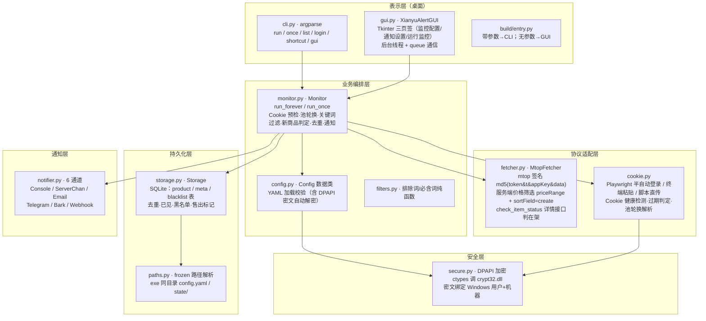

# 闲鱼低价提醒工具 · Docker 化迁移可行性评估

> 评估人：架构师 高见远（Gao）　|　评估对象：xianyu-alert v1.7.0（Python 3.13 CLI + Tkinter GUI）
> 评估基线：`README.md`、`xianyu_alert/*.py`（14 个核心模块）、`build/entry.py`、`config.example.yaml`
> 日期：2025-08-06　|　性质：**纯分析评估**（未改动任何项目文件）

---

## 0. 执行摘要（一屏结论）

| 项 | 结论 |
| --- | --- |
| **可行性等级** | 🟡 **中**（技术可行，但价值高度依赖你的使用场景） |
| **推荐技术路线** | 单容器：**FastAPI + 原生 HTML/JS 单页**（不引入重型前端框架）；核心业务逻辑全部复用现有代码，**只重写 GUI 层与 Cookie 加密/获取两条链路** |
| **预估工作量** | **9 ~ 15 人天**（单人 2~3 周），分 4 阶段：POC 1~2 天 → Web 基础 3~5 天 → Web 全功能 3~5 天 → 打磨 2~3 天 |
| **最大风险点** | **Cookie 安全与获取链路**：Linux 容器内 DPAPI 不可用（`secure.py` 硬编码 Windows ctypes/crypt32），且容器内无桌面无法跑 playwright 半自动登录 —— 必须换加密方案 + 换 Cookie 获取方式，老用户的 `dpapi1:` 密文无法在容器内解密，需重新登录 |
| **一句话建议** | **如果只是当前「本地 Windows 单机自用」场景，不建议迁移**；只有当你要「家庭服务器/NAS 常驻 24h、多设备或远程访问、或想摆脱开机手动启动」时，Docker 化才带来真实增量价值。代码层面复用度约 70%，但 GUI→Web 是一次不小的重写（≈6~10 人天），要算清楚这笔账。 |

---

## 1. 现状架构梳理

### 1.1 现状架构分层图



### 1.2 各层「复用 vs 重写」判定表

| 层 | 模块 | 现状 | Docker 化处置 | 标注 |
| --- | --- | --- | --- | --- |
| 表示层 | `gui.py`（168KB/3600 行） | Tkinter 桌面三页签 | **重写为 Web 后端 API + 前端页面**（核心工作量） | 🔴 重写 |
| 表示层 | `cli.py` | argparse 六子命令 | **保留**，容器内作调试/健康检查入口（`once` 自检） | 🟢 复用 |
| 表示层 | `build/entry.py` | 打包统一入口 | **重写**为 Docker 容器入口（启动 Web + monitor 线程） | 🔴 重写 |
| 业务编排 | `monitor.py` | 常驻轮询循环，`run_forever`/`run_once` | **直接复用**，Web 侧用后台线程驱动（与 GUI 现线程模型一致） | 🟢 复用 |
| 业务编排 | `config.py` | YAML 加载/校验/数据类 | **复用解析逻辑**；Cookie 解密调用点需指向新加密实现 | 🟡 适配 |
| 业务编排 | `filters.py` | 排除词/必含词纯函数 | **直接复用**（零平台依赖） | 🟢 复用 |
| 协议适配 | `fetcher.py` | MtopFetcher 签名+服务端筛价+详情判在架 | **直接复用**（纯 HTTP，与平台无关） | 🟢 复用 |
| 协议适配 | `cookie.py` | playwright 半自动 + 粘贴 + 检测 | **移除 playwright 部分**，保留健康检测/池轮换/粘贴/脚本；新增 Web 粘贴入口 | 🟡 适配 |
| 持久化 | `storage.py` | SQLite 三表 + 迁移 | **直接复用**；路径指向挂载卷 | 🟢 复用 |
| 持久化 | `paths.py` | frozen 路径解析 | **适配**：容器内固定 `/app/data`（config + state），绝对路径语义基本可用 | 🟡 适配 |
| 通知层 | `notifier.py` | 6 通道工厂 | **直接复用** | 🟢 复用 |
| 安全层 | `secure.py` | DPAPI（仅 Windows） | **替换为 Fernet 对称加密**，保持对外接口签名不变（`encrypt_text`/`decrypt_text`/`is_encrypted`/`mask_cookie`） | 🔴 重写（接口兼容） |
| 其它 | `shortcut.py` | 桌面快捷方式 | **废弃**（容器内无桌面语义） | 🔴 废弃 |
| 其它 | `models.py` | Product 数据类 | **直接复用** | 🟢 复用 |

**复用度粗估**：按有效代码行计，可直接复用约 **70%**（fetcher/storage/notifier/monitor/filters/models ≈ 4.5k 行 + config 解析），需重写的约 30%（gui 3.6k 行 + secure 换实现 + 新增 web 层）。

---

## 2. Docker 化可行性分析（分维度打分）

| 维度 | 现状 | Docker 化方案 | 可行性 | 理由（证据） |
| --- | --- | --- | --- | --- |
| 前端交互（Tkinter→Web） | `gui.py` 三页签，后台线程+queue 与 UI 通信 | FastAPI 提供 REST API + 单页 HTML/JS；实时日志用 SSE/WebSocket 或 2s 轮询 | 🟡 中 | 功能面大（见 §4），但当前 GUI 已是「后台线程 + queue + 状态推送给 UI」的清晰模型（`_monitor_worker`/`_push`/`_poll_queue`，gui.py:3392/1752），可**几乎一对一映射**为 Web 模式；风险在表格弹窗类交互（过滤词编辑、Cookie 池管理）的 Web 重做成本 |
| 数据存储（SQLite 本地→卷挂载） | `storage.py` 相对路径锚定 `app_base_dir()/state/`（storage.py:93-107） | `storage.path` 配绝对路径 `/app/data/state/xianyu_alert.db`，volume 挂载 `/app/data`；备份=拷贝 db 文件 | 🟢 高 | SQLite 是纯文件库，`paths.resolve_data_path` 对绝对路径原样返回（paths.py:80-82），容器内零改动即可落盘；注意**单写者**约束（监控线程独占，Web 只读查询） |
| Cookie 安全（DPAPI→替代） | `secure.py` ctypes 调 crypt32.dll，密文绑 Windows 用户+机器 | Fernet 对称加密 + 密钥文件（volume secret）挂载只读；或明文 + 仅 localhost 绑定 | 🟡 中 | `_dpapi_available()` 硬编码 `sys.platform == "win32"`（secure.py:54），Linux 下**直接降级明文**并 warning——不是崩，是失去加密。**核心矛盾**：老配置里 `dpapi1:` 密文在容器内解不开（decrypt 返回空串+提示重新登录），迁移必须重新获取 Cookie |
| Cookie 获取（playwright 桌面→容器） | `cookie.py` `acquire_via_playwright` headless=False 开浏览器（cookie.py:392-462） | ① Web 界面手动粘贴（主推）② 宿主机跑 playwright 生成 Cookie 后写入挂载卷 ③ 容器内 xvfb+playwright（不推荐，镜像 +1GB） | 🟡 中 | 容器无桌面，headless=False 必然失败；但「粘贴模式」与「`--cookie-string` 脚本模式」已存在（cli.py:212-271），只需在 Web 加一个粘贴框即可覆盖 90% 场景 |
| 监控循环（常驻进程） | `monitor.py` `run_forever` 无限轮询 + `_stop` 标志 + `time.sleep(interval)` | 单进程：Web 主线程 + monitor 后台线程（与 GUI 现模型一致）；或双进程/双容器 | 🟢 高 | `run_forever` 是纯 Python 循环，对平台零依赖；GUI 已证明「后台线程跑 monitor、主线程管 UI」的可行性（gui.py:3384-3391），Web 版照搬即可 |
| 抓取协议层（跨平台复用） | `fetcher.py` MtopFetcher：`md5(token&t&appKey&data)` 签名、`sortField=create+sortValue=desc`、`priceRange:0,{max};`+`fromFilter=true`、详情接口判在架 | **原样复用** | 🟢 高 | 纯 HTTP + requests，无任何 Windows/桌面依赖（fetcher.py:265-281/365-425/825+）；容器内 DNS/出口 IP 变化是**风控变量**（见 §7） |
| 通知通道（跨平台复用） | `notifier.py` 6 通道（console/serverchan/email/telegram/bark/webhook） | **原样复用** | 🟢 高 | 全部是 requests/smtplib 网络调用，零平台依赖（notifier.py 全篇） |
| 部署形态（单容器/多容器） | 桌面 exe，无部署概念 | **单容器**（Web+monitor 同进程）；多容器（monitor worker 独立）仅在要独立扩缩/隔离时考虑 | 🟢 高 | 单用户单任务，单容器最简单；多容器增加 compose 复杂度但几乎无收益 |

**分维度汇总**：7 个维度中 4 个「高」（存储/监控/抓取/通知）、2 个「中」（前端/Cookie）、1 个「中」（加密）。**技术障碍全部集中在 Cookie 两条链路（安全+获取）与 GUI 重写**，其余都是「复用 + 换壳」。

---

## 3. 关键技术决策

### 3.1 Web 前端技术栈（方案对比）

> 用户画像：**不懂命令行的普通用户**，界面必须直观、无需安装任何东西、打开浏览器即用。

| 方案 | 复杂度 | 依赖/体积 | 开发效率 | 界面契合度 | 评价 |
| --- | --- | --- | --- | --- | --- |
| **A. FastAPI + 原生 HTML/JS 单页（推荐）** | 中 | `fastapi` + `uvicorn`（+`cryptography` 约几 MB）；前端零构建、单 HTML 文件 + 原生 JS/fetch | 中 | 高——三页签/表格/弹窗全部手写可控，最贴近现有 GUI 交互 | 后端用现有 `build_notifiers`/`Storage`/`Monitor` 直接组装 API；前端用 Tab + 表格 + modal，**不需要 npm/打包链**，镜像小、易维护 |
| B. Flask + Jinja2 模板 + 少量 JS | 低 | `flask`（更小） | 中 | 中高——与 A 类似但更朴素 | 备选；如果不想引 FastAPI 的异步概念，Flask 完全够用（monitor 是同步阻塞的，Web 只需简单并发） |
| C. Gradio / Streamlit | 低 | 各约 100MB+，自带组件 | **高**（最快出活） | 中——表格 CRUD/多页签/弹窗别扭，界面风格「工具感」重 | 适合 2 天出原型验证；但不适合长期作为「正式产品界面」（三页签+复杂弹窗+实时日志在其组件模型里都很绕） |
| D. FastAPI + React/MUI SPA | 高 | 需要 node 构建链，镜像/构建复杂度大增 | 低（需前后端分离工程化） | 高（最漂亮） | **过度设计**：单用户工具不值当前后端+构建+部署复杂度 |

**推荐 A**（FastAPI + 原生单页）。理由：① 与现有 Python 代码同语言、同进程，`Monitor`/`Storage`/`Notifier` 直接 import，零跨语言摩擦；② 不引入 node 构建链，镜像小、普通人好维护；③ 现有 GUI 的「后台线程 + queue 推送」模型可直接平移为「后台线程 + 环形日志缓冲 + SSE/轮询」。若时间极紧可先用 C 出原型验证，正式版回到 A。

### 3.2 DPAPI 替代方案（Cookie 加密）

| 方案 | 安全性 | 复杂度 | 评价 |
| --- | --- | --- | --- |
| **A. Fernet 对称加密 + 密钥文件（推荐）** | 中——密钥与密文同机存放，防「误读/泄密到日志/备份文件」，不防「容器被攻破后同机取钥」 | 低（`cryptography.fernet`，接口 1 个 encrypt/decrypt） | 与 DPAPI 的威胁模型基本对等（DPAPI 同样防不了「同一 Windows 用户会话被攻破」）。**做法**：首次启动生成 `secret.key` 写入挂载卷，config 中存 `fernet1:base64` 密文；`secure.py` 保留 `is_encrypted/mask_cookie` 语义，`encrypt_text/decrypt_text` 换实现，`dpapi1:` 老密文识别为「不可解密→提示重新登录」 |
| B. 明文 + 容器网络隔离（仅绑 127.0.0.1） | 低——Cookie 即明文，任何能读文件/日志的进程都可取 | 最低 | 自用可接受，但 config.yaml 明文 Cookie 一旦被备份/截图/日志泄漏即泄露；不推荐作为默认 |
| C. SQLCipher 加密整个 SQLite | 高（整库加密） | 中高（替换 sqlite3 驱动，storage.py 全链路受影响） | **过度设计**：需要加密的核心只有 Cookie，商品数据无敏感价值 |
| D. Docker Secrets / 环境变量 | 中（密钥不进镜像） | 中 | 可作密钥来源选项，但单机自用收益有限；密钥仍须在 compose 文件里以某种形式存在 |

**推荐 A（Fernet + 密钥文件）**，同时**提供「降级开关」**：`XY_SECRET_MODE=plain` 允许明确接受明文的用户跳过加密（对齐现有「非 Windows 降级明文」的兼容哲学，secure.py:160-162）。

**老数据兼容**（§7.1）：容器内遇到 `dpapi1:` 前缀 → `decrypt_text` 返回空串 + warning「请重新登录」——这个行为**已经在代码里**（secure.py:186-194），迁移时只需在 Web 界面把「无法解密」的 Cookie 状态灯显示出来引导重登，无需写迁移工具。

### 3.3 Cookie 获取（容器内无桌面）

| 方案 | 用户操作 | 复杂度 | 评价 |
| --- | --- | --- | --- |
| **① Web 界面手动粘贴（推荐主路径）** | 浏览器登录 goofish → F12 → 复制 Cookie 头 → 粘贴到 Web「Cookie 管理」→ 保存（服务端 Fernet 加密落盘） | 低（前端一个 textarea + 后端复用 `save_cookies` 逻辑） | 复用现有 `cookie_has_token` 校验 + `detect_cookie_health` 状态灯（cookie.py:103-116/174-208），体验与现 GUI「Cookie 管理」对话框一致 |
| ② 宿主机独立获取工具 | 在 Windows 本机跑 `python -m xianyu_alert.cli login`（或完整版 exe 的自动登录），生成 config 写入挂载卷 | 中（需一份宿主机工具 + 卷共享说明） | 保留 playwright 体验；适合「本机有桌面、服务器在别处」的场景；缺点是两套环境 |
| ③ 容器内 xvfb + playwright | 容器内开虚拟显示跑 headless=False | 高（镜像 +1GB、依赖 `libgtk` 等一堆系统库、需 VNC 查看浏览器） | **不推荐**：与「轻量容器」目标冲突，且登录本身可用方案①替代 |

**推荐 ①为主、②为辅**：默认走 Web 粘贴（对普通用户最顺），需要自动登录的用户在宿主机用现成工具生成 Cookie 后导入。

### 3.4 监控与 Web 共存（单进程 vs 双进程；配置热生效）

- **推荐：单进程多线程**——uvicorn/FastAPI 主线程跑 Web，monitor 跑独立 `threading.Thread`（daemon）。这与现 GUI 的线程模型**完全一致**（gui.py:3384-3391 `_launch_worker`），`Monitor.stop()` 的 `_stop` 标志 + `Event.wait` 替代 `time.sleep` 可即时响应停止（gui.py:3473-3476）。Web API 通过一个 `MonitorService` 单例持有 monitor 实例，暴露 `start/stop/run_once/status`。
- **配置热生效**：两种做法——
  1. **简单版（推荐）**：任何配置保存 → 若监控在运行则「停止旧 monitor → 用新 Config 重建 → 重启」；间隔/关键词变化自然生效。成本低、逻辑清晰，单用户场景完全够。
  2. 复杂版（运行中热替换 keyword/interval 而不重启）——**不做**，收益低、风险高。
- **并发注意**：`Storage` 的 sqlite 连接是**单写者**（monitor 线程独占写，Web 只读查询用独立连接或复用同一连接加锁）。`sqlite3.connect(check_same_thread=False)` 已允许跨线程（storage.py:109），但写操作集中在 monitor 线程，Web 查询 `list_notified` 等需注意事务边界。
- **双进程方案**（monitor worker 独立容器 + Web 容器共享卷）仅当出现「monitor 崩溃不应影响 Web」或「要独立扩缩」需求时再考虑——当前单用户场景**不必要**。

### 3.5 数据卷规划（SQLite 挂载）

- **目录约定**：容器内固定 `/app/data`（对应现 `app_base_dir()/` 语义）：
  ```
  /app/data/
    config.yaml          # 配置（含 Fernet 密文 Cookie）
    secret.key           # Fernet 密钥（权限 0400）
    state/xianyu_alert.db
    state/xianyu_alert.log
  ```
- **实现**：`paths.py` 加一个「容器模式」（环境变量 `XY_DATA_DIR=/app/data` 时 `app_base_dir()` 返回它），或直接约定 compose 里 `WORKDIR=/app` + 卷挂 `/app/data` 且 config 用绝对路径 `storage.path: /app/data/state/xianyu_alert.db`。前者更省事（storage/日志路径自动跟随）。
- **备份/迁移**：SQLite 支持**热备份**——`sqlite3 /app/data/state/xianyu_alert.db ".backup backup.db"`（或 `VACUUM INTO`），不需要停容器；恢复 = 停容器 → 覆盖 db → 启动。老 Windows 数据迁移：拷贝 `state/xianyu_alert.db` + 重配 Cookie（`dpapi1:` 密文不可迁移）即可。

### 3.6 容器镜像

| 项 | 决策 | 理由 |
| --- | --- | --- |
| 基础镜像 | `python:3.13-slim`（≈120MB） | 与当前 3.13 运行时一致（README 用 3.13.12）；slim 比 alpine 省去 musl 兼容坑 |
| 运行时依赖 | `requests` `beautifulsoup4` `PyYAML` `cryptography` `fastapi` `uvicorn`（约 20~30MB 增量） | 现有 requirements.txt 三件套 + 新加密 + Web 框架；**不装 playwright** |
| 健康检查 | `HEALTHCHECK` 打 `/healthz`（返回 200 + monitor 运行状态） | 供 compose/orchestrator 探活 |
| 时区 | `ENV TZ=Asia/Shanghai`（镜像装 `tzdata`） | 通知文案/日志用本地时间；容器默认 UTC 会让「提醒记录时间」错 8 小时 |
| 入口 | 容器 CMD 启动 `entry_web.py`（建数据目录→生成/加载 secret.key→启动 monitor 线程→起 uvicorn） | 替代 `build/entry.py` 的 exe 逻辑 |
| 端口/绑定 | 默认绑定 `127.0.0.1:8080`（本地访问）；远程访问走反向代理+认证（§7.3） | 安全第一 |

---

## 4. 功能映射：GUI 三页签 → Web 页面

> 证据源：`gui.py` 三页签构建（`_build_tab_config` :1307 / `_build_tab_notify` :1460 / `_build_tab_run` :1526）及对应回调。

### 4.1 监控配置页（Tab 1）→ Web「监控配置」

| GUI 功能（gui.py 位置） | Web 映射 | 标注 |
| --- | --- | --- |
| 关键词表格（关键词/阈值/状态/排除·必含摘要列）:1316-1383 | 表格 + 增删改行 + 启用/停用开关 | ✅ 完整映射 |
| 「➕ 添加 / ✏️ 更新选中 / 删除选中」:1360-1364 | 行内表单 + 弹窗 | ✅ 完整映射 |
| 「⏸ 停用/启用」（v3.7）:1363 | 行内开关 | ✅ 完整映射 |
| 「编辑过滤词」弹窗（排除词/必含词）:2126/2173 | 弹窗（每行一个词 + 保存） | ✅ 完整映射 |
| 「添加预置词 / 编辑预置词」（v3.5）:2137/2266 | 弹窗 + 写回 config 顶层 `preset_exclude_keywords` | ✅ 完整映射 |
| 监测间隔 / 抓取方式 / 抓取页数:1389-1419 | 表单字段 | ✅ 完整映射 |
| 登录 Cookie 状态灯:1424-1431 | 状态徽标 + 「Cookie 管理」入口 | ✅ 完整映射 |
| 「Cookie 管理」对话框（池增删/启停/检测/设默认/帮助）:2544-2811 | 独立弹窗/子页，交互一致；「如何获取 Cookie」改为容器内方案说明 | 🟡 改造（帮助文案换容器版） |
| 「创建桌面快捷方式」:1449 | **砍掉**（Docker 无桌面语义） | 🔴 砍 |
| 「💾 保存配置」:1448 | 保存按钮 → 触发 monitor 热重启（§3.4） | ✅ 完整映射（+重启逻辑） |
| 「ℹ 关于」:1452 | 页脚/关于弹窗 | ✅ 完整映射 |

### 4.2 通知设置页（Tab 2）→ Web「通知设置」

| GUI 功能（gui.py 位置） | Web 映射 | 标注 |
| --- | --- | --- |
| 6 通道勾选启用 + 参数表单（secret 字段掩码）:1460-1520 | 每个通道一个卡片：启用开关 + 参数表单（password 型 input） | ✅ 完整映射 |
| 「测试发送」:2816 | 按钮 → POST `/api/notify/test`，后端复用 `build_notifier(channel).notify([sample])` | ✅ 完整映射 |
| console 通道提示「显示在运行监控日志区」:1503-1508 | 保留提示；Docker 下 console 输出同时进容器 stdout（`docker logs` 可看） | ✅ 完整映射 |
| 「保存配置」:1521 | 同 Tab1 保存 | ✅ 完整映射 |

### 4.3 运行监控页（Tab 3）→ Web「运行监控」

| GUI 功能（gui.py 位置） | Web 映射 | 标注 |
| --- | --- | --- |
| ▶ 开始监控 / ■ 停止监控 / ⚡ 立即执行一轮:1531-1536 | 按钮 → `/api/monitor/start|stop|run_once` | ✅ 完整映射 |
| 状态栏（状态/轮数/累计提醒/下次执行）:1552-1559 | 顶部状态条（前端轮询刷新） | ✅ 完整映射 |
| 运行日志区（字号/清空/仅展示符合的低价开关）:1561-1604 | 日志面板 + 清空 + 明细开关 | ✅ 完整映射（字号调节可砍） |
| **实时日志推送** | 方案：SSE（`/api/logs/stream`）或 WebSocket 推送 monitor 线程的 `logging` 记录；备选 2s 轮询读环形缓冲。现有 `QueueLogHandler`（gui.py:1167-1198）可直接复用为「环形日志缓冲 + SSE 广播」 | 🟡 改造（Tk 控件渲染 → 前端渲染） |
| 提醒记录表格（双击打开商品页/表头排序/显示已下架开关）:1606-1648 | 表格 + 链接列 + 排序 + 「显示已下架」开关 | ✅ 完整映射 |
| 🗑 清空去重记录:3507 | 按钮 + 二次确认弹窗 | ✅ 完整映射 |
| 🚫 加入黑名单 / 📋 黑名单管理:3190/3239 | 按钮 + 管理弹窗（含恢复） | ✅ 完整映射 |
| 🗑 标记已售出 / 🔍 校验在架:2985/3034 | 按钮 + 后台批量任务 + 进度日志（复用 `check_item_status` + 限速 `SOLD_CHECK_INTERVAL`） | ✅ 完整映射 |
| 关闭窗口时优雅停线程（on_close）:3545 | 容器 `SIGTERM` 时 `monitor.stop()` + 等待 join（复用同一套优雅关闭） | ✅ 完整映射（入口换信号处理） |

**逐项汇总**：✅ 完整映射 21 项 / 🟡 改造 2 项（Cookie 帮助文案、实时日志通道）/ 🔴 砍 2 项（桌面快捷方式、日志字号微调）。**功能面覆盖度 ≈ 95%**，无一核心功能因 Docker 化而丢失。

---

## 5. 复用清单（代码级）

### 5.1 可直接复用（🟢，零改动或仅 import）

| 模块 | 复用内容 | 证据 |
| --- | --- | --- |
| `fetcher.py` | `MtopFetcher`（签名/服务端筛价/详情判在架）、`build_fetcher`、全部 mtop 纯函数、`MockFetcher` | 纯 HTTP + 纯函数，无平台依赖（fetcher.py:265-449/635+） |
| `storage.py` | `Storage` 全部（三表、去重、黑名单、售出、prev_ids、清空） | 仅依赖标准库 sqlite3 + paths（storage.py:93-113） |
| `notifier.py` | 6 通道 + 工厂 + 消息格式化 | 仅 requests/smtplib（notifier.py 全篇） |
| `monitor.py` | `Monitor` 全部（run_forever/run_once/预检/过滤编排） | 纯逻辑 + 依赖上述模块（monitor.py:46-389） |
| `filters.py` | 排除词/必含词全部纯函数 | 零依赖（filters.py 全篇） |
| `models.py` | `Product` 数据类 | 零依赖 |
| `config.py` | YAML 解析/校验/数据类（除 DPAPI 解密点） | `_parse_monitor` 中 `secure.is_encrypted/decrypt_text` 两个调用点随 secure 一起换实现（config.py:404-409/328-330） |
| `cookie.py` | `cookie_has_token`/`cookie_expiry_status`/`detect_cookie_health`/`pool_enabled_cookies`/`resolve_cookie_for_round`/`build_cookie_header` | 全部纯函数（cookie.py:53-253） |
| `cli.py` | `once`（容器健康自检）、`list`、`login --cookie-string`（宿主机工具） | 保留原样 |
| `tests/` | 673 个 unittest 全部保留；新增 Web 层测试 | 现测试全 mock 无外网，可在 CI/容器内直接跑 |

### 5.2 需适配（🟡，接口不变/小改）

| 模块 | 适配点 | 改动量 |
| --- | --- | --- |
| `secure.py` | `encrypt_text`/`decrypt_text` 实现从 DPAPI 换 Fernet（`dpapi1:` 老密文走「不可解密」分支）；**对外四个函数签名不变** → config/cookie/gui 调用点无需改逻辑 | 小（~80 行重写 + 测试补 Fernet 用例） |
| `cookie.py` | 删除/禁用 `acquire_via_playwright`（容器内用不到）；`save_cookies_to_config` 落盘时改走 Fernet（或由 Web 层直接调 `secure.encrypt_text`） | 小 |
| `paths.py` | 增加容器数据目录支持（`XY_DATA_DIR` 环境变量优先于 `app_base_dir`） | 极小（~10 行） |
| `config.py` | 无结构性改动（secure 换实现即自动生效）；如需「容器模式」默认 storage 路径可加一个默认值分支 | 极小 |
| `cli.py` | 容器 CMD 不再直接调 CLI 主循环（改由 web 入口驱动），但保留子命令供调试 | 不改 |

### 5.3 需重写（🔴）

| 模块 | 重写内容 | 工作量估 |
| --- | --- | --- |
| `gui.py` | → 拆为 `web/api.py`（REST + SSE 端点，复用现有纯函数做表单校验/组装）+ `web/static/index.html`（单页三 Tab + 表格 + 弹窗） | 6~8 人天 |
| `build/entry.py` | → `web/entry.py`（建数据目录 → 初始化 secret.key → 启动 monitor 线程 → 起 uvicorn；处理 SIGTERM 优雅退出） | 0.5~1 人天 |
| `shortcut.py` | 废弃（不进镜像） | 0 |
| `Dockerfile` / `docker-compose.yml` / `.dockerignore` | 新增 | 0.5~1 人天 |

**结论**：**没有「核心业务重写」**——重写集中在表示层与两条 Cookie 链路。这是典型「换壳不换芯」迁移，复用面远大于重写面。

---

## 6. 分阶段迁移路线

| 阶段 | 目标 | 工作量 | 验收标准 |
| --- | --- | --- | --- |
| **阶段 0：可行性验证（POC）** | 证明「monitor + storage + notifier 在容器内可跑」：Dockerfile 最小版（只装 3 件套，不装 Web），CMD 跑 `cli once --config /app/data/config.yaml`；卷挂载 config + state；Fernet 版 secure 落地 | 1~2 人天 | `docker run` 后 `once` 用 mock 抓取成功、SQLite 落盘到挂载卷、`dpapi1:` 老密文显示「重新登录」提示；673 测试在容器内全绿 |
| **阶段 1：Web 后端 API + 基础页面** | FastAPI 起服务；REST：配置读写（复用 config 组装）、monitor start/stop/run_once/status、日志 SSE；前端单页三 Tab 骨架：配置页可编辑关键词+过滤词+间隔+Cookie 粘贴；运行页可开始/停止/看日志 | 3~5 人天 | 浏览器打开 `http://localhost:8080` 可完成「配置关键词 → 开始监控 → 看到 mock 日志与提醒记录」全链路 |
| **阶段 2：Web 全功能** | 补齐：通知设置页（6 通道 + 测试发送）、Cookie 池管理弹窗、黑名单管理、售出标记/校验在架、提醒记录排序/已下架开关、清空去重记录；配置热重启 | 3~5 人天 | 功能面覆盖 §4 全部 ✅ 项；与现 GUI 行为逐项对照通过 |
| **阶段 3：打磨** | 安全（认证 + 仅 localhost/反代指南）、镜像瘦身（slim + 多阶段）、`docker-compose.yml` 一键起（卷/密钥/时区/健康检查/restart=unless-stopped）、README 迁移指南（含老数据迁移 + Cookie 重登说明） | 2~3 人天 | 一条 `docker compose up -d` 即可用；重启用 `restart` 自动拉起；健康检查在 monitor 卡死时可被发现 |

**总工作量：9 ~ 15 人天**（单人 2~3 周；若阶段 1 用 Gradio 快速原型可压缩到 8 天左右，但正式版建议回到方案 A）。

---

## 7. 风险与对策

| # | 风险 | 影响 | 对策 |
| --- | --- | --- | --- |
| 1 | **DPAPI→Fernet 老数据不兼容**：现有 Windows 用户 config 中 `dpapi1:` 密文在容器内解密返回空串 | 老用户 Cookie 失效，需重新登录 | 代码**已有**优雅降级（secure.py:186-194）；Web 界面把「无法解密」状态灯显示清楚 + 迁移文档写明「容器内首次使用需重新粘贴 Cookie」；**不做**自动迁移（密文绑 Windows 用户，物理上无法解） |
| 2 | **风控差异**：容器出口 IP（家庭宽带 NAT / 云服务器 IP）与本地 IP 不同，闲鱼风控对「数据中心 IP + 高频请求」更敏感 | 抓取被 RGV587 拦截、封号风险 | 维持现有保守频率（interval ≥ 600s，README 建议 600~900）；多 Cookie 池轮换已内置（cookie.py:236-253）；新增「风控触发即降频/熔断」可选开关（提示：当前代码只打 warning，不做自动降频，见 fetcher FetchError 处理） |
| 3 | **Web 界面安全**：一旦绑定非 localhost，未认证的 Web 可读取/修改配置、看到明文 Cookie（Fernet 解密后）、触发抓取 | 凭据泄露、被滥用抓取 | 默认只绑 `127.0.0.1`；远程访问必须走反代 + 基本认证（`htpasswd`/Caddy basic_auth）或 Tailscale 类内网；Web 写操作全部 POST + CSRF 防护（同源校验/session）；日志与 API 响应中**永不出明文 Cookie**（复用 `secure.mask_cookie` 脱敏，secure.py:198-213） |
| 4 | **时区/调度**：容器默认 UTC | 日志/提醒记录时间错 8 小时 | `ENV TZ=Asia/Shanghai` + 装 `tzdata`（§3.6）；`datetime.now()` 全链路跟随系统 TZ |
| 5 | **playwright 体积**：若把 playwright 塞进镜像，+1GB+ 且依赖大量系统库 | 镜像臃肿、构建慢 | 默认**不装**（Web 粘贴方案替代）；确需自动登录的用户走「宿主机 playwright 生成 Cookie 导入」方案（§3.3 ②） |
| 6 | **SQLite 并发**：monitor 写 + Web 读同时发生 | 偶发 `database is locked` | 写集中在 monitor 线程（现状如此）；Web 只读查询用独立连接 + `timeout`；备份用 `.backup` 热备（§3.5） |
| 7 | **Docker 环境门槛**：用户若不会 Docker，迁移后反而更难用 | 与「普通用户」画像冲突 | 交付 `docker-compose.yml` + 一键脚本（`start.bat`/`start.sh` 封装 `docker compose up -d`）；文档面向非技术用户写「双击即用」 |

---

## 8. 最终结论与建议

### 8.1 可行性总评

- **技术可行性：中高**。核心业务（抓取/存储/通知/监控编排）几乎零改动复用；障碍集中在 **Cookie 加密替换 + Cookie 获取方式 + GUI→Web 重写**，无不可逾越的技术难题，无平台 API 硬依赖。
- **但「值不值得」是另一回事**——见 8.2。

### 8.2 是否值得迁移（客观决策依据）

**当前用户场景**：本地 Windows 单机、双击 exe、自用。在这个场景下 Docker 化带来的是**成本**而非收益：

| 对比项 | 保持 exe（现状） | Docker 化后 |
| --- | --- | --- |
| 使用门槛 | 双击即用 | 需 Docker 环境 + 浏览器打开 + 维护容器 |
| Cookie 管理 | DPAPI 自动加密，换机需重登 | 重新粘贴 + 新加密，**首次迁移必重登** |
| 多设备/远程访问 | ❌ 无 | ✅ 局域网/公网（反代+认证） |
| 7×24 常驻 | 需开机自启 + 保持登录 | ✅ `restart=unless-stopped` 自动拉起 |
| 交付物 | 15~25MB exe 随便拷 | 镜像 + compose，需 Docker 环境 |

**Docker 化的真实增量价值**（按优先级）：
1. **常驻 24h**：有家庭服务器/NAS/软路由/Docker 主机的用户，监控不再依赖 Windows 开机；
2. **多设备/远程**：手机/其它电脑通过浏览器看提醒记录、改配置；
3. **环境隔离**：抓取进程与日常桌面隔离，不占本机资源。

**决策建议**：
- ✅ **值得迁移**：你已有/打算有 7×24 设备（NAS/云服务器/软路由），或想远程管理；
- ⛔ **不值得**：只是单机自用、电脑长期开机——现有 exe 已完全满足，迁移是负收益；
- 🟡 **折中方案（不迁 Docker 但补远程/常驻）**：
  - 方案 X：保持 exe，用 Windows 计划任务/开机自启跑 `cli once` 或 `cli run`（README 已有 cron 示例，README:122-125），获得常驻；远程访问有限，但可用现有 Bark/Telegram/ServerChan 推送「只出不进」；
  - 方案 Y：**给 exe 加一个轻量远程配置壳**——在现有代码上加一个极小的 HTTP 端点（Flask/FastAPI 单文件，约 1~2 人天），只暴露「查看状态/改配置/看提醒记录」的只读+配置 API，本地浏览器访问；监控仍在 exe 里跑。这是**工作量最小**的「半 Web 化」路径，可覆盖 80% 的远程查看需求，且完全不需要 Docker。

### 8.3 若决定迁移：推荐路线一句话

> **FastAPI + 原生单页，单容器，Fernet 加密 Cookie，Web 粘贴获取 Cookie，monitor 后台线程，volume 挂 `/app/data`，4 阶段 9~15 人天**——先跑阶段 0 POC（1~2 天）验证容器内 monitor 链路，再决定是否投入后续。

---

## 附录 A：未明确事项与假设

1. **目标运行环境未说明**（假设：Linux 容器，部署在家庭服务器/NAS/云主机；若目标是 Windows 容器或 Docker Desktop on Windows，需重新评估——Docker Desktop 的 Linux 容器同样无 DPAPI，结论不变）。
2. **用户是否已有 Docker 环境**未说明（假设：无，需在交付物中提供安装指引或一键脚本）。
3. **访问范围**未说明（假设：默认 localhost 单用户；远程访问按 §7.3 需反代+认证）。
4. **老用户数据量**未说明（假设：单人自用、db 规模 <100MB，备份/迁移用文件拷贝即可）。
5. **闲鱼风控对容器 IP 的实际容忍度**为推测项（现有代码对风控只告警不降频，迁移后若频繁触发需加熔断逻辑——建议阶段 3 验证）。
6. **Web 认证方案**（密码/token）未定，阶段 3 确定（默认推荐 basic auth + 仅 localhost）。

## 附录 B：证据索引（关键文件）

| 结论 | 证据位置 |
| --- | --- |
| 版本 v1.7.0、模块清单 | `xianyu_alert/__init__.py:21` |
| DPAPI 仅 Windows、非 Windows 降级明文 | `xianyu_alert/secure.py:54,160-162,186-194` |
| playwright headless=False 桌面依赖 | `xianyu_alert/cookie.py:392-462` |
| GUI 后台线程 + queue 模型（可平移 Web） | `xianyu_alert/gui.py:3336-3492,1752-1793` |
| mtop 签名与服务端筛价 | `xianyu_alert/fetcher.py:265-281,365-425` |
| 详情接口判在架 | `xianyu_alert/fetcher.py:825+`；`gui.py:3034-3145` |
| SQLite 路径锚定/绝对路径直通 | `xianyu_alert/storage.py:93-107`；`paths.py:66-82` |
| 6 通知通道工厂 | `xianyu_alert/notifier.py:398-468` |
| monitor 常驻循环与停止机制 | `xianyu_alert/monitor.py:343-389` |
| Cookie 健康检测纯函数 | `xianyu_alert/cookie.py:103-253` |
| 依赖清单（无 playwright 主依赖） | `requirements.txt` / `requirements-cookie.txt` |
| 现有 CLI 可作容器调试入口 | `xianyu_alert/cli.py:94-133,163-271` |

*（本报告为评估文档，未修改任何项目文件；如需进入实施阶段，请基于阶段 0 POC 结果再行决策。）*
