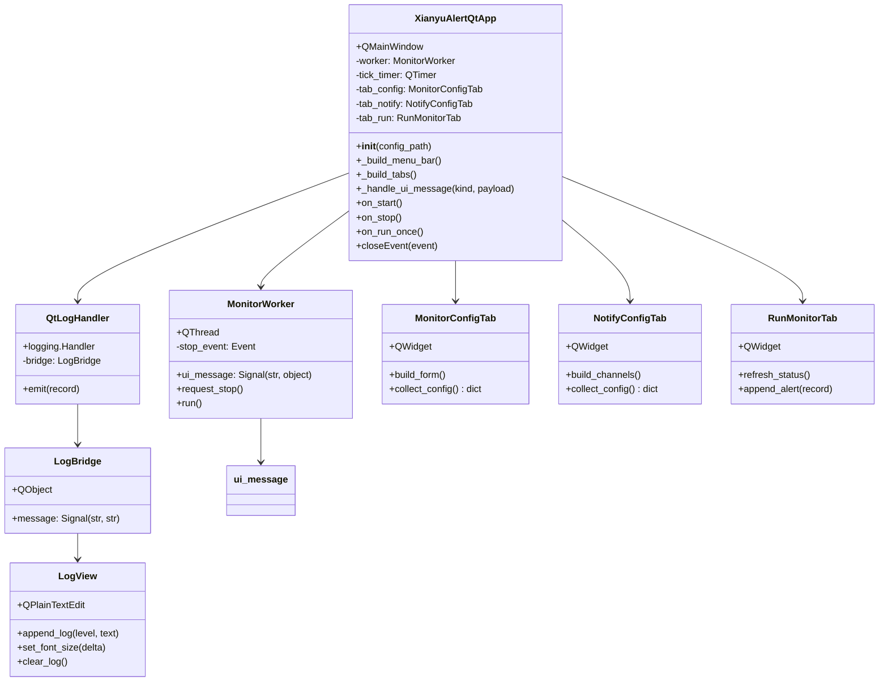
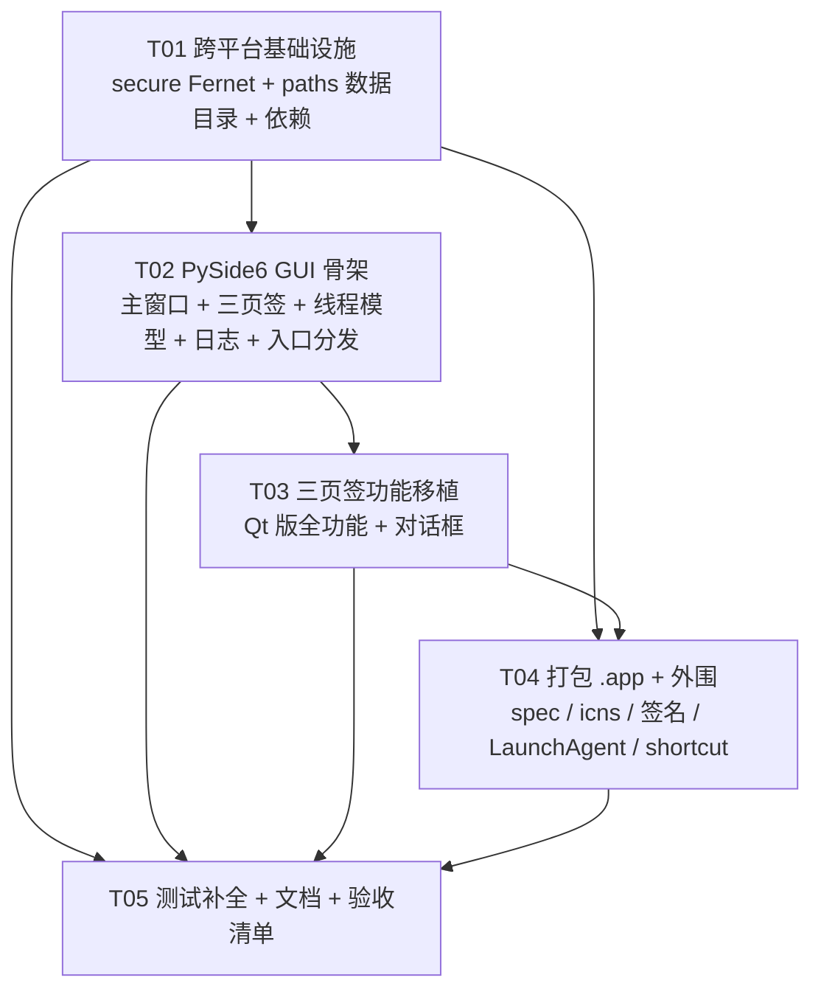

# 闲鱼低价提醒工具 · macOS M4 原生适配增量设计

> 设计人：架构师 高见远（Gao）　|　设计基线：v1.7.0（Python 3.13 CLI + Tkinter GUI，673 tests）
> 上游依据：`docs/Docker与macOS双路径可行性评估.md`（2025-08-07，路径 B 可行性：🟢 高、复用 ~90%、4.5~9 人天）
> 日期：2025-08-07　|　性质：**增量设计 + 任务分解**（仅产出本设计文档，未修改任何代码文件）
> 用户已确认决策（直接采信）：设备 = **Mac Mini M4**（不睡眠，24 小时待机常驻）；**本地自用**；交付 = **双击 .app 的 GUI**（macOS 原生应用）；**GUI 审美要彻底符合 macOS（本次最高优先级要求）**

---

## 0. 执行摘要（一屏结论）

| 项 | 结论 |
| --- | --- |
| **GUI 技术路线** | **方案 2：PySide6（Qt for macOS）**。新增 `xianyu_alert/gui_qt/` 包作为 macOS 端 GUI；Windows 端 `gui.py`（Tkinter）**原样保留零回归**，入口按平台分发 |
| **核心理由** | 用户要求「彻底适配 macOS 生态 + GUI 审美符合 macOS」是**最高优先级**——Tkinter 定制有硬天花板（原生菜单栏 / 毛玻璃 / 原生对话框 / Dock 交互 / 深色模式给不了）；Qt 是唯一成熟、可落地、真正「Mac 味」的方案，且业务层（monitor/fetcher/storage/notifier/config/cookie/filters/models + gui.py 抽出的纯函数）**100% 复用** |
| **预估工作量** | **7 ~ 12 人天**（Qt 路线）；对比 Tkinter 微调路线 4.5~9 人天，多花 ~2~3 人天换取「彻底 macOS 原生观感」 |
| **改造面概览** | ① gui_qt 新 GUI（≈3.5k 行 Tk 视图 → Qt 视图）；② secure.py DPAPI→Fernet；③ paths.py 增加 `XY_DATA_DIR` + macOS frozen 落点；④ PyInstaller `.app`（arm64 + icns + ad-hoc 签名）；⑤ shortcut 平台化隐藏；⑥ LaunchAgent 可选 |
| **最大风险** | ① PySide6 GUI 的**观感只能在 M4 真机验证**（当前开发机是 Windows）；② `.app` 数据目录落点必须经 paths 改造（否则数据写进只读包内）；③ PySide6 打包体积 +150~250MB；④ 老 `dpapi1:` 密文不可解需重登 |
| **硬前提** | **必须有一台 M4 Mac** 用于 POC / 构建 / 观感验收（PyInstaller 不支持跨平台交叉打包） |

---

## 1. GUI 技术路线决策（核心）

### 1.1 候选方案对比

| 维度 | 方案 1：Tkinter + ttk 深度定制 | **方案 2：PySide6（Qt for macOS）★推荐** | 方案 3：Toga 等 | 方案 4：Tk 保留 + 关键页 Qt 化 |
| --- | --- | --- | --- | --- |
| 「彻底 macOS 原生」达成度 | ✗ 硬天花板：Tk 无法提供原生菜单栏集成、NSWindow 毛玻璃、原生对话框、Dock 菜单、深色模式自动切换 | ✓ 达成：QMacStyle 原生控件、原生菜单栏（QMenuBar）、Retina 高清、PingFang SC 渲染佳、深色模式自动跟随 | ✗ 控件少、观感不成熟、生态小 | △ 一半一半，观感割裂 |
| 现有 GUI 复用 | 高（只改样式/字体/图标） | 中（**纯函数 100% 复用**，视图层重写） | 低（整体重写） | 低（两套并行） |
| 工作量 | **1~2 人天** | **4~6 人天**（视图层重写） | 4~8 人天且风险高 | 3~5 人天且长期维护贵 |
| 7×24 挂机稳定性 | 直接沿用现状（已验证） | 需重验长跑，但 monitor 逻辑复用、无 UI 轮询（信号驱动更省 CPU） | 未知 | 混合 |
| 跨平台红利 | Tk 两端一致但都不原生 | Qt 两端各自原生（未来可替换 Windows 端，P3） | 都不原生 | 无 |
| 依赖/体积 | 零新增 | +PySide6（打包体积 +150~250MB） | 新增依赖 | +PySide6 |
| 风险 | 低 | 中（新框架需重测 GUI；打包复杂度） | 高 | 高（双 GUI 维护） |

### 1.2 明确推荐：**方案 2（PySide6 / Qt for macOS）**

理由（按优先级）：

1. **用户要求是「彻底」且「最高优先级」**。Tkinter 定制的天花板是物理性的：macOS 用户对「原生感」的判断来自菜单栏、通知、毛玻璃、系统字体、Dock、深色模式这些**系统级交互**，Tk 一个都给不了原生实现。既然本次任务的**重点要求**就是「GUI 审美符合 macOS」，选 Tk 定制等于不交付核心诉求。
2. **业务层零重写**。GUI 只是「配置/查看面」，monitor/fetcher/storage/notifier/config/cookie/filters/models 全部不动；`gui.py` 已抽出的纯函数（`config_to_form / cookie_status / validate_keyword_entry / channel_is_complete …` 等，tests/test_gui*.py 已覆盖）可直接被 Qt 版 import 复用。真正的重写面 = 视图控件 + 事件接线，4~6 人天可控。
3. **Qt 的线程模型与现状同构**：Tk 的 `queue.Queue + root.after` 轮询 → Qt 的 `Signal + QThread`（信号跨线程自动 queued 投递），语义一一映射；日志 2000 行裁剪在 Qt 里用 `QTextDocument::setMaximumBlockCount` 一行实现，比 Tk 手写裁剪更稳。
4. **一份 Qt 代码未来可同时服务 Windows**（P3 可选），不是沉没成本。
5. **风险可控**：用「T02 先出可运行骨架 → 用户在 Mac 上先看观感 → 满意再继续 T03」的**决策门**对冲「观感只能真机验证」的最大风险。

### 1.3 为什么不是方案 1（Tkinter 定制）

- 工作量最小（1~2 人天）是它唯一的优势；但 ttk 在 macOS 的默认 Aqua 主题只能让**部分控件**（Notebook/Treeview/Button）接近原生，`ScrolledText`/对话框/菜单等仍是老旧观感，中文字体回退与 Retina 细节依赖真机碰运气。
- 无法兑现用户「彻底」二字：没有原生菜单栏、没有 Dock 菜单、没有深色模式联动、没有毛玻璃。**若用户接受「能用就行」，方案 1 足够；但本次用户明确要「审美符合 macOS」，故不选。**

### 1.4 排除方案 3 / 方案 4

- **方案 3（Toga）**：跨平台控件集不成熟，macOS 原生观感与稳定性均无保障，且同样要全量重写——风险大于收益，排除。
- **方案 4（折中）**：Tk 保留功能 + 关键页 Qt 化 = 两套 GUI 长期并行维护，工作量与方案 2 相当、观感还割裂，排除。**注意**：本设计的「双 GUI」是「Tk（Windows）+ Qt（macOS）各一套完整 GUI、入口按平台分发」，不是同一平台内混用，维护成本集中在 Qt 视图层（业务层共用），可接受。

### 1.5 工作量对比与风险

| 路线 | 阶段工作量 | 合计 | 观感达成 | 主要风险 |
| --- | --- | --- | --- | --- |
| 方案 1（Tk 微调） | 安全 1~2 + GUI 微调 1~2 + 打包 1~2 + 挂机 1~2 | **4.5~9 人天**（沿用评估） | △ 可接受但非原生 | 低 |
| **方案 2（Qt）** | 安全 1~2 + Qt 骨架 1.5~2.5 + 功能移植 3~4.5 + 打包 1~2 + 测试文档 0.5~1 | **7~12 人天** | ✓ 彻底原生 | 中（GUI 重写、真机验证、体积） |

> 结论：多花 ~2~3 人天，换取用户明确要求的「彻底 macOS 原生」；且 Qt 版 GUI 与 Tk 版共享全部业务逻辑与纯函数，长期维护成本可控。

### 1.6 决策门（POC 先行，防「观感不符」返工）

```
T02（Qt 骨架）完成 → 用户在 M4 Mac 上运行 gui_qt 骨架（三页签空壳 + 菜单栏 + 日志区）
  ├─ 观感可接受 → 继续 T03 全功能移植
  └─ 观感不可接受 → 回到 §1.1 重新权衡（届时仅损失 T02 的 1.5~2.5 人天，业务层不受影响）
```

---

## 2. 改造范围清单

| # | 改动点 | 涉及文件 | 改动方式 | 影响 | 风险 |
| --- | --- | --- | --- | --- | --- |
| 1 | **GUI 技术路线（新增 Qt 版）** | `xianyu_alert/gui_qt/`（新包 8 文件）、`xianyu_alert/cli.py`、`build/entry.py` | 新增约 2500~3500 行 Qt 代码；入口按 `sys.platform=="darwin"` 分发到 Qt，其余走 Tk | macOS 观感原生；Windows 零回归（Tk 原样） | 中：重写质量、双 GUI 维护（业务层共用可接受） |
| 2 | **Cookie 加密 DPAPI→Fernet** | `xianyu_alert/secure.py`、`requirements.txt` | 重写实现（对外 4 函数签名不变）；密文前缀 `dpapi1:`→`fernet1:` | config/cookie/gui 调用点**零改动**（config.py:328/369/404、cookie.py:194/326、gui.py 若干仅走公开 API） | 中：老 `dpapi1:` 密文不可解 → 提示重登（用户已确认接受） |
| 3 | **密钥文件** | `secure.py` 内部 + `paths.data_dir()` | 首次启动生成 `secret.key`（0600 权限，POSIX） | 新增落盘文件；随数据目录迁移 | 低：密钥丢失=密文不可解（提示重登） |
| 4 | **数据目录** | `xianyu_alert/paths.py` | 新增 `data_dir()`：`XY_DATA_DIR` 优先 → frozen+darwin 落 `~/Library/Application Support/闲鱼低价提醒工具/` → frozen 其他平台落 exe 目录（现状）→ 源码落项目根 | config.yaml/state//secret.key/日志统一锚定 data_dir | 中：路径回归（用 test_paths 扩展锁死） |
| 5 | **依赖声明** | `requirements.txt`、`requirements-build.txt` | 新增 `cryptography>=42.0`；PySide6 放 macOS 专用 requirements（`requirements-macos.txt`） | 打包体积 +150~250MB（PySide6） | 低：体积可接受度（待明确） |
| 6 | **快捷方式** | `xianyu_alert/shortcut.py`、`xianyu_alert/cli.py`、`gui_qt/tab_config.py` | shortcut 增加 `supported()`（非 win32 返回 False）；CLI `shortcut` 子命令非 Windows 提示不支持；Qt 版 GUI 不渲染该按钮 | macOS 无 .lnk 语义，.app 拖入「应用程序」即用 | 低 |
| 7 | **图标** | `icon.ico`、`build/make_icns.py`（新）、`build/make_icns.sh`（新） | ico→png（Pillow，Windows 开发机可做）→iconset→icns（iconutil，Mac 上执行） | Dock/菜单栏图标原生显示 | 低：观感（可选重设计为 macOS 风格，P2） |
| 8 | **打包 .app** | `build/macos_闲鱼低价提醒工具.spec`（新）、`build/macos_build.sh`（新） | PyInstaller `--windowed` + `BUNDLE` + `target_arch='arm64'` + Info.plist（NSAppSleepDisabled / CFBundleIdentifier / CFBundleIconFile）+ ad-hoc 签名 | 交付形态 = 双击 .app | 中：PyInstaller+PySide6 需真机调通 |
| 9 | **7×24 挂机** | `build/macos_*.spec`（Info.plist）、`scripts/com.xianyu-alert.gui.plist`（新）、`scripts/install_launchagent.sh`（新）、`scripts/uninstall_launchagent.sh`（新） | Info.plist `NSAppSleepDisabled=true`（关键，防 App Nap）；LaunchAgent 可选（RunAtLoad + KeepAlive） | 开机自启 / 崩溃拉起（可选）；Mac mini 不睡眠，无需 caffeinate 强制 | 低 |
| 10 | **测试** | `tests/test_secure.py`（更新）、`tests/test_paths.py`（更新）、`tests/test_gui_qt.py`（新）、`tests/test_paths_macos.py`（新） | Fernet 往返、XY_DATA_DIR、darwin frozen、Qt offscreen 逻辑测试 | 673 旧测试保持全绿 + 新增回归保护 | 低 |

> 复用度：业务核心（fetcher 1532 行 / monitor 394 / storage 575 / notifier 468 / config 579 / cookie 486 / filters / models / cli 349）**零改动直接复用**；需重写/新增约 10~15%（secure ~90 行 + paths ~20 行 + gui_qt ~3k 行 + 打包外围）。

---

## 3. 关键设计

### 3.1 GUI（PySide6）

#### 3.1.1 包结构与页面结构（保持三页签心智模型）

```
xianyu_alert/gui_qt/
  __init__.py     # main(config_path)：入口；QApplication 装配；平台分发辅助
  app.py          # XianyuAlertQtApp(QMainWindow)：主窗口 + 三页签 + 原生菜单栏 + 状态栏 + 线程装配 + 关闭流程
  workers.py      # MonitorWorker(QThread) + QtLogHandler + LogBridge（信号）
  widgets.py      # LogView(QPlainTextEdit) / StatusLight / KeywordTable / AlertTable / FormRow 等通用控件
  tab_config.py   # MonitorConfigTab(QWidget)：监控配置页（关键词表 + 监测设置 + Cookie 管理）
  tab_notify.py   # NotifyConfigTab(QWidget)：通知设置页（6 通道卡片）
  tab_run.py      # RunMonitorTab(QWidget)：运行监控页（控制区 + 状态行 + 提醒记录表 + 日志区）
  dialogs.py      # QDialog 家族：CookieDialog / KeywordEditDialog / PresetWordsDialog / ChannelEditDialog / SoldCheckDialog
```

| 页签 | 心智模型（与 Tk 版一致） | Qt 控件映射 |
| --- | --- | --- |
| 监控配置 | 关键词与价格阈值表 + 监测设置 + Cookie 状态灯/管理 | `QTabWidget` + `QTableWidget`（关键词表）+ `QGroupBox`（监测设置）+ 状态灯 + 按钮行；**macOS 不渲染「创建桌面快捷方式」** |
| 通知设置 | 6 通道（console/serverchan/telegram/email/bark/webhook）卡片，启用 + 字段 + 测试 | `QGroupBox` 卡片 + `QFormLayout` + `QPushButton`（测试） |
| 运行监控 | 开始/停止/单轮/清空/字号 + 状态行 + 提醒记录表 + 运行日志 | 控制按钮 + `QTableWidget`（提醒记录，双击打开链接/右键菜单）+ `LogView` |

- **菜单栏（原生）**：`QMenuBar` 提供「关于 / 退出 / 保存配置 / 如何获取 Cookie / 查看日志目录 / 版本」——macOS 菜单栏自动置顶显示，这是 Tk 给不了的「原生感」关键项。
- **窗口**：`QMainWindow` + `setUnifiedTitleAndToolBarOnMac(False)` 保持简洁标题栏；`resize(1020,720)` + `setMinimumSize(880,600)` 对齐现有尺寸习惯。

#### 3.1.2 线程模型（QThread / Signal 替代 threading + queue + after）

| Tk 现状（gui.py） | Qt 对应（gui_qt） | 说明 |
| --- | --- | --- |
| `threading.Thread(daemon=True)` 跑 `_monitor_worker` | `MonitorWorker(QThread)`，`run()` = `_monitor_worker` 移植 | 循环体、停止事件、单轮/循环逻辑逐行保留，仅把 `self._push(...)` 换成 `self.ui_message.emit(kind, payload)` |
| `queue.Queue` + `root.after(100/500ms)` 轮询 | `ui_message = Signal(str, object)` 跨线程自动 queued 投递 | **不再需要轮询**：消息直达主线程槽函数；挂机时仅剩 1 秒 `QTimer` 状态刷新，CPU 占用比 Tk 更低 |
| `root.after(1000, self._tick)` | `QTimer(1000ms)` → `_tick` | 状态行/倒计时/按钮态刷新 |
| `QueueLogHandler` → queue | `QtLogHandler(logging.Handler)` 持有 `LogBridge(QObject)`，`emit()` → `bridge.message.emit(level, text)` | logging 来自任意线程，Qt 信号跨线程安全；`LogView` 槽函数在主线程渲染 |
| `_closing` + 取消 after 回调 | `closeEvent` → `worker.request_stop()` → `worker.wait(CLOSE_JOIN_TIMEOUT=5.0)` | 与现有关闭流程语义一致（gui.py:3545-3584） |

**线程铁律（写进代码注释，与 v3.6 修复同源）**：后台线程（MonitorWorker / logging 线程）**绝不访问任何 Qt 控件**；所有控件状态在主线程一次性读取为普通值传给后台线程；控件更新只发生在主线程槽函数。

#### 3.1.3 日志组件（QPlainTextEdit + 高亮）

- `LogView(QPlainTextEdit)`：只读（`setReadOnly(True)`）；`document().setMaximumBlockCount(MAX_LOG_LINES=2000)` **自动裁剪**（替代 Tk 手动 delete，更稳）。
- 高亮：`QTextCharFormat` 按级别着色，颜色沿用现状（INFO `#333333` / DEBUG `#888888` / WARNING `#d97706` / ERROR `#dc2626` / ALERT `#059669` 粗体 / NEW_ITEM `#2563eb` 粗体 / SUMMARY `#059669` 粗体 / ROUND `#6d28d9` 粗体 / DIM `#9ca3af`）。
- 字号：8~16pt 可调（`QFont.setPointSize`）；追加后自动滚动到底（`verticalScrollBar().setValue(maximum())`）。
- 清空：`clear()`；「仅展示符合的低价」勾选保留（detail_only 主线程读入传后台，同现状）。

#### 3.1.4 观感与样式（macOS 原生）

- **不强制 Fusion 样式**：保持 Qt 默认 macOS 风格（QMacStyle），控件原生。
- **深色模式**：不硬编码颜色到 stylesheet；文本/背景用 `QPalette` 角色 + 上述日志色（日志区色块与深色模式对比度可接受即可），跟随系统外观自动切换。
- **字体**：默认系统字体（macOS 自动 SF Pro / PingFang SC）；若个别控件回退异常，`QApplication.setFont(QFont("PingFang SC", 13))` 兜底。
- **间距/留白**：三页签内容统一 `QMargins(12,12,12,12)` + 控件 `spacing` 8~10px，贴合 macOS 视觉节奏。

#### 3.1.5 类图 / 时序图（详见附录 mermaid 文件）



### 3.2 secure.py：DPAPI → Fernet（评估已定，设计细化）

| 项 | 设计 |
| --- | --- |
| 前缀 | 新增 `FERNET_PREFIX = "fernet1:"`；保留 `PREFIX = "dpapi1:"` 仅用于**识别老密文**；`is_encrypted()` 对两种前缀都返回 True |
| 密钥 | `secret.key` 放 `paths.data_dir()`；首次调用 `Fernet.generate_key()` 生成并落盘；POSIX 下 `os.chmod(key_path, 0o600)`；模块级缓存（进程内只读一次） |
| 加密 | `encrypt_text(plain)`：空串返回空；否则 `fernet1:` + base64(Fernet token) |
| 解密 | `decrypt_text(cipher)`：空/无前缀原样返回（兼容存量明文）；`dpapi1:` → **不可解密** → warning + 返回 `""`（走已有「请重新登录」分支，gui.py:2540 状态灯显示「无法解密」）；`fernet1:` → 用密钥解，失败（密钥丢失/损坏）→ warning + `""` |
| 兼容 | 对外 4 函数签名 `encrypt_text / decrypt_text / is_encrypted / mask_cookie` 不变 → config.py / cookie.py / gui.py 调用点**零改动** |
| 迁移 | Windows 老用户：拷贝 db + config.yaml 到新数据目录，`dpapi1:` 密文不可解 → GUI 提示重新粘贴 Cookie；`ensure_cookie_encrypted` 会对后续明文自动升级为 `fernet1:` |
| 依赖 | `cryptography>=42.0`（支持 Python 3.13；PyInstaller 有官方 hook，打包时**不要 exclude**） |
| 测试 | Fernet 真实往返（不再 mock crypt 层）；dpapi1: 分支；密钥生成/权限/损坏路径 |

### 3.3 paths.py：数据目录（两条路径共用工程）

```python
APP_DIR_NAME = "闲鱼低价提醒工具"   # macOS Application Support 子目录名（用户已确认中文）

def data_dir() -> str:
    env = os.environ.get("XY_DATA_DIR")            # 1) 环境变量优先（Docker / LaunchAgent / 高级用户）
    if env:
        return os.path.abspath(os.path.expanduser(env))
    if is_frozen() and sys.platform == "darwin":   # 2) macOS .app：落用户可写目录（包内只读+签名校验）
        return os.path.join(os.path.expanduser("~"), "Library",
                            "Application Support", APP_DIR_NAME)
    if is_frozen():                                # 3) Windows/Linux frozen：exe 同目录（现状保持）
        return os.path.dirname(os.path.abspath(sys.executable))
    return project_root()                          # 4) 源码模式：项目根（开发/测试行为不变）
```

- 语义：**所有数据类路径统一锚定 `data_dir()`**——`default_config_path()` → `data_dir()/config.yaml`；`resolve_data_path(rel)` → 相对路径锚定 `data_dir()`；`default_state_dir()` → `data_dir()/state`（并 makedirs）。
- `app_base_dir()` 保留原语义（frozen→exe 目录 / 源码→项目根），仅被 shortcut（Windows 专属）与既有测试引用，**不承担数据定位**，避免破坏现状。
- 启动时调用一次 `ensure_data_dir()`（makedirs 幂等），GUI/CLI/打包入口都走。
- 新增测试：XY_DATA_DIR 优先级与 `~` 展开；frozen+darwin → Application Support；frozen+win32 → exe 目录（现状回归）；源码 → 项目根；绝对路径直通。

### 3.4 shortcut.py 处置

- **代码保留 + 平台判断**（最小改动）：新增 `supported() -> bool`（`sys.platform == "win32"`）；`create_shortcut()` 在非 Windows 直接返回 None 并打 warning（现状已能优雅失败，加显式判断更清晰）。
- **GUI**：Qt 版「监控配置」页在 macOS **不渲染**该按钮（Tk 版 Windows 不变）。
- **CLI**：`shortcut` 子命令在非 Windows 打印「当前平台不支持创建桌面快捷方式」并返回非 0（cli.py:274-283 微调）。
- 语义替代：macOS 上 `.app` 拖入「应用程序」/Dock 即用；开机自启由 LaunchAgent 承担（§3.6）。

### 3.5 打包 .app（PyInstaller macOS arm64）

| 项 | 设计 |
| --- | --- |
| spec | 新增 `build/macos_闲鱼低价提醒工具.spec`：`EXE → COLLECT → BUNDLE`；`console=False`、`target_arch='arm64'`（M4 默认 arm64，显式声明防回归）；`excludes=['playwright', ...]`（标准版不带浏览器自动化，同 Windows 标准版） |
| 入口 | 复用 `build/entry.py`：无参数→GUI（macOS 分发到 gui_qt），带参数→CLI |
| Info.plist | `CFBundleIdentifier=com.xianyu-alert.app`、`CFBundleName/CFBundleDisplayName=闲鱼低价提醒工具`、`CFBundleShortVersionString=1.7.0`、`CFBundleIconFile=AppIcon`、`NSHighResolutionCapable=true`、**`NSAppSleepDisabled=true`（防 App Nap，7×24 关键）**、`LSMinimumSystemVersion=13.0` |
| 图标 | `icon.ico` → `.icns`：新增 `build/make_icns.py`（Pillow 读 ico → 生成 1024 底图 + iconset 各尺寸 PNG，Windows 开发机可执行）+ `build/make_icns.sh`（macOS `iconutil -c icns` 合成）。可选 P2：重新设计一枚 macOS 风格圆角方形图标 |
| 签名 | **ad-hoc 签名**：构建后执行 `codesign --force --deep --sign - "dist/闲鱼低价提醒工具.app"`（PyInstaller 默认也做 ad-hoc，显式执行保证一致）；自用无需开发者证书 |
| Gatekeeper | 本机构建本机运行无 quarantine 阻碍；**若分发给他人**：未签名/未公证 .app 需「右键→打开」或 `xattr -dr com.apple.quarantine`；正式公证需 Apple Developer Program（$99/年），自用阶段不做（0.5~1 人天，待明确） |
| 数据目录 | 依赖 §3.3 `data_dir()`：frozen+darwin 自动落 `~/Library/Application Support/闲鱼低价提醒工具/`，**无需设置环境变量即可双击运行**；`XY_DATA_DIR` 仅供高级用户/LaunchAgent 覆盖 |
| 构建脚本 | `build/macos_build.sh`：`python -m PyInstaller build/macos_闲鱼低价提醒工具.spec --noconfirm` + `codesign` + 产物自检（`dist/闲鱼低价提醒工具.app` 存在、`codesign --verify`） |
| 体积 | PySide6 使 .app 约 150~250MB（vs Tk 版 ~40MB）；单机自用可接受（待明确） |

### 3.6 7×24 挂机（防睡眠无需 / LaunchAgent 可选）

| 项 | 方案 | 说明 |
| --- | --- | --- |
| 防睡眠 | **Mac mini 不睡眠（用户已确认），无需 caffeinate 强制**；核心是 **Info.plist `NSAppSleepDisabled=true`** 抑制 App Nap（窗口被遮挡时系统降频） | 打包时配置即生效 |
| 开机自启（可选 P1） | `scripts/com.xianyu-alert.gui.plist`（RunAtLoad + KeepAlive `SuccessfulExit=false` 崩溃拉起）+ `scripts/install_launchagent.sh` / `uninstall_launchagent.sh`（`launchctl bootstrap` / `bootout`） | 提供模板与一键脚本，用户按需启用 |
| 挂机形态 | **GUI 挂机为主**（窗口可见即「在跑」，符合普通用户心智）；headless daemon（`cli run`）为备选 | 两者**互斥**：SQLite 单写者，GUI 与 daemon 不可同时运行（文档写明） |
| 稳定性 | Qt 版沿用 Tk 版已内置设计：日志 2000 行自动裁剪、优雅关闭 `wait(5s)`、单轮异常不中断（monitor.py:377-378） | 需在 Mac 上做 24h soak 实测 |

---

## 4. 任务列表（按依赖排序，T01~T05）

> 铁律：每个任务 ≥3 个相关文件；T01 = 项目基础设施；任务间依赖见 §7 依赖图。

### T01：跨平台基础设施（secure Fernet + paths 数据目录 + 依赖声明）

- **文件**：`xianyu_alert/secure.py`（重写）、`xianyu_alert/paths.py`（修改）、`requirements.txt`（+`cryptography>=42.0`）、`requirements-macos.txt`（新增，PySide6）、`.gitignore`（+`secret.key`）、`tests/test_secure.py`（更新）、`tests/test_paths.py`（更新）
- **依赖**：无（第一个任务）
- **优先级**：P0
- **验收标准**：
  - [ ] `encrypt_text/decrypt_text/is_encrypted/mask_cookie` 签名不变，config/cookie 调用点零改动
  - [ ] `fernet1:` 密文往返一致；`dpapi1:` 密文 → 返回 `""` + warning「请重新登录」
  - [ ] `secret.key` 首次生成于 `data_dir()`，POSIX 权限 0600；损坏/缺失 → 解密失败不崩
  - [ ] `XY_DATA_DIR` 优先；frozen+darwin → `~/Library/Application Support/闲鱼低价提醒工具/`；frozen+win32 → exe 目录（现状回归）；源码 → 项目根
  - [ ] Windows 开发机上全部旧测试 + 新增测试通过（含 `ensure_cookie_encrypted` 迁移为 fernet1:）

### T02：PySide6 GUI 骨架（主窗口 + 三页签 + 线程模型 + 日志组件 + 入口分发）

- **文件**：`xianyu_alert/gui_qt/__init__.py`（新，main()）、`xianyu_alert/gui_qt/app.py`（新，XianyuAlertQtApp 骨架）、`xianyu_alert/gui_qt/workers.py`（新，MonitorWorker + QtLogHandler + LogBridge）、`xianyu_alert/gui_qt/widgets.py`（新，LogView 等）、`xianyu_alert/cli.py`（修改 cmd_gui 分发）、`build/entry.py`（修改分发）
- **依赖**：T01
- **优先级**：P0
- **验收标准**：
  - [ ] Windows 上 `import xianyu_alert.gui_qt` 无 PySide6 时不崩（防御性导入）
  - [ ] `QT_QPA_PLATFORM=offscreen` 下可构造主窗口：三页签 + 原生菜单栏 + 状态栏
  - [ ] `MonitorWorker` 启停 + `QtLogHandler→LogBridge→LogView` 渲染通路单测通过
  - [ ] 入口分发：`sys.platform=='darwin'` → gui_qt；否则 → gui（Tk）；PySide6 缺失回退 Tk + warning
  - [ ] **决策门**：骨架可在 M4 Mac 运行，用户确认观感方向后再进入 T03

### T03：三页签功能移植（Qt 版全功能）

- **文件**：`xianyu_alert/gui_qt/tab_config.py`（新）、`xianyu_alert/gui_qt/tab_notify.py`（新）、`xianyu_alert/gui_qt/tab_run.py`（新）、`xianyu_alert/gui_qt/dialogs.py`（新）、`xianyu_alert/gui_qt/app.py`（修改，装配三页签 + 消息分发 + 关闭流程）
- **依赖**：T02
- **优先级**：P0
- **验收标准**（与 Tk 版功能对拍，逐项勾选）：
  - [ ] 监控配置页：关键词表增删改查/启停、预置排除词、监测设置、Cookie 状态灯 + Cookie 管理对话框（粘贴模式）、**macOS 不渲染「创建桌面快捷方式」**
  - [ ] 通知设置页：6 通道卡片启用/字段/测试按钮，配置保存/加载与 Tk 版等价
  - [ ] 运行监控页：开始/停止/单轮、状态行倒计时、提醒记录表（双击开链接/排序/右键：标记售出/校验在架/加入黑名单）、日志字号/清空/仅展示符合的低价
  - [ ] 复用 `gui.py` 纯函数（config_to_form/cookie_status/validate_* 等），不重复造轮子
  - [ ] offscreen 单测覆盖：表单收集、消息分发、启停、黑名单/售出标记纯逻辑

### T04：macOS 打包 .app + 外围（图标/签名/数据目录/LaunchAgent）

- **文件**：`build/macos_闲鱼低价提醒工具.spec`（新）、`build/macos_build.sh`（新）、`build/make_icns.py`（新）、`build/make_icns.sh`（新）、`scripts/com.xianyu-alert.gui.plist`（新）、`scripts/install_launchagent.sh`（新）、`scripts/uninstall_launchagent.sh`（新）、`xianyu_alert/shortcut.py`（修改，supported()）、`xianyu_alert/cli.py`（修改，cmd_shortcut 非 Windows 提示）
- **依赖**：T01（paths/secure 必需）、T03（打包验证需完整 GUI）；spec/脚本可在 T03 期间并行起草
- **优先级**：P1
- **验收标准**（需 M4 Mac 真机）：
  - [ ] `build/macos_build.sh` 产出 `dist/闲鱼低价提醒工具.app`（arm64，含 icns 图标）
  - [ ] 双击 .app 启动 Qt GUI；config.yaml / state/ / secret.key 落在 `~/Library/Application Support/闲鱼低价提醒工具/`；重启不丢数据
  - [ ] Info.plist 含 `NSAppSleepDisabled=true`；`codesign --verify` 通过（ad-hoc）
  - [ ] `shortcut` 子命令在 macOS 提示不支持；LaunchAgent 可选安装/卸载脚本可跑通

### T05：测试补全 + 文档 + 用户验收清单

- **文件**：`tests/test_gui_qt.py`（新，offscreen 逻辑测试）、`tests/test_paths_macos.py`（新，darwin 分支）、`docs/macOS适配设计文档.md`（本文件）、`docs/macOS用户验收清单.md`（新）、`README.md`（修改，新增 macOS 章节）
- **依赖**：T01–T04
- **优先级**：P0
- **验收标准**：
  - [ ] Windows 上全量单测通过：673 旧测试（更新 secure/shortcut 相关后）+ 新增测试
  - [ ] `docs/macOS用户验收清单.md` 可按步骤在 M4 Mac 上逐项验证（见 §5.3）
  - [ ] README 增加 macOS 安装/构建/挂机说明

---

## 5. 测试计划

### 5.1 更新现有测试

| 文件 | 更新内容 |
| --- | --- |
| `tests/test_secure.py` | DPAPI mock 用例 → Fernet 真实往返；前缀断言 `dpapi1:` → `fernet1:`；新增 dpapi1: 不可解、密钥生成/权限/损坏分支 |
| `tests/test_paths.py` | 新增 `data_dir()` 用例；既有 frozen 用例显式 mock `sys.platform='win32'` 保持确定性 |
| `tests/test_shortcut.py` | 新增非 Windows（mock darwin）→ `supported()==False` / `create_shortcut() is None` |

### 5.2 新增测试（Windows 开发机即可跑）

| 文件 | 覆盖 |
| --- | --- |
| `tests/test_paths_macos.py` | darwin frozen → Application Support；`XY_DATA_DIR` 优先级与 `~` 展开；绝对路径直通 |
| `tests/test_gui_qt.py` | QtLogHandler→LogBridge 信号；LogView 最大块数裁剪；MonitorWorker 启停（mock monitor）；入口分发；三页签纯逻辑（表单收集/消息分发/黑名单/售出标记）——全部 `QT_QPA_PLATFORM=offscreen` |

### 5.3 Windows 可验证 vs Mac 需真机验证

| 类别 | 项目 | 验证方式 |
| --- | --- | --- |
| ✅ Windows 可验证（单测/纯逻辑） | secure Fernet 往返与分支；paths XY_DATA_DIR/darwin 分支（mock platform）；shortcut 平台判断；gui_qt offscreen 逻辑；入口分发；673 旧测试全绿 | 本机 `python -m unittest discover tests` |
| ⚠️ 仅语法/静态可验 | macos spec 文件、plist 模板、shell 脚本语法 | 人工 review（PyInstaller 不能跨平台交叉打包） |
| 🔴 Mac 真机必验 | Qt 观感（三页签/字体/Retina/深色/菜单栏/Dock 图标）；.app 构建与双击启动；数据目录落 Application Support；重启不丢数据；codesign --verify；24h 挂机 soak（内存/日志/通知）；LaunchAgent 自启（可选） | 交付时按 `docs/macOS用户验收清单.md` 逐项执行 |

---

## 6. 待明确事项

| # | 事项 | 影响 | 建议 |
| --- | --- | --- | --- |
| 1 | **M4 Mac 可用性**（POC/构建/观感验收） | 整个 Qt 路线与 .app 交付的硬前提 | 确认有一台 M4 Mac；无则 Qt 观感无法验证 |
| 2 | PySide6 版本与 Python 3.13 兼容（6.8+ 提供 cp313 wheel） | 依赖选型 | Mac 上 POC 确认；若 6.8 安装异常则评估 6.7/6.9 |
| 3 | 数据目录名用中文「闲鱼低价提醒工具」还是英文 `xianyu-alert` | 落盘路径（用户已确认中文，记录留痕） | 按用户已确认中文执行；如遇终端/脚本编码问题再议 |
| 4 | 图标：ico 直接转换 vs 重新设计 macOS 风格图标 | 观感（P2 可选） | 先转换保底；若用户在意再投入 0.5 人天重设计 |
| 5 | 是否启用 LaunchAgent 开机自启 | 挂机体验（P1 可选） | 默认提供模板 + 一键脚本，用户按需启用 |
| 6 | 是否加 macOS 本地通知通道（osascript display notification，P2） | 通知体验（可选增强） | 主力仍是 ServerChan/Telegram/Bark/Webhook；本地通知 0.5 人天，默认不做 |
| 7 | Qt GUI 未来是否替换 Windows 端 Tkinter | 长期维护策略（P3） | 本次不做；gui_qt 跨平台，未来可平滑替换 |
| 8 | PySide6 打包体积 +150~250MB 是否可接受 | 交付物大小 | 单机自用建议接受；若在意可评估 Qt lite 裁剪（收益有限，不推荐） |
| 9 | 是否分发他人（公证 $99/年） | Gatekeeper 体验 | 自用不做公证；分发时再评估 |
| 10 | 深色模式配色细节 | 观感 | 默认跟随系统；日志色块在深色下对比度可接受即可，真机微调 |

---

## 附录 A：新增/修改文件清单

```
新增：
  xianyu_alert/gui_qt/__init__.py        # GUI 入口（QApplication + main）
  xianyu_alert/gui_qt/app.py             # 主窗口 + 三页签装配 + 线程/关闭流程
  xianyu_alert/gui_qt/workers.py         # MonitorWorker(QThread) + QtLogHandler + LogBridge
  xianyu_alert/gui_qt/widgets.py         # LogView / StatusLight / 表格控件
  xianyu_alert/gui_qt/tab_config.py      # 监控配置页
  xianyu_alert/gui_qt/tab_notify.py      # 通知设置页
  xianyu_alert/gui_qt/tab_run.py         # 运行监控页
  xianyu_alert/gui_qt/dialogs.py         # QDialog 家族
  build/macos_闲鱼低价提醒工具.spec       # macOS .app 打包配置
  build/macos_build.sh                   # 构建 + ad-hoc 签名 + 自检
  build/make_icns.py                     # ico→iconset PNG（Pillow，跨平台）
  build/make_icns.sh                     # iconset→icns（iconutil，macOS）
  scripts/com.xianyu-alert.gui.plist     # LaunchAgent 模板（可选）
  scripts/install_launchagent.sh         # launchctl bootstrap 一键安装
  scripts/uninstall_launchagent.sh       # launchctl bootout 一键卸载
  requirements-macos.txt                 # PySide6>=6.8（macOS 专用）
  tests/test_gui_qt.py                   # Qt offscreen 逻辑测试
  tests/test_paths_macos.py              # darwin 路径分支测试
  docs/macOS用户验收清单.md               # 交付时用户逐项验证清单

修改：
  xianyu_alert/secure.py                 # DPAPI → Fernet（接口不变）
  xianyu_alert/paths.py                  # +data_dir()/ensure_data_dir()/APP_DIR_NAME
  xianyu_alert/shortcut.py               # +supported()；非 Windows 显式返回 None
  xianyu_alert/cli.py                    # cmd_gui 平台分发 + cmd_shortcut 非 Windows 提示
  build/entry.py                         # GUI 入口平台分发（darwin → gui_qt）
  requirements.txt                       # +cryptography>=42.0
  .gitignore                             # +secret.key
  tests/test_secure.py / test_paths.py / test_shortcut.py   # 按 §5.1 更新
  README.md                              # +macOS 章节
```

## 附录 B：所需依赖（Required Packages）

```
- cryptography>=42.0        # Fernet 对称加密（新增，全平台 runtime；PyInstaller hook 支持）
- PySide6>=6.8              # Qt for macOS GUI（新增，仅 macOS；requirements-macos.txt）
- pyinstaller>=6.0          # 打包（已有，build-time）
- requests>=2.31.0          # 已有
- beautifulsoup4>=4.12.0    # 已有
- PyYAML>=6.0               # 已有
- playwright>=1.40.0        # 已有（可选；标准版 .app 排除）
```

## 附录 C：共享知识（Shared Knowledge）

- **数据目录语义**：`XY_DATA_DIR` 环境变量优先 > frozen+darwin → `~/Library/Application Support/闲鱼低价提醒工具/` > frozen 其他平台 → exe 目录 > 源码 → 项目根。config.yaml / state/ / secret.key / 日志全部锚定 `data_dir()`。
- **密文前缀**：新密文一律 `fernet1:`；`dpapi1:` 为遗留前缀，识别到即「不可解密 → 提示重新登录」，不保留 DPAPI 代码。
- **GUI 线程铁律**：所有 Qt/Tk 控件操作只在主线程；后台线程只发信号/队列；控件状态在主线程一次性读取后作为普通值传递。
- **SQLite 单写者**：GUI 挂机与 headless daemon 不可同时运行（同一份 config 互斥）。
- **日志格式**：`[HH:MM:SS] 消息` 不变；级别色沿用现状（INFO/DEBUG/WARNING/ERROR/ALERT/NEW_ITEM/SUMMARY/ROUND/DIM）。
- **7×24**：Mac mini 不睡眠，`NSAppSleepDisabled=true` 必须随 .app 下发；LaunchAgent 可选。

## 附录 D：任务依赖图（Task Dependency Graph）



> 说明：T04 的 spec/plist/shortcut 改造可在 T03 期间并行起草，最终打包验证依赖 T03（完整 GUI）；T05 文档部分可与 T02/T03 并行，全量测试收口在最后。

---

*（本设计为增量设计文档，未修改任何代码文件；执行顺序以任务列表为准，T02 完成后先过 §1.6 决策门再进入 T03。）*
