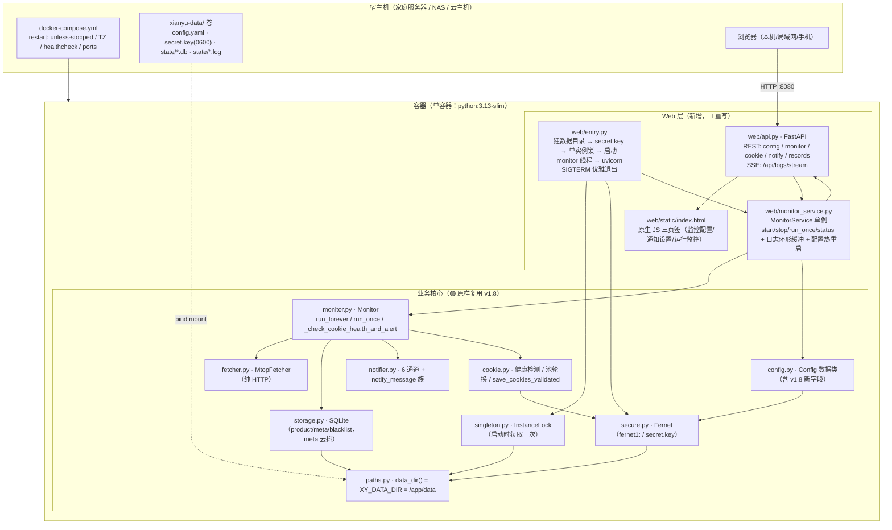
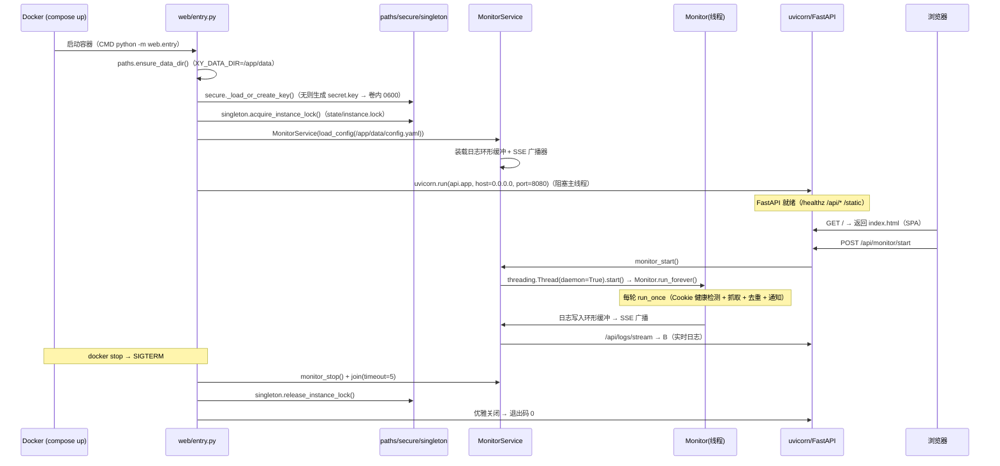
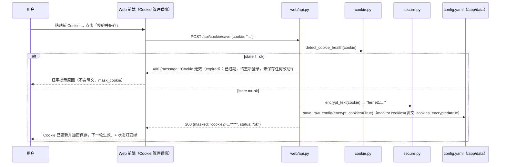
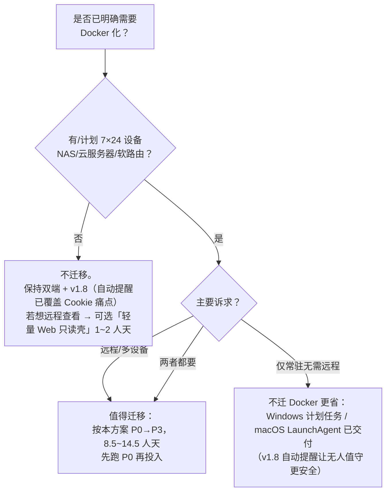

# 闲鱼低价提醒工具 · v1.8.0 Docker 化增量研判与执行方案

> 研判人：架构师 高见远（Gao）
> 研判对象：xianyu-alert **v1.8.0**（Python 3.13，Windows Tkinter + macOS PySide6 Qt，业务核心共享；836 测试函数全 mock）
> 增量基线：`docs/Docker化迁移可行性评估.md`（v1.7.0 基线，2025-08-06）、`docs/Docker与macOS双路径可行性评估.md`（v1.7.0 基线，2025-08-07）
> 日期：2025-08-08　|　性质：**纯分析/设计**（仅产出本文档，未修改任何代码文件）

---

## 0. 执行摘要（一屏结论）

| 项 | 结论 |
| --- | --- |
| **v1.8.0 对 Docker 化的净影响** | 🟢 **显著降低风险、小幅减少工作量**：两大评估期的「硬伤」已落地解决——① `secure.py` 已是 **Fernet 跨平台加密**（评估 §3.2 推荐方案即当前实现，DPAPI 依赖已删除，`secret.key` 放 `data_dir()`）；② `paths.py` 的 `XY_DATA_DIR` 环境变量优先级**已经实现**（`paths.py:75-78`），Docker 卷挂载零改动直通；③ 新增进程单实例锁（`singleton.py`）与容器单进程模型天然一致；④ v1.8 的 Cookie 自动刷新/健康提醒能力可直接映射为 Web 功能，让「容器内无桌面」的 Cookie 痛点得到主动告警缓解 |
| **目标架构** | 确认既有结论：**单容器 = FastAPI + 原生 HTML/JS 单页 + monitor 后台线程**（不推翻）；v1.8 新增能力（Cookie 健康检测/去抖提醒、单实例锁、`cookie status`）全部原样复用 |
| **推荐路线** | 4 阶段：POC（0.5~1.5 人天）→ Web 基础（3~5 人天）→ Web 全功能（3~5 人天）→ 打磨（2~3 人天）；**总工作量 8.5 ~ 14.5 人天**（较评估 9~15 略降，且风险集中在「Web 重写」而非「Cookie 链路」） |
| **最大残留风险** | ① 容器出口 IP 风控（与评估一致，未变）；② 容器内无浏览器 → Cookie 仍须 Web 粘贴（**但 v1.8 过期自动提醒已上线，被动失联问题缓解**）；③ `secret.key` 一旦随卷丢失 → `fernet1:` 密文不可解（需重新粘贴 Cookie） |
| **一句话建议** | **仍不建议为「本地单机自用」迁移**（现有 Windows/macOS 双端 + v1.8 自动提醒已覆盖绝大多数痛点）；**只有当你有家庭服务器/NAS/云主机常驻 24h、或要手机/多设备远程管理时才值得**。若决定做，先跑 POC（0.5~1.5 人天）验证容器内 monitor 链路，再投入 Web。 |

---

## 1. v1.8 增量差异分析（对照既有评估修正结论）

> 方法：逐项对照 v1.7.0 评估基线，找出 v1.8.0 已落地的代码变化，修正既有评估的结论与风险表。

### 1.1 增量差异总表

| # | v1.8.0 变化 | 代码证据 | 对 Docker 化的影响 | 既有评估结论修正 |
| --- | --- | --- | --- | --- |
| 1 | **Fernet 加密已替代 DPAPI** | `secure.py:27-33`（`FERNET_PREFIX="fernet1:"`、`KEY_FILE_NAME="secret.key"`）；`secure.py:88-114`（`_load_or_create_key`：data_dir 生成/加载密钥，POSIX 0600，进程内缓存）；`secure.py:133-197`（`encrypt_text/decrypt_text`，`dpapi1:` 老密文返回空串+提示重登）；`secure.py:200-214`（`mask_cookie` 脱敏） | **消除评估 §3.2 的最大风险**：容器内 Linux 无需 DPAPI；加解密与 Windows/macOS 完全一致；`secret.key` 在 `data_dir()`，Docker 卷挂载即管理 | ⬇️ 风险降级：§7 风险 #1（DPAPI→Fernet 不兼容）从「**最大风险**」降为「**低**」——残留仅两项：老 `dpapi1:` 密文不可解（代码已有优雅降级）、`secret.key` 丢失需重登（文档化即可） |
| 2 | **进程单实例锁已落地** | `singleton.py` 全篇（`InstanceLock`/`acquire_instance_lock`/`release_instance_lock`/`is_running`/`lock_holder_pid`；POSIX flock / Windows msvcrt；锁锚定 `paths.default_state_dir()/instance.lock`） | **与容器单进程模型天然一致**：Web 入口启动时 `acquire_instance_lock()` 即获得「唯一实例」语义；SQLite 单写者由单进程保证，无需额外互斥 | ✅ 确认无冲突；新增**一个注意点**：容器内健康检查**不得**调用 `cli once`/`cli run`（会与运行中 Web 实例抢锁返回 2）——健康检查走 HTTP `/healthz`（见 §2.3/§6） |
| 3 | **Cookie 自动刷新/健康提醒已落地** | `monitor.py:124-232`（`_check_cookie_health_and_alert`：周期检测 + meta 表去抖 + 池汇总提醒 + 全通道 `notify_message`）；`cookie.py:236-258`（`pool_usable_cookies` 健康过滤）；`cookie.py:341-362`（`save_cookies_validated`）；`notifier.py:142-172`（`notify_message` 族）；`storage.py:70-72,548-585`（meta 去抖读写） | **直接映射为 Web 功能**：Web「运行监控」页可展示 Cookie 健康状态灯 + 最近检测结果；「Cookie 管理」弹窗可复用 `save_cookies_validated` 校验粘贴；7×24 挂机时 Cookie 失效会主动推送提醒（不再静默失联） | ✅ 新增价值点：评估 §3.3 方案①「Web 粘贴」升级为「**粘贴 + 自动健康检测 + 主动提醒**」，与桌面 GUI 行为完全对齐 |
| 4 | **新配置字段** | `config.py:110-113`（`cookie_alert_enabled=True`、`cookie_check_interval_seconds=0`）；`config.example.yaml:62-64` | Web「监控配置」表单需补两个字段；容器默认值即可，无需特殊处理 | ✅ 无架构影响，纯表单新增 |
| 5 | **CI 双平台已就绪** | `.github/workflows/release.yml`（windows-latest + macos-14 arm64：测试 → PyInstaller → 发布） | 不影响 Docker 本身；发布流程可**复用测试步骤**（全 mock 836 用例可在容器内跑），后续可加 Docker 构建 job（P3 可选） | ✅ 无架构影响；P3 可复用 `actions/setup-python` + `docker/build-push-action` 模式 |
| 6 | **测试基线提升** | v1.7.0 为 749 测试函数；v1.8.0 实测 836 测试函数（`grep -c "def test_" tests/*.py`） | Web 层新增测试沿用「全 mock + 内存 SQLite + `XY_DATA_DIR` 临时目录」惯例，可在容器内跑通 | ✅ 回归保障更强 |

### 1.2 既有评估结论逐项修正表

| 既有评估结论（v1.7.0 基线） | 出处 | v1.8.0 修正 |
| --- | --- | --- |
| 「最大风险点：Cookie 安全与获取链路——DPAPI 在 Linux 不可用」 | Docker评估 §0/§3.2 | **风险已消除（安全部分）**：Fernet 已在 v1.7.0 落地，v1.8.0 保持；残留「获取链路」= 容器无浏览器 → Web 粘贴（方案不变） |
| 「secure.py 判定：🔴 重写（接口兼容）」 | Docker评估 §1.2 | **改为 🟢 直接复用**：`encrypt_text/decrypt_text/is_encrypted/mask_cookie` 已是 Fernet 跨平台实现，容器内零改动 |
| 「paths.py 判定：🟡 适配——加 XY_DATA_DIR」 | Docker评估 §5.2 | **改为 🟢 直接复用**：`XY_DATA_DIR` 优先级已实现（`paths.py:75-78`），`resolve_data_path` 对绝对路径原样返回（`paths.py:133-149`），容器设 `XY_DATA_DIR=/app/data` 即全链路落卷 |
| 「monitor 判定：🟢 直接复用」 | Docker评估 §1.2 | **保持 🟢，且更完整**：v1.8 的 `_check_cookie_health_and_alert` 零网络、`fetcher!=mtop` 时 no-op——mock 测试不破坏，容器 Web 直接受益 |
| 「cookie.py 判定：🟡 适配（移除 playwright 部分）」 | Docker评估 §1.2 | **保持 🟡 且工作量更小**：playwright 本就在函数内延迟导入（`cookie.py:475-484`），容器不装 playwright 即天然不可用、自动降级粘贴；v1.8 的 `save_cookies_validated`/`pool_usable_cookies` 直接给 Web API 用 |
| 「阶段 0 POC 包含 Fernet 落地」 | Docker评估 §6 | **POC 不再含加密改造**：Fernet 已就绪，POC 缩减为「容器内跑通 `cli once` + 卷落盘 + 测试全绿」，约 0.5~1.5 人天 |
| 「风险 #6：SQLite 并发」 | Docker评估 §7 | **风险降低**：v1.8 单实例锁保证「同 data_dir 只一个实例」；Web+monitor 单进程内线程模型与 GUI 相同（monitor 写、Web 读），沿用 `check_same_thread=False` + busy timeout 即可 |
| 「折中方案 Y：轻量 Web 壳」 | Docker评估 §8.2 / 双路径 §5.3 | **保持不变**，且 v1.8 的 `cookie status` 子命令让「壳」的只读健康巡检更简单（可被 ssh/脚本直接调用） |
| 工作量 9~15 人天 | Docker评估 §0 | **修正为 8.5 ~ 14.5 人天**：POC 减少约 1 人天（Fernet 已完成），其余阶段基本不变；风险集中度从「Cookie 链路 50% + Web 50%」变为「Web 重写 ~80% + 风控 ~20%」 |

### 1.3 一句话增量结论

> **v1.8.0 把评估期「必须重写/适配」的两条 Cookie 链路从「要做」变成了「已完成」**——Fernet 加密、`XY_DATA_DIR`、单实例锁、Cookie 健康检测/去抖提醒全部落地且与容器模型天然兼容。剩下的工作本质上只剩一件：**把 gui.py 的三页签 Tkinter 界面重写为 FastAPI + 原生单页 Web 界面**（复用 gui.py 纯函数与全部业务核心）。

---

## 2. Docker 化目标架构

### 2.1 架构决策总表

| 决策点 | 结论 | 理由（v1.8 现状） |
| --- | --- | --- |
| **单容器 vs 多容器** | **单容器（确认既有结论，不推翻）** | 单用户单任务；SQLite 单写者天然满足；v1.8 单实例锁 = 单进程语义；多容器增加 compose/网络/卷复杂度，零收益 |
| **进程模型** | **单进程多线程：uvicorn 主线程 + monitor daemon 线程**（与 GUI `_launch_worker`/`_monitor_worker` 模型一致，gui.py:3641-3784） | 复用 v1.8 `Monitor.stop()` `_stop` 标志 + `Event.wait` 即时停止语义；避免双进程抢单实例锁/抢 SQLite 写 |
| **Web 框架** | **FastAPI + 原生 HTML/JS 单页**（确认既有推荐） | 与 Python 业务同进程零摩擦；`Monitor`/`Storage`/`Notifier` 直接 import；无 node 构建链；镜像小 |
| **配置热生效** | **简单版：保存配置 → 停止旧 monitor → 用新 Config 重建 → 重启** | 单用户场景够用；不引入运行中热替换复杂度 |
| **Cookie 获取** | **Web 粘贴为主**（复用 `save_cookies_validated`/`detect_cookie_health`）；宿主机 playwright 为辅 | 容器无桌面；v1.8 校验+加密落盘链路直接复用 |
| **健康检查** | **HTTP `/healthz`**（返回 200 + monitor 线程存活 + 最近轮次时间） | **不得用 `cli once`**（会与运行中实例抢单实例锁返回 2） |
| **认证** | 默认绑定 `127.0.0.1`；可选 `XY_WEB_TOKEN` 环境变量启用 Bearer token（详见 §5.4） | 单机自用最小配置；远程访问必须开 token + 反代 |
| **数据卷** | `./xianyu-data:/app/data`（含 config.yaml / secret.key / state/） | `paths.data_dir()` 由 `XY_DATA_DIR=/app/data` 直接接管 |

### 2.2 目标架构图



### 2.3 容器启动时序（entry_web → monitor 线程 → uvicorn）



### 2.4 SQLite 单写者与单实例锁语义（v1.8 对齐）

| 约束 | GUI 现状（v1.8） | 容器 Web 方案 | 一致性 |
| --- | --- | --- | --- |
| SQLite 写 | monitor 线程独占写 | monitor 线程独占写（同进程） | ✅ 完全一致 |
| SQLite 读 | GUI 主线程 `list_notified`/`count_notified` 等查询 | Web handler 读查询（同 `Storage` 实例，`check_same_thread=False` + 短事务 + busy timeout） | ✅ 一致（Web 查询与 GUI 主线程查询同性质） |
| 多实例互斥 | `singleton.acquire_instance_lock()` 在 run/once/gui 入口 | `entry_web` 启动时获取一次 | ✅ 更强（Web 进程即唯一实例） |
| `cli list` 并存 | 只读允许并存（v1.8 共享知识 2） | 容器内 `cli list`/`cli cookie status`/`cli login` 仍可用（不参与锁） | ✅ 一致 |
| `cli once/run` 在容器内 | 会抢锁失败返回 2 | **文档声明**：Web 运行时不可在容器内跑 `once`/`run`；调试用 `cookie status`/`list`/`login` 或 HTTP API | ✅ 一致（语义未变） |

---

## 3. Web 前端与功能映射

### 3.1 页面结构（三页签 → 三页面/三 Tab）

| GUI 页签 | Web 页面 | 关键交互 | 复用来源 |
| --- | --- | --- | --- |
| 监控配置（Tab 1） | 页面「监控配置」 | 关键词表格（增删改/启用开关/过滤词弹窗/预置词弹窗）+ 监测间隔/抓取参数 + Cookie 状态灯 + Cookie 管理弹窗 + 保存 | `gui.py` 纯函数：`config_to_form`(619)、`build_config_dict`(784)、`validate_keyword_entry`(391)、`validate_interval`(523)、`validate_pages`(294)、`add_preset_excludes`(432)、`resolve_preset_exclude_keywords`(450)、`apply_filter_edit`(468)、`keyword_filter_summary`(493)、`cookie_status`(254)、`_cookie_health_label`(2727)、`save_raw_config`(926) |
| 通知设置（Tab 2） | 页面「通知设置」 | 6 通道卡片（启用开关 + 参数表单 + 测试发送） | `normalize_channel_options`(547)、`channel_is_complete`(572)、`default_channel_options`(614)、`make_sample_product`(943)、后端 `build_notifier(channel).notify([sample])` |
| 运行监控（Tab 3） | 页面「运行监控」 | 开始/停止/立即执行一轮 + 状态条 + 实时日志（SSE）+ 提醒记录表（排序/已下架开关/售出/校验在架/黑名单/清空） | `sort_alert_rows`(987)、`blacklist_alert_row`(1029)、`log_tag_for_text`(1075)、`keyword_status_text`(1115)、`parse_enabled_flag`(1127)、`format_countdown`(962)；后端 `Storage.list_notified/list_blacklist/mark_sold_out/check_item_status` |

### 3.2 功能映射完整对照（GUI → Web）

| GUI 功能（gui.py 位置） | Web 映射 | 标注 |
| --- | --- | --- |
| 关键词表格/添加/更新/删除/停用开关（1316-1383/2039-2217） | 表格 + 行内编辑 + 弹窗 | ✅ 完整映射 |
| 编辑过滤词弹窗（排除词/必含词，2126/2278） | 弹窗 | ✅ 完整映射 |
| 预置排除词编辑（2137/2371） | 弹窗 + 写回 config 顶层 | ✅ 完整映射 |
| 监测间隔/抓取方式/页数（1389-1419） | 表单 | ✅ 完整映射 |
| **v1.8 新增字段**：cookie_alert_enabled / cookie_check_interval_seconds（config.py:110-113） | 表单开关 + 数字输入 | 🆕 新增映射（v1.8） |
| 登录 Cookie 状态灯（1424-1431/2559） | 状态徽标 + 健康详情（复用 `cookie_status`/`detect_cookie_health`） | ✅ 完整映射 |
| Cookie 管理对话框（2544-2811，含池增删/启停/检测/设默认/帮助） | 独立弹窗；帮助文案换「容器内粘贴」版 | 🟡 改造（帮助文案换容器版） |
| **v1.8 一键刷新 Cookie**（2638 on_refresh_cookie） | 「🔄 一键刷新」按钮 → 粘贴 → `save_cookies_validated` 校验 → 加密落盘 → 状态灯刷新 | ✅ 完整映射（校验逻辑 v1.8 已就绪） |
| **v1.8 刷新选中/自动停用过期项**（2739 on_manage_cookies） | Cookie 池管理弹窗内按钮 | ✅ 完整映射 |
| 6 通道勾选 + 参数表单 + 测试发送（1460-1520/3107） | 通道卡片 + 测试按钮 → `POST /api/notify/test` | ✅ 完整映射 |
| console 通道提示（1503-1508） | 保留提示；Docker 下 console 输出同时进容器 stdout（`docker logs`） | ✅ 完整映射 |
| ▶ 开始 / ■ 停止 / ⚡ 立即执行（1531-1536） | `POST /api/monitor/start|stop|run_once` | ✅ 完整映射 |
| 状态栏（状态/轮数/累计提醒/下次执行，1552-1559） | 顶部状态条（前端轮询 2s） | ✅ 完整映射 |
| 实时日志（1561-1604/1682-1766） | SSE `/api/logs/stream` + 环形缓冲（复用 `QueueLogHandler` 思路，gui.py:1191-1221）；字号调节砍 | 🟡 改造（Tk 渲染 → 前端渲染） |
| 提醒记录表（双击打开/排序/显示已下架，1606-1648/3155-3275） | 表格 + 链接 + 排序 + 开关 | ✅ 完整映射 |
| 标记已售出 / 校验在架（2985-3438） | 按钮 + 批量任务 + 进度日志（复用 `check_item_status` + `SOLD_CHECK_INTERVAL=1.5` 限速） | ✅ 完整映射 |
| 黑名单管理（3190/3530） | 弹窗（含恢复） | ✅ 完整映射 |
| 清空去重记录（3507） | 按钮 + 二次确认 | ✅ 完整映射 |
| 创建桌面快捷方式（1449/2609） | **砍掉**（容器无桌面语义） | 🔴 砍 |
| 关于（1452/2586） | 页脚/关于弹窗 | ✅ 完整映射 |
| 关闭窗口优雅停线程（3545-3584/3836） | 容器 SIGTERM → `monitor.stop()` + join + 释放锁 | ✅ 完整映射（入口换信号处理） |

**逐项汇总**：✅ 完整映射 22 项 / 🆕 v1.8 新增 1 项 / 🟡 改造 2 项（Cookie 帮助文案、实时日志通道）/ 🔴 砍 1 项（桌面快捷方式）。**功能面覆盖度 ≈ 96%，无核心功能丢失；v1.8 的 Cookie 自动提醒在 Web 上「开箱即得」。**

### 3.3 gui.py 纯函数复用的可行性（已核实）

- `gui.py:40-53` **防御性导入 tkinter**：无图形环境（容器）也能 `from .gui import <纯函数>`，与 `gui_qt/widgets.py:31`、`gui_qt/tab_config.py:37`、`gui_qt/dialogs.py:39` 的既有复用模式完全一致——**容器内直接 import 即可，无需先做「抽函数」重构**。
- 若后续希望 Web 层不依赖 gui.py（纯 UI 模块），可在 `web/form_logic.py` 做一层 re-export（P3 可选，非必需）。

---

## 4. Cookie 链路方案（容器内）

### 4.1 三条链路对比（更新版）

| 方案 | 用户操作 | 复杂度 | v1.8 支持度 | 评价 |
| --- | --- | --- | --- | --- |
| **① Web 粘贴（推荐主路径）** | 浏览器登录 goofish → F12 → 复制 Cookie 头 → Web「Cookie 管理」粘贴 → 服务端校验 + Fernet 加密落盘 | 低 | **`save_cookies_validated`（cookie.py:341-362）已实现**：非 ok 状态拒绝保存并给中文原因；`detect_cookie_health` 状态灯复用 | **主推**：与桌面 GUI 体验一致 |
| ② 宿主机 playwright 生成后导入 | Windows/macOS 本机 `cli login`（playwright 半自动或粘贴）→ 生成 config/卷内 config.yaml → 容器热重载 | 中 | `cli login` 已带校验（v1.8 C15） | 辅助：保留自动登录体验；需处理「外部修改 config」→ Web 重载（见 4.3） |
| ③ 容器内 xvfb + playwright | 容器内虚拟显示跑 headless=False | 高（镜像 +1GB） | playwright 可装但无桌面 | **不推荐**（与轻量目标冲突） |

### 4.2 Web 粘贴时序（复用 v1.8 校验 + 加密落盘）



> 与 v1.8 GUI 刷新链路完全同构（GUI 走 `on_refresh_cookie` → `save_raw_config(encrypt_cookies=True)`，见 v1.8 设计 §5.2）；Web 复用同一「校验 → 加密 → 落盘 → 回显脱敏」四步，**不允许新增明文落盘路径**（v1.8 共享知识 7）。

### 4.3 外部刷新（宿主机 `cli login`）与 Web 热重载

- 容器内/宿主机执行 `cli login --cookie-string "..." --config /app/data/config.yaml`（容器内走 `docker exec`）只写 config.yaml、**不参与单实例锁**（v1.8 语义）。
- Web 侧处理：**MonitorService 每轮 run_once 前（或前端保存前）比对 config.yaml 的 mtime**（复用 v1.8 C22 `config_file_mtime` 思路，gui.py:236/1895），检测到外部修改 → 自动重载 Config 并热重启 monitor（打日志「检测到配置文件外部变更，已重载」）。简单版：Web 保存接口本身就重载，外部修改靠「下一次保存」或「mtime 轮询」兜底。
- 7×24 无人值守时的兜底：**v1.8 的 Cookie 过期自动提醒已上线**——容器内 monitor 每轮检测 `detect_cookie_health`，过期/临期会通过全部通知通道推送（去抖、不含明文），用户收到提醒后在任意浏览器打开 Web 粘贴即可，或直接 ssh 执行 `docker exec <ct> python -m xianyu_alert.cli login --cookie-string "..."`。

---

## 5. 数据卷与镜像规划

### 5.1 数据目录约定

```
/app/data/                        ← XY_DATA_DIR=/app/data（bind mount ./xianyu-data）
├── config.yaml                   # 配置（含 fernet1: 密文 Cookie；权限 0644）
├── secret.key                    # Fernet 密钥（POSIX 0600，secure.py 自动生成）
└── state/
    ├── xianyu_alert.db           # SQLite 主库（product/meta/blacklist）
    ├── xianyu_alert.log(.1/.2/.3) # 滚动文件日志（cli.py install_file_logging 复用）
    ├── xianyu_alert_cli.log      # 容器内 CLI 调试输出（可选）
    └── instance.lock             # v1.8 单实例锁（entry 启动时创建）
```

- **实现零改动**：`paths.data_dir()` 读 `XY_DATA_DIR`（paths.py:75-78）→ 容器 ENV `XY_DATA_DIR=/app/data` 即全链路（config/state/secret.key/日志/锁）自动落卷。
- **备份/迁移**：SQLite 热备份 `sqlite3 /app/data/state/xianyu_alert.db ".backup /backup/xa-$(date +%F).db"`（无需停容器）；**`secret.key` 必须与 `config.yaml`/db 一起备份**，否则 `fernet1:` 密文不可解（v1.8 FAQ 5 同语义）。

### 5.2 secret.key 管理：卷挂载（默认）vs 环境变量注入

| 方案 | 做法 | 安全性 | 复杂度 | 评价 |
| --- | --- | --- | --- | --- |
| **A. 卷挂载（默认推荐）** | `secret.key` 首次启动自动生成到 `/app/data/secret.key`（0600），随卷持久化 | 中——密钥与密文同卷，防「日志/备份文件/截图泄漏」，不防「容器被攻破后同卷取钥」（与 DPAPI/Fernet 威胁模型对等） | 零（secure.py 现成） | 对齐评估 §3.2 方案 A；备份 = 卷整体备份 |
| B. 环境变量注入（可选增强） | compose 传 `XY_SECRET_KEY_BASE64=<base64>`，secure.py 增加「环境变量优先于文件」分支 | 中高——密钥不进持久卷（但进 compose 文件/环境，仍有泄漏面） | 小（secure.py 加 ~10 行分支 + 测试） | 适合「担心卷被拷走」的高级用户；**P2 可选，非默认** |
| C. Docker Secrets | `secrets:` 节挂载密钥文件 | 中高 | 中（swarm 语法） | 单机 compose 收益有限，不做 |

> 决策：**默认 A**；B 作为 P2 可选增强，需用户拍板（见 §9 待确认事项 4）。无论 A/B，**老 Windows `dpapi1:` 密文不可迁移**（代码已优雅降级 → Web 状态灯显示「无法解密」，引导重登）。

### 5.3 镜像规划

| 项 | 决策 | 说明 |
| --- | --- | --- |
| 基础镜像 | `python:3.13-slim`（bookworm，≈120MB） | 与开发运行时一致（3.13）；slim 比 alpine 省 musl 兼容坑 |
| 系统包 | `tzdata`（时区）、`ca-certificates` | `TZ=Asia/Shanghai` 必须装 tzdata（评估 §3.6 同） |
| Python 依赖 | `requests` `beautifulsoup4` `PyYAML` `cryptography` `fastapi` `uvicorn`（约 20~30MB 增量） | **不装 playwright**、不装 PySide6、不装 tkinter |
| 体积控制 | `pip install --no-cache-dir`；`.dockerignore` 排除 `.venv/ state/ dist/ build/ tests/ docs/ re_analysis/ .git/ secret.key`；单层 COPY 源码 | 目标镜像 ~150~180MB（slim 底 + 依赖） |
| 非 root | 可选 `USER app`（P3 加固；注意 volume 权限 1000:1000） | P3 可选，非默认 |
| 健康检查 | `HEALTHCHECK --interval=30s --timeout=5s --retries=3 CMD python -c "import urllib.request;urllib.request.urlopen('http://127.0.0.1:8080/healthz', timeout=4)"` | 探测 Web + monitor 线程存活（healthz 内部检查） |
| 入口 | `CMD ["python", "-m", "web.entry"]` | 替代 build/entry.py 的 exe 逻辑 |
| 端口/绑定 | 容器内 `0.0.0.0:8080`；compose 映射 `127.0.0.1:8080:8080`（默认仅本机） | 远程访问改映射 + token（§5.4） |

### 5.4 Web 访问安全

| 场景 | 方案 | 说明 |
| --- | --- | --- |
| 仅本机（默认） | compose `ports: "127.0.0.1:8080:8080"`，不设 token | 与 GUI 本地使用等价 |
| 局域网/远程（可选） | ① 设置 `XY_WEB_TOKEN=<随机串>` → FastAPI 依赖校验 `Authorization: Bearer <token>`（除 `/healthz` 与静态资源外全部要求）；② 前端首次访问输入 token，存 localStorage | 简单、无第三方依赖；反代方案（Caddy basic_auth / Tailscale）写入 README 作为进阶 |
| 通用 | 所有 API 响应与日志**永不出明文 Cookie**（复用 `secure.mask_cookie`，前 8 后 4）；Cookie 写入接口只接受「校验通过」的明文（服务端加密落盘），不回显明文 | 对齐 v1.8 共享知识 5/7 |

### 5.5 7×24 挂机方案（更新版）

| 项 | 方案 | 说明 |
| --- | --- | --- |
| 进程守护 | compose 顶层 `restart: unless-stopped`（+ `on-failure:5` 防 crash-loop） | 宿主机重启/容器崩溃自动拉起 |
| 健康检查 | 见 §5.3 HEALTHCHECK；`/healthz` 返回 `{web:"ok", monitor:"running|stopped", last_round_at:"..."}` | monitor 卡死（线程死）时 `docker ps` 显示 unhealthy，可被外部告警捕获 |
| 监控线程看门狗（P3 可选） | MonitorService 内一个 watchdog：monitor 线程异常退出（非 stop 请求）→ 记日志 + 3 次重试后不再拉起（避免风控叠加） | 可选项，评估阶段 3 决定 |
| 日志轮转 | 容器 stdout（`docker logs`）+ compose `logging: driver: json-file, options: {max-size: "10m", max-file: "3"}`；文件日志 `state/xianyu_alert.log` 已有 RotatingFileHandler 1MB×4（cli.py:43-69） | 双通道可观测 |
| 时区 | `ENV TZ=Asia/Shanghai` + `apt-get install -y tzdata` | 提醒记录时间正确 |
| 资源限制 | compose `deploy.resources.limits: memory: 256M, cpus: "0.5"` | 单用户纯 Python + SQLite 绰绰有余 |
| **Cookie 失联兜底** | **v1.8 已内置**：monitor 每轮健康检测 + 去抖推送（`_check_cookie_health_and_alert`） | 容器内 Cookie 过期会主动推送提醒，不再静默 |

---

## 6. 分阶段执行方案（含工作量与验收）

> 总工作量：**8.5 ~ 14.5 人天**（单人 2~3 周）。每阶段验收标准均以「浏览器可操作 + 全量测试绿 + 与 GUI 行为对照」为纲。

| 阶段 | 目标 | 主要交付物 | 工作量 | 验收标准 |
| --- | --- | --- | --- | --- |
| **P0：容器 POC** | 证明「业务核心 + v1.8 新能力在容器内可跑」 | `Dockerfile`（最小版：3 件套 + cryptography，**不装 Web**）、`.dockerignore`、`docker-compose.yml`（最小）、卷挂载 + `XY_DATA_DIR=/app/data`；容器内跑 `cli once --config config.example.yaml`（mock）与 `cli cookie status` | **0.5 ~ 1.5 人天** | `docker compose up` 后 `once` mock 抓取成功、SQLite 落盘到挂载卷；`secret.key` 自动生成于卷内（0600）；`fernet1:` 加解密往返 OK；836 测试在容器内全绿；`dpapi1:` 老密文显示「无法解密→重登」 |
| **P1：Web 基础** | FastAPI 起服务；配置读写 + monitor 控制 + 日志 SSE；单页三 Tab 骨架 | 新增 `web/__init__.py`、`web/entry.py`（建目录/密钥/锁/线程/uvicorn/SIGTERM）、`web/api.py`（REST 核心：config GET/PUT、monitor start/stop/run_once/status、cookie save、/healthz、SSE logs）、`web/monitor_service.py`（MonitorService + 日志环形缓冲）、`web/static/index.html`（三 Tab 骨架）+ `app.js` + `style.css`；`tests/test_web_api.py`、`tests/test_web_monitor_service.py` | **3 ~ 5 人天** | 浏览器打开 `http://localhost:8080` 可完成「配置关键词 → 粘贴 Cookie（校验拒绝/通过）→ 开始监控 → 看到 mock 日志与提醒记录」全链路；`/healthz` 返回 200 且含 monitor 状态；`docker stop` 优雅退出（monitor.stop + join + 释放锁）；新增 Web 测试全绿 + 836 基线全绿 |
| **P2：Web 全功能** | 补齐 GUI 三页签全部功能 | `web/api.py` 扩展（notify test、Cookie 池管理、黑名单、售出/校验在架、记录排序/已下架、清空记录）、`web/static` 三页面完整交互（表格/弹窗/状态灯/测试发送）、配置热重启（保存→重建→重启）、config mtime 检测重载 | **3 ~ 5 人天** | 功能面覆盖 §3.2 全部 ✅/🆕 项；与 GUI 行为逐项对照通过（关键词过滤、池轮换、售出、黑名单、通知测试）；Cookie 状态灯与 v1.8 去抖提醒在 Web 可见；容器内全量测试绿 |
| **P3：打磨** | 安全 + 运维 + 文档 + 镜像瘦身 | `XY_WEB_TOKEN` 认证接入（api.py 依赖校验 + 前端 localStorage）、`docker-compose.yml` 完善（restart/healthcheck/TZ/资源限制/logging）、README「Docker 部署」章节（含老数据迁移 + Cookie 重登说明 + 备份指引）、`.github/workflows/release.yml` 可选加 Docker 构建 job、镜像瘦身（多阶段/`--no-cache-dir`/非 root 可选） | **2 ~ 3 人天** | 一条 `docker compose up -d` 即用；重启自动拉起；healthcheck 在 monitor 卡死时可被发现；无 token 时远程访问被拒；README 覆盖「备份 secret.key + db」「Cookie 重登」「反代/Tailscale 进阶」；容器镜像 ≤ ~180MB |

> **执行原则**：P0 通过后再决定是否投入 P1~P3（与既有评估一致）；若 P0 期间发现容器出口 IP 被闲鱼风控高频拦截（实测项），在进入 P1 前先回退决策（见 §8 风险 #2）。

---

## 7. 代码复用清单与文件清单

### 7.1 复用清单（基于 v1.8 现状更新）

| 模块 | 判定 | 复用内容 | 证据 |
| --- | --- | --- | --- |
| `fetcher.py` | 🟢 直接复用 | `MtopFetcher`（签名/服务端筛价/详情判在架）、`build_fetcher`、`MockFetcher` | 纯 HTTP（fetcher.py:635+/1497+） |
| `storage.py` | 🟢 直接复用 | 三表 + meta 去抖（`get/set/delete_meta_value`，storage.py:548-585）+ 黑名单/售出 | 标准库 sqlite3 + paths |
| `notifier.py` | 🟢 直接复用 | 6 通道 + `notify_message` 族 + 工厂 | 全网络（notifier.py:142-172/562+） |
| `monitor.py` | 🟢 直接复用 | `run_forever/run_once/preflight_cookie/_check_cookie_health_and_alert` | 纯逻辑（monitor.py:124-319/480-526） |
| `filters.py` / `models.py` | 🟢 直接复用 | 纯函数 / Product | 零依赖 |
| `secure.py` | 🟢 **直接复用（评估期原判 🔴 重写，已修正）** | Fernet 加解密 + `mask_cookie` + `set_key_file` | `fernet1:` 跨平台（secure.py:133-214） |
| `paths.py` | 🟢 **直接复用（评估期原判 🟡 适配，已修正）** | `data_dir()` 的 `XY_DATA_DIR` 优先级、`resolve_data_path` 绝对路径直通 | paths.py:62-88/133-149 |
| `singleton.py` | 🟢 **直接复用（v1.8 新增）** | `acquire_instance_lock`（entry 启动一次）；`is_running`（healthz 可复用探测） | singleton.py:156-308 |
| `cookie.py` | 🟢 直接复用（纯函数部分） | `detect_cookie_health`/`pool_usable_cookies`/`save_cookies_validated`/`resolve_cookie_for_round`；playwright 部分不 import 即不生效 | cookie.py:174-362 |
| `config.py` | 🟢 直接复用 | YAML 加载/校验（含 v1.8 新字段）；`config_from_dict` 供 Web 表单组装 | config.py:560-613 |
| `gui.py` 纯函数 | 🟢 直接复用 | 表单转换/校验/脱敏/排序/日志标签等 30+ 纯函数（§3.1 清单）；**防御性导入 tkinter 已核实**（gui.py:40-53），容器可 import | gui.py:236-1189 |
| `cli.py` | 🟢 直接复用 | `cookie status`（容器巡检）、`list`、`login --cookie-string`（外部刷新） | cli.py:291-333/225-289 |
| `tests/` | 🟢 直接复用 | 836 测试全保留；新增 Web 层测试沿用 mock 惯例 | tests/ |
| `gui.py` GUI 类 / `gui_qt/` | 🔴 重写为 Web | `XianyuAlertGUI` 三页签 Tkinter 控件 / Qt 控件 → `web/static` 单页 | — |
| `build/entry.py` | 🔴 重写为 `web/entry.py` | exe 入口 → 容器入口（建目录/密钥/锁/线程/uvicorn/SIGTERM） | — |
| `shortcut.py` | 🔴 废弃（不进镜像） | 容器无桌面语义 | — |

**复用度粗估（按有效代码行）**：v1.8 下可直接复用 ≈ **75%**（fetcher/storage/notifier/monitor/filters/models/secure/paths/singleton/cookie 纯函数/config + gui 纯函数），需重写 ≈ 25%（gui 3.9k 行控件层 + 新增 web 层 + Docker 外围）。**与评估期 70% 相比，复用度提升且重写面更单纯（无安全层改造）。**

### 7.2 文件清单

**新增（15 个）**

| 文件 | 内容 | 阶段 |
| --- | --- | --- |
| `web/__init__.py` | 包标识（版本号沿用 `xianyu_alert.__version__`） | P1 |
| `web/entry.py` | 容器入口：`ensure_data_dir` → `secure._load_or_create_key` → `acquire_instance_lock` → `MonitorService` → `uvicorn.run`；SIGTERM 优雅退出（monitor.stop + join + 释放锁） | P1 |
| `web/api.py` | FastAPI app：REST（config/monitor/cookie/notify/records/blacklist）+ SSE（/api/logs/stream）+ /healthz + 可选 token 依赖 | P1/P2/P3 |
| `web/monitor_service.py` | MonitorService 单例：`start/stop/run_once/status/config_reload`；monitor 线程管理；日志环形缓冲 + SSE 广播；config mtime 检测 | P1/P2 |
| `web/static/index.html` | 单页三 Tab（监控配置/通知设置/运行监控）+ 弹窗容器 + CSS 引用 | P1 |
| `web/static/app.js` | 原生 JS：fetch 封装、Tab 渲染、表格/弹窗交互、SSE 订阅、token localStorage | P1/P2 |
| `web/static/style.css` | 页面样式（移动端可用：响应式表格） | P1 |
| `tests/test_web_api.py` | API 单测（TestClient + mock fetcher + 内存 SQLite + `XY_DATA_DIR` 临时目录） | P1 |
| `tests/test_web_monitor_service.py` | MonitorService 单测（start/stop/run_once/status/热重启/日志环形缓冲/SSE） | P1 |
| `tests/test_qa_docker_extra.py` | Docker/Web 回归文件（历史惯例：新版本追加 QA 文件） | P2 |
| `Dockerfile` | python:3.13-slim + tzdata + 依赖 + COPY + HEALTHCHECK + CMD | P0 |
| `docker-compose.yml` | 卷/端口/TZ/restart/healthcheck/logging/资源限制/可选 token | P0/P3 |
| `.dockerignore` | 排除 .venv/ state/ dist/ build/ tests/ docs/ re_analysis/ .git/ secret.key | P0 |
| `requirements-web.txt` | `fastapi>=0.110` `uvicorn>=0.29`（或并入 requirements.txt，二选一，见附录 A） | P0 |
| `docs/v1.8_Docker化增量研判与执行方案.md` | 本文档 | — |

**修改（5 个）**

| 文件 | 改动点 | 阶段 |
| --- | --- | --- |
| `README.md` | 新增「Docker 部署」章节：compose 用法、数据卷、备份（secret.key+db）、Cookie 重登、反代/Tailscale 进阶、容器内 CLI 约束（不可 `once/run` 抢锁） | P3 |
| `.github/workflows/release.yml` | 可选：新增 build-docker job（buildx 双平台 amd64/arm64 + 推送 GHCR） | P3 可选 |
| `config.example.yaml` | 注释补充 Docker 部署提示（`XY_DATA_DIR`、`XY_WEB_TOKEN`） | P3 |
| `xianyu_alert/secure.py` | **可选（P2）**：`XY_SECRET_KEY_BASE64` 环境变量优先分支（默认不启用） | P2 可选 |
| `xianyu_alert/__init__.py` / 两个 spec | **仅当发版**时同步版本号（惯例三处一致；Docker 化本身不强制升版） | 发版时 |

> 说明：**不修改任何业务核心模块**（fetcher/storage/notifier/monitor/cookie/config/secure/paths/singleton）——它们全部原样复用，保证 Windows/macOS 桌面版与 Docker 版行为一致、互不回归。

---

## 8. 风险与对策（更新版）

> 基于评估 §7 风险表，结合 v1.8 现状更新。**#1 已消除降级、#6 已降低、其余基本保留**，新增 #8~#11。

| # | 风险 | v1.8 影响 | 对策 |
| --- | --- | --- | --- |
| ~~1~~ | ~~DPAPI→Fernet 老数据不兼容~~ | **已消除（安全部分）**：Fernet 已落地，跨平台可解；残留仅 `dpapi1:` 老密文不可解（代码优雅降级 → Web 状态灯显示「无法解密」引导重登） | 迁移文档写明「容器内首次使用需重新粘贴 Cookie」；**不做**自动迁移 |
| 2 | **风控差异**：容器出口 IP（数据中心/NAS NAT）与本地 IP 不同 | 不变（v1.8 不改变抓取频率）；但 v1.8 的**池健康过滤**（`pool_usable_cookies`）让过期 Cookie 不再注入 fetcher，间接降低无效请求 | 维持 interval ≥ 600s；多 Cookie 池轮换；P0 实测容器 IP 的风控表现；若高频被 RGV587 拦截 → 回退决策（不迁 Docker） |
| 3 | **Web 界面安全**：绑定非 localhost 时未认证访问可读/改配置、触抓取 | 不变；v1.8 `mask_cookie` 脱敏惯例可直接沿用 | 默认 `127.0.0.1`；远程必须开 `XY_WEB_TOKEN` + 反代/Tailscale；所有 API 响应/日志走 `mask_cookie`；写操作 POST + 同源校验 |
| 4 | 时区/调度（UTC 错 8 小时） | 不变 | `ENV TZ=Asia/Shanghai` + tzdata |
| 5 | playwright 体积（+1GB） | 不变 | 默认不装；Web 粘贴替代；宿主机 playwright 生成后导入为辅 |
| 6 | **SQLite 并发**（monitor 写 + Web 读） | **降低**：v1.8 单实例锁保证同 data_dir 单实例；Web+monitor 同进程线程模型与 GUI 相同 | monitor 线程独占写；Web 读查询短事务 + busy timeout；备份用 `.backup` 热备 |
| 7 | Docker 环境门槛（普通用户） | 不变 | compose + 一键脚本（`start.sh`/`start.bat` 封装 `docker compose up -d`）；README 面向非技术用户 |
| 8 | **secret.key 丢失/未随卷持久化** → `fernet1:` 密文不可解 | **新增（v1.8 语义）**：密钥文件在 `data_dir()`，若卷未挂载或误删则 Cookie 全失效 | 卷挂载 `/app/data`（含 secret.key）；README 备份指引「secret.key 与 config.yaml/db 一起备份」；P2 可选 `XY_SECRET_KEY_BASE64` 注入 |
| 9 | **健康检查与单实例锁冲突**：`cli once` 抢锁失败 | **新增（v1.8 特有）**：Web 进程持有锁，健康检查若跑 `cli once` 会返回 2 | 健康检查一律走 HTTP `/healthz`；README 声明容器内调试用 `cookie status`/`list`/`login`（不参与锁） |
| 10 | **外部刷新 config 与 Web 内存态不一致** | **新增（v1.8 C22 场景）**：宿主机 `cli login` 写 config.yaml，Web 仍在用旧 Config | MonitorService 检测 config mtime → 自动重载 + 热重启（简单版）；Web 保存接口即重载 |
| 11 | **monitor 线程静默死亡**（异常未捕获） | 不变（`run_forever` 单轮异常已容错，monitor.py:514-515；但线程级崩溃无兜底） | `/healthz` 检查 monitor 线程存活 + 最近轮次时间；P3 可选 watchdog（3 次重启上限） |

---

## 9. 决策建议与下一步

### 9.1 客观决策依据（结合用户实际）

**用户画像（据交接文档与既往评估）**：个人自用、已有 Windows 与 macOS M4 双端可用、无明确家庭服务器/NAS 需求（评估期假设，需确认）。

| 对比项 | 保持现状（Windows/macOS 双端 + v1.8） | Docker 化后 |
| --- | --- | --- |
| 使用门槛 | 双击 exe / .app | 需 Docker 环境 + 浏览器打开 + 维护容器 |
| Cookie 管理 | GUI/CLI 粘贴 + **v1.8 自动过期提醒**（推送通道主动告警） | Web 粘贴 + 同样自动提醒；**首次迁移必重登**（`dpapi1:` 不可迁） |
| 多设备/远程访问 | ❌ 无 | ✅ 局域网/公网（token + 反代） |
| 7×24 常驻 | Windows 计划任务 / macOS LaunchAgent（已有交付物） | ✅ `restart=unless-stopped` 自动拉起（更稳） |
| 环境隔离 | 无 | ✅ 抓取进程与桌面隔离 |
| 工作量 | 0（现状） | 8.5~14.5 人天 + 长期维护 |

**v1.8 的关键修正点**：既有评估说「Docker 化的最大风险是 Cookie 链路」——**该风险在 v1.8 已大幅收敛**（Fernet 落地 + 自动提醒）。但**「值不值得」的判断框架不变**：Docker 化的真实增量价值仍是「常驻 24h + 远程/多设备 + 环境隔离」三项，而这三项对「本地双端自用」用户没有吸引力。

### 9.2 推荐结论（决策树）



- ✅ **值得迁移**：有/计划 7×24 设备且要远程管理 → 按本方案执行（先 P0）。
- ⛔ **不值得**：本地双端自用 → 保持现状；v1.8 已把「Cookie 失联」痛点用自动提醒解决，迁移是负收益。
- 🟡 **折中（不迁 Docker）**：若只是想要「手机看状态/改关键词」，用既有「轻量 Web 只读壳」方案（1~2 人天，本地 127.0.0.1），监控仍在桌面版跑；或直接依赖 v1.8 推送通道（只出不进）。

### 9.3 下一步动作（待用户确认）

| 顺序 | 事项 | 用途 |
| --- | --- | --- |
| 1 | **确认设备前提**：是否已有/计划 7×24 Docker 主机（NAS/云服务器/软路由）？ | 决定是否启动 P0 |
| 2 | **确认访问范围**：仅本机 / 局域网 / 公网（反代）？ | 决定认证方案（默认 localhost；远程开 token） |
| 3 | **确认 Web 认证形态**：token（默认推荐，`XY_WEB_TOKEN`）vs basic auth？ | P3 落地细节 |
| 4 | **确认 secret.key 管理**：卷挂载（默认）vs `XY_SECRET_KEY_BASE64` 环境注入（P2）？ | 决定 secure.py 是否加可选分支 |
| 5 | **确认镜像平台**：amd64 / arm64 / 双平台 buildx？ | Dockerfile/compose 平台约束 |
| 6 | **确认 P3 是否加 CI Docker job**（GHCR 推送） | 发布流程扩展 |
| 7 | **确认「容器内 CLI 调试」边界**：接受「Web 运行中不可 `once/run`（抢锁返回 2）」，调试走 HTTP/`cookie status`？ | 文档与 README 表述 |

> 若用户确认「暂不迁移」：本方案存档，P0 可作为「万一以后有 NAS」的零成本验证（0.5~1.5 人天）先行完成，不浪费。

---

## 附录 A：依赖变化

| 依赖 | 版本 | 用途 | 体积影响 | 说明 |
| --- | --- | --- | --- | --- |
| `fastapi` | `>=0.110,<1.0` | Web API 框架 | ~1.5MB（+starlette/pydantic 传递依赖） | 与 Python 3.13 兼容（0.110+） |
| `uvicorn[standard]` | `>=0.29,<1.0` | ASGI 服务器 | ~1MB（standard 含 uvloop/httptools；可只用纯 uvicorn 减依赖） | 单进程单 worker；`uvicorn` 不带 `[standard]` 亦可 |
| `requests` / `beautifulsoup4` / `PyYAML` / `cryptography` | 沿用 requirements.txt | 既有运行时 | 已计入 | **容器内必须装 cryptography**（Fernet 依赖，不再允许降级明文） |
| ~~playwright~~ | — | — | **不装**（省 ~1GB） | Web 粘贴替代 |
| ~~PySide6~~ / ~~tkinter~~ | — | — | **不装**（省 150MB+） | Web 替代 GUI |
| `tzdata` | apt 包 | 时区 | ~0.5MB | `TZ=Asia/Shanghai` 必需 |

**安装策略**：新增 `requirements-web.txt`（fastapi + uvicorn），`Dockerfile` 中 `pip install --no-cache-dir -r requirements.txt -r requirements-web.txt`。桌面版 requirements.txt **不变**（fastapi/uvicorn 仅容器需要，避免污染 exe 体积）。

---

## 附录 B：docker-compose 示例（目标态）

```yaml
# docker-compose.yml（P3 目标态；P0 可先去掉 token/healthcheck 精化项）
services:
  xianyu-alert:
    image: xianyu-alert:1.8.0          # 或 ghcr.io/<user>/xianyu-alert:latest
    build: .
    container_name: xianyu-alert
    restart: unless-stopped            # 7×24：宿主机重启/崩溃自动拉起
    environment:
      XY_DATA_DIR: /app/data           # paths.data_dir() 直通（v1.8 已支持）
      TZ: Asia/Shanghai                # 提醒记录时间正确（需 tzdata）
      # XY_WEB_TOKEN: "change-me-随机串" # 远程访问时启用 Bearer 认证（P3）
      # XY_SECRET_KEY_BASE64: "..."    # 可选：密钥环境注入（P2，默认用卷内 secret.key）
    ports:
      - "127.0.0.1:8080:8080"          # 默认仅本机；远程改为 "8080:8080" + 开 token
    volumes:
      - ./xianyu-data:/app/data        # config.yaml / secret.key / state/ 全部落卷
    healthcheck:
      test: ["CMD", "python", "-c",
        "import urllib.request;urllib.request.urlopen('http://127.0.0.1:8080/healthz', timeout=4)"]
      interval: 30s
      timeout: 5s
      retries: 3
      start_period: 10s
    logging:
      driver: json-file
      options:
        max-size: "10m"
        max-file: "3"
    deploy:
      resources:
        limits:
          memory: 256M
          cpus: "0.5"
    # 非 root 加固（P3 可选）：需卷属主对齐
    # user: "1000:1000"
```

```dockerfile
# Dockerfile（P0 最小版起步，P3 瘦身）
FROM python:3.13-slim
ENV PYTHONDONTWRITEBYTECODE=1 \
    PYTHONUNBUFFERED=1 \
    TZ=Asia/Shanghai \
    XY_DATA_DIR=/app/data
RUN apt-get update && apt-get install -y --no-install-recommends tzdata \
    && rm -rf /var/lib/apt/lists/*
WORKDIR /app
COPY requirements.txt requirements-web.txt ./
RUN pip install --no-cache-dir -r requirements.txt -r requirements-web.txt
COPY xianyu_alert/ ./xianyu_alert/
COPY web/ ./web/
RUN mkdir -p /app/data
EXPOSE 8080
HEALTHCHECK --interval=30s --timeout=5s --retries=3 \
    CMD python -c "import urllib.request;urllib.request.urlopen('http://127.0.0.1:8080/healthz', timeout=4)"
CMD ["python", "-m", "web.entry"]
```

---

## 附录 C：证据索引（v1.8 现状）

| 结论 | 证据位置 |
| --- | --- |
| 版本 v1.8.0 | `xianyu_alert/__init__.py:21`（`__version__ = "1.8.0"`）；git log `6a63c9e feat: v1.8.0 Cookie 自动刷新 + 进程单实例锁 + 双平台 CI` |
| Fernet 已替代 DPAPI（`fernet1:` / secret.key / 0600 / 进程缓存） | `xianyu_alert/secure.py:27-39, 74-114, 133-214` |
| `dpapi1:` 老密文优雅降级（返回空串 + 重登提示） | `xianyu_alert/secure.py:177-180` |
| `XY_DATA_DIR` 优先级已实现（Docker 卷直通） | `xianyu_alert/paths.py:62-88`；`resolve_data_path` 绝对路径直通 `paths.py:133-149` |
| 单实例锁（flock/msvcrt、锚定 data_dir/state/instance.lock） | `xianyu_alert/singleton.py:56-69, 122-215, 288-308` |
| CLI 锁参与范围（run/once/gui；login/list/cookie 不参与） | `xianyu_alert/cli.py:422-431` |
| Cookie 健康检测/去抖提醒（v1.8） | `xianyu_alert/monitor.py:124-232`；`cookie.py:174-258`；`storage.py:70-72,548-585` |
| `save_cookies_validated`（校验后保存） | `xianyu_alert/cookie.py:341-362` |
| 通知文本提醒（notify_message 族，v1.8） | `xianyu_alert/notifier.py:142-172` |
| 新配置字段（cookie_alert_enabled / cookie_check_interval_seconds） | `xianyu_alert/config.py:110-113`；`config.example.yaml:62-64` |
| gui.py 防御性导入 tkinter（容器可 import 纯函数） | `xianyu_alert/gui.py:40-53` |
| gui.py 可复用纯函数（表单/校验/脱敏/排序） | `xianyu_alert/gui.py:236-1189`（`config_to_form`:619、`build_config_dict`:784、`save_raw_config`:926、`validate_keyword_entry`:391、`channel_is_complete`:572、`cookie_status`:254 等） |
| Qt GUI 复用 gui.py 纯函数（模式已证明） | `xianyu_alert/gui_qt/widgets.py:31`、`tab_config.py:37`、`dialogs.py:39`、`app.py:39` |
| monitor 线程模型（后台线程 + stop 标志 + Event.wait） | `xianyu_alert/gui.py:3641-3784`；`monitor.py:476-526` |
| 滚动文件日志（1MB×4） | `xianyu_alert/cli.py:43-69` |
| mtop 纯 HTTP（风控依赖出口 IP） | `xianyu_alert/fetcher.py:265-281, 635+`；README 风控频率建议 |
| 双平台 CI（Windows + macOS arm64） | `.github/workflows/release.yml` |
| 测试基线 836 函数（实测） | `grep -c "def test_" tests/*.py` 汇总 |

---

*（本文档为增量研判与执行方案，未修改任何代码文件；是否进入 P0 由用户按 §9.3 待确认事项拍板。）*
