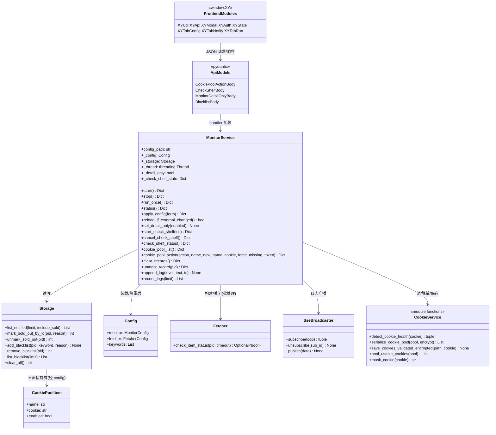
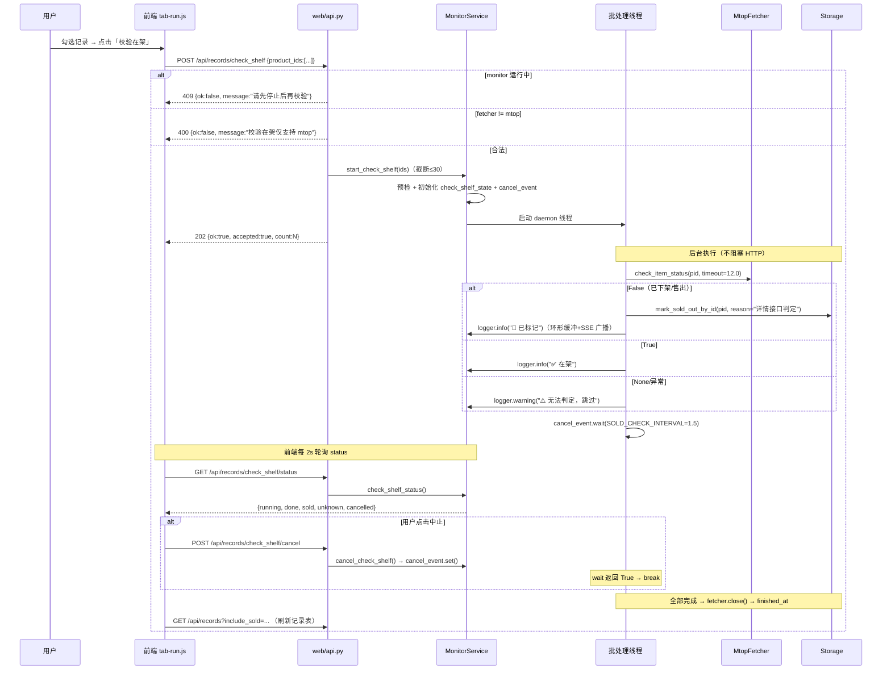
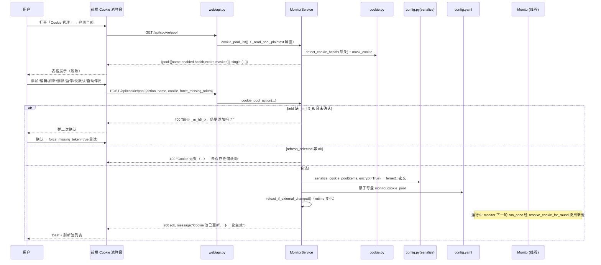
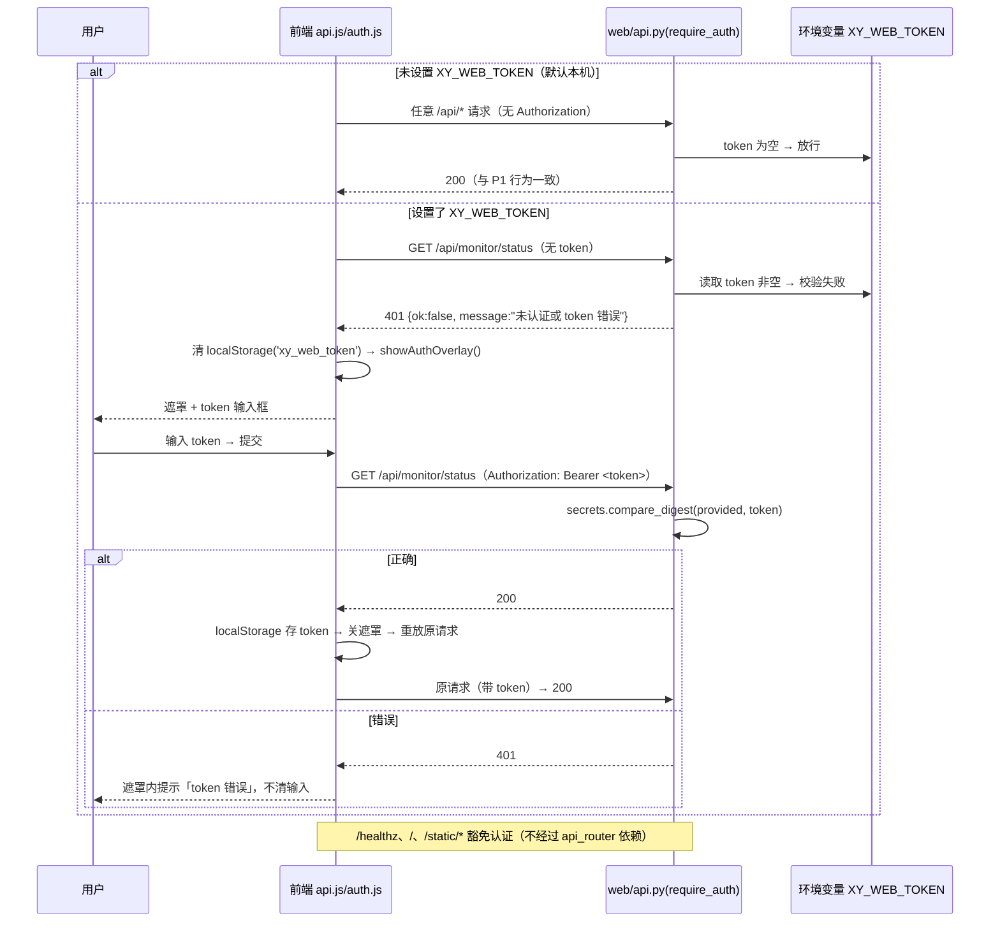

# 闲鱼低价提醒工具 · v1.8 Docker 化 P2（Web 全功能）+ P3（打磨）增量设计

> 架构师：高见远（Gao）
> 依据：`docs/v1.8_P2P3_增量PRD_Web全功能与打磨.md`（需求基线，P2-01~P2-18 + P3-01~P3-05 + 验收表 + 待确认 10 项）、`docs/v1.8_Docker化增量研判与执行方案.md`（既有设计 §3.2 功能映射 / §5.4 认证 / §6 分阶段）、P1 交付源码（`web/api.py` / `web/monitor_service.py` / `web/entry.py` / `web/static/*` / `tests/test_web_*.py` / `Dockerfile` / `docker-compose.yml` / `entrypoint.sh`）
> 日期：2025-08-08　|　性质：**纯分析/设计**（未修改任何代码文件）
> 设计原则：**复用业务核心零改动**（fetcher/storage/notifier/monitor/cookie/config/secure/paths/singleton/gui 纯函数全部原样复用）；新增改动全部落在 `web/` 层 + 测试 + 外围文档；与 PRD 冲突时以 PRD 为准并同步回本文档。

---

## 0. 执行摘要（一屏结论）

| 项 | 结论 |
| --- | --- |
| **增量本质** | P1 已覆盖 §3.2 约 60% 功能面；P2 补齐的是「**管理数据所需的 Web 层交互**」——Cookie 池、黑名单、校验在架、售出撤销、清空记录、预置词编辑、关键词编辑、过滤词弹窗，全部是 **API + 前端组件**工作，业务逻辑复用核心库既有函数（`cookie.py`/`storage.py`/`gui.py`/`fetcher.py`） |
| **核心设计决策** | ① 前端 `app.js` 按职责拆分（无构建链，多 `<script>` 顺序加载 + 全局命名空间 `window.XY`）；② 「校验在架」走 **异步批处理线程 + 202 立即返回 + SSE 进度日志 + 独立 cancel/status 接口**（避免 45s+ HTTP 长阻塞与超时）；③ 认证用 FastAPI `APIRouter(dependencies=[Depends(require_auth)])` 一次性挂载，天然豁免 `/healthz` `/` `/static/*`；④ SSE 因 `EventSource` 无法带 `Authorization` 头，前端统一改 **fetch + ReadableStream** 流式订阅（兼容认证与自动重连） |
| **零新增依赖** | 认证用 stdlib `secrets.compare_digest`；无任何新第三方包（依赖包列表仍为 P1 的 fastapi/uvicorn + 业务核心 requirements.txt） |
| **任务划分** | T01 基础设施+认证骨架 → T02 后端服务层扩展 → T03 前端核心业务组件 → T04 前端体验打磨与集成 → T05 Docker/运维/文档/镜像瘦身（**5 个任务，每任务 ≥3 文件**，依赖链 T01→T02→T03→T04 + T01→T05） |
| **最大残留风险** | ① `check_shelf` 依赖 mtop 详情接口，容器出口 IP 风控表现需实测（既有风险 #2 不变）；② Cookie 池密文落盘依赖 `cryptography`（容器内已装，P0 已验证）；③ SSE fetch 流式改造引入前端重连逻辑，需自测断线重连 |

---

## 1. 待确认决策（Q1~Q10：直接采用 PRD §7 建议默认值 + 理由）

> PRD 明确「需用户/架构师拍板」的 10 项，本设计**全部按建议默认值落地**，无需用户再拍板；理由与实现落点如下。

| # | 问题 | 决策（采用默认） | 理由 | 落点 |
| --- | --- | --- | --- | --- |
| Q1 | Cookie 池管理 UI 形态 | **独立弹窗**（对齐 GUI `on_manage_cookies`，gui.py:2739） | GUI 即弹窗（760×440 表格 + 9 按钮）；Web 弹窗可复用同一操作集合（增删/启停/检测/设默认/刷新选中/自动停用/帮助）；页内表格挤占 Tab1 空间 | T03 `tab-config.js` Cookie 池弹窗 |
| Q2 | 校验在架上限/限速 | **沿用 GUI 常量** `SOLD_CHECK_MAX_ITEMS=30` / `SOLD_CHECK_INTERVAL=1.5` | 行为一致性与防风控是第一诉求（PRD 验收「测试用 mock 计时断言 ≤ 实际条数×1.5s」）；直接引用 `gui.SOLD_CHECK_*`（gui.py:113-115）避免重复定义漂移 | T02 `monitor_service.py` |
| Q3 | 售出撤销交互 | **行灰显 + 按钮切换「恢复在架」** | 对齐 GUI「已售出行再点一次恢复」（gui.py:3305-3315）；`include_sold=True` 时 `sold_out=1` 行灰显、按钮文案/行为切换 | T02 `unmark_record` + T03 `tab-run.js` 行渲染 |
| Q4 | 清空是否保留 blacklist | **保留**（对齐 `storage.clear_all` v3.6 语义，storage.py:587-606） | 黑名单是用户长期偏好，清空去重历史不应撤销；PRD P2-05 验收「blacklist 保留」 | T02 `clear_records` |
| Q5 | `XY_WEB_TOKEN` 默认 | **默认不开启**（仅远程场景开启） | compose 默认 `127.0.0.1:8080:8080`（本机）；开启 token 零成本（设置环境变量即启用），文档引导远程开启 | T01 认证依赖 + T05 README |
| Q6 | 镜像非 root | **可选，默认不启用** | 卷属主 1000:1000 适配成本 > 收益（个人自用）；`user: "1000:1000"` 注释保留在 compose 供高级用户启用 | T05 compose/Dockerfile 注释 |
| Q7 | CI Docker job | **可选，打 tag 触发，双平台 amd64/arm64 → GHCR** | 复用既有 release.yml 模式；`docker/build-push-action` + buildx；失败不阻断桌面 job | T05 `release.yml` |
| Q8 | `XY_SECRET_KEY_BASE64` | **不做** | 卷挂载 secret.key（方案 A）已覆盖；环境注入增加 secure.py 改动面与泄漏面，收益有限 | 明确排除 |
| Q9 | `page_size`/`page_sleep` 暴露 | **暴露**（补齐监测参数完整性） | 满足「业务逻辑缺失」反馈；`web_form_from_config`/`config_from_web_form` 透传，前端校验 `1~100` / `≥0` | T02 表单透传 + T03 表单 UI |
| Q10 | 关于弹窗内容 | **版本/数据目录/配置路径/GitHub 链接/免责声明** | 版本读 `/healthz`（已有）；目录/路径经 `GET /api/config` 或 `/healthz` 补充；链接与免责声明静态文案 | T04 `app.js` 关于弹窗 |

**明确排除项（PRD §6，本设计不涉及）**：桌面快捷方式、playwright 容器化、运行中配置热替换（复杂版）、多容器架构、DPAPI 老密文自动迁移、`XY_SECRET_KEY_BASE64`、桌面 GUI 等价物进镜像、通知去抖/聚合。

---

## 2. API 扩展设计（web/api.py 路由表）

### 2.1 路由总表（P1 现状 + P2/P3 新增）

> 统一信封沿用 P1：成功 `{"ok": true, ...}`；失败 `{"ok": false, "message": "中文原因"}`（`ok()` / `fail()` 助手不变）。**任何响应/错误信息永不出明文 Cookie**（`mask_cookie` 脱敏，共享知识 5/7 延续）。

| 方法 | 路径 | 阶段 | 请求体/参数 | 成功响应 | 错误语义 |
| --- | --- | --- | --- | --- | --- |
| GET | `/` | P1 | — | index.html（免认证） | — |
| GET | `/healthz` | P1 | — | `{status, monitor_running, last_round_at, round_count, notified_count}`（免认证） | — |
| GET | `/api/config` | P1 | — | 表单（Cookie 脱敏） | 401/500 |
| PUT | `/api/config` | P1 | `{form}` | `{ok, restarted}` | 400（ConfigError 中文）/401/500 |
| POST | `/api/monitor/start` | P1 | — | `{ok, message}` | 409（已在运行）/401 |
| POST | `/api/monitor/stop` | P1 | — | `{ok, message}` | 401 |
| POST | `/api/monitor/run_once` | P1 | — | `{ok, notified}` | 409（运行中）/401 |
| GET | `/api/monitor/status` | P1 | — | 状态条全字段 **+ `detail_only`（P2 新增）** | 401 |
| POST | `/api/monitor/detail_only` | **P2** | `{enabled: bool}` | `{ok, detail_only}` | 400/401 |
| POST | `/api/cookie/save` | P1 | `{cookie}` | `{ok, masked, status}` | 400（校验拒绝）/500（加密失败）/401 |
| GET | `/api/cookie/pool` | **P2** | — | `{ok, pool: [...], single: {...}, pool_used: bool}` | 500/401 |
| POST | `/api/cookie/pool` | **P2** | `{action, name?, new_name?, cookie?, force_missing_token?}` | `{ok, message, pool?}` | 400/409/500/401 |
| POST | `/api/notify/test` | P1 | `{channel_type, options}` | `{ok, message}` | 400/500/401 |
| GET | `/api/records` | P1 | `include_sold/limit/sort/order` | `{ok, records, total}`（**含 `sold_out` 标志，P2 前端灰显用**） | 500/401 |
| POST | `/api/records/{id}/sold` | P1 | — | `{ok, updated}` | 400/500/401 |
| POST | `/api/records/{id}/unmark` | **P2** | — | `{ok, updated}` | 400/500/401 |
| POST | `/api/records/{id}/blacklist` | P1（改） | `{reason}`（前端加原因输入，P2） | `{ok, message}` | 400/500/401 |
| GET | `/api/blacklist` | **P2** | `limit=100` | `{ok, items: [{product_id, keyword, reason, created_at}], total}` | 500/401 |
| POST | `/api/blacklist/{product_id}/restore` | **P2** | — | `{ok, removed}` | 400/500/401 |
| POST | `/api/records/check_shelf` | **P2** | `{product_ids: [...]}`（≤30） | **202** `{ok, accepted, count}` | 400（空/非 mtop）/409（monitor 运行 或 已有批处理）/401 |
| GET | `/api/records/check_shelf/status` | **P2** | — | `{ok, running, total, done, sold, unknown, cancelled, started_at, finished_at}` | 401 |
| POST | `/api/records/check_shelf/cancel` | **P2** | — | `{ok, cancelled}` | 401 |
| POST | `/api/records/clear` | **P2** | — | `{ok, deleted}` | 409（monitor 运行）/500/401 |
| GET | `/api/logs/stream` | P1（改） | — | SSE（**受认证保护；前端 fetch 流式订阅**） | 401 |
| GET | `/static/*` | P1 | — | 静态资源（免认证） | — |

### 2.2 认证依赖 `require_auth`（P3-01）

**实现方式（结构性决策）**：把现有挂在 `app` 上的全部 `/api/*` 路由迁入一个带默认依赖的 APIRouter：

```python
# web/api.py
import os, secrets
from fastapi import APIRouter, Depends, HTTPException, Request

def require_auth(request: Request) -> None:
    """Bearer token 认证依赖：XY_WEB_TOKEN 未设置 → 放行；设置 → 常数时间校验。
    401 语义：未携带 / 错误均返回 401（统一信封经全局 HTTPException handler 转换）。"""
    token = os.environ.get("XY_WEB_TOKEN", "").strip()
    if not token:
        return
    header = request.headers.get("Authorization", "")
    provided = header[len("Bearer "):].strip() if header.startswith("Bearer ") else ""
    if not provided or not secrets.compare_digest(provided, token):
        raise HTTPException(status_code=401, detail="未认证或 token 错误")

api_router = APIRouter(prefix="/api", dependencies=[Depends(require_auth)])
# 把现有 /api/* 路由迁入 api_router（路径去掉 /api 前缀，由 prefix 统一加）；
# /healthz、/、/static/* 仍直接挂 app —— 天然豁免认证。
app.include_router(api_router)

@app.exception_handler(HTTPException)
async def http_exception_handler(request: Request, exc: HTTPException):
    # 统一失败信封：{"ok": false, "message": ...}（含 401/404/409 等 FastAPI 抛出的异常）
    return JSONResponse(status_code=exc.status_code, content={"ok": False, "message": str(exc.detail)})
```

**行为矩阵**：

| 场景 | `XY_WEB_TOKEN` 未设置 | 设置且携带正确 token | 设置且未携带/错误 |
| --- | --- | --- | --- |
| `/healthz` `/` `/static/*` | 200 | 200（豁免） | 200（豁免） |
| 任一 `/api/*` | 200（与 P1 完全一致） | 200 | **401** `{"ok": false, "message": "未认证或 token 错误"}` |

要点：
- **常数时间比较**：`secrets.compare_digest(provided, token)`（PRD P3-01 should）。
- **SSE 同样受保护**：`/api/logs/stream` 在 `api_router` 内 → 未认证 401。前端因此不能用 `EventSource`（无法带 header），统一改 fetch 流式（§3.4）。
- **不设 token 行为不变**：`require_auth` 空 token 直接放行，P1 全部测试无需改动认证路径（新增测试单独覆盖 token 分支）。

### 2.3 新增/修改端点详细设计

#### （1）Cookie 池（P2-01）

**GET `/api/cookie/pool`**
```
200 {
  "ok": true,
  "pool_used": true,                       # 池中是否有「启用+健康」条目（resolve_cookie_for_round 语义）
  "pool": [{
    "name": "主账号",
    "enabled": true,
    "health_state": "ok",                  # ok/expiring/expired/no_token/missing/invalid_encrypt
    "health_reason": "有效（含 _m_h5_tk 且未过期）",
    "expire_at": "2025-08-09 12:00:00",    # 未知 → "未知"；停用/空 → "—"
    "masked": "cookie2=ab...xyz"           # secure.mask_cookie 脱敏，绝不出明文
  }],
  "single": {"health_state": "missing", "health_reason": "未配置 Cookie", "masked": ""},
  "message": "池为空时回退单值"             # 提示语义（仅池无健康条目时附带）
}
```
实现：`service.cookie_pool_list()` → `_read_pool_plaintext()`（磁盘 config → 解密 → 逐条 `detect_cookie_health` + `mask_cookie`）+ `detect_cookie_health(单值)`。**绝不回传明文**。

**POST `/api/cookie/pool`** — action 驱动，请求体 `CookiePoolActionBody`：
```python
class CookiePoolActionBody(BaseModel):
    action: str = Field(..., description="add/update/delete/toggle/set_default/refresh_selected/auto_disable_expired")
    name: Optional[str] = Field(None, description="目标条目名称（add 必填；其余按 name 定位）")
    new_name: Optional[str] = Field(None, description="update 改名后的新名称")
    cookie: Optional[str] = Field(None, description="add/update/refresh_selected 的明文 Cookie")
    force_missing_token: bool = Field(False, description="add 缺 _m_h5_tk 时前端二次确认后置 true")
```

| action | 行为 | 校验/错误 |
| --- | --- | --- |
| `add` | 追加 `{name, cookie, enabled:true}`；缺 `_m_h5_tk` 且 `force_missing_token=false` → **400** 提示「缺少 _m_h5_tk，mtop 抓取很可能失败，仍要添加吗？」（前端弹确认后重试 `force=true`） | 400：name/cookie 空、重名 |
| `update` | 改名 / 换 Cookie（`cookie` 可选，不传只改名）；`new_name` 重名校验 | 400：条目不存在、new_name 重名 |
| `delete` | 删除条目（前端二次确认） | 400：条目不存在 |
| `toggle` | 切换 `enabled`（停用条目不参与轮换） | 400：条目不存在 |
| `set_default` | 选中条目 Cookie → 写 `monitor.cookies`（**加密落盘** + reload）；要求健康 ∈ {ok, expiring}（`detect_cookie_health`），否则 400 | 400：不健康/条目不存在 |
| `refresh_selected` | 粘贴新 Cookie 替换选中条目；`detect_cookie_health != ok` → **400 且不落盘**（v1.8 C15 语义） | 400：校验失败/条目不存在 |
| `auto_disable_expired` | 遍历池，`state ∈ {expired, no_token, missing, invalid_encrypt}` → `enabled=false` **保留条目**；返回停用数 | — |

**落盘语义（关键）**：所有 action 修改磁盘 `monitor.cookie_pool` 时用 `config.serialize_cookie_pool(items, encrypt=True)`（config.py:353，逐条 `encrypt_text` → `fernet1:` 密文）+ **原子写盘**（同目录临时文件 + `os.replace`，复用 `save_cookies_validated_encrypted` 模式，cookie.py:419-433）→ **完成后调用 `service.reload_if_external_changed()`**，运行中 monitor 下一轮换用新池（共享知识 R1）。**明文 Cookie 只存在于内存**，磁盘无明文持久化窗口。

#### （2）黑名单（P2-02）

**GET `/api/blacklist?limit=100`** → `service.storage.list_blacklist(limit)` → `{ok, items, total}`（4 字段原样）。
**POST `/api/blacklist/{product_id}/restore`** → `service.storage.remove_blacklist(pid)`（幂等）→ `{ok, removed}`；日志「已把商品 {pid} 移出黑名单（恢复提醒）」（对齐 GUI gui.py:3609-3611）。
**POST `/api/records/{id}/blacklist`（修改）**：body `reason` 已支持（P1），前端补原因输入弹窗；后端语义不变。

#### （3）校验在架（P2-03）—— 异步批处理

**POST `/api/records/check_shelf`** — 请求体 `CheckShelfBody{product_ids: List[str]}`：
- **立即返回 202**（后台线程执行，进度经 SSE 日志可见，前端轮询 status + 刷新记录表）；
- 预检顺序：`product_ids` 空 → 400；`config.fetcher.type != "mtop"` → 400「校验在架仅支持 mtop 抓取方式」；monitor 线程运行中 → 409「监测正在运行中，请先停止后再校验在架状态」（对齐 GUI gui.py:3336-3337）；已有批处理运行 → 409「已有校验任务正在执行」；
- `len(ids) > SOLD_CHECK_MAX_ITEMS` → **截断**到 30（对齐 GUI `items[:SOLD_CHECK_MAX_ITEMS]`，gui.py:3356）并打日志提示。

**GET `/api/records/check_shelf/status`** → `{ok, running, total, done, sold, unknown, cancelled, started_at, finished_at}`（前端轮询 2s，任务完成后再刷新记录表）。

**POST `/api/records/check_shelf/cancel`** → 设置取消事件；worker 在限速等待处唤醒退出；`{ok, cancelled: true}`。

> **为何异步**：30 条 × 1.5s 限速 ≈ 45s+（含单条 12s 超时最坏 6min+），同步 HTTP 会被浏览器/反代/TestClient 超时截断；GUI 本身即后台线程模型（gui.py:3376 worker）。202 + 进度日志是 Web 场景的等价映射。

#### （4）售出撤销（P2-04）

**POST `/api/records/{product_id}/unmark`** → `service.storage.unmark_sold_out(pid)`（幂等，storage.py:373-390）→ `{ok, updated}`；日志「已把商品 {pid} 恢复为在架」（对齐 GUI gui.py:3305-3309）。

#### （5）清空记录（P2-05）

**POST `/api/records/clear`**：
- monitor 线程运行中 → **409**「请先停止监控再清空记录」（对齐 GUI gui.py:3800-3802）；
- `deleted = storage.clear_all()`（product + meta，**保留 blacklist**）→ `{ok, deleted}`；日志「已清空去重记录，共删除 N 条」。

#### （6）明细日志开关（P2-11）

**POST `/api/monitor/detail_only`** `{enabled: bool}` → `service.set_detail_only(enabled)`；`GET /api/monitor/status` 增加 `detail_only` 字段。`Monitor.run_once(round_ts, log_item_details=...)`（monitor.py:273）已暴露该参数，`log_item_details = not detail_only`（对齐 GUI `_monitor_worker(config, single_round, detail_only=True)`，gui.py:3683）。**后端直接支持，无需前端日志过滤兜底**。

---

## 3. 前端设计（web/static/ 改动）

### 3.1 组件化方案：app.js 拆分（无构建链）

P1 的 `app.js`（20KB 单体）在 P2 需承载 5+ 弹窗、认证、日志工具条、批量操作，继续堆单文件将不可维护。**决策：保持零构建链，按职责拆分为多 `<script>` 顺序加载 + 全局命名空间 `window.XY`**（不引入 ES modules，避免模块 MIME/缓存兼容风险，与 P1 全局函数风格一致）。

```
web/static/
├── index.html                  # 改造：引入拆分脚本 + favicon + 标题 + 弹窗/遮罩容器 + loading 骨架
├── favicon.svg                 # 新增：简单「闲」字铃铛图标
├── style.css                   # 扩展：弹窗/loading/错误条/灰显/日志工具条/移动端/触控
├── app.js                      # 收敛为入口：init + 版本/关于 + 加载错误态（渲染逻辑下放）
└── js/
    ├── util.js                 # $ / escapeHtml / toast / formatTime / debounce / fetchJSON 工具
    ├── api.js                  # api() 封装（认证头 + 401 引导 + 统一信封）+ connectStream()（fetch SSE）
    ├── modal.js                # 通用弹窗：openModal / closeModal / confirmDialog / promptDialog
    ├── auth.js                 # 认证遮罩：showAuthOverlay / clearToken / ensureToken
    ├── state.js                # 全局 state（config / channel 定义 / 记录排序 / detail_only）
    ├── tab-config.js           # Tab1：关键词编辑/过滤词弹窗/预置词弹窗/监测参数/Cookie 池弹窗/保存
    ├── tab-notify.js           # Tab2：通道卡片渲染/测试发送/校验反馈（自 app.js 迁移）
    └── tab-run.js              # Tab3：状态条/日志工具条/记录表（售出撤销灰显/批量/清空/校验在架/黑名单弹窗）
```

index.html `<script>` 引入顺序（依赖方向）：
```html
<script src="/static/js/util.js"></script>
<script src="/static/js/api.js"></script>
<script src="/static/js/modal.js"></script>
<script src="/static/js/auth.js"></script>
<script src="/static/js/state.js"></script>
<script src="/static/js/tab-config.js"></script>
<script src="/static/js/tab-notify.js"></script>
<script src="/static/js/tab-run.js"></script>
<script src="/static/app.js"></script>
```
各文件以 IIFE 包裹、挂 `window.XY.xxx`；`app.js` 的 `init()` 在 `DOMContentLoaded` 后调用各 Tab init（`XY.TabConfig.init()` 等）。

### 3.2 弹窗组件化（modal.js）

统一弹窗骨架（遮罩 + 圆角卡片 + 标题栏 + 内容区 + 底部按钮），三个工厂：

| 函数 | 用途 | P2 实例 |
| --- | --- | --- |
| `XY.Modal.open({title, bodyHtml, width, onMount, onClose})` | 通用弹窗 | Cookie 池管理、黑名单管理、过滤词、预置词、关于 |
| `XY.Modal.confirm({title, message, danger, confirmText, onConfirm})` | 二次确认 | 删除 Cookie 条目、清空记录、批量黑名单 |
| `XY.Modal.prompt({title, fields: [{key,label,type,value,placeholder,required,validate}], onSave})` | 表单弹窗 | 添加/编辑 Cookie、编辑关键词、加入黑名单（原因）、登录 token 输入 |

- 过滤词弹窗（Tab1）：`textarea` ×2（排除词/必含词，每行一个）+ 当前关键词名标题 + 保存/取消 → 替换 P1 `prompt()`（对齐 GUI `_open_filter_dialog`，gui.py:2278）。
- 预置词弹窗：`textarea` 每行一个词 + 增删 + 保存写回 config 顶层 `preset_exclude_keywords`（复用 `gui.resolve_preset_exclude_keywords` 去重保序，gui.py:450）。
- Cookie 池弹窗：表格（名称/状态/有效性/过期时间）+ 操作按钮组（➕添加 / ✏编辑选中 / 🔄刷新选中 / 🗑删除选中 / ⏻启用停用 / ⏹自动停用过期项 / 🔍检测全部 / ⭐设为默认 / ❓如何获取 Cookie / 关闭）+ 帮助文案（容器内粘贴版）——逐项对齐 GUI `on_manage_cookies`（gui.py:2739-2807）。
- 黑名单弹窗：表格（product_id/keyword/reason/created_at）+「♻️恢复选中」+ 关闭——对齐 GUI `on_manage_blacklist`（gui.py:3530）。
- 关于弹窗（T04）：版本（/healthz）/数据目录/配置路径/GitHub 链接/免责声明。

### 3.3 状态栏 / 日志 / 加载错误态

- **状态条（Tab3）**：P1 已含 状态/轮数/累计提醒/最近轮次/下次倒计时；P2 增加「明细日志」开关（checkbox → `POST /api/monitor/detail_only`）；`/api/monitor/status` 轮询同步 `detail_only` 回显。
- **日志工具条（Tab3 日志卡头）**：`清空`（清前端 DOM，不清后端环形缓冲）、`级别/关键词过滤`（如 `WARNING+`、含「命中」）、`字号 +/−`（默认 12px，范围 10~16px，localStorage 记忆）。
- **加载态**：各 section（关键词表/Cookie 状态/通道列表/记录表）初始渲染 `.skeleton` 占位；`loadConfig`/`loadRecords` 完成替换。
- **错误态**：`api()` 失败 → 页面顶部 `.error-banner`（message + 「重试」按钮）；关键按钮（保存/测试/开始/校验在架）统一 `btn.loading`（disabled + spinner）。
- **校验反馈统一**：toast 保留 + 字段级红框（`.field-error`）+ 5 类必测错误均有中文文案（关键词重名/价格非正/间隔页数越界/Cookie 空/保存失败）。

### 3.4 认证前端（P3-01）

```
首次访问 → api() 发起请求 → 401 → 清 localStorage('xy_web_token') → XY.Auth.showAuthOverlay()
        → 用户输入 token → 试调 GET /api/monitor/status（带 Authorization）→ 200 → 存 localStorage → 关遮罩 → 重放原请求
        → 仍 401 → 遮罩内提示「token 错误」不清除输入
不设 token → 无 401 → 遮罩永不出现（与 P1 行为一致）
```

- `api.js` 的 `api()` 统一附带 `Authorization: Bearer ${localStorage.getItem('xy_web_token') || ''}`（无 token 时 header 值空串，后端未设 token 时忽略）；
- **SSE 改造**：`EventSource` 无法携带 Authorization 头 → `api.js` 提供 `connectStream(path, {onMessage, onStatus, onError})`，基于 `fetch` + `response.body.getReader()` 解析 SSE 文本（`data: ...\n\n`），401 → 触发认证遮罩，网络断开 → 指数退避自动重连（2s→5s→10s 封顶）——**不设 token 时行为与 EventSource 一致**（含断线重连提示 `.log-reconnecting`）。

### 3.5 移动端 / 批量 / favicon / 关于

- **移动端（P2-17）**：表格外包 `.table-scroll`（横向滚动容器）；`.btn`/`.switch` 触控目标 `min-height:44px`；`@media (max-width: 720px)` 弹窗全屏化（`.modal {width:100vw; height:100vh; border-radius:0}`）。
- **批量操作（P2-18）**：记录表增加 checkbox 列（+表头全选）；选中 ≥1 时启用「批量标记售出」「批量加入黑名单」「校验在架（选中）」；批量售出复用 `POST /records/{id}/sold` 逐条（前端 Promise.allSettled）；批量黑名单先弹原因输入。
- **favicon/标题（P2-15）**：`<link rel="icon" href="/static/favicon.svg" type="image/svg+xml">`；`<title>闲鱼低价提醒工具 · Web</title>`。
- **关于（P2-16）**：footer 增加「ℹ 关于」入口 → 弹窗（版本/数据目录/配置路径/GitHub 链接/免责声明）。

---

## 4. 后端服务层设计（web/monitor_service.py 扩展）

> 线程模型约束延续 P1：monitor 线程独占 SQLite 写；Web handler 读。**新增的 check_shelf 批处理线程与 monitor 线程互斥**（同一时刻只允许其一运行，语义对齐 GUI「先停止再校验」）。

### 4.1 新增常量（引用 gui 常量，避免漂移）

```python
#: 「校验在架」限速间隔 / 单次上限 / 单条详情接口超时（秒）
#: 直接复用 gui.SOLD_CHECK_*（gui.py:113-115），Web 与桌面行为完全一致
SOLD_CHECK_INTERVAL: float = gui.SOLD_CHECK_INTERVAL      # 1.5
SOLD_CHECK_MAX_ITEMS: int = gui.SOLD_CHECK_MAX_ITEMS      # 30
SOLD_REASON_DETAIL: str = gui.SOLD_REASON_DETAIL          # "详情接口判定"
CHECK_SHELF_ITEM_TIMEOUT: float = 12.0
```

### 4.2 校验在架批处理（线程 + 中止 + 状态）

```python
# 新增实例状态（__init__ 初始化）
self._check_shelf_lock = threading.Lock()
self._check_shelf_thread: Optional[threading.Thread] = None
self._check_shelf_cancel: Optional[threading.Event] = None
self._check_shelf_state: Dict[str, Any] = {
    "running": False, "total": 0, "done": 0, "sold": 0,
    "unknown": 0, "cancelled": False, "started_at": None, "finished_at": None,
}
self._detail_only: bool = True   # P2-11 明细日志开关（默认仅展示命中）

def start_check_shelf(self, product_ids: List[str]) -> Dict[str, Any]:
    """启动校验在架批处理（异步线程）。预检：monitor 运行→409；fetcher 非 mtop→400；
    已有批处理→409；ids 空→400；超 SOLD_CHECK_MAX_ITEMS 截断。返回 202 语义。"""
    # 校验顺序与 GUI on_check_on_shelf（gui.py:3325-3368）一致

def cancel_check_shelf(self) -> Dict[str, Any]: ...
def check_shelf_status(self) -> Dict[str, Any]: ...

def _check_shelf_worker(self, ids: List[str], cancel_event: threading.Event) -> None:
    """后台线程：build_fetcher(config) → 逐条 check_item_status(pid, timeout=12.0)；
    判 False → mark_sold_out_by_id(pid, reason=SOLD_REASON_DETAIL) + sold+1；
    判 True → done+1（日志「✅ 在架」）；None/异常 → unknown+1（WARNING 继续）；
    两条请求间 cancel_event.wait(SOLD_CHECK_INTERVAL)，被取消则 break；
    全程 logger.info 写进度（环形缓冲 + SSE 可见）；finally fetcher.close() + 收尾状态。"""
```

进度日志文案对齐 GUI（gui.py:3370-3417）：
- 开始：`开始校验 N 个商品的在架状态（每次间隔 1.5s 限速）…`
- 逐条：`✅ 商品（{pid}）在架` / `🚫 商品（{pid}）已下架/售出，已标记` / `⚠️ 商品 {pid} 在架状态无法判定（跳过，未标记）`
- 完成：`校验在架完成：共 N 条，标记售出 X，无法判定 Y（被取消：Z）`

**互斥补充**：`start()` 若 `self._check_shelf_thread` 存活 → 返回 409「校验在架任务正在执行中，无法启动监测」（对称互斥）。

### 4.3 Cookie 池操作与重载

```python
def cookie_pool_list(self) -> Dict[str, Any]:
    """读磁盘 config 的 monitor.cookie_pool（解密为明文）→ 逐条 detect_cookie_health
    + mask_cookie 脱敏 + expire 时间 → 返回展示列表（绝不出明文）。"""

def cookie_pool_action(self, action: str, name: Optional[str] = None,
                       new_name: Optional[str] = None, cookie: Optional[str] = None,
                       force_missing_token: bool = False) -> Dict[str, Any]:
    """action 分发（add/update/delete/toggle/set_default/refresh_selected/auto_disable_expired）。
    所有写路径：内存明文操作 → serialize_cookie_pool(items, encrypt=True)（fernet1: 密文）
    → 原子写盘 → reload_if_external_changed()。set_default 额外写 monitor.cookies 加密单值。"""

def _read_pool_plaintext(self) -> List[Dict[str, Any]]:
    """data = gui.load_raw_config(config_path) → monitor.cookie_pool 每条 cookie 解密
    （secure.is_encrypted → decrypt_text，解密失败条目跳过并 WARNING）→ 返回明文列表。"""

def _write_pool_encrypted(self, items: List[Dict[str, Any]]) -> None:
    """serialize_cookie_pool(items, encrypt=True) → 更新 monitor.cookie_pool →
    同目录临时文件 + os.replace 原子写盘（复用 cookie.py:419-433 模式）。"""
```

### 4.4 清空 / 售出撤销 / 明细开关 / 表单透传

```python
def clear_records(self) -> Dict[str, Any]:
    """monitor 线程运行中 → {"ok": False, "message": "请先停止监控再清空记录", "code": 409}；
    否则 storage.clear_all() → 日志 → {"ok": True, "deleted": N}。"""

def unmark_record(self, product_id: str) -> Dict[str, Any]:
    """storage.unmark_sold_out(pid) → 日志「已把商品 {pid} 恢复为在架」→ {"ok": True, "updated": N}。"""

def set_detail_only(self, enabled: bool) -> None:
    self._detail_only = bool(enabled)

# status() 增加： "detail_only": self._detail_only
# _worker / run_once 中调用： monitor.run_once(..., log_item_details=not self._detail_only)
```

**表单透传（P2-09）**：`web_form_from_config` 增加 `page_size`/`page_sleep`（读 `data["fetcher"]`）；`config_from_web_form` 显式写回 `data["fetcher"]["page_size"]`/`["page_sleep"]`（base deepcopy 保留其它字段），并做范围校验（`page_size 1~100`、`page_sleep ≥0`，越界抛 `ConfigError` 由 `apply_config` 转 400）——与 `validate_pages`/`validate_interval` 风格一致。

---

## 5. 数据结构与接口（Mermaid classDiagram）



**新增 pydantic 模型**（api.py）：
```python
class CookiePoolActionBody(BaseModel):
    action: str
    name: Optional[str] = None
    new_name: Optional[str] = None
    cookie: Optional[str] = None
    force_missing_token: bool = False

class CheckShelfBody(BaseModel):
    product_ids: List[str]

class MonitorDetailOnlyBody(BaseModel):
    enabled: bool
```

---

## 6. 程序调用流程（Mermaid sequenceDiagram）

### 6.1 校验在架批处理



### 6.2 Cookie 池操作 → 重载生效



### 6.3 认证 401 → token 引导



---

## 7. 任务列表（按依赖排序，每任务 ≥3 文件 + 验收标准）

> 分组原则：**按层/模块分组**（基础设施 → 后端服务层 → 前端组件 → 前端体验 → 外围运维），不按单文件拆分；T01 为首任务（基础设施 + 横切认证）。依赖：T02 依赖 T01（api.py 认证依赖先就位）；T03 依赖 T01+T02（前端调用新 API）；T04 依赖 T01+T03（组件齐后集成）；T05 依赖 T01（compose token 注释对应认证设计），可与 T02~T04 并行。

| 任务 | 名称 | 源文件（新增/修改） | 依赖 | 优先级 |
| --- | --- | --- | --- | --- |
| **T01** | 项目基础设施 + 认证骨架 | `web/api.py`（APIRouter 重构 + require_auth + HTTPException handler + 401 信封）、`web/static/index.html`（脚本引入/favicon/标题/弹窗容器/loading 骨架/关于按钮）、`web/static/favicon.svg`（新增）、`web/static/js/util.js`（新增）、`web/static/js/api.js`（新增：认证头 + 401 引导 + connectStream）、`web/static/js/auth.js`（新增：token 遮罩）、`tests/test_web_auth.py`（新增：401/通过/免认证/compare_digest）、`docker-compose.yml`（XY_WEB_TOKEN 注释示例） | — | P0 |
| **T02** | 后端服务层扩展（业务 API） | `web/monitor_service.py`（check_shelf 批处理/中止/状态、cookie_pool_list/action + 原子写盘 + reload、clear_records 互斥、unmark_record、set_detail_only、page_size/page_sleep 透传与校验）、`web/api.py`（新增 pool/blacklist/check_shelf/unmark/clear/detail_only 路由 + CookiePoolActionBody/CheckShelfBody/MonitorDetailOnlyBody）、`tests/test_web_api.py`（新增 P2 API 测试）、`tests/test_web_monitor_service.py`（新增 check_shelf/cookie_pool/clear 测试）、`tests/test_qa_docker_extra.py`（新增：P2-10 业务核对补测 4 例） | T01 | P0 |
| **T03** | 前端核心业务组件 | `web/static/js/modal.js`（新增：open/confirm/prompt）、`web/static/js/state.js`（新增：全局 state）、`web/static/js/tab-config.js`（新增：关键词编辑/过滤词弹窗/预置词弹窗/user_agent+page_size+page_sleep 表单/Cookie 状态/Cookie 池弹窗）、`web/static/js/tab-run.js`（新增：状态条+明细开关/日志工具条/记录表售出撤销灰显/批量操作/清空确认/校验在架/黑名单弹窗） | T01、T02 | P0 |
| **T04** | 前端体验打磨与集成 | `web/static/js/tab-notify.js`（新增：通道卡片迁移 + 校验反馈统一）、`web/static/style.css`（弹窗/loading/错误条/灰显/日志工具条/移动端/触控 44px）、`web/static/app.js`（收敛为入口：init/版本/关于弹窗/加载错误态）、`web/static/index.html`（完善：弹窗容器内容区/关于入口/标题） | T01、T03 | P1 |
| **T05** | Docker/运维/文档/镜像瘦身 | `README.md`（Docker 部署章节：compose 用法/老数据迁移/Cookie 重登/备份/远程访问/CLI 约束）、`docker-compose.yml`（XY_WEB_TOKEN 示例 + 非 root 注释）、`Dockerfile`（多阶段构建瘦身 ≤180MB + 缓存优化 + 可选 USER app）、`.github/workflows/release.yml`（build-docker job：buildx 双平台 → GHCR，打 tag 触发）、`config.example.yaml`（Docker 部署提示注释）、`entrypoint.sh`（非 root 兼容性核对） | T01 | P1 |

**验收标准（对齐 PRD §5 验收表）**：

| 任务 | 验收 |
| --- | --- |
| T01 | □ 设 `XY_WEB_TOKEN` 后无认证 `/api/*` 请求 401（信封 `{ok:false,message}`）；□ `/healthz`、`/`、`/static/*` 免认证；□ 前端 401 → 遮罩 → localStorage → 重放；□ 不设 token 行为与 P1 完全一致；□ `secrets.compare_digest` 校验；□ `tests/test_web_auth.py` 全绿 + 882 基线全绿；□ 页面可打开（favicon/标题/脚本引入无 404） |
| T02 | □ P2-01~P2-05、P2-07、P2-09、P2-10 验收表全勾：pool 脱敏无明文 / add 缺 token 二次确认 / refresh_selected 非 ok 不落盘 / auto_disable 保留条目 / set_default 加密落盘+reload / restore 幂等 / check_shelf 409/400/截断 30/1.5s 限速（mock 计时断言）/ 单条异常不中断 / SSE 进度可见 / cancel 生效 / unmark 幂等 / clear 409 + blacklist 保留 + 返回删除数 / 热重启计数保留 / page_size/page_sleep 表单往返；□ 新增测试全绿（`test_web_api.py`/`test_web_monitor_service.py`/`test_qa_docker_extra.py` ≥4 例）+ 882 基线全绿 |
| T03 | □ P2-01~P2-06、P2-08、P2-09、P2-11、P2-12、P2-18 前端交互可操作：Cookie 池/黑名单/过滤词/预置词/编辑关键词弹窗可用；`prompt()` 全部替换；售出灰显 + 恢复按钮；日志清空/过滤/字号；明细开关；批量标记售出/黑名单；□ 手工冒烟通过（对齐 §2.3 核对表） |
| T04 | □ P2-06~P2-09 校验反馈统一（5 类错误中文文案 + 字段红框）；□ P2-12~P2-17 全勾：loading 占位/错误条+重试/按钮 loading/关于弹窗（版本/目录/链接/免责）/favicon/标题/移动端（手机可完成改词+看记录+启停）；□ 全 Tab 手工冒烟通过 |
| T05 | □ P3-01 认证已在 T01 完成并文档化；□ P3-02 README 6 项齐全可复制执行；□ P3-03 compose 5 项 P1 已有项确认保留 + token 注释；□ P3-04 `docker images` 实测 ≤ ~180MB，多阶段不破坏 HEALTHCHECK/入口；□ P3-05 build-docker job 存在、打 tag 触发、双平台、不影响桌面 job |

---

## 8. 依赖包列表（零新增）

> **本阶段零新增第三方依赖**：认证用 stdlib `secrets`；所有功能复用既有核心库函数。容器/Web 依赖保持 P1 状态：

```
# requirements-web.txt（不变）
fastapi>=0.110,<1.0
uvicorn>=0.29,<1.0

# requirements.txt（业务核心，不变）
# requests / beautifulsoup4 / PyYAML / cryptography 等（容器内必须装 cryptography，Fernet 依赖）

# 系统包（Dockerfile 已含）：tzdata / ca-certificates
```

**明确不新增**：无 playwright、无 PySide6/tkinter、无 JWT/oauth 库（token 用 secrets 常数时间比较）、无前端构建链依赖。

---

## 9. 共享知识（跨文件约定）

1. **池操作后 reload 语义（R1）**：任何修改 `monitor.cookie_pool` / `monitor.cookies` 的 Web 路径（`POST /api/cookie/pool`、`POST /api/cookie/save`、`set_default`）落盘后**必须**调用 `service.reload_if_external_changed()`；运行中 monitor 下一轮经 `resolve_cookie_for_round` 自动换用新池/新单值。不得只改内存态。
2. **限速常量（R2）**：校验在架限速 `SOLD_CHECK_INTERVAL=1.5s` / 上限 `SOLD_CHECK_MAX_ITEMS=30` / 单条超时 `CHECK_SHELF_ITEM_TIMEOUT=12.0`；**一律引用 `gui.SOLD_CHECK_*`（gui.py:113-115）**，不得在 web 层重新定义数值（避免与桌面漂移）。
3. **认证豁免路径（R3）**：认证只作用于 `api_router`（`/api/*`）；`/healthz`、`/`、`/static/*` 豁免。新增任何 `/api/*` 路由必须挂在 `api_router` 上，否则会绕过认证。SSE 属于受保护 API，前端必须用带 header 的 fetch 流（`connectStream`），**不得**用 `EventSource`。
4. **脱敏规则延续（R4）**：所有 API 响应/日志/错误信息中的 Cookie 一律 `secure.mask_cookie`（前 8 后 4）；`GET /api/cookie/pool` 绝不回传明文；`POST /api/cookie/pool` 中 `add/update/refresh_selected` 的明文只进内存；落盘一律 `serialize_cookie_pool(encrypt=True)`（fernet1:）+ 原子写盘（临时文件 + `os.replace`），磁盘无明文持久化窗口（对齐共享知识 7）。
5. **JSON 信封（R5）**：成功 `{"ok": true, ...}`；失败 `{"ok": false, "message": "中文原因"}`；新增端点复用 `ok()` / `fail()`。401 也走同一信封（HTTPException handler 转换）。
6. **错误码语义（R6）**：400=参数/校验失败（含 ConfigError 中文原因）；401=未认证/token 错误；409=状态冲突（monitor 运行中 run_once/clear/check_shelf、check_shelf 运行中 start、已有批处理）；500=数据库/文件/网络异常；**202**=异步任务已接受（check_shelf）。
7. **互斥语义（R7）**：monitor 线程 与 check_shelf 批处理线程互斥（GUI「先停止再校验」语义）；monitor 运行中 `run_once`/`clear`/`check_shelf` 均 409；check_shelf 运行中 `start` 409。
8. **计数器语义（R8）**：`round_count`/`notified_count`/`last_round_at` 由 MonitorService 持有，配置热重启**不清零**（P2-07）；`clear_records` 只清 SQLite 的 product/meta，**不清**这些运行计数（与 GUI 清空后 alert_total 置 0 略有差异——见待明确事项 #1）。
9. **表单透传语义（R9）**：`config_from_web_form` 基于 base deepcopy 保留磁盘字段（Cookie 密文、cookie_pool、page_size/page_sleep）；Web 表单**不回传明文 Cookie**（共享知识 7）。
10. **测试惯例（R10）**：新增测试沿用「全 mock（MockFetcher）+ 内存/临时 SQLite + `XY_DATA_DIR` 临时目录 + `secure.set_key_file` 临时密钥 + `dependency_overrides[get_service]`」；`check_shelf` 计时断言用 mock `check_item_status` 记录调用时间，断言相邻间隔 ≥ SOLD_CHECK_INTERVAL；异步线程测试在 tearDown 中确保线程退出（cancel + join）。

---

## 10. 待明确事项（PRD 未覆盖的边界）

| # | 事项 | 本设计取向 | 需确认 |
| --- | --- | --- | --- |
| 1 | **清空记录后运行计数是否清零**：GUI `on_clear_records` 清空后把界面累计提醒置 0（gui.py:3827-3831）；Web 的 `notified_count` 是 MonitorService 内存计数。设计**不清零**（运行计数 ≠ 记录表） | 文档化差异；如用户期望一致可 T02 加 `reset_notified_count()` 一并清零 | 用户可确认 |
| 2 | **check_shelf 期间前端刷新/关闭页面**：批处理线程属服务端，不受前端断开影响；重新打开页面可通过 status 接口 + SSE 回放看到结果（环形缓冲保留） | 保持服务端线程；前端刷新后 status 轮询兜底 | — |
| 3 | **check_shelf 的 fetcher 构建**：monitor 停止时 `service._fetcher` 为 None（stop 已 close），批处理需 `build_fetcher(config)` 新建临时 fetcher 并 `close()`（与 `run_once` 同模式，monitor_service.py:512-533） | 采用临时 fetcher | — |
| 4 | **`page_size`/`page_sleep` 后端范围校验**：`_parse_fetcher`（config.py:454）是否已校验二者范围需 T02 实现时核对；若无，在 `config_from_web_form` 显式校验抛 ConfigError（本设计已规定 1~100 / ≥0） | 双保险（前端 + 后端） | — |
| 5 | **批量黑名单原因**：批量操作需先弹原因输入（单行表单）统一应用到所有选中项；GUI 批量黑名单 `_ask_blacklist_reason`（gui.py:3455）是逐个询问 | Web 采用「一次原因 → 应用到全部」 | — |
| 6 | **favicon 来源**：`icon.ico`（仓库根）转 SVG 或手工绘制占位；本设计创建 `web/static/favicon.svg`（简单铃铛/「闲」字） | 无需用户提供素材 | — |
| 7 | **CI Docker job 镜像 tag 策略**：`ghcr.io/<user>/xianyu-alert:<tag>` 对齐 release tag；`latest` 是否同时推送 | 打 tag 时推送 `<tag>`；`latest` 可选（默认不推，避免覆盖语义） | 用户可确认 |
| 8 | **`detail_only` 与「日志过滤」的关系**：后端已支持 `log_item_details` 参数（monitor.py:273），P2-11 直接后端实现；前端日志过滤（P2-12）是独立的纯前端能力，两者并存不冲突 | 后端开关 + 前端过滤双通道 | — |

---

*（本文档为增量设计，未修改任何代码文件；任务 T01~T05 由工程师按 §7 执行，验收以 PRD §5 与本设计 §7 为准，冲突时以 PRD 为准并同步回本文档。对应图表另存：`docs/v1.8-P2P3-sequence-diagram.mermaid`、`docs/v1.8-P2P3-class-diagram.mermaid`。）*
