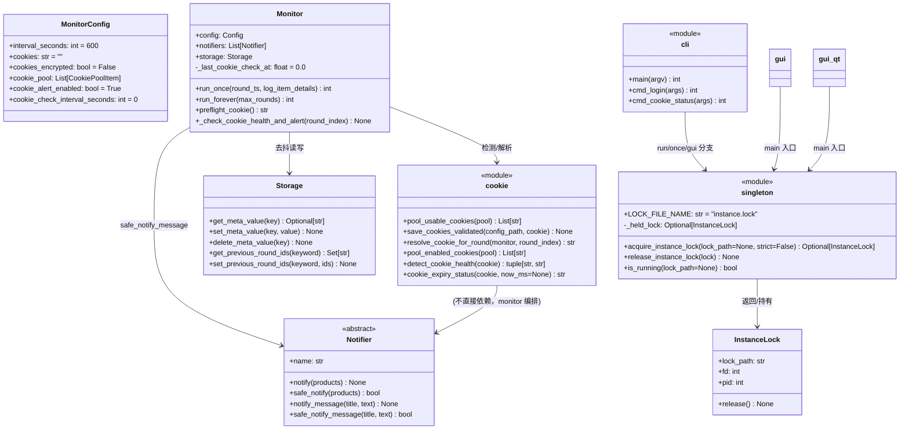
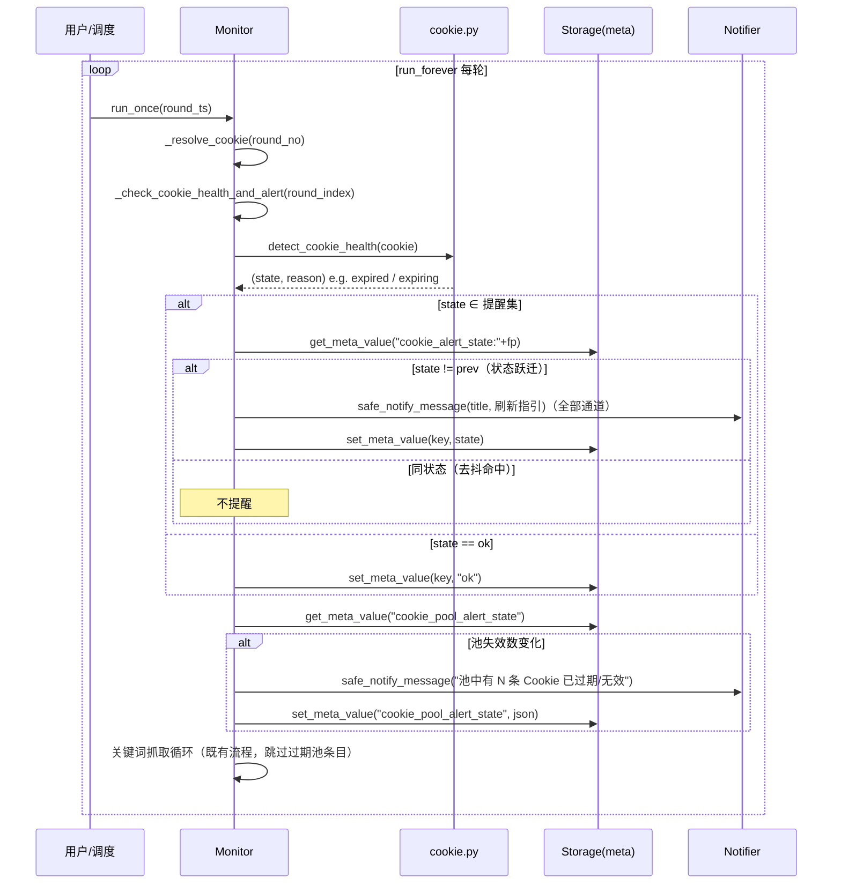
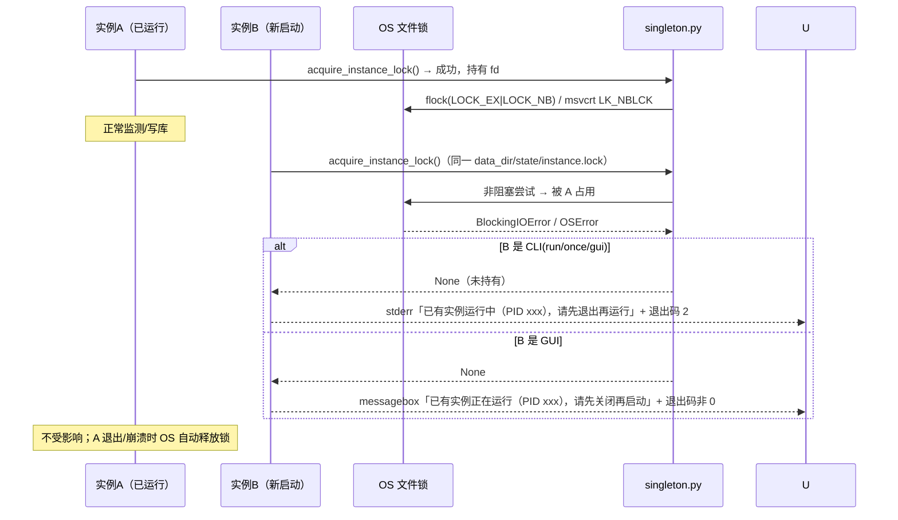
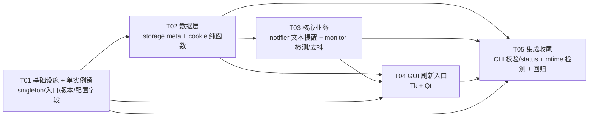

# 闲鱼低价提醒工具 · v1.8.0 增量架构设计（Cookie 自动刷新 + 进程单实例锁）

> **设计者**：软件架构师「高见远（Gao）」
> **基线**：v1.7.0（Windows Tkinter + macOS PySide6 Qt，业务核心共享）
> **依据**：`docs/v1.8_增量PRD_Cookie刷新与单实例锁.md`（需求池 C1~C21 + L1~L13 + Q1~Q11）、`docs/维护交接文档.md`、`docs/v3_设计文档.md`、`docs/macOS适配设计文档.md`
> **测试基线**：749 tests（`python -m unittest discover -s tests`，全 mock）
> **性质**：纯设计文档，**不修改任何代码文件**；工程师按本文 Part B 任务列表实现。

---

# Part A：系统设计

## 1. 待确认问题决策（PRD §6 Q1~Q11）

> 已通读 PRD 建议值 + 实际阅读 `cookie.py / monitor.py / notifier.py / storage.py / config.py / paths.py / cli.py / gui.py / gui_qt/* / build/entry.py / secure.py` 确认接口签名。以下为架构决策；带 ⭐ 的建议值已采纳为默认，仅当用户有异议才需拍板。

| # | 问题 | 架构决策 | 理由（代码现状） |
|---|---|---|---|
| **Q1** ⭐ | 过期提醒通道 | **默认全部已配置通道 + 新增总开关 `monitor.cookie_alert_enabled`（默认 `true`）**；不引入独立通道子集 | `notifier.build_notifiers(config)` 已返回「全部可用通道」且保证至少 1 个（缺参通道自动跳过、全空回退 console）。新增开关一行配置即可避免打扰；子集会增加配置面与两套 GUI 表单成本，收益低 |
| **Q2** ⭐ | 提醒去抖策略 | **状态跃迁才提醒 + SQLite `meta` 表持久化**（跨重启有效）。key 命名：`cookie_alert_state:<fingerprint>`（单条）/ `cookie_pool_alert_state`（池汇总） | `storage.py` 已有 `meta(key,value)` 表与 `prev_ids:<keyword>` 模式（`get_previous_round_ids/set_previous_round_ids`），新增通用 `get_meta_value/set_meta_value` 即可，零新表。冷却期方案会掩盖「恢复后再失效」，且无法跨重启精确计数 |
| **Q3** ⭐ | CLI 刷新入口形态 | **复用 `cli login`（P0，最小变更）+ 保存前自动校验（C15）+ 输出「已刷新并加密保存」**；新增 `cli cookie status`（P1）只检测不写入 | `cmd_login` 已具备 --cookie-string / playwright / 粘贴三模式；新增校验函数 `save_cookies_validated`（见 §4）后，旧测试传入的 `_m_h5_tk=t`（无 13 位时间戳）经 `detect_cookie_health` 判定为 `ok`（历史样本兼容），**749 基线不破** |
| **Q4** ⭐ | GUI 刷新入口形态 | **两者都要（Tk + Qt 对齐）**：状态灯旁「🔄 一键刷新 Cookie」 + Cookie 管理对话框内「🔄 刷新选中」 | C7/C8 均为 P0；两套 GUI 纯函数已共享（`cookie_status` / `COOKIE_MANUAL_HELP` / `save_raw_config`），对话框逻辑可复用，工作量可控 |
| **Q5** ⭐ | 池过期项处置 | **P0 仅轮换跳过（内存态）+ 池失效汇总提醒（C12）**；GUI「⏹ 自动停用过期项」按钮（P1，写盘前 `askyesno` 确认，写 `enabled=false` 保留条目） | 自动写盘会改用户配置且不可逆，不符合「最小变更 + 不静默改配置」；`resolve_cookie_for_round` 是纯函数（`pool_enabled_cookies` 已可复用），在它上层加健康过滤即可单测 |
| **Q6** ⭐ | 单实例锁 key | **`paths.data_dir()`（推荐）**，锁文件 `data_dir()/state/instance.lock`；文档声明边界：自定义绝对 `storage.path` 指向 data_dir 之外时锁不覆盖该 DB 文件（接受） | DB 默认 `state/xianyu_alert.db` 锚定 data_dir；`resolve_data_path` 对绝对路径原样返回，若用户强配绝对路径属高级场景，sqlite 自带锁超时兜底 |
| **Q7** ⭐ | `cli login` 是否纳入锁 | **不纳入（推荐）** + 新增 **C22「GUI 检测 config.yaml mtime 变化 → 提示重载」**（P1，纳入本版本） | `login` 只写 config.yaml 不写 SQLite；挂机时远程/本地刷新必须可用（正是刷新入口）。不纳入后 GUI 内存态 config 与外部 login 写盘可能冲突 → 用 mtime 检测缓解：GUI 定时器比对 config 文件 mtime，外部修改则弹「配置文件已被外部修改，是否重载？」 |
| **Q8** ⭐ | `cli list` 是否并存 | **允许并存（只读并发安全）**，不参与锁；文档声明 | SQLite 多连接读安全；list 不写库 |
| **Q9** ⭐ | 第二实例 `--wait`/排队 | **不做**，保持「检测 → 提示退出」（L5/L6），退出码：CLI=2，GUI=非 0 | 套接字 + 进程间协议成本高收益低（PRD N5） |
| **Q10** ⭐ | CDP 复用浏览器 | **仅记录，不排期**（v1.9+ 评估项） | PRD N4 |
| **Q11** ⭐ | `cookie_check_interval_seconds` 默认 | **默认每轮检测（0 = 每轮）**；`>0` 时为独立节流秒数。**不新增** `expiring` 提前量配置（默认沿用 `TOKEN_EXPIRING_SOON_MS=1h`） | 检测是纯本地时间戳解析（`cookie_expiry_status`），无网络开销，每轮成本可忽略；提前量用常量即可避免配置膨胀 |

**需用户拍板的点（默认已按建议值，若用户有偏好请告知）**：
- Q1：若用户觉得「全部通道」太吵，可把默认值改为 `cookie_alert_enabled` 仅控制通知（不控制 GUI 状态灯/日志——C5 降级始终保留）。
- Q7：若用户不希望 GUI 弹重载提示（可能打断挂机），可将 C22 降级为「仅日志提示，不弹框」。

---

## 2. 实现方案 + 框架选型

### 2.1 核心难点分析与对策

| 难点 | 对策 |
|---|---|
| 过期提醒会每轮轰炸 | 去抖 = 状态跃迁才提醒 + `meta` 表持久化（Q2）。提醒触发状态集 = `{expired, expiring, missing, no_token, invalid_encrypt}`；`expiring` 单独「即将过期」文案，其余统一「已过期/无效，请刷新」文案；恢复 `ok` 后再次失效才重新提醒 |
| 通知器接口面向 `List[Product]`，无法直接发纯文本提醒 | `notifier.py` 新增 `Notifier.notify_message(title, text)`（6 子类各自实现）+ `safe_notify_message`（try/except 包装，与 `safe_notify` 同构）。这是「非商品提醒」的正规消息形态，未来其它系统提醒（如风控提示）可复用 |
| 多 Cookie 池含过期条目会注入 fetcher | `cookie.py` 新增纯函数 `pool_usable_cookies(pool)`（启用 + 非空 + `detect_cookie_health ∈ {ok, expiring}`），`resolve_cookie_for_round` 改为优先用它轮换；全部失效回退单值（单值健康才用）；再失效返回空串走既有抓取失败路径（C11/C14）。`pool_enabled_cookies` **保持原语义不变**（preflight 等仍用），避免回归 |
| 双进程同时写同一 SQLite | 新增 `xianyu_alert/singleton.py`：OS 级文件锁（POSIX `fcntl.flock(LOCK_EX|LOCK_NB)`；Windows `msvcrt.locking(LK_NBLCK,1)`）。进程退出（含崩溃/kill）由 OS 自动释放，无残留锁问题（L8/L9/L10）。锁锚定 `data_dir()/state/instance.lock`（L2/L9） |
| 多个入口都可能启动实例 | 锁获取集中在 `cli.main()`（run/once/gui 分支）+ `gui.main()` / `gui_qt.main()` + `run_gui.pyw` + `build/entry.py`；模块级缓存保证**同进程重复获取幂等**（L4），不产生自锁 |
| 登录/刷新后校验失败不得落盘 | `cookie.py` 新增 `save_cookies_validated(config_path, cookie)`：先 `detect_cookie_health`，非 `ok` 抛 `ValueError(原因)` 拒绝保存（C15/C20）；GUI 刷新路径复用同一校验 |

### 2.2 框架选型

**零新增运行时依赖**（对齐项目哲学与 PRD 硬约束）：

| 能力 | 选型 | 说明 |
|---|---|---|
| 单实例锁 | 标准库 `fcntl`（POSIX）/ `msvcrt`（Windows） | 模块内平台分支封装；`msvcrt.locking` 需文件至少 1 字节（先写 `b"\0"`）；Windows 无 `fcntl` 时 `try import` 容错 |
| 去抖持久化 | 标准库 `sqlite3`（已有 `meta` 表） | 复用既有 `meta` 表，无新表 |
| 提醒通知 | 既有 `notifier.py`（requests 通道） | 只新增 `notify_message` 方法族，无新通道 |
| 过期检测 | 既有 `cookie.py` 纯函数 | `cookie_expiry_status` / `detect_cookie_health` 零改动复用 |
| 加密回写 | 既有 `secure.py` Fernet + `cookie.save_cookies_encrypted` / `gui.save_raw_config(encrypt_cookies=True)` | 无新加密路径（C16） |
| 脱敏 | 既有 `secure.mask_cookie`（前 8 后 4） | C19 |

架构模式不变（MVC 风格分层，见维护交接文档 §3.1）；本版本为**增量**，不重构。

---

## 3. 文件列表及相对路径

### 3.1 新增文件

| 文件 | 内容 |
|---|---|
| `xianyu_alert/singleton.py` | 进程级单实例锁（`InstanceLock` + `acquire_instance_lock` / `release_instance_lock` / `is_running`），平台分支封装，零新增依赖 |
| `tests/test_singleton.py` | 锁行为单测（A9/A10/A11/A12）：首次 acquire 成功、二次 acquire（另一 fd）失败且不抛未处理异常、同进程幂等、release 后可重取、崩溃（不 release 丢弃 fd）后新 acquire 立即成功、mock `sys.platform` / patch `fcntl` / `msvcrt` 缺失场景、GUI/CLI 冲突文案与退出码 |
| `tests/test_qa_v1_8_extra.py` | v1.8 全量回归文件（历史惯例，覆盖本版本全部新行为；A8） |

### 3.2 修改文件

| 文件 | 改动点 |
|---|---|
| `xianyu_alert/config.py` | `MonitorConfig` 新增字段 `cookie_alert_enabled: bool = True`、`cookie_check_interval_seconds: int = 0`；`_parse_monitor` 解析（脏数据容错）；`ConfigError` 校验（interval ≥ 0） |
| `config.example.yaml` | `monitor` 节点补两个新字段注释（提醒总开关 / 检测周期） |
| `xianyu_alert/__init__.py` | `__version__` → `"1.8.0"` |
| `build/闲鱼低价提醒工具.spec`、`build/macos_闲鱼低价提醒工具.spec` | 版本字段同步 1.8.0（三处一致惯例） |
| `xianyu_alert/storage.py` | 新增通用 meta 读写：`get_meta_value(key) -> Optional[str]`、`set_meta_value(key, value) -> None`、`delete_meta_value(key) -> None`；常量 `_META_COOKIE_ALERT_PREFIX = "cookie_alert_state:"`（供 monitor 使用，避免魔数） |
| `xianyu_alert/cookie.py` | 新增 `pool_usable_cookies(pool) -> List[str]`、`save_cookies_validated(config_path, cookie) -> None`（校验 + 保存）；`resolve_cookie_for_round` 增强（健康过滤 + 单值回退校验） |
| `xianyu_alert/notifier.py` | `Notifier` 新增抽象 `notify_message(title, text)` 与保护包装 `safe_notify_message(title, text) -> bool`；6 子类（Console/ServerChan/Email/Telegram/Bark/Webhook）各实现 `notify_message`；模块级便捷函数 `notify_plain_message(notifiers, title, text)` |
| `xianyu_alert/monitor.py` | 新增 `_check_cookie_health_and_alert(round_index)`（周期检测 + 去抖 + 通知 + 池汇总）；`run_once` 开头（resolve 后）调用；`run_forever` 保持不变（每轮自然覆盖）；`preflight_cookie` 保持现状（只日志） |
| `xianyu_alert/cli.py` | `main()` 对 `run/once/gui` 分支获取单实例锁（冲突 stderr + 退出码 2，L6）；`cmd_login` 改用 `save_cookies_validated`（C15/C9）；新增 `cmd_cookie_status` + `cookie` 子命令（P1，C10） |
| `xianyu_alert/gui.py` | `main()` 入口获取锁（冲突 messagebox + 非 0，L5）；状态灯区新增「🔄 一键刷新 Cookie」按钮 + `on_refresh_cookie`；`on_manage_cookies` 对话框新增「🔄 刷新选中」「⏹ 自动停用过期项（确认后写盘）」；`_tick`/`after` 增加 config mtime 检测（C22，P1） |
| `xianyu_alert/gui_qt/app.py` | `main()` 入口获取锁（冲突提示 + 非 0）；`_tick_timer` 增加 config mtime 检测（C22，P1）；刷新后内存态同步 |
| `xianyu_alert/gui_qt/tab_config.py` | Cookie 状态灯区新增「🔄 一键刷新 Cookie」按钮（发信号由主窗口处理保存）；`_on_manage_cookies` 透传刷新能力 |
| `xianyu_alert/gui_qt/dialogs.py` | `CookieDialog` 新增「🔄 刷新选中」「⏹ 自动停用过期项」（工作副本，Ok 后提交，对齐既有「未确认不生效」语义）；新增 `RefreshCookieDialog`（一键刷新：说明 + 粘贴 + playwright 按钮 + 校验保存） |
| `build/entry.py` | 无参数 GUI 分支先 `paths.ensure_data_dir()` 后获取锁（幂等，重复获取安全） |
| `run_gui.pyw` | 启动 GUI 前获取锁（幂等） |
| `tests/test_cookie.py` | 追加 `pool_usable_cookies` / `resolve_cookie_for_round` 健康过滤 / `save_cookies_validated` 拒绝保存用例（A3/A5） |
| `tests/test_storage.py` | 追加 `get_meta_value` / `set_meta_value` / `delete_meta_value` 用例 |
| `tests/test_monitor.py` | 追加周期检测 / 去抖 / 提醒文案脱敏用例（A1/A2/A7） |
| `tests/test_notifier.py` | 追加 `notify_message` / `safe_notify_message` 用例（A2） |
| `tests/test_gui.py` / `tests/test_gui_qt.py` | 追加一键刷新入口 / Cookie 管理刷新选中 / 自动停用按钮存在与回调用例（A6，offscreen） |

---

## 4. 数据结构与接口

### 4.1 类图（新增/变更高亮）



### 4.2 关键接口签名（精确）

**`xianyu_alert/singleton.py`（新增）**

```python
LOCK_FILE_NAME = "instance.lock"

class InstanceLock:
    """已持有的进程级独占锁（持有 fd 与 pid）。"""
    lock_path: str
    fd: int          # 打开的文件描述符
    pid: int
    def release(self) -> None: ...

def acquire_instance_lock(lock_path: Optional[str] = None, strict: bool = False) -> Optional[InstanceLock]:
    """尝试获取进程级独占锁。
    - lock_path=None → paths.default_state_dir()/instance.lock（锚定 data_dir，自动建目录）；
    - 成功 → 返回 InstanceLock；已被其它进程占用 → 返回 None（不抛异常）；
    - IO 异常：strict=True 时抛 OSError；False（默认）时 logger.warning 并返回 None（放行，L10）；
    - 同进程重复调用 → 返回已持有的同一个对象（幂等，L4），不二次加锁。
    """

def release_instance_lock(lock: Optional[InstanceLock]) -> None:
    """释放锁（幂等：None / 已释放均安全）。进程退出时 OS 自动释放，可不显式调用。"""

def is_running(lock_path: Optional[str] = None) -> bool:
    """只检测不持有：非阻塞尝试获取，能获取则立即释放并返回 False（无实例），否则 True。"""
```

平台实现要点：
- POSIX：`fcntl.flock(fd, fcntl.LOCK_EX | fcntl.LOCK_NB)`，`BlockingIOError` → 占用。
- Windows：`msvcrt.locking(fd, msvcrt.LK_NBLCK, 1)`，`OSError` → 占用（先 `os.write(fd, b"\0")` 保证文件非空）。
- `try: import fcntl` / `import msvcrt` 在模块顶层分别 try，供测试 mock `sys.platform` 与缺失场景（A12）。

**`xianyu_alert/cookie.py` 新增**

```python
def pool_usable_cookies(pool: Any) -> List[str]:
    """池中「启用 + 非空 + 健康（detect_cookie_health ∈ {ok, expiring}）」条目的明文 Cookie 列表（保序）。
    与 pool_enabled_cookies 互补：后者只过滤启用/非空，前者再做健康过滤（C11）。"""

def save_cookies_validated(config_path: str, cookie_str: str) -> None:
    """校验后保存：detect_cookie_health(cookie) 非 ok → 抛 ValueError(中文原因) 且不落盘（C15/C20）；
    通过 → 调用 save_cookies_to_config（保持既有明文/加密语义不变，避免破坏存量测试）。"""
```

`resolve_cookie_for_round` 增强逻辑（纯函数，单测覆盖 A5）：

```
pool = pool_usable_cookies(monitor.cookie_pool)
if pool:                          # 池有健康条目 → 轮换
    return pool[round_index % len(pool)]
single = monitor.cookies
if single and detect_cookie_health(single)[0] in ("ok", "expiring"):
    return single                 # 池全部失效 → 单值兜底（健康才用）
if pool_enabled_cookies(monitor.cookie_pool) and not pool:
    logger.warning("池中所有 Cookie 已过期/无效，且单值 Cookie 亦不可用，本轮抓取将失败（C14）")
return ""                         # 全失效 → 空串，走既有抓取失败路径
```

**`xianyu_alert/storage.py` 新增**

```python
_META_COOKIE_ALERT_PREFIX = "cookie_alert_state:"

def get_meta_value(self, key: str) -> Optional[str]:
    """读取 meta 表 key 的 value；不存在返回 None。"""

def set_meta_value(self, key: str, value: str) -> None:
    """写入/更新 meta 表（INSERT OR REPLACE 语义，对齐 set_previous_round_ids）。"""

def delete_meta_value(self, key: str) -> None:
    """删除 meta 表 key（幂等）。"""
```

去抖 key 命名（共享知识）：
- 单条 Cookie：`cookie_alert_state:<fingerprint>`，`fingerprint = hashlib.sha1(cookie明文.encode()).hexdigest()[:12]`（单值与池条目统一按「本轮 resolve 出的内容」计算，同一内容同一 key；`invalid_encrypt` 时用密文原文计算，稳定）。
- 池汇总：`cookie_pool_alert_state`（不依赖指纹），value = JSON `{"degraded": bool, "count": int, "at": "YYYY-MM-DD HH:MM:SS"}`；跃迁条件 = `degraded` 与上次不同。

**`xianyu_alert/notifier.py` 新增**

```python
class Notifier(ABC):
    def notify_message(self, title: str, text: str) -> None: ...      # 抽象：纯文本提醒
    def safe_notify_message(self, title: str, text: str) -> bool:
        """try/except 包装 notify_message，失败只 warning，返回是否成功（与 safe_notify 同构）。"""

def notify_plain_message(notifiers, title: str, text: str) -> None:
    """向全部通知器推送一条纯文本消息（Cookie 提醒等非商品场景）。"""
```

各子类 `notify_message` 语义：Console=print；ServerChan=payload `{title, desp}`；Email=Subject=title/body=text；Telegram/Bark/Webhook=`f"{title}\n\n{text}"` 走既有请求。

**`xianyu_alert/monitor.py` 新增**

```python
_COOKIE_ALERT_STATES = {"expired", "expiring", "missing", "no_token", "invalid_encrypt"}

def _check_cookie_health_and_alert(self, round_index: int = 0) -> None:
    """周期检测「本轮将使用的 Cookie」健康并推送提醒（去抖）。

    流程：
      1. fetcher.type != "mtop" 或 not config.monitor.cookie_alert_enabled → return（零成本 no-op）；
      2. 节流：cookie_check_interval_seconds > 0 且距上次检测不足 → return；
      3. cookie = self._resolve_cookie(round_index)；
      4. state, reason = detect_cookie_health(cookie)；
      5. fingerprint = sha1(cookie 明文)[:12]；prev = storage.get_meta_value("cookie_alert_state:"+fp)；
      6. 仅当 state != prev 时提醒（跃迁）并 set_meta_value 新状态；
         - expired/missing/no_token/invalid_encrypt → 标题「闲鱼 Cookie 已过期/无效」+ 刷新指引（不含 Cookie 明文）；
         - expiring → 标题「闲鱼 Cookie 即将过期」；
      7. 池汇总：pool_degraded = 池内健康条目数 < 启用条目数；与 meta "cookie_pool_alert_state" 的 degraded 不同
         则推送「池中有 N 条 Cookie 已过期/无效」（N = 失效条数）并写回；
      8. 任何异常 catch 后只 warning，不打断监测循环（对齐 C2③）。
    """
```

`run_once` 开头（resolve 后、关键词循环前）调用 `self._check_cookie_health_and_alert(self._round_no - 1)`；`run_forever` 每轮经 `run_once` 自然覆盖（默认每轮检测满足 M1）。`fetcher.type == "mock"` 时 no-op → 既有 monitor 测试全部不破坏。

**新配置项（dataclass + YAML）**

```python
@dataclass
class MonitorConfig:
    ...
    cookie_alert_enabled: bool = True          # 过期/即将过期提醒总开关（Q1）
    cookie_check_interval_seconds: int = 0     # 0=每轮检测；>0=节流秒数（Q11）
```

```yaml
monitor:
  cookie_alert_enabled: true          # v1.8：Cookie 过期/即将过期时是否通过全部通知通道提醒（默认 true）
  cookie_check_interval_seconds: 0    # v1.8：Cookie 健康检测节流秒数；0 = 每轮检测（默认，纯本地零开销）
```

---

## 5. 程序调用流程

### 5.1 运行期过期检测 → 提醒 → 去抖（`cli run` / GUI 挂机）



### 5.2 GUI 一键刷新 → 校验 → 加密回写 → 内存态刷新

```mermaid
sequenceDiagram
    participant U as 用户
    participant G as GUI(Tk/Qt)
    participant D as 刷新对话框
    participant C as cookie.py
    participant SEC as secure.py
    participant F as config.yaml

    U->>G: 点击「🔄 一键刷新 Cookie」
    G->>D: 打开引导式对话框（三步：说明/粘贴或playwright/校验保存）
    U->>D: 粘贴新 Cookie（或 playwright 半自动提取）
    D->>C: detect_cookie_health(new_cookie)
    alt state != ok
        D-->>U: 拒绝保存 + 原因文案（缺 token / 已过期 / 无法解密），不落盘
    else state == ok
        D->>C: save_cookies_validated(config_path, new_cookie)
        C->>SEC: encrypt_text(plain) → fernet1:...
        C->>F: yaml.safe_dump（monitor.cookies = 密文, cookies_encrypted=true）
        D-->>G: 校验通过
        G->>G: self._cookies = new_cookie; _cookies_undecryptable=False
        G->>G: _refresh_cookie_status()（状态灯变绿）/ 刷新池健康列
        G-->>U: 「Cookie 已更新并加密保存，下一轮将生效」
    end
```

### 5.3 双实例启动冲突（GUI/CLI）



---

## 6. 任务列表（有序，Part B 节选）

> 详细验收见本文 Part B；此处为与 PRD A1~A14 的对应速览。

| 任务 | 名称 | 对应 PRD |
|---|---|---|
| T01 | 项目基础设施 + 单实例锁 | L1~L13, A9~A12 |
| T02 | 数据层：配置新字段 + meta 去抖 + cookie 纯函数 | C11, C14, C15, C20, A3, A5 |
| T03 | 核心业务：notifier 文本提醒 + monitor 周期检测/去抖 | C1~C6, C12, A1, A2, A7 |
| T04 | GUI 刷新入口（Tk + Qt） | C7, C8, C13, C17, C18, A4, A6 |
| T05 | 集成收尾：CLI 校验/status + mtime 检测 + 回归 | C9, C10, C16, C19, C21, C22, A8, A13, A14 |

---

# Part B：任务分解

## 7. 依赖包列表

**空 —— 零新增运行时依赖。**

- 单实例锁：标准库 `fcntl`（POSIX）/ `msvcrt`（Windows）。
- 去抖持久化：标准库 `sqlite3`（既有 meta 表）。
- 其余复用既有依赖（requests / PyYAML / cryptography / PySide6 / tkinter），版本不变。
- 测试：标准库 `unittest.mock`，无新增。

## 8. 任务列表（按依赖顺序，5 个任务）

### T01 项目基础设施 + 进程单实例锁（P0）

- **源文件**：
  - 新增 `xianyu_alert/singleton.py`
  - 新增 `tests/test_singleton.py`
  - 修改 `xianyu_alert/__init__.py`（`__version__ = "1.8.0"`）
  - 修改 `xianyu_alert/config.py`（`MonitorConfig` 新字段 + `_parse_monitor` 解析）
  - 修改 `config.example.yaml`（新字段注释）
  - 修改 `build/闲鱼低价提醒工具.spec`、`build/macos_闲鱼低价提醒工具.spec`（版本字段）
  - 修改 `xianyu_alert/cli.py`（main 对 run/once/gui 获取锁，冲突 stderr + 退出码 2）
  - 修改 `xianyu_alert/gui.py`（main 入口获取锁，冲突 messagebox + 非 0）
  - 修改 `xianyu_alert/gui_qt/app.py`（main 入口获取锁，冲突提示 + 非 0）
  - 修改 `build/entry.py`、`run_gui.pyw`（GUI 启动前获取锁，幂等）
- **依赖**：无（第一个任务）。
- **优先级**：P0
- **验收标准**：
  - A9：`test_singleton.py` 全绿——首次 acquire 成功；二次 acquire（另一 fd / 模拟另一进程）失败且不抛未处理异常；同进程重复 acquire 幂等返回同一对象；release 后可重新 acquire。
  - A10：不 release 直接丢弃 fd（模拟崩溃）后，新 acquire 立即成功（OS 自动释放）。
  - A11：mock 已持有锁时，`cli run/once` 返回 2 且 stderr 含中文提示；`gui.main` / `gui_qt.main` 返回非 0 且弹中文提示（offscreen 下可断言返回码/日志）。
  - A12：mock `sys.platform` / patch `fcntl`、`msvcrt` 缺失场景单测通过；`is_running` 只检测不持有。
  - `config.py` 新字段默认值加载正确（`cookie_alert_enabled=True`、`cookie_check_interval_seconds=0`），旧 config 无该字段不报错。
  - 全量 `python -m unittest discover -s tests` 通过（749 基线 + 新增）。

### T02 数据层：meta 去抖读写 + Cookie 纯函数增强（P0）

- **源文件**：
  - 修改 `xianyu_alert/storage.py`（`get_meta_value` / `set_meta_value` / `delete_meta_value` + key 常量）
  - 修改 `xianyu_alert/cookie.py`（`pool_usable_cookies` / `save_cookies_validated` / `resolve_cookie_for_round` 增强）
  - 修改 `tests/test_storage.py`、`tests/test_cookie.py`
  - 新增 `tests/test_qa_v1_8_extra.py`（数据层部分）
- **依赖**：T01（config 新字段底座）。
- **优先级**：P0
- **验收标准**：
  - A5（纯函数单测）：池混入 expired/no_token 条目时 `resolve_cookie_for_round` 只返回有效条目；全部失效回退单值（单值健康）；再失效返回空串；`pool_usable_cookies` 保序且只含 ok/expiring；`pool_enabled_cookies` 行为不变。
  - A3（部分）：`save_cookies_validated` 对 expired/no_token Cookie 抛 `ValueError` 且不写盘；对无时间戳 `_m_h5_tk=t` 正常保存（旧测试兼容）。
  - A14：既有 `test_cookie.py` / `test_storage.py` 全部保持绿。

### T03 核心业务：文本提醒 + 周期检测/去抖（P0）

- **源文件**：
  - 修改 `xianyu_alert/notifier.py`（`notify_message` / `safe_notify_message` / `notify_plain_message`）
  - 修改 `xianyu_alert/monitor.py`（`_check_cookie_health_and_alert` + `run_once` 接入）
  - 修改 `tests/test_notifier.py`、`tests/test_monitor.py`
  - 新增 `tests/test_qa_v1_8_extra.py`（核心业务部分）
- **依赖**：T02（meta 读写 + cookie 纯函数 + 新配置字段）。
- **优先级**：P0
- **验收标准**：
  - A1：mock fetcher（type=mock）下检测 no-op；构造 mtop 配置 + 过期 Cookie 时 `run_forever(max_rounds=N)` 每轮调用检测；`cookie_check_interval_seconds>0` 节流生效。
  - A2：mock 通知器收到「Cookie 已过期/即将过期」提醒，文案含刷新指引、**不含 Cookie 明文**（A7 脱敏断言）；去抖：同状态不重复推送、状态跃迁才推送、恢复 ok 后再失效重新推送；去抖状态跨重启（meta 表）保持。
  - A7：日志/通知文案断言 `mask_cookie` 后无完整 Cookie 明文。
  - 既有 monitor / notifier 测试全绿（fetcher=mock no-op 保证）。

### T04 GUI 刷新入口（Tk + Qt，P0）

- **源文件**：
  - 修改 `xianyu_alert/gui.py`（一键刷新按钮 + `on_refresh_cookie` + Cookie 管理「刷新选中」「自动停用过期项」+ 状态灯联动）
  - 修改 `xianyu_alert/gui_qt/tab_config.py`（一键刷新按钮）
  - 修改 `xianyu_alert/gui_qt/dialogs.py`（`RefreshCookieDialog` + `CookieDialog` 增强）
  - 修改 `xianyu_alert/gui_qt/app.py`（刷新保存 / 内存态同步）
  - 修改 `tests/test_gui.py`、`tests/test_gui_qt.py`（offscreen）
  - 新增 `tests/test_qa_v1_8_extra.py`（GUI 部分）
- **依赖**：T02（保存/校验纯函数）、T03（提醒/状态语义，GUI 侧仅引用状态灯无需强依赖）。
- **优先级**：P0
- **验收标准**：
  - A6：Tk 与 Qt 均出现「🔄 一键刷新 Cookie」入口与 Cookie 管理「刷新选中」能力；offscreen 测试覆盖控件存在与回调。
  - A4：GUI 刷新保存后 config.yaml 中 `monitor.cookies` 为 `fernet1:` 密文（`cookies_encrypted=true`）；状态灯即时变绿；无需重启（内存态 `_cookies`/`_cookie_pool` 同步）。
  - A7：刷新对话框回显 / 日志均走 `mask_cookie`。
  - C13（P1）：「⏹ 自动停用过期项」按钮存在，点击弹确认，确认后写 `enabled=false` 落盘且保留条目。
  - 既有 `test_gui*.py` / `test_gui_qt.py` 全绿。

### T05 集成收尾：CLI 校验/status + GUI mtime 检测 + 全量回归（P0/P1）

- **源文件**：
  - 修改 `xianyu_alert/cli.py`（`cmd_login` 改 `save_cookies_validated` + 新增 `cookie status` 子命令）
  - 修改 `xianyu_alert/gui.py`、`xianyu_alert/gui_qt/app.py`（config mtime 检测 C22，P1）
  - 修改 `README.md`（login 双重语义 + cookie status 用法 + 单实例锁说明）
  - 修改 `config.example.yaml`（login/cookie status 说明注释）
  - 新增 `tests/test_qa_v1_8_extra.py`（汇总 + 全量回归）
- **依赖**：T01~T04。
- **优先级**：P0（login 校验）/ P1（cookie status、mtime 检测）
- **验收标准**：
  - A3（完整）：`cli login --cookie-string` 传入 expired/no_token Cookie → 拒绝保存、退出码非 0、config.yaml 内容不变；传入有效 Cookie → 保存成功并输出「已刷新并加密保存，可运行 once 验证」。
  - A8：`tests/test_qa_v1_8_extra.py` 覆盖本版本全部新行为；`python -m unittest discover -s tests` 全绿（749 基线 + 新增）。
  - C22：GUI 运行中外部修改 config.yaml → 弹「配置文件已被外部修改，是否重载？」；本进程保存不触发（mtime 快照更新）。
  - A13（可选打包冒烟）：双开 exe 第二实例弹提示退出，`state/xianyu_alert.db` 无锁冲突日志。
  - A14：749 基线全绿；macOS 上 `test_shortcut.py` 4 条 Windows 专属失败为既有平台现象，如顺手 mock `supported()` 修正则以修正后为准并记录。

## 9. 共享知识（跨文件约定）

1. **锁 key 锚定 data_dir()**：锁文件统一 `paths.default_state_dir()/instance.lock`（=`data_dir()/state/instance.lock`）；同一数据目录只允许一个实例。
2. **login / list / shortcut 不参与锁**：`login`（写 config 不写 SQLite）、`list`（只读）默认不获取锁；`run / once / gui` 必须获取。GUI 与 login 并发写 config 的冲突由 C22（mtime 检测）缓解。
3. **meta 表去抖 key 命名**：
   - 单条：`cookie_alert_state:<sha1(cookie明文)[:12]>`（value=状态字符串 `expired/expiring/ok/...`）；
   - 池汇总：`cookie_pool_alert_state`（value=JSON `{"degraded":bool,"count":int,"at":str}`）。
   - 均通过 `Storage.get_meta_value / set_meta_value` 读写（T02 新增），**不新建表**。
4. **提醒触发状态集**：`{expired, expiring, missing, no_token, invalid_encrypt}`；`expiring` 用「即将过期」文案，其余用「已过期/无效，请刷新」文案；仅状态跃迁时推送（去抖）。
5. **脱敏规则**：所有日志 / 通知文案 / 对话框回显中的 Cookie 一律 `secure.mask_cookie`（前 8 后 4）；通知推送内容**绝不含 Cookie 明文**（C19）。
6. **保存前校验**：任何刷新路径（GUI/CLI）保存前必须 `detect_cookie_health`，非 `ok` 拒绝保存并给出可操作原因（C15/C20）。
7. **加密回写**：GUI 刷新保存一律 `save_raw_config(encrypt_cookies=True)`（Fernet `fernet1:` 密文）；CLI 复用 `save_cookies_validated`（内部保持既有明文/加密语义，frozen 版自动 `ensure_cookie_encrypted`）；**不允许新增明文落盘路径**（C16）。
8. **检测零网络**：Cookie 健康检测只做本地时间戳解析（`cookie_expiry_status`），不发起请求。
9. **线程铁律（Qt）不变**：后台线程绝不访问 Qt 控件；控件更新只发生在主线程槽函数；mtime 检测用主线程 `QTimer`。
10. **错误容忍**：锁获取 IO 失败默认放行 + warning（L10）；去抖/提醒任何异常 catch 后只 warning，不打断监测循环（C2③）。

## 10. 任务依赖图



> 说明：T04 依赖 T01（入口锁）与 T02（保存/校验纯函数），对 T03 仅为弱依赖（GUI 侧复用 `detect_cookie_health` 与状态灯，不依赖 monitor 提醒），可并行开发。

## 11. 待明确事项（需用户/工程师注意的边界）

1. **login 明文语义**：`cli login` 在源码模式保持明文保存（既有测试依赖、便于调试），frozen 打包版自动 `ensure_cookie_encrypted`；「加密回写」硬约束落在 GUI 刷新路径与池保存路径。若用户要求 login 源码模式也强制加密，需同步更新 `test_cookie.py::TestCliLogin`（5 条断言）——默认不做。
2. **`cookie status` 子命令**：PRD C10 为 P1；默认纳入（只检测不写入），若排期紧张可砍，不影响 P0 验收（A1~A8 不依赖它）。
3. **C22 mtime 检测弹框**：Q7 建议「弹框询问重载」；若用户不希望打断挂机，可降级为仅日志提示（默认弹框，可调）。
4. **锁的边界声明**：锁锚定 `data_dir()`；用户自定义绝对 `storage.path` 指向 data_dir 之外的 DB 文件时，锁不覆盖该文件（Q6 接受）；sqlite 自带 busy timeout 兜底。
5. **`cli list` 并发声明**：list 只读允许与 GUI 并存（Q8），文档明确。
6. **GUI 刷新对话框的 playwright 依赖**：一键刷新对话框内 playwright 按钮需处理 `PlaywrightUnavailable`（提示安装或改用手动粘贴），与 `cli login` 行为一致。
7. **测试平台备注**：macOS 开发机上 `test_shortcut.py` 4 条 Windows 专属用例失败属既有平台现象（Windows 基线 749 OK）；如顺手修正（mock `supported()`）以修正后为准并记录（A14）。
8. **版本号三处一致**：`__init__.py` + 两个 spec 同步 `1.8.0`（T01 完成）。

---

*文档结束。本设计为 v1.8.0 增量；实现前请主理人/用户确认 §1 中「需用户拍板」的两点（Q1 默认全部通道、Q7 默认弹框重载）。*
