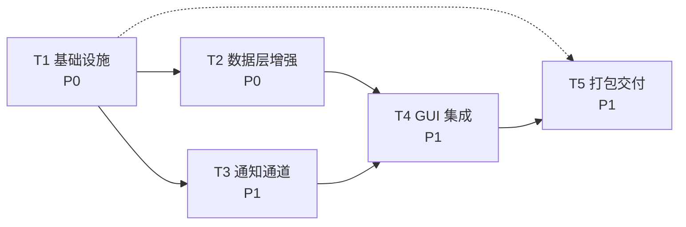
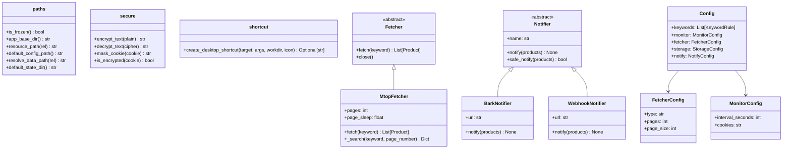
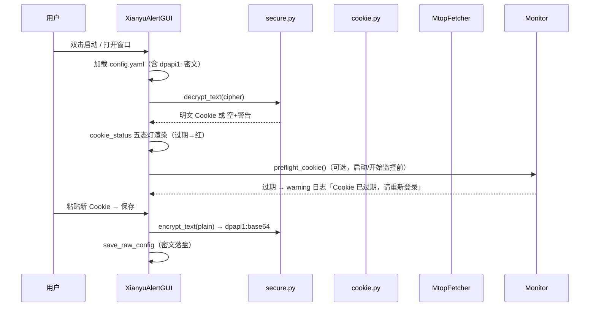
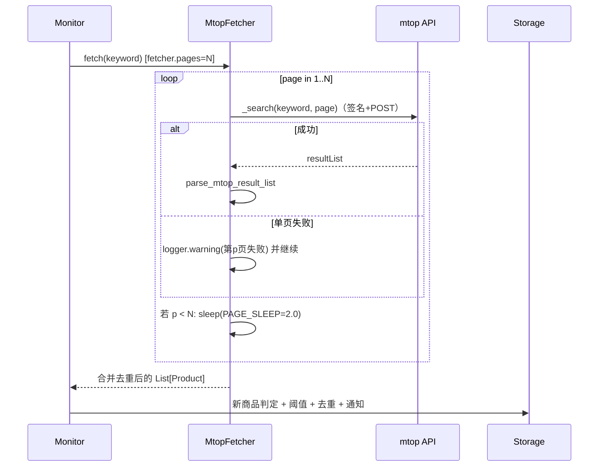

# 闲鱼低价提醒工具 · V3 满分改造设计文档（增量设计 + 任务分解）

> **设计者**：软件架构师「高见远（Gao）」
> **基线**：本地 `xianyu_alert/` 9 模块（4,629 行）/ 178 个测试全过（实测 `python -m unittest discover -s tests` → OK）
> **依据**：`re_analysis/二次开发可行性评估报告.md`（路径 C+ 建议）、`re_analysis/代码质量审查报告.md`（exe 缺陷清单）、`re_analysis/逆向工程分析报告.md`（exe 资产清单）
> **性质**：纯设计文档，**不修改任何代码文件**；工程师按本文任务列表实现。
> **运行环境实测**：隔离 Python 3.13.14（`C:\Users\fun\.workbuddy\binaries\python\envs\default`），已装 requests 2.34.2 / beautifulsoup4 4.15.0 / PyYAML 6.0.3 / playwright 1.61.0，**未装 PyInstaller**（T05 需先安装）。

---

## 0. 现状基线（通读确认结论）

| 维度 | 现状 | 结论 |
| --- | --- | --- |
| 架构 | 9 模块包（models/config/fetcher/storage/notifier/monitor/cli/cookie/gui），MVC 风格清晰 | 不需要重构，做增量 |
| 抓取 | `MtopFetcher` 协议正确（mtop 签名与 exe 互证），已有重试 + 指数退避 + 令牌过期自动重试 + 风控/登录失效标记 | 重试退避**已达标**（只需补页级容错 + 翻页限速） |
| 价格解析 | `fetcher.parse_price` 仅支持 `¥1,299.00` 类数字，**无万换算、无「面议/电议/私聊/咨询」过滤** | 需移植 exe 资产 #1 |
| 通知 | 4 通道（console/serverchan/email/telegram），与 exe 的 bark/webhook **交集为空** | 需移植 exe 资产 #2 |
| 存储 | SQLite `(keyword, product_id)` 唯一去重 + `prev_ids` 轮次集合，健壮 | 不动 |
| GUI | 三页签 tkinter，输入校验已做（`validate_keyword_entry`/`validate_interval`），线程模型正确（queue+after） | 缺空状态/首次引导/状态灯细化/新通道 UI |
| CLI | argparse 子命令（run/once/list/login/gui），**无 `--setup`**（exe 才有）；argparse 自带类型校验 | 仅需补范围校验 + `shortcut` 子命令 |
| Cookie | 明文存在项目根 `config.yaml`（实测含真实 Cookie），`_m_h5_tk` 值尾带 13 位时间戳但**无过期检测** | 需加密 + 过期检测 |
| 打包 | 无 PyInstaller 配置 | 全新（核心需求） |
| 测试 | 178 个全过，网络全 mock（FakeSession/sleep_func 注入） | 新增测试沿用同样式 |

---

## 1. 改造目标与验收标准（用户可验收的 checklist）

### 1.1 改造目标（对齐主理人三大诉求）

| 目标 | 含义 | 落地方式 |
| --- | --- | --- |
| **G1 工程质量拉满** | 可读性 / 健壮性 / 安全 / 工程化补齐 | Cookie 加密（DPAPI）、过期检测、页级容错、日志落盘、参数范围校验、异常可见性审计 |
| **G2 降低使用门槛** | 普通用户不碰命令行也能用 | GUI 空状态引导、首次使用引导、Cookie 状态灯（含过期）、新通道可视化配置、桌面快捷方式、关于对话框 |
| **G3 环境无依赖即可使用** | 双击 exe 即用，无需 Python/依赖/playwright | PyInstaller 标准版（排除 playwright，15~25MB）+ 完整版（含 playwright，可选）；frozen 路径适配 |

### 1.2 验收清单（满分改造的衡量标准，逐项打勾）

**功能与资产（A）**
- [ ] A1 价格解析：`1.2万 → 12000.0`；`面议/电议/私聊/咨询 → None`；`¥1,299.00 / 1299 / 1299.5` 保持可解析；原有 Web/Mtop 抓取解析不回归
- [ ] A2 mtop 多页抓取：`fetcher.pages` 可配；翻页间限速 sleep(2s)；单页失败只警告不丢整轮；全页失败才抛 FetchError
- [ ] A3 通知新增 Bark / 企微 webhook 通道：config schema 生效、GUI 可勾选可测试发送、缺参自动跳过
- [ ] A4 桌面快捷方式：GUI 按钮 + `cli shortcut` 子命令均可用；路径含中文/空格/`$`/`"` 不报错不注入

**安全（S）**
- [ ] S1 Cookie 不再明文落盘：DPAPI 加密后以 `dpapi1:` 前缀存 YAML；启动自动迁移存量明文；换机/换用户解密失败给出「请重新登录」提示而非静默
- [ ] S2 Cookie 过期检测：`_m_h5_tk` 时间戳解析；过期/临期（1h 内）/正常三态；GUI 状态灯变色 + 日志 warning + 启动预检
- [ ] S3 日志与界面均**脱敏显示** Cookie（只显示前 8 后 4 字符）
- [ ] S4 关键路径异常可见：`state/xianyu_alert.log` 滚动日志落盘（windowed exe 无控制台也能查错）

**健壮性（R）**
- [ ] R1 CLI 参数范围校验：`--max-rounds`/`--limit` 负数拒绝并给提示
- [ ] R2 单页失败不丢整轮（见 A2）；通知通道任一失败不影响其它通道（现有行为保持）
- [ ] R3 配置损坏（YAML 非法）启动不白屏：GUI 回退内置默认 + 弹提示（现有行为保持，补测试确认）

**GUI 自解释（U）**
- [ ] U1 关键词为空时表格区显示引导文案「还没有关键词，请在上方输入后点击添加/更新」
- [ ] U2 首次使用（fetcher=mtop 且无 cookie）时显示获取 Cookie 步骤引导 + 状态灯红色提示
- [ ] U3 Cookie 状态灯升级五态：未配置 / 已配置缺 token / **已过期** / **即将过期** / 正常
- [ ] U4 配置保存有明确反馈（现有 messagebox 保持）+ 日志记录
- [ ] U5 「关于 / 使用说明」对话框（快速上手 + 免责声明）

**打包（P）**
- [ ] P1 `build/闲鱼低价提醒工具.spec` 产出独立 exe（排除 playwright，预估 15~25MB）
- [ ] P2 把 exe 复制到**干净临时目录**后：双击启动 GUI 成功；config.yaml 生成在 exe 同目录；mock 模式跑通一轮；mtop 无 cookie 时给出引导提示；状态 DB 落在 exe 同目录 `state/`
- [ ] P3 `build/build_full.spec` 可编译出含 playwright 的完整版（可选验收）
- [ ] P4 README 增加「打包为独立 exe」章节与 exe 快速上手说明

**回归**
- [ ] G 全量测试 `python -m unittest discover -s tests` 通过（原 178 + 新增全部绿灯）

---

## 2. 变更清单（改动点 → 文件 → 方式 → 影响 → 风险）

> 影响范围：🔴 核心链路（抓取/通知/存储）｜🟠 入口/配置 ｜🟡 界面/文档/构建

| # | 改动点 | 涉及文件 | 方式 | 影响范围 | 风险 |
| --- | --- | --- | --- | --- | --- |
| C1 | frozen 路径适配（exe 同目录 config/state、资源定位） | `xianyu_alert/paths.py`（新增）、`config.py`、`storage.py`、`run_gui.pyw`、`cli.py` | 新增+修改 | 🟠 全部入口 | 中：路径解析改动面广，需 mock `sys.frozen` 单测锁行为 |
| C2 | 日志落盘（滚动文件） | `cli.py`、`run_gui.pyw`、`gui.py` | 修改 | 🟡 可观测性 | 低：仅新增 FileHandler |
| C3 | 版本号 1.0.0 → 1.1.0 | `__init__.py` | 修改 | 🟡 | 无 |
| C4 | 构建依赖声明 + 忽略规则 | `requirements-build.txt`（新增）、`.gitignore` | 新增+修改 | 🟡 | 无 |
| C5 | parse_price 增强（万换算 + 关键词过滤） | `fetcher.py`、`tests/test_fetcher_parse.py`（新增） | 修改 | 🔴 所有抓取器的价格解析 | 中：必须保持旧格式兼容，靠新测试锁定 |
| C6 | mtop 多页抓取 + 翻页限速 + 页级容错 | `fetcher.py`、`config.py`（`fetcher.pages`）、`config.example.yaml`、`tests/test_mtop_fetcher.py` | 修改 | 🔴 mtop 抓取 | 中高：多页增加请求频率 → 风控风险；默认 pages=1 不改变现状 |
| C7 | Cookie 加密（DPAPI）+ 存量迁移 + 脱敏 | `xianyu_alert/secure.py`（新增）、`cookie.py`、`config.py`、`tests/test_cookie.py` | 新增+修改 | 🔴 配置安全 | 中：DPAPI 绑定用户/机器；非 Windows 降级明文+警告；解密失败需明确提示 |
| C8 | Cookie 过期检测（时间戳解析 + 三/五态） | `cookie.py`、`gui.py`、`monitor.py`（preflight）、`tests/test_cookie.py`、`tests/test_gui.py` | 修改 | 🔴 mtop 使用体验 | 低：纯解析 + 提示，不拦截请求 |
| C9 | Bark / 企微 webhook 通道 | `notifier.py`、`config.py`（VALID_CHANNEL_TYPES）、`config.example.yaml`、`tests/test_notifier.py` | 修改 | 🔴 通知链路 | 低：新增分支，不触碰既有通道 |
| C10 | GUI 自解释（空状态/首次引导/状态灯/翻页字段/快捷方式按钮/关于） | `gui.py`、`tests/test_gui.py` | 修改 | 🟡 GUI | 低：纯 UI 增量 |
| C11 | 桌面快捷方式（安全转义） | `xianyu_alert/shortcut.py`（新增）、`cli.py`（shortcut 子命令）、`tests/test_shortcut.py`（新增） | 新增+修改 | 🟡 | 低：subprocess 参数化，杜绝 f-string 拼接注入 |
| C12 | CLI 参数范围校验 + 启动预检 | `cli.py`、`monitor.py` | 修改 | 🟡 CLI | 低 |
| C13 | PyInstaller 双配置（标准/完整）+ 构建脚本 | `build/闲鱼低价提醒工具.spec`、`build/build_full.spec`、`build/build.bat`、`build/build_full.bat`（新增） | 新增 | 🟡 交付 | 中：pyinstaller hidden-imports 需显式声明（yaml/bs4），必须冒烟验证 |
| C14 | README 打包章节 + exe 上手 | `README.md` | 修改 | 🟡 文档 | 无 |
| C15 | 打包冒烟清单 | `docs/打包验证清单.md`（新增） | 新增 | 🟡 交付 | 无 |
| C16 | 应用图标 | `icon.ico`（新增，来源见 §7 待明确事项） | 新增 | 🟡 打包 | 低：缺图标则打包不设 Icon |

---

## 3. 关键设计决策（写清理由）

### D1. Cookie 安全方案选型：**Windows DPAPI（ctypes 零依赖）为主，明文降级为辅**

**方案对比**

| 方案 | 依赖成本 | 安全性 | 适配本项目的理由 / 否决理由 |
| --- | --- | --- | --- |
| **DPAPI via ctypes**（`crypt32.CryptProtectData/UnprotectData`） | **零新增依赖**（Windows 内置 crypt32.dll） | 加密数据与「当前 Windows 用户 + 本机」绑定，非本人无法解开 | ✅ **采用**。目标交付物是 Windows exe；零依赖契合 G3「环境无依赖」；比「配置文件旁放密钥」的伪加密强一个量级 |
| keyring 库（Windows Credential Manager） | 新增第三方依赖（+ 其 backend 链） | 凭据管理器托管，跨进程安全 | ⚠️ 否决：多一层依赖与打包体积；凭据管理器对普通用户不可见、不可导出，出问题更难排查 |
| 文件级 AES + 硬编码/旁置密钥 | 零依赖 | 密钥与密文同机共存 = **安全剧场** | ❌ 否决 |
| 仅「提醒 + 移目录」不加密 | 零依赖 | 明文仍在 | ⚠️ 仅作降级兜底 |

**落地规格**
1. 新增 `xianyu_alert/secure.py`（纯函数，便于单测）：
   - `encrypt_text(plain: str) -> str`：DPAPI 加密后 base64，带前缀 `dpapi1:`；非 Windows 或 ctypes 调用失败 → 返回原文并 `logger.warning`（降级模式）。
   - `decrypt_text(cipher: str) -> str`：`dpapi1:` 前缀则解密；解密抛异常 → 返回 `""` 并 warning「Cookie 无法解密（可能换机/换用户），请重新登录」。
   - `mask_cookie(cookie: str) -> str`：脱敏显示，只保留前 8 后 4（如 `_m_h5_tk=deadbeef...0000`）。
2. `config.py` 读取 `monitor.cookies` 时：以 `dpapi1:` 前缀判定 → 调 `secure.decrypt_text`；解密失败置空并给可操作提示。
3. `cookie.py` 新增 `save_cookies_encrypted(config_path, cookie)`（高电平封装）：DPAPI 可用则加密写入；低电平 `save_cookies_to_config` 保持明文语义（**存量测试不破坏**）。
4. 启动迁移 `ensure_cookie_encrypted(config_path)`：检测到明文 Cookie 且 DPAPI 可用 → 就地加密重写，日志 `INFO 已自动加密 Cookie`；在 `cli login`、GUI 启动与保存路径调用。
5. 风险声明：DPAPI 密文**不可跨机/跨用户迁移**——换电脑需重新登录获取 Cookie（文档写明）。

### D2. playwright 打包取舍：**标准版（默认交付）排除 playwright；完整版（可选）包含**

| 维度 | 标准版 `闲鱼低价提醒工具.spec`（✅ 默认交付） | 完整版 `build_full.spec`（可选） |
| --- | --- | --- |
| 体积 | 预估 15~25MB | 预估 100MB+（playwright 1.61 含 node 驱动） |
| 取 Cookie | 手动粘贴 / `login --cookie-string`（**本就支持**，GUI 有详细步骤引导） | GUI「打开浏览器登录」自动获取可用 |
| 依赖 | 无 | 仍需目标机 `playwright install chromium`（浏览器内核不由 PyInstaller 打包，约 300MB，塞进 onefile 不现实） |
| 适用 | **绝大多数普通用户**（双击即用、体积小、够用） | 想要自动登录体验、且接受一次性装 chromium 的用户 |
| 交付物 | `dist/闲鱼低价提醒工具.exe` | `dist/闲鱼低价提醒工具_完整版.exe` |

**理由**：
- exe 逆向教训（质§2.5）：103MB playwright 只为「可选」功能，还拖累 51MB 体积、漏打包 3KB 弹窗库——**打包未验证真实路径**。标准版把 playwright 排除在依赖树外，从根上避免重蹈覆辙。
- 完整版虽含 playwright Python 包，但**浏览器内核仍需目标机安装**（PyInstaller 不打包用户缓存），因此「环境无依赖」承诺只能由标准版兑现——README 与 GUI 均引导用户优先用标准版。
- 标准版 GUI「获取 Cookie」对话框的「方式一」按钮：playwright 缺失时应**清晰提示改用方式二手动粘贴**（现有 `finish_unavailable` 已具备，保留并增强文案）。

### D3. frozen 路径适配：**新增 `paths.py` 统一收敛**

```
app_base_dir()      # frozen → dirname(sys.executable)；源码 → 项目根
resource_path(rel)  # frozen → sys._MEIPASS/rel（打包资源如 icon.ico）；源码 → 项目根/rel
default_config_path()  # app_base_dir()/config.yaml
resolve_data_path(rel) # 相对路径锚定 app_base_dir()（state/xxx.db → exe 同目录 state/）
default_state_dir()    # app_base_dir()/state（自动创建）
```

- `storage.py __init__` 与 `config.load_config` 均用 `resolve_data_path` 解析相对路径，**保证 frozen 后 config/state 落在 exe 同目录**（对齐 exe 的 `BASE_DIR` 模式，逆§2.4）。
- `run_gui.pyw` 改造：frozen 时**不 chdir 到源码目录**、不把源码根塞进 sys.path；直接用 `paths.default_config_path()`。
- `cli.py` 默认 `--config` 指向 `paths.default_config_path()`。
- 单测：用 `unittest.mock.patch.object(sys, "frozen", True, create=True)` + patch `sys.executable` 验证函数分支。

### D4. 新增通道的 config schema 与 GUI 集成

**schema（与现有 `notify.channels` 列表一致）**
```yaml
notify:
  channels:
    - type: bark          # iOS Bark 推送：GET {url}/{quote(msg)}
      url: "https://api.day.app/YourKey/"
    - type: webhook       # 企业微信/钉钉风格机器人
      url: "https://qyapi.weixin.qq.com/cgi-bin/webhook/send?key=xxx"
```

**实现要点（移植 exe 确证行为，修正其静默吞错）**
- `BarkNotifier.notify`：`GET url.rstrip("/") + "/" + requests.utils.quote(msg)`，timeout=10，非 200 抛 RuntimeError（经 `safe_notify` 降级为 warning）。
- `WebhookNotifier.notify`：`POST url, data=json.dumps({"msgtype":"text","text":{"content":msg}})`，**显式 `headers={"Content-Type":"application/json"}`**（exe 用裸字符串 data 未设头，部分网关会拒收——此处修正）。
- 两者均继承 `Notifier`，异常统一走基类 `safe_notify`（不静默）。

**GUI 集成（`gui.py`）**
- `CHANNEL_ORDER += ("bark", "webhook")`；`CHANNEL_LABELS` 中文名；`CHANNEL_REQUIRED_FIELDS`：bark→`("url",)`、webhook→`("url",)`；`CHANNEL_FIELDS`：各一个 `url` 输入框（bark 带默认占位示例）。
- 现有「测试发送」按钮自动生效（`build_notifier` 工厂分支扩展即可）。
- `config.py VALID_CHANNEL_TYPES += ("bark", "webhook")`；工厂 `_build_one` 增加两个分支。

### D5. 其余工程决策（简短）

| 项 | 决策 | 理由 |
| --- | --- | --- |
| 重试与退避 | **现状已达标**（`_post_once` 指数退避 + 令牌重试 + 风控/登录失效标记），仅补「翻页多页的页级容错」与「可注入 sleep」 | 评估确认，不重复造轮子 |
| 异常可见性 | 日志落盘（C2）+ 审计现有 `except: pass` 点 | windowed exe 无控制台，文件日志是唯一查错通道 |
| CLI 校验 | argparse 类型校验已有；补 `--max-rounds>0`、`--limit>0` 范围检查；本地**无 `--setup`**（确认结论，不新增） | 对齐现状，避免过度设计 |
| 多页频率风控 | `fetcher.pages` 默认 **1**（不改变现状）；GUI 明示「翻页会增加请求频率，建议配合 300s+ 间隔」 | 平衡功能与风控风险（逆§5.1） |
| 图标 | 从原 exe 提取 RT_ICON 生成 `icon.ico`（见 §7） | 复用现成资产，避免版权/设计成本 |

---

## 4. 依赖变更

| 文件 | 变更 | 内容 |
| --- | --- | --- |
| `requirements.txt` | **不变** | requests / beautifulsoup4 / PyYAML（核心依赖零新增） |
| `requirements-cookie.txt` | **不变** | playwright（可选，标准版打包排除） |
| `requirements-build.txt` | **新增** | `pyinstaller>=6.0`（仅构建环境需要） |
| 运行时新增依赖 | **无** | DPAPI 走 ctypes（stdlib）；快捷方式走 subprocess + PowerShell（系统自带） |

> 依赖哲学：**运行零新增依赖**，构建期唯一新增 pyinstaller。这直接支撑 G3「环境无依赖即可使用」。

---

## 5. 任务列表（按实现顺序，T1..T5）

> 分组原则：按「基础设施 → 数据层 → 通知层 → 界面集成 → 打包交付」五层；**每个任务 ≥ 3 个文件**；T1 为项目基础设施（路径 + 入口 + 依赖声明）。

### T1 项目基础设施与路径适配（P0，无依赖）

| 项 | 内容 |
| --- | --- |
| 源文件 | `xianyu_alert/paths.py`（新增）、`xianyu_alert/config.py`（修改：路径解析）、`xianyu_alert/storage.py`（修改：相对路径锚定）、`xianyu_alert/__init__.py`（修改：版本 1.1.0）、`xianyu_alert/cli.py`（修改：默认配置路径 + 文件日志）、`run_gui.pyw`（修改：frozen 适配）、`requirements-build.txt`（新增）、`.gitignore`（修改） |
| 验收标准 | ① `python -m xianyu_alert.cli --version` 输出 1.1.0；② 源码模式 `paths.app_base_dir()==项目根`、`resolve_data_path("state/x.db")` 锚定项目根；③ mock `sys.frozen=True` 时 `app_base_dir()` 指向 exe 目录；④ 运行任一 cli 命令后生成 `state/xianyu_alert.log`；⑤ 全量测试 178 全过（本任务不改业务行为） |

### T2 领域数据层增强（P0，依赖 T1）

| 项 | 内容 |
| --- | --- |
| 源文件 | `xianyu_alert/secure.py`（新增：DPAPI 加解密 + 脱敏）、`xianyu_alert/fetcher.py`（修改：parse_price 增强 + 多页抓取 + 翻页限速 + 页级容错）、`xianyu_alert/cookie.py`（修改：过期检测 + 加密保存 + 存量迁移）、`xianyu_alert/config.py`（修改：`fetcher.pages` 字段 + cookies 解密钩子）、`config.example.yaml`（修改：pages 说明）、`tests/test_fetcher_parse.py`（新增）、`tests/test_mtop_fetcher.py`（修改）、`tests/test_cookie.py`（修改） |
| 验收标准 | ① `parse_price("1.2万")==12000.0`、`parse_price("面议") is None`、`parse_price("¥1,299.00")==1299.0`、`parse_price("1299")==1299.0`；② `pages=2` 时 `fetch` 调用 `_search` 两次、注入的 `sleep_func` 被调用 1 次、结果合并去重、第二页抛 FetchError 时第一页结果保留并 warning；③ `cookie_expiry_status` 对 过期/临期/正常/无时间戳 返回正确状态；④ DPAPI 加密-解密往返一致，非 Windows 降级不抛异常；⑤ `ensure_cookie_encrypted` 把明文 Cookie 就地转为 `dpapi1:` 密文；⑥ 全量测试通过 |

### T3 通知通道扩展（P1，依赖 T1）

| 项 | 内容 |
| --- | --- |
| 源文件 | `xianyu_alert/notifier.py`（修改：BarkNotifier/WebhookNotifier + 工厂分支）、`xianyu_alert/config.py`（修改：VALID_CHANNEL_TYPES）、`config.example.yaml`（修改：bark/webhook 示例）、`tests/test_notifier.py`（修改） |
| 验收标准 | ① `build_notifiers` 可构造 bark/webhook，缺 `url` 时跳过并 warning；② mock `requests.get` 断言 bark URL = `url.rstrip("/") + "/" + quote(msg)`；③ mock `requests.post` 断言 webhook payload = `{"msgtype":"text","text":{"content":msg}}` 且 `Content-Type: application/json`；④ 任一通道网络失败经 `safe_notify` 返回 False 不抛；⑤ 全量测试通过 |

### T4 GUI 自解释与集成（P1，依赖 T1 + T2 + T3）

| 项 | 内容 |
| --- | --- |
| 源文件 | `xianyu_alert/gui.py`（修改：新通道 UI / 空状态 / 首次引导 / Cookie 五态状态灯 / 翻页字段 / 快捷方式按钮 / 关于对话框 / Cookie 脱敏）、`xianyu_alert/shortcut.py`（新增：安全转义的 PowerShell .lnk 创建）、`xianyu_alert/cli.py`（修改：`shortcut` 子命令 + 参数范围校验）、`xianyu_alert/monitor.py`（修改：`preflight_cookie()` 启动预检）、`tests/test_gui.py`（修改）、`tests/test_shortcut.py`（新增） |
| 验收标准 | ① GUI 通知设置页出现「Bark / 企微 webhook」两个区块，「测试发送」可用；② 关键词为空时表格区显示引导文案；③ Cookie 状态灯五态正确（含过期红色 / 临期橙色）；④ mtop+无 cookie 时显示获取步骤引导；⑤ 「创建桌面快捷方式」在桌面生成 .lnk，路径含中文/空格/`$`/`"` 不报错（shortcut 单测覆盖转义）；⑥ `cli shortcut` 子命令可用；⑦ 全量测试通过 |

### T5 打包交付与冒烟（P1，依赖 T1..T4）

| 项 | 内容 |
| --- | --- |
| 源文件 | `build/闲鱼低价提醒工具.spec`（新增：标准版 onefile windowed，exclude playwright）、`build/build_full.spec`（新增：完整版含 playwright）、`build/build.bat` / `build/build_full.bat`（新增：一键构建脚本）、`README.md`（修改：打包章节 + exe 上手）、`docs/打包验证清单.md`（新增）、`icon.ico`（新增，来源见 §7） |
| 验收标准 | ① 隔离环境安装 pyinstaller 后 `pyinstaller build/闲鱼低价提醒工具.spec` 成功产出 exe（无 playwright 依赖）；② **干净目录冒烟**：exe 复制到临时目录后双击启动 GUI、config.yaml 生成于 exe 同目录、mock 模式跑通一轮、mtop 无 cookie 给出引导、state DB 落在 exe 同目录；③ 桌面快捷方式可创建并指向 exe；④ `build_full.spec` 可编译（可选验收）；⑤ README 打包章节完整 |

**任务依赖关系（T1..T5）**



- T2 与 T3 **可并行**（互不依赖，仅各自依赖 T1）。
- T4 依赖 T2（过期状态/空状态数据）与 T3（新通道表单），必须串行。
- T5 依赖 T1..T4 全部完成。

---

## 6. 测试计划

### 6.1 新增测试

| 测试文件 | 新增用例 | 覆盖点 |
| --- | --- | --- |
| `tests/test_fetcher_parse.py`（新增） | ~12 条 | parse_price：万换算（1.2万/3.5万/整万）、关键词过滤（面议/电议/私聊/咨询）、符号清洗（￥/¥/,/空格）、旧格式兼容（1299 / ¥1,299.00 / 1299.5）、空/None、异常文本返回 None |
| `tests/test_mtop_fetcher.py`（修改） | ~8 条 | 多页合并去重；翻页 sleep 调用次数（注入 sleep_func spy）；单页失败容错（第 2 页失败保留第 1 页结果 + warning）；全页失败抛 FetchError；`pages` 钳制 ≥1；cookie 过期时 `_check_cookies`/预检提示 |
| `tests/test_cookie.py`（修改） | ~10 条 | `cookie_token_timestamp` 解析（含/不含时间戳）；`cookie_expiry_status` 过期/临期/正常/未知；secure 加密-解密往返；非 Windows 降级；`save_cookies_encrypted` 前缀；`ensure_cookie_encrypted` 迁移；解密失败置空 + 提示 |
| `tests/test_notifier.py`（修改） | ~8 条 | Bark URL 构造（quote/尾斜杠）；Webhook payload + Content-Type；工厂分支（缺 url 跳过）；`safe_notify` 失败返回 False；超时参数传递 |
| `tests/test_shortcut.py`（新增） | ~6 条 | 路径含引号/`$`/空格不注入；subprocess 调用参数为列表；冻结态 target=sys.executable；非冻结态 target=pythonw/python；失败返回 None |
| `tests/test_gui.py`（修改） | ~6 条 | 空状态文案；Cookie 状态五态；bark/webhook 表单字段存在；`pages` 字段存在；脱敏显示 |

### 6.2 回归策略

1. **行为不变红线**：`parse_price` 增强必须保持旧输入输出（Web/Mtop 解析路径已有 178 测试间接覆盖）；`save_cookies_to_config` 低电平语义不变（存量 test_cookie 用例不破坏）。
2. 每个任务完成后跑 `python -m unittest discover -s tests`，**必须全绿再进入下一任务**。
3. T2/T3 的注入点（`sleep_func`、FakeSession、mock requests）沿用现有测试基建，不访问外网。
4. 打包冒烟（T5）按 `docs/打包验证清单.md` 在干净目录执行，作为独立验收项。

---

## 7. 待明确事项

| # | 事项 | 说明 | 建议 |
| --- | --- | --- | --- |
| U1 | **应用图标 `icon.ico` 来源** | 项目当前无图标文件；exe 内 RT_ICON×7 可提取（`re_analysis/tools/pe_info.py` 已有 PE 解析能力），或另设计 | 建议从原 exe 提取转成 `.ico` 复用（零成本、风格一致）；若用户介意第三方资产，可自绘简单图标 |
| U2 | **Cookie 加密范围** | DPAPI 只保护 `monitor.cookies`；`notify` 通道的 sendkey/token/密码仍明文（与现状一致） | 可接受（提醒类令牌价值低于登录态）；如需全量加密，成本 +1 任务，建议 V4 再议 |
| U3 | **完整版 playwright 内核** | 完整版 exe 仍要求目标机执行一次 `playwright install chromium`（约 300MB） | 是否接受「完整版 = exe + 一次性安装浏览器内核」？若要求真·零依赖自动登录，需另议 CDP 复用本机 Edge/Chrome（成本高，本期不做） |
| U4 | **是否保留 `start_gui.bat` / `run_gui.pyw` 双入口** | 打包后 exe 为唯一入口，但源码模式双入口仍有用 | 建议保留，README 区分「源码运行」与「exe 运行」 |
| U5 | **exe 数字签名** | 无签名会被 SmartScreen 拦截提示（exe 逆向教训） | 个人分发可接受；如需消除提示需代码签名证书（付费），本期不纳入 |
| U6 | **多页抓取的默认值** | `fetcher.pages` 默认 1 不改变现状 | 若用户明确要多页，可在 GUI 中明示风控风险后放开 |

---

## 附：类图与关键时序图（另存 mermaid 文件）

### 类图（新增/变更部分）



### 时序图：Cookie 加密保存 + 启动预检（GUI）



### 时序图：mtop 多页抓取（翻页限速 + 页级容错）



---

*设计完。本设计以「本地工程底座 + exe 全部特色能力」为目标（路径 C+），运行零新增依赖，打包为独立 exe；任务 5 项、依赖清晰、每项可独立验收。*
