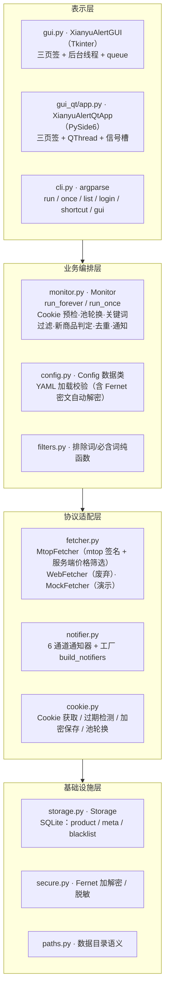

# 闲鱼低价提醒工具 · 维护交接文档

> 版本：v1.7.0（Windows + macOS 双平台）
> 交接对象：新维护者（Engineer）
> 编写：架构师 高见远（Gao）
> 仓库：https://github.com/17funnyway8-ux/xianyu-low-price-alert
> 测试基线：**749 tests OK（32 个测试文件，全 mock 不依赖外网）**

---

## 1. 交接概览

### 1.1 项目定位

一个**个人自用的闲鱼低价监测提醒工具**：按关键词周期性抓取闲鱼「最新发布 + 价格低于阈值」的商品，去重后通过多通道推送提醒（控制台 / Server酱 / 邮件 / Telegram / Bark / 企业微信机器人）。Windows 主用 Tkinter GUI + CLI，macOS 使用 PySide6 Qt GUI，核心业务逻辑双端完全共享。

### 1.2 状态快照（v1.7.0）

| 项 | 状态 |
|---|---|
| 版本 | `xianyu_alert/__init__.py` 中 `__version__ = "1.7.0"` |
| 代码规模 | 核心包 14 个模块 + gui_qt 9 个文件，共约 11.6k 行 |
| 测试 | 749 个测试函数 / 32 个文件，`python -m unittest discover -s tests` 全绿 |
| 发布 | GitHub Release v1.7.0：`xianyu-low-price-alert-win64-v1.7.0.exe`（19.6MB） |
| 平台 | Windows（Tkinter GUI + exe）、macOS（PySide6 Qt .app，需在 Mac 上构建） |
| 数据形态 | SQLite（`state/*.db`）+ YAML 配置（`config.yaml`）+ Fernet 加密 Cookie |
| 风险提示 | 闲鱼强风控；Cookie `_m_h5_tk` 24 小时过期；`interval_seconds` 不得过短 |

### 1.3 新维护者 3 分钟上手指引

```bash
# 1) 搭环境（Windows 示例；Python 3.13）
python -m venv .venv
.venv\Scripts\pip install -r requirements.txt

# 2) 跑测试（全 mock，无外网依赖）
.venv\Scripts\python -m unittest discover -s tests -v    # 期望 749 OK

# 3) 离线冒烟（mock 抓取，开箱即用）
.venv\Scripts\python -m xianyu_alert.cli once --config config.example.yaml

# 4) 启动 GUI（Windows Tkinter）
.venv\Scripts\python -m xianyu_alert.cli gui
# 或双击 run_gui.pyw（pythonw，不弹黑窗）
```

**三个最重要的认知**：
1. **真实抓取只有一条路——mtop 接口**（`fetcher.type: "mtop"`），必须带含 `_m_h5_tk` 的登录 Cookie；`web`（HTML 解析）已废弃实测无效，`mock` 只是离线演示。
2. **改需求先看 `docs/v3_设计文档.md` + `docs/macOS适配设计文档.md`**，架构决策（路径语义、加密方案、线程模型）都在里面，代码注释也大量引用这两份文档。
3. **打包有两大已知坑**：Windows spec 必须排除 PySide6（否则体积 +30MB）、`upx` 必须为 `False`（否则 cryptography 原生库损坏启动即崩）；详见 §6.3。

---

## 2. 项目概况

### 2.1 功能全景

| 功能域 | 说明 | 版本引入 |
|---|---|---|
| 关键词监测 | 任意多关键词，每词独立 `max_price`（严格 `<` 才提醒） | v1.0 |
| 价格阈值 | 服务端 `priceRange:0,{max_price};` 筛选 + 本地双保险 | v1.0 / v3.4 |
| 去重 | SQLite `notified` 标志，同一商品永不重复提醒（跨重启） | v1.0 |
| 「新商品」判定 | 与上一轮 product_id 集合比对（`meta` 表 `prev_ids:<keyword>`） | v1.0 |
| 关键词过滤 | 排除词（命中任一即跳过）/ 必含词（须全部包含）+ 预置排除词模板 | v3.1 / v3.3 / v3.5 |
| 关键词停用 | `keywords[].enabled: false` 临时停用（保留配置） | v3.7 |
| 多 Cookie 池 | `monitor.cookie_pool` 按轮次轮换取用，分摊风控 | v3.2 |
| 通知通道 | console / serverchan / email / telegram / bark / webhook 共 6 种 | v1.0~v3.3 |
| 临时黑名单 | 用户人工剔除商品，不提醒、不记 notified，可恢复 | v3.6 |
| 已售出标记 | 人工标记 / 「校验在架」调详情接口自动判定 | v3.7 |
| Cookie 安全 | Fernet 对称加密（跨平台，替代 Windows DPAPI） | v1.7.0 |
| 双 GUI | Windows Tkinter；macOS PySide6 Qt（原生观感 / 深色模式 / Retina） | v1.0 / v1.7.0 |
| 打包 | Windows onefile exe；macOS .app（ad-hoc 签名）+ LaunchAgent 开机自启 | v1.5 / v1.7.0 |

### 2.2 技术栈

| 层 | 选型 | 说明 |
|---|---|---|
| 语言 | Python 3.13（3.12 亦可） | 开发机 3.13.14 |
| 抓取 | `requests` + mtop 签名接口 | 手写 md5 签名，无第三方爬虫库 |
| 解析 | `beautifulsoup4`（仅 web 遗留）+ 内联 JSON | mtop 走 JSON 解析 |
| 配置 | `PyYAML` → dataclass `Config` | 含严格校验 |
| 存储 | 标准库 `sqlite3` | 无 ORM，手写 SQL |
| 加密 | `cryptography`（Fernet） | macOS/Windows 通用；缺失时降级明文 |
| GUI-Win | Tkinter（标准库） | `gui.py` |
| GUI-macOS | PySide6 ≥ 6.6（Qt for macOS） | `gui_qt/` |
| 打包 | PyInstaller ≥ 6.0 | spec 驱动 |
| Cookie 获取 | `playwright`（可选） | 不装则降级手动粘贴 |
| 测试 | 标准库 `unittest` | 全 mock |

依赖文件分工：
- `requirements.txt`：运行期依赖（requests / beautifulsoup4 / PyYAML / cryptography）
- `requirements-macos.txt`：PySide6（仅 macOS 需要）
- `requirements-cookie.txt`：playwright（可选，Cookie 半自动获取）
- `requirements-build.txt`：pyinstaller + pillow（仅打包期需要）

### 2.3 双前端架构说明

```
                 ┌────────────────────────────────────────────┐
                 │          build/entry.py（打包统一入口）      │
                 │  带命令行参数 → cli.main()；无参数 → GUI     │
                 └──────────────────┬─────────────────────────┘
                                    │
              sys.platform == "darwin" ?
              ┌─────────┴──────────┐
              ▼                    ▼
   PySide6 可用?              Tkinter（Windows/回退）
   ┌────┴────┐                gui.py XianyuAlertGUI
   ▼         ▼                三页签（监控配置/通知设置/运行监控）
   gui_qt    │                后台线程 + queue
   XianyuAlertQtApp
   QMainWindow 三页签
   原生菜单栏 + QThread
              │
              └────────┬─────────┘
                       ▼
         ┌─────────────────────────────┐
         │ 共享业务核心（不随前端切换）   │
         │ config / fetcher / storage  │
         │ notifier / monitor / cookie │
         │ secure / paths / filters    │
         └─────────────────────────────┘
```

**要点**：
- 两套 GUI 只是「壳」，业务全部走共享模块；`gui_qt/app.py` 直接复用 `gui.py` 里的纯函数（`CHANNEL_LABELS`、`channel_is_complete`、`save_raw_config` 等）。
- 入口分发在 `build/entry.py`：darwin 上优先 PySide6，`is_available()` 探测失败回退 Tkinter。
- 线程模型铁律（Qt 版在 `gui_qt/app.py` 模块 docstring 中明确）：后台线程绝不访问 Qt 控件，控件状态在主线程一次性读取，控件更新只在主线程槽函数。

---

## 3. 架构设计

### 3.1 分层架构



### 3.2 模块职责表

| 模块 | 文件 | 职责 | 关键类/函数 |
|---|---|---|---|
| 模型 | `models.py` | Product 数据类 + 校验 | `Product`、`ModelError` |
| 配置 | `config.py` | YAML 加载/校验/默认值、密文自动解密 | `Config`、`KeywordRule`、`MonitorConfig`、`load_config()` |
| 路径 | `paths.py` | frozen/源码数据目录统一解析 | `data_dir()`、`resolve_data_path()`、`default_config_path()` |
| 安全 | `secure.py` | Fernet 加密/解密/脱敏（`fernet1:` 前缀） | `encrypt_text`、`decrypt_text`、`is_encrypted`、`mask_cookie` |
| 抓取 | `fetcher.py` | 三抓取器 + mtop 签名 + 解析 | `Fetcher`(ABC)、`MtopFetcher`、`WebFetcher`、`MockFetcher`、`mtop_sign()`、`build_search_payload()` |
| 存储 | `storage.py` | SQLite 去重/黑名单/已售出/轮次 ID | `Storage`（`is_notified`、`mark_notified`、`save_seen`、`add_blacklist`、`mark_sold_out`、`set_previous_round_ids`） |
| 通知 | `notifier.py` | 6 通道通知 + 工厂 | `Notifier`(ABC)、`ConsoleNotifier`、`ServerChanNotifier`、`EmailNotifier`、`TelegramNotifier`、`BarkNotifier`、`WebhookNotifier`、`build_notifiers()` |
| 监测 | `monitor.py` | 核心循环 + 新商品判定 + 预检 | `Monitor`、`RoundResult`、`run_once()`、`run_forever()`、`preflight_cookie()` |
| CLI | `cli.py` | 命令行入口 | `cmd_run/cmd_once/cmd_list/cmd_login/cmd_shortcut/cmd_gui`、`main()` |
| Cookie | `cookie.py` | 获取/过期检测/池轮换/加密保存 | `acquire_via_playwright`、`acquire_via_prompt`、`cookie_expiry_status`、`resolve_cookie_for_round`、`save_cookies_to_config` |
| 过滤 | `filters.py` | 排除词/必含词纯函数 | `matches_required_keywords`、`hits_exclude_keywords`、`product_passes_filter`、`extract_required_keywords` |
| 快捷方式 | `shortcut.py` | 桌面快捷方式（PowerShell 转义） | `create_shortcut` |
| GUI-Tk | `gui.py` | Windows 图形界面 | `XianyuAlertGUI`、`main()` |
| GUI-Qt | `gui_qt/` | macOS 图形界面 | `XianyuAlertQtApp`、`MonitorWorker`、`SoldCheckWorker`、`TestChannelWorker`、`LogBridge` |

### 3.3 一轮监测数据流

```mermaid
sequenceDiagram
    participant U as 用户/调度
    participant M as Monitor
    participant F as MtopFetcher
    participant X as 闲鱼 mtop
    participant S as Storage
    participant N as Notifier

    U->>M: run_once()
    M->>M: resolve_cookie_for_round(round_no) 池轮换
    M->>F: set_cookies(cookie) / set_max_price(max_price)
    loop 每个启用的关键词
        M->>F: fetch(keyword)
        F->>X: POST h5api...（mtop 签名 + sortField=create&sortValue=desc + priceRange:0,max;）
        X-->>F: 商品列表 JSON（可能刷新 _m_h5_tk → 自动吸收）
        F-->>M: List[Product]
        M->>M: 关键词过滤（排除词/必含词）
        M->>S: get_previous_round_ids(keyword)
        M->>M: 筛出「新出现」→ 黑名单过滤 → 价格阈值 + is_notified
        alt 命中低价
            M->>N: safe_notify(hits)（逐通道）
            M->>S: mark_notified(product)
        end
        M->>S: save_seen(过滤后商品) + set_previous_round_ids
    end
    M-->>U: RoundResult（fetched/filtered/new/notified）
```

### 3.4 关键设计决策表

| # | 决策 | 理由 | 代价/注意 |
|---|---|---|---|
| D1 | mtop 接口为唯一真实抓取方式 | 闲鱼前端 JS 渲染，HTML 解析实测 0 商品；mtop 带签名可稳定取数 | Cookie 必填；签名算法依赖 `_m_h5_tk` |
| D2 | 服务端价格筛选 `priceRange:0,max;` + `sortField=create&sortValue=desc` | 实证：不传筛选时最新 30 条被高价商品主导，客户端过滤几乎无命中；传后与网页结果一致 | priceRange 为**闭区间**（详见 §10.3） |
| D3 | SQLite 双保险去重 | `prev_ids` 判「新出现」，`notified` 判「永不重复」，跨重启有效 | 数据库文件需备份 |
| D4 | Fernet 替代 DPAPI | 跨平台可加解密（Win/macOS/Linux 一致），不绑定本机用户；`fernet1:` 前缀 | 密钥 `secret.key` 丢失则密文不可解（需重新登录）；`dpapi1:` 老密文识别为「无法解密」 |
| D5 | 多 Cookie 池轮换 | 分摊单账号请求频率，降低风控概率；池优先、单值兜底 | 需多账号；每账号 Cookie 同样 24h 过期 |
| D6 | 6 通知通道 + `safe_notify` | 单通道失败不影响其它通道与主流程 | 邮件 SMTP 配置较繁琐 |
| D7 | 数据目录语义统一 `paths.data_dir()` | `XY_DATA_DIR` > frozen+darwin Application Support > frozen exe 目录 > 源码项目根；macOS .app 包内只读 | 改路径必须走 `paths`，勿硬编码 |
| D8 | GUI 双前端共享业务核心 | 避免两套业务逻辑分叉；Qt 版复用 Tk 版纯函数 | 需遵守线程铁律 |
| D9 | windowed 打包 + 文件日志 | exe 无控制台，滚动文件日志是唯一查错通道（`state/xianyu_alert.log`） | windowed 下 CLI 输出重定向到 `state/xianyu_alert_cli.log`（见 §10.1） |
| D10 | 测试全 mock | 不依赖外网/闲鱼，CI 可复现 | 上线前需真机冒烟（`once --config config.mtop.example.yaml`） |

---

## 4. 代码导航

### 4.1 入口分发逻辑

```
双击 exe / run_gui.pyw / `cli gui`
        │
        ▼
build/entry.py main()
   ├─ 有命令行参数 → _ensure_cli_stdio() → xianyu_alert.cli.main(argv)
   └─ 无参数（GUI）
        ├─ darwin → gui_qt.is_available() ? gui_qt.main() : gui.main()（回退）
        └─ 其它  → gui.main(config_path=paths.default_config_path())
```

CLI 子命令一览（`cli.py`）：

| 子命令 | 行为 |
|---|---|
| `run` | 持续监测，Ctrl+C 优雅退出；`--max-rounds` 可限轮数 |
| `once` | 只跑一轮（适合 cron / 计划任务） |
| `list` | 查看已提醒记录（`--limit`） |
| `login` | 获取 Cookie 并写入配置（Playwright 半自动 / 手动粘贴 / `--cookie-string`） |
| `shortcut` | 桌面创建快捷方式 |
| `gui` | 启动图形界面 |
| `--version` / `--help` | 版本 / 帮助 |

### 4.2 各模块核心类/方法速查

**monitor.py — Monitor**
- `run_once(round_ts, log_item_details)`：单轮主流程，返回通知数
- `run_forever(max_rounds)`：按 interval 循环，单轮异常不退出
- `preflight_cookie()`：启动预检（缺失/缺 token/过期/即将过期）
- `_process_keyword(rule, ...)`：单关键词全流程（过滤→新商品→黑名单→阈值→通知→落库）
- `_resolve_cookie(round_index)`：池轮换解析

**fetcher.py — MtopFetcher（核心）**
- `fetch(keyword)`：搜索 + 解析商品列表（多页支持）
- `set_cookies(cookie_str)` / `set_max_price(max_price)`：monitor 注入
- `check_cookie_health()`：Cookie 有效性探测
- `check_item_status(product_id)`：详情接口判在架（GUI「校验在架」用）
- 模块级：`mtop_sign(token, ts, app_key, data)`、`build_search_payload(...)`、`parse_mtop_item(...)`、`extract_product_id(...)`

**storage.py — Storage**
- 表：`product(id, keyword, product_id, title, price, url, publish_time, first_seen, last_seen, notified, sold_out, sold_at, sold_reason)` 唯一 `(keyword, product_id)`；`meta(key,value)`；`blacklist(product_id, keyword, reason, created_at)`
- 关键方法：`is_notified` / `mark_notified` / `save_seen` / `get_previous_round_ids` / `set_previous_round_ids` / `add_blacklist` / `is_blacklisted` / `mark_sold_out` / `list_notified` / `count_notified`

**config.py — Config / KeywordRule / MonitorConfig / CookiePoolItem**
- `load_config(path)`：加载 + 校验 + 解密 Cookie
- 注意 `enabled` 字段的字符串容错（`"false"` 字符串陷阱，见 §10.2）

**secure.py**
- `encrypt_text(plain)` → `fernet1:...`；`decrypt_text(cipher)` → 明文（`dpapi1:` 返回空串+警告）；`is_encrypted`；`mask_cookie`（前 8 后 4 脱敏）
- 密钥：`data_dir()/secret.key`，POSIX 0600，进程内缓存

**cookie.py**
- `cookie_expiry_status(cookie)`：missing / no_token / expired / expiring / ok / unknown（TTL 24h，提前 1h 告警）
- `resolve_cookie_for_round(monitor, round_index)`：池优先、单值兜底
- `save_cookies_to_config` / `save_cookies_encrypted` / `ensure_cookie_encrypted`
- `acquire_via_playwright` / `acquire_via_prompt`

**notifier.py**
- `build_notifiers(config)` → List[Notifier]；`Notifier.safe_notify(products)`（内部 try/except 包裹）
- 各通道：Console / ServerChan / Email(SMTP, SSL/STARTTLS) / Telegram / Bark(GET) / Webhook(POST JSON)

### 4.3 「改需求动哪个文件」速查表

| 需求 | 要动的文件 | 备注 |
|---|---|---|
| 加/改抓取逻辑、mtop 参数 | `fetcher.py` | `build_search_payload` 是服务端筛选关键 |
| 改「新商品/去重/黑名单/售出」判定 | `monitor.py` + `storage.py` | 业务规则在 monitor，落库在 storage |
| 加新通知通道 | `notifier.py` + `config.py`(VALID_CHANNEL_TYPES) + 两 GUI 的通道表单 | 通道标签常量在 `gui.py`（`CHANNEL_LABELS`） |
| 加配置字段 | `config.py`（dataclass + 解析）+ `config.example.yaml` + 两 GUI 表单 | 别忘了默认值兼容旧 config |
| 改 Cookie 加密方案 | `secure.py` + `cookie.py` | 前缀语义勿破坏 |
| 改数据目录/打包路径 | `paths.py` | 勿在别处硬编码路径 |
| 改 GUI 布局/页签 | `gui.py`（Win）/ `gui_qt/tab_*.py`（mac） | 纯 UI 改动不碰业务 |
| 改打包配置 | `build/闲鱼低价提醒工具.spec`、`build/macos_闲鱼低价提醒工具.spec`、`build/macos_build.sh` | 注意两个已知坑 |
| 新增关键词过滤规则 | `filters.py` + `config.py` + `monitor.py` | 纯函数先行、monitor 编排 |
| 改版本号 | `xianyu_alert/__init__.py` + 两个 spec 的版本字段 | 三处一致 |
| 加测试 | `tests/test_*.py` | 见 §8 测试规范 |

---

## 5. 开发环境搭建

### 5.1 Windows

```bash
# 0) 前置：Python 3.13（3.12 亦可）
#    开发机参考：C:\Users\fun\.workbuddy\binaries\python\versions\3.13.12\python.exe

# 1) 克隆仓库
git clone https://github.com/17funnyway8-ux/xianyu-low-price-alert.git
cd xianyu-low-price-alert

# 2) 虚拟环境 + 依赖
python -m venv .venv
.venv\Scripts\pip install -r requirements.txt

# 3) 跑测试（全 mock，无外网）
.venv\Scripts\python -m unittest discover -s tests -v
# 期望：Ran 749 tests ... OK

# 4) 离线冒烟（mock）
.venv\Scripts\python -m xianyu_alert.cli once --config config.example.yaml

# 5) GUI（Tkinter）
.venv\Scripts\python -m xianyu_alert.cli gui
```

**可选**：Cookie 半自动获取
```bash
.venv\Scripts\pip install -r requirements-cookie.txt
.venv\Scripts\playwright install chromium
```

### 5.2 macOS（M4 / arm64）

```bash
# 0) 前置：macOS 13+，Python 3.12/3.13（PySide6 需对应 wheel）
# 1) 拷贝工程到 Mac（如 ~/xianyu-alert）
# 2) venv + 依赖
python3 -m venv .venv
.venv/bin/pip install -r requirements.txt
.venv/bin/pip install -r requirements-macos.txt        # PySide6

# 3) 跑测试（与 Windows 同套）
.venv/bin/python -m unittest discover -s tests -v      # 749 OK

# 4) 源码模式启动 Qt GUI
.venv/bin/python -m xianyu_alert.cli gui
# 或直接 python -m xianyu_alert.gui_qt（需 QT_QPA_PLATFORM 兜底逻辑已内置）

# 5) 构建 .app（见 §6.2）
bash build/macos_build.sh
```

### 5.3 常见环境问题

| 现象 | 处理 |
|---|---|
| `cryptography` 未安装 | `pip install -r requirements.txt`；缺失时 Cookie 降级明文 + warning（GUI 可用） |
| macOS 无 PySide6 | 回退 Tkinter（入口自动）；要 Qt 则装 requirements-macos.txt |
| 测试跑挂（网络相关） | 测试全 mock 不应联网；确认没有残留真实 config 被加载（用 `--config` 指定） |
| Python 版本过低 | 需 ≥3.10（dataclass/类型注解语法）；3.13 为验证基线 |

---

## 6. 构建与打包

### 6.1 Windows exe

```bash
# 方式一：一键脚本（推荐）
build\build.bat

# 方式二：手动
.venv\Scripts\pip install -r requirements-build.txt
.venv\Scripts\python -m PyInstaller "build/闲鱼低价提醒工具.spec" --noconfirm

# 产物：dist\闲鱼低价提醒工具.exe（约 19.6MB，onefile + windowed）
```

- **标准版 spec**（`build/闲鱼低价提醒工具.spec`）：排除 playwright + PySide6 + pytest/unittest，`upx=False`，`console=False`，入口 `build/entry.py`。
- **完整版 spec**（`build/build_full.spec`）：包含 playwright（GUI「获取 Cookie」方式一可用），体积更大；**注意该 spec 目前 `upx=True`，实测有坑，主推标准版**。
- 双击使用：exe 同目录放 `config.yaml`，数据落 exe 同目录 `state/`（`paths` 保证）。

### 6.2 macOS .app

```bash
# 必须在 M4 Mac 上执行（PyInstaller 不支持跨平台交叉打包）
cd 项目根
bash build/macos_build.sh            # 可传 python3 路径作为第一个参数

# 产物：dist/闲鱼低价提醒工具.app（PySide6，150~300MB 正常）
# 脚本自动完成：venv → 依赖 → icon.icns → PyInstaller → ad-hoc 签名 → 自检
```

- 数据目录：`~/Library/Application Support/闲鱼低价提醒工具/`（双击运行自动创建，包内只读）。
- 开机自启：`scripts/install_launchagent.sh`（模板 `docs/LaunchAgent模板.plist`）。
- 发布前对照 `docs/macOS用户验收清单.md` 逐项验收（含 `NSAppSleepDisabled=true` 防 App Nap 检查）。

### 6.3 ⚠️ 两个打包坑（务必遵守）

| 坑 | 现象 | 修复 |
|---|---|---|
| **PySide6 被误打进 Windows exe** | 体积 15.7MB → 48.7MB | spec `excludes` 加 `PySide6`、`PySide6.QtCore/QtGui/QtWidgets`、`shiboken6` 整树（`gui_qt` 虽延迟导入，PyInstaller 静态分析仍会收集） |
| **UPX 压缩损坏 cryptography** | exe 启动即崩（退出码 -1 / 4294967295） | spec `upx=False`（带原生二进制的库禁 UPX，PyInstaller 已知坑） |

### 6.4 发布流程（gh release）

```bash
# 1) 更新版本号：xianyu_alert/__init__.py + 两个 spec 的 CFBundleShortVersionString 等
# 2) 跑全量测试 + 真机冒烟（once --config config.mtop.example.yaml）
# 3) Windows 打包 → dist\闲鱼低价提醒工具.exe
# 4) 提交并打 tag
git add -A && git commit -m "release: v1.7.x"
git tag v1.7.x && git push origin main --tags

# 5) 发布（注意：gh 上传中文文件名会变 default.exe，用英文名上传）
gh release create v1.7.x \
  dist/闲鱼低价提醒工具.exe#"xianyu-low-price-alert-win64-v1.7.x.exe" \
  --title "v1.7.x" --notes "变更说明"

# 6) macOS：需在 Mac 上构建后手动补充 .app（或打 zip 上传）
#    上传英文名：xianyu-low-price-alert-macos-arm64-v1.7.x.zip
```

**发布前安全排查**（历史教训）：
- `config.yaml` 含真实 Cookie（等同账号凭据）→ 已被 `.gitignore` 排除，仓库只用 `config.example.yaml` 模板；
- 绝不提交 `secret.key`、`.workbuddy/`、`re_analysis/extracted/`（153MB 解包产物）。

---

## 7. 运行与运维

### 7.1 config.yaml 全部字段说明

| 字段 | 类型 | 默认 | 说明 |
|---|---|---|---|
| `preset_exclude_keywords` | list[str] | 回收/置换/收购/高价回收/收 | v3.5 预置排除词模板；GUI 添加新关键词时自动写入其 `exclude_keywords` |
| `keywords[].keyword` | str | 必填 | 搜索关键词 |
| `keywords[].max_price` | float | 必填 | 价格阈值，仅 `price < max_price` 提醒 |
| `keywords[].enabled` | bool | true | v3.7 停用开关；false 时 monitor 跳过（不抓取/不提醒），配置保留 |
| `keywords[].exclude_keywords` | list[str] | [] | 排除词：命中任一即跳过（子串匹配，大小写不敏感） |
| `keywords[].required_keywords` | list[str] | 自动提取 | 必含词：须全部包含；空 [] 不强制。未显式配置时自动从主关键词提取「数字+单位」片段 |
| `monitor.interval_seconds` | int | 600 | 监测间隔秒；生产建议 600~900，过短触发风控 |
| `monitor.user_agent` | str | 内置 Chrome UA | 留空用默认 |
| `monitor.cookies` | str | "" | 登录 Cookie；mtop 必填；支持 `fernet1:` 密文或明文 |
| `monitor.cookies_encrypted` | bool | false | 是否密文存储（保存路径自动维护） |
| `monitor.cookie_pool` | list | [] | v3.2 多 Cookie 池 `[{name, cookie, enabled}]`；池优先、单值兜底 |
| `fetcher.type` | str | mtop | mtop（真实）/ mock（演示）/ web（废弃） |
| `fetcher.page_size` | int | 30 | mtop 每次拉取条数（1~100） |
| `fetcher.pages` | int | 1 | 多页总页数（翻页增风控，配合 300s+ 间隔） |
| `fetcher.page_sleep` | float | 2.0 | 翻页限速秒 |
| `fetcher.mock_products_per_round` | int | 5 | 仅 mock |
| `fetcher.mock_fail_rounds` | list | [] | 仅 mock：模拟抓取失败轮次 |
| `storage.path` | str | state/xianyu_alert.db | SQLite 路径（自动建目录） |
| `notify.channels[]` | list | console | 通道配置；type 可选 console/serverchan/email/telegram/bark/webhook |

### 7.2 state/ 数据与语义

| 文件/目录 | 语义 |
|---|---|
| `state/xianyu_alert.db` | 主 SQLite（product/meta/blacklist 三表） |
| `state/xianyu_alert.log` + `.1/.2/.3` | 滚动文件日志（1MB×4 份），windowed exe 唯一查错通道 |
| `state/xianyu_alert_cli.log` | windowed exe 下 CLI 输出重定向文件 |
| `secret.key`（在 data_dir 而非 state） | Fernet 密钥（POSIX 0600）；丢失则 `fernet1:` 密文不可解 |
| `XY_DATA_DIR` 环境变量 | 最高优先级数据目录覆盖（Docker/LaunchAgent/高级用户） |

**DB 表语义**：
- `product`：`(keyword, product_id)` 唯一；`notified=1` 表示已提醒（永久去重）；`sold_out=1` 表示已售出/下架（提醒记录默认隐藏，`include_sold=True` 可见）。
- `meta`：`prev_ids:<keyword>` = 上一轮商品 ID 的 JSON 数组（判「新出现」）。
- `blacklist`：用户人工剔除商品（product_id 全局唯一），可恢复。

### 7.3 7×24 挂机要点

1. **间隔 ≥ 600 秒**（默认 600），短于 300 秒必触发风控；
2. **Cookie 24h 过期**：`_m_h5_tk` 时间戳 +24h 判定；建议每 12h~24h 重新登录刷新，或用多 Cookie 池轮换；
3. **日志监控**：盯 `state/xianyu_alert.log`，出现 `RGV587` / `被挤爆` / `Cookie 已过期` 即处理；
4. **Windows**：用计划任务或开机自启 + windowed exe（无黑窗）；GUI 关闭即停止监测；
5. **macOS**：LaunchAgent 自启 + `NSAppSleepDisabled=true` 防 App Nap；数据在 Application Support；
6. **备份**：定期备份 `state/*.db` 与 `config.yaml`（含加密 Cookie）；`secret.key` 与数据库一起备份才能解密。

### 7.4 常见故障排查

| 症状 | 原因 | 处理 |
|---|---|---|
| **RGV587 风控**（日志含 `RGV587_ERROR::SM::哎哟喂,被挤爆啦`） | 请求频率过高 / 匿名请求 / 触发风控 | 拉大 `interval_seconds`（≥600）；用多 Cookie 池轮换；暂停 10~30 分钟再试；检查 UA |
| **Cookie 过期**（preflight 警告「已过期」） | `_m_h5_tk` 签发超 24h | 重新 `cli login` 或 GUI「Cookie 管理」刷新 |
| **抓取为空** | Cookie 缺失 / 缺 `_m_h5_tk` / 风控 / 关键词无结果 | `cli login` 确认 Cookie 完整；`once` 看日志；对照网页手工搜索确认关键词有效 |
| **mtop 签名失败 / token 无效** | Cookie 中 `_m_h5_tk` 不完整 | 重新登录获取完整 Cookie（含 `_m_h5_tk`） |
| **Cookie 无法解密**（`dpapi1:`） | 旧版 Windows DPAPI 密文跨平台不可解 | 重新登录获取新 Cookie（v1.7.0 起用 Fernet） |
| **windowed exe 无输出** | 无控制台 | 看 `state/xianyu_alert.log` / `state/xianyu_alert_cli.log` |
| **exe 启动即崩（退出码 -1）** | UPX 损坏 cryptography | 用标准版 spec（`upx=False`）重新打包 |
| **macOS .app 无法写入** | 包内只读 | 数据应自动落 Application Support；检查 `paths.data_dir()` |

---

## 8. 测试体系

### 8.1 749 测试构成

| 测试文件 | 用例数 | 覆盖 |
|---|---|---|
| test_filter.py | 51 | 排除词/必含词/自动提取 |
| test_gui_v3_2.py | 42 | GUI 纯函数（多 Cookie 池表单等） |
| test_gui.py | 38 | Tkinter GUI 纯函数 |
| test_notifier.py | 37 | 6 通道消息构造/请求 |
| test_mtop_fetcher.py | 37 | mtop 签名/payload/解析/风控 |
| test_qa_v3_7_extra.py | 32 | v3.7 回归（enabled/售出） |
| test_qa_v3_extra.py | 31 | v3.x 回归 |
| test_gui_v3_7.py | 29 | v3.7 GUI |
| test_gui_v3_5.py | 29 | v3.5 GUI（预置排除词） |
| test_qa_v3_3_extra.py | 25 | v3.3 回归 |
| test_qa_extra.py | 25 | QA 回归 |
| test_gui_v3.py | 24 | v3 GUI |
| test_fetcher_v3.py | 24 | fetcher v3 行为 |
| test_qa_v3_2_extra.py | 23 | v3.2 回归（Cookie 池） |
| test_secure.py / test_secure_fernet.py | 22+12 | DPAPI→Fernet 加密/脱敏 |
| test_qa_v3_4_extra(_2).py | 22+22 | v3.4 回归（价格筛选） |
| test_gui_v3_6.py | 22 | v3.6 GUI（黑名单） |
| test_qa_v3_5_extra.py | 21 | v3.5 回归 |
| test_qa_macos_extra.py | 20 | macOS 适配回归 |
| test_gui_qt.py | 20 | PySide6 offscreen 逻辑 |
| test_qa_v3_1_extra.py | 18 | v3.1 回归（关键词过滤） |
| test_cookie.py | 18 | Cookie 过期检测/池轮换 |
| test_monitor.py | 16 | 监测主链路 |
| test_qa_v3_6_extra.py | 15 | v3.6 回归 |
| test_paths_v2.py / test_paths.py | 15+13 | 路径 frozen/macOS 数据目录 |
| test_storage.py | 14 | SQLite 去重/黑名单/售出 |
| test_shortcut.py | 14 | 快捷方式转义 |
| test_gui_v3_3.py | 11 | v3.3 GUI（明细日志开关） |
| test_models.py | 7 | Product 校验 |

运行命令（两种等价）：
```bash
python -m unittest discover -s tests -v
# 或
python -m pytest tests -q          # 若装了 pytest
```

### 8.2 QA 质量关卡流程

1. **本地全量**：`python -m unittest discover -s tests` → 749 OK；
2. **离线冒烟**：`python -m xianyu_alert.cli once --config mock_smoke.yaml`（mock 配置，确定性数据）验证主链路日志；
3. **真机冒烟**（改抓取/通知后必做）：`python -m xianyu_alert.cli once --config config.mtop.example.yaml`，确认真实抓到数据、命中逻辑正确、通知可达；
4. **GUI 冒烟**：源码模式启动 GUI（Win Tk / mac Qt），点「测试通道」「运行一轮」；
5. **打包验收**：对照 `docs/打包验证清单.md`（Windows）与 `docs/macOS用户验收清单.md`（macOS）逐项勾选；
6. **发布**：见 §6.4。

### 8.3 新增测试规范

- 全部 mock：`MockFetcher` 造数据、`:memory:` SQLite、mock 网络（`unittest.mock.patch`），**不得访问外网**；
- 纯函数优先：过滤/解析/格式化逻辑写成可单测的纯函数，再在 GUI/worker 里调用；
- 命名：`test_<模块>.py` 或 `test_qa_v<版本>_extra.py`（回归追加用 QA 文件，不动旧文件）；
- 每个新版本至少追加一个 `test_qa_vX_Y_extra.py` 回归文件，覆盖该版本全部新行为（历史惯例）；
- Qt 测试用 `QT_QPA_PLATFORM=offscreen`（`gui_qt.main` 内置兜底）；
- 目录语义测试用 `XY_DATA_DIR` 临时目录隔离（`paths.set_key_file` 可隔离密钥）。

---

## 9. 历史技术决策与迭代记录

### 9.1 版本演进表（v1.0 → v1.7.0）

| 版本 | 时间 | 关键内容 |
|---|---|---|
| v1.0 | 2024-07 | 首个逆向版本；`__version__=1.0.0`，作者「花开半夏」；基础 CLI 抓取+通知 |
| v1.1~v1.2 | - | 去重持久化 SQLite；多关键词；Server酱/邮件通道 |
| v1.3 | - | WebFetcher HTML 解析（对闲鱼实测无效的根源）；Telegram 通道 |
| v1.5 | - | Tkinter GUI；`gui.py`；PyInstaller exe（DPAPI Cookie 加密 `dpapi1:`）；快捷方式 |
| v3.0/3.1 | - | **mtop 接口替代 HTML 解析**；关键词过滤（排除词/必含词） |
| v3.2 | - | mtop 为默认抓取器；多 Cookie 池轮换；默认间隔 600s |
| v3.3 | - | GUI 添加关键词自动预置排除词、必含词留空；明细日志开关；webhook 通道明确为企业微信机器人 |
| v3.4 | - | **服务端价格筛选** `priceRange:0,max;` + `sortField=create&sortValue=desc`（实证修复「综合页旧商品」） |
| v3.5 | - | 预置排除词可配置可持久化（`preset_exclude_keywords`） |
| v3.6 | - | 临时黑名单（blacklist 表）；GUI 黑名单管理 |
| v3.7 | - | 关键词启用开关（enabled）；已售出标记（sold_out 列 + 详情接口校验在架） |
| v1.7.0 | 2026-08 | **macOS 适配**：PySide6 Qt GUI（gui_qt/）；Fernet 跨平台加密替代 DPAPI；macOS 数据目录语义；.app 构建脚本 + LaunchAgent；Release v1.7.0（win64 exe 19.6MB） |

> 注：v3.x 与 v1.x 编号并行（v3 是 mtop 时代的功能号，v1.7.0 是最终发布号）。

### 9.2 关键 Bug 与教训列表

| Bug/教训 | 根因 | 修复 | 经验 |
|---|---|---|---|
| 抓取 0 商品（HTML 解析） | 闲鱼 JS 渲染，纯 requests 拿到骨架 | 切换到 mtop 签名接口 | 强反爬站点必须走接口而非 DOM |
| 「综合页旧商品」 | sortField=create 但 sortValue 留空，服务端回退综合排序 | 补 `sortValue=desc` | 参数组合需真机验证，不能只看字段名 |
| 客户端过滤几乎无命中 | 最新 30 条被高价商品主导，本地过滤后无低价 | 服务端 `priceRange` 筛选 + fromFilter=true | 能下推的筛选尽量下推到服务端 |
| RGV587 风控 | 频率过高 / 匿名请求 | 间隔≥600s、多 Cookie 池、Cookie 必填 | 频率控制是抓取工具的生命线 |
| 匿名拿不到 `_m_h5_tk` | 服务端不下发 token | login 强制要求完整 Cookie | 文档明确「mtop 必须带登录 Cookie」 |
| 打包 PySide6 误入 Windows exe | PyInstaller 静态分析收集延迟导入包 | spec excludes 整树排除 | 延迟导入≠不被打包，需显式 excludes |
| UPX 压缩 cryptography 崩溃 | UPX 损坏原生 _rust.pyd | `upx=False` | 带原生二进制的库禁 UPX |
| DPAPI 密文跨平台不可解 | DPAPI 绑定 Windows 用户+本机 | Fernet + secret.key；`dpapi1:` 识别为需重登 | 跨平台方案从设计期就要考虑 |
| gh 上传中文文件名变 default.exe | gh 对中文资产名处理异常 | 用英文文件名上传 | 发布脚本用英文资产名 |
| windowed exe 无日志 | 无控制台 | 滚动文件日志 + CLI 输出重定向 | 打包即考虑可观测性 |
| `enabled: "false"` 字符串陷阱 | YAML 引号导致字符串，bool() 变 True | config 解析层字符串容错 | 配置解析必须做脏数据容错（见 §10.2） |
| git push 静默失败 | GCM 凭据管理器弹不出窗口 | `gh auth setup-git` | 沙箱/CI 环境认证要用 CLI 托管 |

---

## 10. 已知问题与限制

### 10.1 P2：windowed CLI 挂起

标准版 exe 是 `console=False`（windowed）。双击无参数进 GUI 正常；但若在 windowed exe 上跑 `run` 等长驻 CLI 命令，`_ensure_cli_stdio()` 把输出重定向到 `state/xianyu_alert_cli.log` 后进程挂起且无可见交互——**这是预期行为而非 bug**，但容易让使用者误以为死机。建议：CLI 场景一律用源码/虚拟环境跑，或后续版本提供 console 版 spec。

### 10.2 `enabled: "false"` 陷阱

YAML 中 `enabled: "false"`（带引号）会被解析为**字符串** `"false"`，直接 `bool()` 会得 `True`（关键词被误启用）。`config.py` 已做容错（`raw_enabled.strip().lower() not in ("0","false","no","off","")`），但**手工编辑 config 时务必写不带引号的 `enabled: false`**，或直接用 GUI 编辑。

### 10.3 priceRange 闭区间

服务端筛选语义是 `priceRange:0,{max_price};`，实测为**闭区间**（`price <= max_price` 也会返回），而本地判定是**严格 `<`**（`price < max_price`）。二者边界差 1 分钱场景下可能出现「服务端返回了 max_price 的商品，但本地因 `>=` 不提醒」，属可接受的轻微不一致，不影响主流程。

### 10.4 Cookie 24h 过期

闲鱼 `_m_h5_tk` 时间戳 +24h 判定过期（`TOKEN_TTL_MS = 24h`），且**服务端也可能提前刷新/吊销**。工具只做「预检警告 + 每轮请求失败自动吸收新 token」，不会自动重新登录——7×24 挂机需人工或脚本定期刷新 Cookie。

### 10.5 其它已知限制

| 限制 | 说明 |
|---|---|
| web 抓取器废弃 | 对闲鱼实测 0 商品，仅作通用 HTML 示例保留；GUI 不展示 |
| 单轮多关键词串行 | monitor 顺序处理关键词，单关键词超时会拖慢整轮（有 failed_keywords 记录不中断） |
| 无内置代理支持 | 需要代理请在环境变量层配置（requests 支持 http_proxy/https_proxy） |
| macOS 需本地构建 | PyInstaller 不支持交叉打包；.app 只能在 Mac 上构建 |
| GUI 关闭即停止监测 | 没有独立 daemon 模式；后台挂机需保持 GUI 运行或用 CLI run |
| 无多实例锁 | 两个进程同时写同一 SQLite 可能锁冲突（sqlite 默认超时兜底，未做进程锁） |

---

## 11. 未来路线（Docker 化评估结论摘要）

完整评估见 `docs/Docker化迁移可行性评估.md` 与 `docs/Docker与macOS双路径可行性评估.md`。结论摘要：

| 项 | 结论 |
|---|---|
| 可行性 | 🟡 中（技术可行，价值取决于场景） |
| 推荐路线 | 单容器：**FastAPI + 原生 HTML/JS 单页**；核心业务全复用，只重写 GUI 层与 Cookie 两条链路 |
| 预估工作量 | 9~15 人天（4 阶段：POC → Web 基础 → Web 全功能 → 打磨） |
| 最大风险 | Cookie 安全与获取链路：容器内需 Fernet + 密钥文件方案（v1.7.0 已为 Fernet，**风险已较评估时降低**）；容器内无法跑 playwright 半自动登录，需 Web 粘贴方案 |
| 一句话建议 | **如果只是本地 Windows/macOS 单机自用，不建议迁移**；当需要家庭服务器/NAS 常驻 24h、多设备/远程访问时才值得 |

其它潜在方向（未排期）：console 版 spec（解 windowed CLI 挂起）、进程单实例锁、Cookie 自动刷新脚本、通知去抖/聚合。

---

## 12. FAQ（新维护者高频问题）

1. **Q：为什么抓不到数据？** A：先确认 `fetcher.type: "mtop"` 且 `monitor.cookies` 非空且含 `_m_h5_tk`；再跑 `cli once -v` 看日志——常见为 Cookie 过期（RGV587/被挤爆）或 Cookie 缺失。
2. **Q：`_m_h5_tk` 是什么？** A：闲鱼 mtop 接口的签名 token，形如 `xxx_1785488087003`（后半段是 13 位签发时间戳），必须在登录 Cookie 中；签名算法见 `fetcher.mtop_sign`。
3. **Q：为什么推荐间隔 600 秒？** A：过短必触发风控（RGV587）；600~900s 是实测安全区间。
4. **Q：`enabled: false` 为什么没生效？** A：检查是否写成带引号的 `"false"`（字符串陷阱，见 §10.2），用不带引号布尔或 GUI 编辑。
5. **Q：换机器后 Cookie 解不开？** A：`fernet1:` 密文依赖 `secret.key`——把 `secret.key` 一起迁移；`dpapi1:` 老密文无法跨平台解密，重新登录。
6. **Q：黑名单和已售出有什么区别？** A：黑名单=用户剔除的噪音（不提醒、不进 notified、可恢复）；已售出=标记售出/下架（提醒记录默认隐藏）。二者都基于 product_id。
7. **Q：怎么加一个通知通道？** A：`notifier.py` 实现 Notifier 子类 → `config.py` 的 `VALID_CHANNEL_TYPES` 加类型 → `gui.py` 的 `CHANNEL_LABELS`/`channel_is_complete` 加表单 → 加测试。
8. **Q：为什么 Windows exe 有 48MB/启动即崩？** A：PySide6 没排除 / UPX 开了（见 §6.3），用标准版 spec 重打。
9. **Q：macOS 版怎么构建？** A：必须在 Mac 上 `bash build/macos_build.sh`，产物 `dist/闲鱼低价提醒工具.app`；PyInstaller 不能交叉打包。
10. **Q：测试需要联网吗？** A：不需要，749 测试全 mock（MockFetcher + 内存 SQLite + patch 网络）。
11. **Q：`state/` 里文件能删吗？** A：`*.db` 是去重历史（删了会重新提醒旧商品）；`*.log` 可删（会自动重建）；`secret.key` 千万别删（删了 Cookie 解不开）。
12. **Q：如何让工具开机自启？** A：Windows 用任务计划程序跑 exe；macOS 用 `scripts/install_launchagent.sh`（模板 `docs/LaunchAgent模板.plist`）。
13. **Q：修改代码后如何快速验证？** A：`unittest discover -s tests` → `cli once --config mock_smoke.yaml` → 真机 `once --config config.mtop.example.yaml`。
14. **Q：`config.example.yaml` 和 `config.mtop.example.yaml` 区别？** A：前者完整模板（含全部通道示例、默认 mock 演示）；后者真实抓取专用（mtop + 最小字段）。
15. **Q：发布新版本要动哪些版本号？** A：`xianyu_alert/__init__.py` + `build/macos_闲鱼低价提醒工具.spec` 的版本字段（Windows spec 无版本资源），三处一致。

---

## 13. 附录

### 13.1 docs/ 文档索引

| 文档 | 用途 |
|---|---|
| `v3_设计文档.md` | v3 时代架构设计（mtop、多 Cookie 池、服务端价格筛选等） |
| `macOS适配设计文档.md` | macOS 适配全设计（Qt GUI、Fernet、数据目录、.app 打包、LaunchAgent） |
| `Docker化迁移可行性评估.md` | Docker 化完整评估（§11 摘要的来源） |
| `Docker与macOS双路径可行性评估.md` | Docker 与 macOS 双路径补充评估 |
| `macOS用户验收清单.md` | macOS .app 逐项验收清单（发布前必过） |
| `打包验证清单.md` | Windows 打包验收清单 |
| `class-diagram.mermaid` / `sequence-diagram.mermaid` | v3 类图/时序图 |
| `macos-class-diagram.mermaid` / `macos-sequence-diagram.mermaid` | macOS 适配类图/时序图 |
| `LaunchAgent模板.plist` | macOS 开机自启模板 |
| `维护交接文档.md` | 本文档 |

### 13.2 关键资源

- 仓库：https://github.com/17funnyway8-ux/xianyu-low-price-alert
- Release：https://github.com/17funnyway8-ux/xianyu-low-price-alert/releases/tag/v1.7.0
- mtop 接口：`mtop.taobao.idlemtopsearch.pc.search`，URL `https://h5api.m.goofish.com/h5/{API}/1.0/`，appKey `34839810`
- 详情接口：`mtop.taobao.idle.pc.detail`（判在架，`check_item_status`）
- 逆向参考：`re_analysis/`（含解包产物与协议分析记录；`extracted/` 不入库）
- 工作日志：`.workbuddy/memory/*.md`（2026-07-31 ~ 2026-08-08 记录了每次迭代与踩坑）

### 13.3 目录结构速览

```
项目根/
├── config.example.yaml          # 完整配置模板（默认 mock 演示）
├── config.mtop.example.yaml     # 真实抓取配置模板（mtop + 最小字段）
├── mock_smoke.yaml              # 冒烟测试配置（mock + 内存 DB）
├── requirements*.txt            # 运行/构建/可选依赖（4 个）
├── icon.ico                     # Windows 图标（打包用）
├── run_gui.pyw                  # Windows 双击 GUI 入口（pythonw 无黑窗）
├── start_gui.bat                # Windows 启动脚本
├── xianyu_alert/                # 核心包（14 模块 + gui_qt/）
├── build/                       # PyInstaller spec + 构建脚本（entry.py / .bat / .sh / make_icns）
├── scripts/                     # LaunchAgent 安装/卸载 + GUI 冒烟脚本
├── tests/                       # 32 个测试文件（749 用例）
├── docs/                        # 设计/验收/评估文档（见附录 13.1）
├── state/                       # 运行数据（db/log；不入库）
├── dist/                        # 打包产物（不入库）
└── re_analysis/                 # 逆向分析记录（extracted/ 不入库）
```

---

*文档结束。新维护者请从 §1.3 的三分钟指引开始，改需求前先读对应设计文档（§4.3 速查表定位文件），发布前务必过 §6.4 流程与两份验收清单。*
