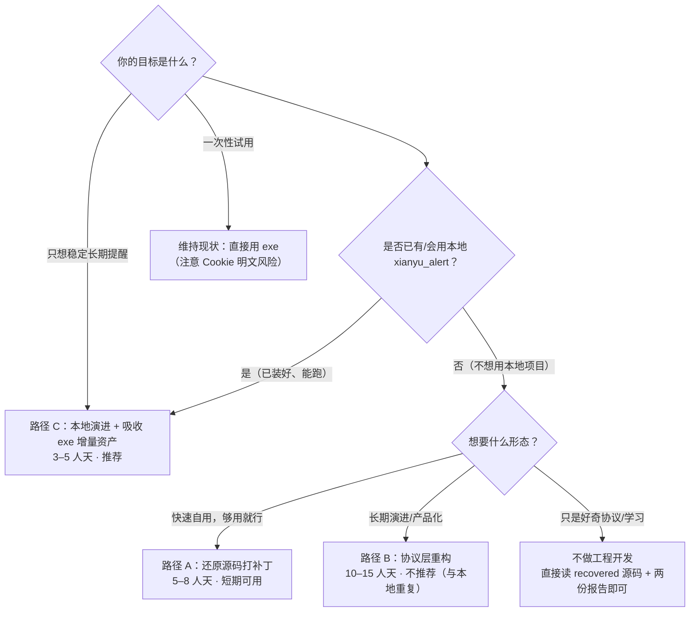

# 二次开发可行性评估报告 · 闲鱼低价提醒工具 V1.0（exe 还原源码）

> **评估者**：软件架构师「高见远（Gao）」
> **评估对象**：`C:\Users\fun\Desktop\闲鱼低价提醒工具V1.0.exe` 之逆向还原源码（`re_analysis/recovered/xianyu_price_alert.py`，938 行）
> **评估输入**：`re_analysis/逆向工程分析报告.md`（648 行）、`re_analysis/代码质量审查报告.md`（≈4.6/10）、`re_analysis/evidence/04_diff_vs_local.md`、本地 `xianyu_alert/`（9 模块 / 4,576 行 / 178 测试）
> **证据标记**：🟢 确证（指令/常量/实证直接支撑）｜🔵 实证（真实运行产物校验）｜🟡 推测（还原不确定性）
> **行号约定**：`R-L#` = recovered 骨架行号；`质§#` = 代码质量审查报告章节；`逆§#` = 逆向工程分析报告章节
> **性质声明**：本文为**纯分析文档**，不修改/不执行 exe 与桌面任何文件，未改动 `re_analysis/` 下任何已有文件。

---

## 0. 执行摘要（Executive Summary）

| 问题 | 结论 |
| --- | --- |
| **二次开发可能性** | **技术可行性：高（≈80%）** —— 核心协议层经 14/14 实证校验零偏差（🔵），单文件 938 行结构清晰，可读性强；**业务改造空间：有限** —— 单关键词、单接口、无抽象，天花板明显 |
| **值不值得基于它开发** | **边际价值有限，且存在更优替代**。exe 的协议知识（mtop 签名）与本地 `xianyu_alert` **100% 同源互证**（逆§9.2 / 04_diff§4.8），本地已实现等价 MtopFetcher 且带 178 个测试。基于 exe 源码「从零重构」的净收益 ≈ 0；真正值得吸收的是 exe 独有的 **4 个增量资产**（bark/webhook 通道、parse_price 万换算、桌面快捷方式、翻页限速） |
| **推荐路线** | **路径 C+（混合）**：以本地 `xianyu_alert` 为基座继续演进，把 exe 的 4 个独有资产**移植合并**进来（预计 **3–5 人天**），而非在原还原源码上打补丁（路径 A，5–8 人天但仍是脚本）或以其为内核重构（路径 B，10–15 人天，交付物与本地重复） |
| **量化判断** | 若坚持「基于 exe 源码」开发：可行性 80%，改造成本 10–15 人天（路径 B）才能达到本地项目现有的工程化水平——**属于「做得到，但不划算」** |

**一句话结论**：这份源码是「协议正确、功能完整、工程纪律缺位」的**个人实用工具**（质§0，≈4.6/10）。作为**协议与领域的参考实现**价值高、值得借鉴；作为**二次开发的基座**价值低——因为本地已有同协议、更工程化的实现，正确姿势是「吸收它的增量资产」而非「以它为起点重写」。

---

## 1. 二次开发可行性总评

### 1.1 四维评分

| 维度 | 评分 | 依据 | 标记 |
| --- | --- | --- | --- |
| **技术可行性** | **8/10** | mtop 签名 `md5(token&ts&APP_KEY&data)` 逐指令确证且与本地实现互证（R-L186-194 / 逆§3.1）；IO 格式 14/14 实证零偏差（逆§10.B）；GUI 线程模型正确（queue+after 桥接，R-L687-699）；单文件易读、53 个 code object 全覆盖还原 | 🟢 |
| **代码质量** | **4.6/10** | 质§0 综合评分：可读性 7、模块化 5、健壮性 4、安全 3、工程化 3、性能 6、规范 4——「可用的小工具」层级 | 🟢 |
| **作者持续性** | **1/10** | 单作者署名「花开半夏」（R-L75），无仓库、无版本管理、无社区、无更新迹象；打包时间戳 2026-07-29（逆§1.1）；缺陷（toast 失效）从打包起就存在，说明无持续维护闭环 | 🟢 |
| **领域空间** | **5/10** | 闲鱼是强反爬站点：签名/UA/风控随时可能升级（04_diff§4.3 已见 UA 从 Chrome/122 → Chrome/134 的差异）；exe 零重试零退避（质§2.3），长期运行有封号风险；单关键词设计使业务扩展空间受限（逆§4.1） | 🟢 |

### 1.2 综合结论与置信度

```
二次开发可行性 = 技术可行性(高) × 代码质量(中低) × 作者持续性(无) × 领域空间(中)
              → 「技术上可行，工程上不建议作为基座，领域上需自担风控」
```

- **可行性结论**：基于 exe 源码二次开发**做得到**（协议已实证、代码可读），但**性价比低于预期**——因为本地 `xianyu_alert` 已覆盖其协议内核且工程化程度更高。
- **置信度：高（🟢）**。所有关键判断（协议正确、toast 失效、Cookie 明文、单关键词、无测试、非同源）均有反汇编/实证/差分证据直接支撑，不依赖推测。
- **残余不确定性（🟡）**：U1-U11 均不影响可行性结论（质§4），仅 GUI 内部 4 个小函数（`set_buttons_state`/`restore`/`fetch_done`/`fetch_cancel_now`，R-L729/772/830/833）在骨架中近乎空壳——这些是纯 UI 开关逻辑，不构成二次开发障碍。

---

## 2. 可复用资产盘点（按价值排序）

> 复用成本口径：**重构成本** = 把 exe 资产提取/改造成可维护形态；**重写成本** = 从零实现等价功能。两者对照用于判断「移植 vs 重写」。

| # | 资产 | 价值评估 | 重构成本 | 重写成本 | 建议动作 | 证据 |
| --- | --- | --- | --- | --- | --- | --- |
| 1 | **XianyuClient 协议层**（`_sign`/`_cookie_dict`/`search`/`parse_response`） | ⭐ 极高：14/14 实证正确；签名串与 body 字节一致是验签最容易翻车处，作者做对了 | 0.5 人天（提取为 `client.py` 模块） | 2–3 人天（本地已实现，实际 0） | **放弃 / 仅作参考**：本地 `MtopFetcher`（fetcher.py L465）已实现等价协议，双向互证（04_diff§4.3） | 逆§3.1 / 逆§10.B / R-L165-341 |
| 2 | **`parse_price`**（万换算 + 面议/电议/私聊/咨询过滤 + 货币符号清洗） | ⭐ 高：闲鱼价格文案脏数据的一站式鲁棒解析，本地缺失（04_diff§4.2） | <0.5 人天（拷贝 + 补 3-5 条单测） | 1 人天 | **直接移植到本地**（增量资产 #1） | R-L113-133 / 逆§3.2 / 04_diff§4.9 |
| 3 | **Bark / 企微 webhook 通知通道** | 高：本地 4 通道（console/serverchan/email/telegram）与 exe 4 通道（toast/sound/bark/webhook）**交集为空**（04_diff§4.6） | 1 人天（接入本地 `Notifier` 工厂 + 测试） | 1–2 人天 | **直接移植到本地**（增量资产 #2） | R-L407-433 / 04_diff§4.6 |
| 4 | **去重状态机**（`dedup_key` + monitor 四条件短路） | 中高：item_id 优先、无则 `title|seller|price_text` 兜底，简单正确 | 0.5 人天 | 1 人天（本地 SQLite 版已更完善） | **参考思路，不移植**：本地 SQLite 唯一约束 `(keyword, product_id)` 更健壮（README§五） | R-L472-479 / R-L535-548 / 逆§3.3 |
| 5 | **`monitor` 循环骨架**（可中断休眠 + 轮级容错） | 中：`sleep(min(5, interval-slept))` + 每片检查 stop_event，停止延迟 ≤5s——思路正确（逆§5.1 修正了骨架的 min(1) 写法） | 1 人天（重写为带重试/退避的版本） | 1 人天（本地 monitor.py 已有） | **参考思路**：本地 `monitor.py` 已有主循环，需补的是 exe 的「失败轮不写去重」细节 | R-L555-569 / 逆§5.1 / 质§3.1-4 |
| 6 | **GUI 线程模型**（queue.Queue + root.after(200ms) 桥接） | 中高：规避 tkinter 跨线程操作控件这一经典崩溃源（质§3.1-5） | 0.5 人天 | 1 人天（本地 gui.py 1,617 行已实现） | **参考，不移植**：本地 GUI 更完整 | R-L687-699 / 质§3.1-5 |
| 7 | **桌面快捷方式**（PowerShell + WScript.Shell 建 .lnk） | 中：本地缺失（04_diff§4.2）；但实现有隐患（6 段 f-string 拼 PS 脚本，路径含 `"`/`$` 即破坏，质§2.4） | 0.5 人天（改参数化/转义后移植） | 1 人天 | **移植到本地**（增量资产 #3，需先修转义） | R-L848-895 / 04_diff§4.9 / 质§2.4 |
| 8 | **翻页限速 `time.sleep(2)`** | 中低：礼貌且必要（质§2.6） | <0.5 人天 | <0.5 人天 | **移植**（增量资产 #4，一行代码 + 测试） | R-L533 / 04_diff§4.9 |
| 9 | **playwright 半自动取 Cookie**（`_cookie_worker`） | 中低：功能可用但体积拖累（103MB playwright 只为可选功能，51MB exe 几乎全来自它，逆§8.4）；本地已有 `cli login`（含粘贴降级） | 1 人天（拆独立可选组件/CDP） | 0.5 人天（本地已实现） | **放弃**：本地 `cookie.py` 已有更优实现（README§二.4） | R-L797-828 / 逆§8.4 / 质§2.5 |
| 10 | **`toast`/`sound` 通知** | 中低：`_toast` 依赖链断裂（win11toast/plyer 未打包，静默失效，逆§8.4）；`_sound` 双蜂鸣可用 | toast 重写 1 人天；sound 0.5 人天 | 1–2 人天 | **toast 重写**（见 §3）；**sound 可移植** | R-L378-405 / 逆§8.4 / 质§3.2-1 |
| 11 | **`alerts.jsonl` 审计日志** | 中低：11 字段 JSONL 追加，作为审计轨迹是亮点（质§2.5） | 0.5 人天 | 0.5 人天（本地 SQLite `product` 表已覆盖） | **参考**：本地已有历史记录与 `list` 子命令 | 逆§4.3 / R-L435-445 |

**盘点结论**：真正值得「搬」的只有 **4 项增量资产**（parse_price、bark/webhook、快捷方式、翻页限速），合计约 **3–5 人天**；其余要么本地已有等价实现（协议/去重/循环/GUI/playwright），要么必须重写（toast/配置安全）。

---

## 3. 必须重写 / 必须补齐的部分

> 以下为「若把 exe 源码当作产品基座」必须处理的缺陷项；工作量按**单人天（人天）**估算，S/M/L 为相对规模。

| # | 项 | 现状与根因 | 改造内容 | 工作量 | 证据 |
| --- | --- | --- | --- | --- | --- |
| 1 | **通知层 toast 依赖链** | win11toast/plyer 未打包 + 双层 `except Exception: pass` 静默吞错 → 桌面弹窗**永久失效且用户无感知**（默认 `toast=true` 每次提醒都走必死路径） | 重写为单通道可靠实现（winrt 原生 / 自定义 Tk 弹窗）；**打包前 import 自检**，失败弹提示而非静默 | **S（1 人天）** | R-L378-395 / 逆§8.4 / 质§3.2-1（成因链展开） |
| 2 | **配置与 Cookie 安全** | Cookie 明文 673 字符落盘桌面 `config.json`（🔵 实证）；bark/webhook 令牌同明文；约 24h 过期后**无任何提示**静默失效 | Cookie 用 Windows DPAPI / keyring 加密存储；`config.json` 移出桌面（AppData）；Cookie 过期检测 + 主动提示；敏感字段脱敏显示 | **S–M（1–2 人天）** | R-L63 / R-L85 / 逆§8.5 / 质§2.4 |
| 3 | **输入校验** | `cmd_setup` 与 GUI `sync_config_from_fields` 的 `float()`/`int()` 均无异常保护（co_names 无 Exception，逆§7.1-#3）→ 输入非数字即 `ValueError` 崩溃；GUI 子系统表现为「点开始没反应」 | 所有用户输入转换加 try/校验 + 错误提示；`load_config` 加 try（配置损坏 → 重建/报错而非启动即崩） | **S（0.5–1 人天）** | R-L599-602 / R-L701-712 / R-L482-491 / 质§2.3 |
| 4 | **多关键词支持** | exe 仅单关键词 `keyword: str`（逆§4.1）；数据模型、配置、monitor 循环、去重键全按单关键词设计 | 配置改为 `keywords: [{keyword, max_price, min_price}]`；monitor 外层加关键词循环；去重键加关键词维度 | **M（2–3 人天）**（本地已是多关键词，若走路径 C 则 0） | 逆§4.1 / 04_diff§4.4 / R-L514 |
| 5 | **测试体系** | 零测试；`search` 直连网络、`Notifier` 直接 `requests`/`winsound`，无 mock 接口（唯一注入点 `log_fn`） | pytest + mock（requests/winsound）+ 黄金文件固化 IO 格式（14/14 实证记录可作回归基准）；协议层单测 | **M（2–3 人天）** | 质§2.5 / 质§4 |
| 6 | **重试与风控策略** | 全程序零重试零退避（🟢 grep 复核）；固定 UA、无代理池、无风控标记识别（04_diff§4.3 本地有 `_RET_RISK_MARKERS`/`_RET_TOKEN_MARKERS`）；一轮中第 2 页失败 → 已抓第 1 页结果整体丢弃 | 重试 + 指数退避 + 抖动；风控/令牌过期标记识别与自动重登提示；UA 轮换；请求节流；页级容错（单页失败不丢整轮） | **M（1–2 人天）** | 质§2.3 / 04_diff§4.3 / R-L527-557 |
| 7 | **静默吞错策略** | 约 10 处 `except Exception: pass`（toast×2/sound/bark/webhook/log/save_seen/load_seen/apply_icon 全吞）→ 所有通道失败均无痕迹 | 全局改为「显式错误上报 + 降级日志」；`logging` 框架替代 print/log_fn 平铺；关键通道失败打 warning | **S（1 人天）** | 质§2.3 / R-L390-445 |
| 8 | **打包流程验证** | 依赖打包与体积倒挂：103MB playwright 塞进 51MB exe，却漏掉 3KB 弹窗库——暴露「打包未跑真实路径」的流程缺陷（质§2.5） | hidden-imports 显式清单 + 启动时 import 自检 + 打包 CI 冒烟测试；playwright 拆独立可选组件 | **M（1–2 人天）** | 逆§8.4 / 质§2.5 / 质§3.2-1 |
| 9 | **seen 集合无限增长** | `seen_items.json` 整文件重写、只增不减无淘汰（质§2.6） | 加容量上限/时间淘汰；或走本地 SQLite（天然支持） | **S（0.5 人天）**（路径 C 则 0） | R-L463-469 / 质§2.6 |
| 10 | **PowerShell 字符串拼接** | 6 段 f-string 直接拼 PS 脚本，路径含 `"`/`$` 即破坏/注入（质§2.4，低危） | 参数化/转义/改用 `subprocess` 列表参数 | **S（0.5 人天）** | R-L874-890 / 质§2.4 |

**合计（若全量改造 exe 源码）**：约 **11–16 人天**；其中「必须重写」核心 6 项（#1-#6）约 **7–10 人天**。

---

## 4. 三条改造路径对比

### 4.1 路径定义

| 路径 | 定义 | 本质 |
| --- | --- | --- |
| **A：在原还原源码上打补丁** | 保留单文件结构，逐项修 §3 缺陷（补 toast、加校验、Cookie 加密），不动架构 | 「修 bug」 |
| **B：以协议层为内核重构** | 提取 XianyuClient/parse_price/去重/monitor 骨架，拆 5 模块（client/storage/notifier/monitor/gui）+ 测试 + 打包规范，其余重写 | 「重写工程化」 |
| **C：本地 `xianyu_alert` 继续演进** | 以本地 9 模块项目为基座，把 §2 的 4 项增量资产（parse_price/bark/webhook/快捷方式/限速）移植合并 | 「吸收增量」 |

### 4.2 对比表

| 维度 | A：打补丁 | B：协议层重构 | C：本地演进（推荐） |
| --- | --- | --- | --- |
| **工作量** | 5–8 人天 | 10–15 人天 | **3–5 人天** |
| **交付质量** | 低–中（仍是单文件脚本；toast 修好后功能可用） | 中–高（模块化 + 测试 + 打包规范） | **高**（继承 178 测试，新增资产各自补测） |
| **风险** | 高：单文件难扩展；多关键词改造会动核心循环；每次改动都可能碰坏协议层 | 中：重构期间需保持协议行为不变（可用 14/14 实证记录做回归） | **低**：增量合入，不动现有稳定链路 |
| **长期可维护性** | 低（单文件 938 行继续膨胀；无测试护航） | 中–高（模块化但仍是「第二个本地项目」，与本地重复维护） | **高**（单一代码基，测试全覆盖） |
| **适用场景** | 用户只想快速自用、不在乎扩展 | 用户坚持「以 exe 为源头」且要长期演进（不推荐，因本地已等价） | **绝大多数场景**：个人长期使用 / 团队维护 / 想稳定抓取 |
| **与本地项目关系** | 平行维护两个代码基（冗余） | 再造一个与本地功能重复的模块化项目（浪费） | **收敛为一个代码基**（最优） |

### 4.3 推荐路径演进示意（路径 C+）

```mermaid
flowchart LR
    subgraph EXE["exe 还原源码（评估对象）"]
        A1["XianyuClient 协议层"]:::ref
        A2["parse_price 万换算"]:::gain
        A3["Bark / webhook 通道"]:::gain
        A4["去重状态机"]:::ref
        A5["monitor 骨架"]:::ref
        A6["桌面快捷方式"]:::gain
        A7["toast / 配置 / 校验 / 测试"]:::bad
        A8["翻页限速"]:::gain
    end

    subgraph LOCAL["本地 xianyu_alert（基座，178 测试）"]
        L1["MtopFetcher（协议等价）"]
        L2["SQLite 存储"]
        L3["多关键词 + 独立阈值"]
        L4["Console/ServerChan/Email/Telegram"]
        L5["cli login（playwright+粘贴降级）"]
        L6["GUI 三页签"]
    end

    subgraph OUT["路径 C+ 目标态"]
        O1["本地项目 + parse_price"]
        O2["+ Bark / webhook 通道"]
        O3["+ 桌面快捷方式"]
        O4["+ 翻页限速"]
    end

    A2 -->|移植| O1
    A3 -->|移植| O2
    A6 -->|移植(修转义)| O3
    A8 -->|移植| O4
    A1 -.协议互证,不移植.-> L1
    A4 -.参考,不移植.-> L2
    A5 -.参考,不移植.-> L2
    A7 -.必须重写,不移植.-> OUT

    classDef ref fill:#eef2ff,stroke:#6366f1,stroke-dasharray:4 2
    classDef gain fill:#dcfce7,stroke:#16a34a
    classDef bad fill:#fee2e2,stroke:#dc2626
```

### 4.4 决策图（用户场景 → 推荐路径）



---

## 5. 关键风险与应对

| # | 风险 | 现状证据 | 级别 | 应对方案 |
| --- | --- | --- | --- | --- |
| 1 | **Cookie 安全**：明文 673 字符落盘桌面 + 约 24h 过期后无提示静默失效 | R-L63/R-L85；🔵 实证桌面 config.json；逆§8.5 🔴 高 | 🔴 高 | ① DPAPI/keyring 加密存储，config 移出桌面；② 启动时校验 `_m_h5_tk` 存在 + 过期主动提示重登；③ 桌面截图/分享前提醒；④ 若走路径 C，本地 cookie.py 已具备写入/降级，补加密即可 |
| 2 | **闲鱼反爬升级**：签名变化、UA 风控、封号 | 当前签名正确（🔵）但 exe 零重试零退避、固定 UA（质§2.3）；04_diff§4.3 已见两次独立实现的 UA 不同 | 🟠 中-高 | ① **协议层封装隔离**：所有请求/签名/解析收敛到单一模块（本地 `fetcher.py` 已如此），站点变化只改一处；② 补重试/退避/风控标记识别（本地已有 `_RET_RISK_MARKERS`）；③ 请求节流（interval ≥ 300s，README§八.4）；④ 多通道降级保证提醒不丢 |
| 3 | **单作者无维护**：无仓库/无社区/缺陷长期存在（toast 打包起就失效） | 逆§1.1 时间戳；质§3.2-1 成因链 | 🟡 中 | ① 不把 exe 当「活代码」依赖，只当参考实现；② 用 14/14 实证记录 + 黄金文件**固化行为**，回归测试锁定协议细节；③ 交接文档（本报告 + 逆§3.1 签名说明即可复现协议） |
| 4 | **还原不确定性（U1-U11）对二次开发的影响** | 质§4：U1-U11 均不影响质量结论；U6 强化缺陷、U4/U5 修正休眠粒度数字；GUI 4 个空壳函数（R-L729/772/830/833）不影响核心 | 🟡 低 | ① 二次开发**不依赖任何 🟡 推测项**——协议/去重/循环/通知模板全为 🟢 确证；② 若走路径 C，移植的 4 项资产均为确证级；③ GUI 空壳函数按「重新实现」处理，不做逐行还原 |
| 5 | **依赖与体积**：103MB playwright 拖累分发、弹窗库漏打包 | 逆§8.4；质§2.5 | 🟡 中 | ① 打包前 import 自检 + 冒烟测试；② playwright 拆独立可选组件（本地 `requirements-cookie.txt` 已是此模式）；③ hidden-imports 显式清单 |

---

## 6. 给用户的决策建议

### 6.1 明确推荐（按场景）

| 用户场景 | 推荐 | 理由 |
| --- | --- | --- |
| 想**长期稳定**用低价提醒 | **路径 C**（本地演进 + 吸收 exe 增量） | 178 测试护航、多关键词、SQLite 去重、重试风控、可维护 |
| 想快速自用、**不愿用本地项目** | 路径 A（打补丁）或直接用 exe | 5–8 人天修好 toast/Cookie/校验即可用；但别指望扩展 |
| 想**产品化 / 分发给别人** | 路径 C + 打包规范（§3 之 #8） | 测试 + 打包自检 + 可选签名，才是可分发形态 |
| 纯个人小工具、**不折腾** | 维持现状用 exe | 但注意 Cookie 明文风险（不要截图/分享桌面 config.json） |
| 想**学习协议 / 反爬** | 直接读 recovered 源码 + 两份报告 | 协议层已是公开事实，无需二次开发 |

### 6.2 若坚持基于 exe 开发：30/60/90 天里程碑（路径 B 简化版）

| 阶段 | 目标 | 内容 | 验收标准 |
| --- | --- | --- | --- |
| **D0–30** | 基础设施 | 拆 5 模块（client/storage/notifier/monitor/gui）+ `pyproject.toml` 锁依赖 + pytest 骨架 + 协议层单测（mock requests）+ Cookie 加密存储（DPAPI） | `pytest` 通过 ≥30 条；Cookie 不再明文落盘 |
| **D31–60** | 功能补齐 | 通知层重写（toast 修复 + 显式错误上报）+ 输入校验 + 重试退避 + 多关键词 + 导入 14/14 实证记录为回归基准 | toast 实测弹窗成功；非法输入不崩溃；连续 3 轮无风控 |
| **D61–90** | 产品化 | 打包流程验证（import 自检 + 冒烟测试）+ playwright 拆独立组件 + 桌面快捷方式 + （可选）代码签名 | 打包产物一键可用，弹窗/声音/推送全通道验证通过 |

### 6.3 能力对比清单（exe vs 本地 `xianyu_alert`）

| exe 有、本地没有（值得吸收） | 本地有、exe 没有（直接受益） |
| --- | --- |
| ✅ **Bark 推送**（iOS 可达，R-L407-418） | ✅ 多关键词 + 每关键词独立阈值（README§一） |
| ✅ **企微/钉钉 webhook**（R-L420-433） | ✅ SQLite 存储：永久去重 + 历史记录 + `list` 查询 |
| ✅ **parse_price 万换算 + 面议/电议/私聊/咨询过滤**（R-L113-133） | ✅ 178 个测试 + 类型标注 + YAML 配置校验 |
| ✅ **桌面快捷方式**（PowerShell 建 .lnk，R-L848-895） | ✅ GUI 三页签（gui.py 1,617 行，04_diff§4.2） |
| ✅ **翻页限速 sleep(2)**（R-L533） | ✅ `cli login` 三方式（playwright/粘贴/纯手工，README§二.4） |
| ✅ alerts.jsonl 审计日志（逆§4.3） | ✅ 重试/风控标记识别（`_RET_RISK_MARKERS`，04_diff§4.3） |
| — | ✅ MockFetcher 离线演示 + 可测性（fetcher.py L1030） |

**交叉结论**：exe 的独有优势集中在「**通知通道与领域解析**」两个点，且都是**可移植的小函数/小类**；本地优势覆盖「**架构、存储、测试、风控、多关键词**」等系统性能力。两者的互补方向清晰——**把 exe 的 4 个增量点搬进本地**，即获得「本地工程底座 + exe 全部特色能力」的合体，这是性价比最高的路线。

---

## 7. 附录：证据与材料索引

### 7.1 评估输入材料

| 材料 | 路径 | 关键章节 |
| --- | --- | --- |
| 逆向工程分析报告 | `re_analysis/逆向工程分析报告.md` | §0 摘要 / §3 算法 / §4 IO 规格 / §5 功能 / §7 不确定项 / §8 安全 / §9 横向对比 / §10 附录 |
| 代码质量审查报告 | `re_analysis/代码质量审查报告.md` | §0 速览 / §2 分层评分 / §3 亮点与缺陷 / §4 还原可靠性 / §5 给架构师的输入 |
| 还原源码骨架 | `re_analysis/recovered/xianyu_price_alert.py` | 938 行，行号锚点 R-L# |
| 与本地差分 | `re_analysis/evidence/04_diff_vs_local.md` | §4.2 模块对应 / §4.3 协议常量 / §4.8 匹配度 / §4.9 后续影响 |
| 本地项目 | `xianyu_alert/`（9 模块，4,576 行） | `fetcher.py`（MtopFetcher L465）/ `notifier.py` / `README.md`（178 测试确证） |

### 7.2 关键证据行号速查

| 结论 | 证据位置 |
| --- | --- |
| mtop 签名公式 | R-L186-194；逆§3.1（disasm L760-795） |
| 14/14 实证校验 | 逆§10.B；质§4 |
| toast 永久失效成因链 | 质§3.2-1；逆§8.4；R-L378-395 |
| Cookie 明文落盘 | R-L63 / R-L85；逆§8.5；🔵 桌面 673 字符 |
| 零重试零退避 | 质§2.3（🟢 grep 复核） |
| 单关键词限制 | 逆§4.1；04_diff§4.4 |
| 非同源判定 | 04_diff§4.1（E1-E5）；逆§9.1 |
| 协议层 100% 一致 | 04_diff§4.3（5/5）；逆§9.2 |
| 本地 178 测试 | `tests/` 8 文件 def test 合计 178（实测） |

### 7.3 取证纪律声明

- ✅ 目标 exe **全程只读、未执行**；桌面任何文件未修改
- ✅ `re_analysis/` 下已有文件仅只读引用，本文为**唯一新增文件**
- ✅ 全部结论可追溯至上述行号/章节，未编造任何证据

---

*报告完。评估结论以「协议正确性 + 工程成熟度 + 边际价值」三维权衡得出；推荐路径基于技术事实，不偏向任何一方代码基。*
