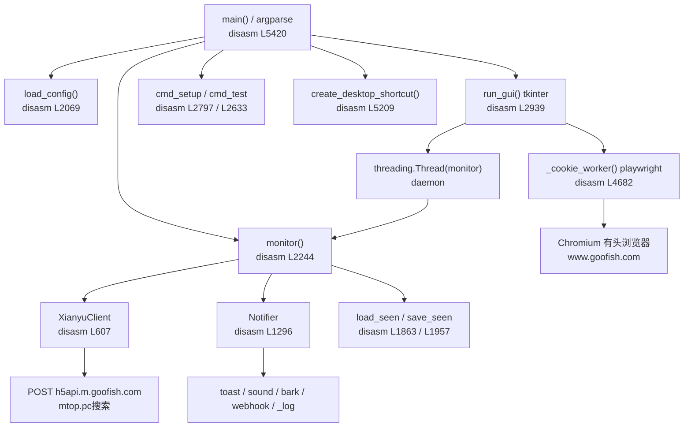
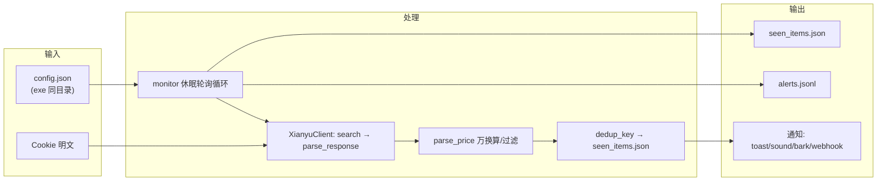

# 逆向工程分析报告 · 闲鱼低价提醒工具 V1.0

> **分析对象**：`C:\Users\fun\Desktop\闲鱼低价提醒工具V1.0.exe`（53,872,111 B / 51.38 MB）
> **分析方式**：纯静态取证（PE 解析 → PyInstaller 解包 → CPython 3.13 字节码反汇编 + 常量表提取）
> **取证纪律**：全程只读目标文件，**未执行 exe、未修改/移动/删除/重命名目标，也未修改任何证据文件**
> **报告作者**：软件架构师「高见远（Gao）」· 基于工程师寇豆码（Kou）的静态取证证据产出
> **证据可信度标记**：🟢 确证（有指令/常量直接支撑） ｜ 🔵 实证校验（静态推导获真实运行产物 14/14 吻合）｜ 🟡 推测（多种等价写法，语义确定但细节未知）

---

## 0. 执行摘要（Executive Summary）

| 维度 | 结论 | 标记 |
| --- | --- | --- |
| 打包方式 | PyInstaller **onefile**，CArchive 追加于 PE overlay，占全文件 **99.5%** | 🟢 确证 |
| 运行时 | **CPython 3.13**（`python313.dll`，6.15 MB） | 🟢 确证 |
| 业务代码形态 | **单文件脚本** `xianyu_price_alert.py`（1 模块 / **53 个 code object**） | 🟢 确证 |
| 反汇编覆盖率 | **53 / 53 = 100%**（3.13 无可用反编译器，用 `marshal.loads` + `dis` 手工重建） | 🟢 确证 |
| 核心协议 | 闲鱼 mtop PC 搜索接口 + `md5(token&ts&appKey&data)` 签名 | 🟢 确证 |
| 与本地 `xianyu_alert` 项目 | **非同源**（协议常量 100% 一致，代码结构 0% 一致） | 🟢 确证 |
| 恶意行为 | **未发现**（无后门、无数据外传、无持久化、无提权） | 🟢 确证 |
| 已知缺陷 | **桌面弹窗通知永久失效**（依赖库 `win11toast`/`plyer` 未打包，被裸 `except` 吞掉） | 🟢 确证 |
| IO 还原准确率 | **14/14 项获真实运行产物实证校验，零偏差** | 🔵 实证 |

**一句话定性**：这是一个独立编写的、功能完整且行为良善的闲鱼关键词低价监控小工具；代码质量属于"个人实用工具"级别（无混淆、无签名、隐私处理粗糙），但**不存在任何恶意特征**。

---

## 1. 目标概况与取证方法论

### 1.1 文件指纹

| 项 | 值 | 证据 |
| --- | --- | --- |
| 大小 | 53,872,111 B (51.38 MB) | `01_pe_info.md` |
| MD5 | `adff8e0510f607b86a652f28cc5c5222` | `01_pe_info.md` |
| SHA256 | `3c9bea9cdacb02d75a1cfe03d7f98e5eb96aa01ab68dfdf3f4dd900d73ee7937` | `01_pe_info.md` |
| PE 类型 | PE32+ x86-64，`IMAGE_SUBSYSTEM_WINDOWS_GUI` | `01_pe_info.md` |
| 链接时间戳 | 2026-07-29 02:49:28 UTC | `01_pe_info.md` |
| 数字签名 | **无**（`IMAGE_DIRECTORY_ENTRY_SECURITY` 为空） | `01_pe_info.md` §1.4 |
| 版本资源 | **无** VS_VERSIONINFO | `01_pe_info.md` |
| 图标 | 有（RT_ICON × 7 + RT_GROUP_ICON × 1） | `01_pe_info.md` |

### 1.2 取证流水线（方法论）

```
① PE 解析 (pefile)
   → 确认 GUI 子系统、无签名、overlay 偏移
② PyInstaller CArchive 解包 (pyinstxtractor-ng)
   → 顶层 1,196 条目 + PYZ.pyz 555 模块
   → 提取唯一业务脚本 xianyu_price_alert.pyc (46,315 B)
③ 字节码提取
   → 与运行时同版本(CPython 3.13)的 marshal.loads 还原 code object
   → 53/53 个 code object 全部成功（无加壳、PYZ 未加密）
④ 结构化反汇编 (dis)
   → 导出 5,630 行完整反汇编 + co_consts / co_names / co_varnames
⑤ 手工语义重建
   → 逐指令还原等价源码，行号锚定原始 co_firstlineno
⑥ 黑盒实证校验（被动）
   → 桌面上用户历史运行的 config.json / seen_items.json / alerts.jsonl
   → 14/14 项与静态推导吻合，零偏差
```

> **为何不用反编译器**：CPython 3.13 的字节码格式（含 `RESUME`、`CALL_KW`、`LOAD_FAST_CHECK` 等新 opcode）目前没有成熟可用的反编译器，故采用"反汇编 + 常量表 + 结构化提取"的半自动手工还原路线，等价性高于反编译器且可逐条追溯。

### 1.3 证据来源索引

| 证据文件 | 内容 | 关键结论 |
| --- | --- | --- |
| `evidence/00_findings.md` | 汇总报告 | TL;DR、缺陷、实证校验 |
| `evidence/01_pe_info.md` | PE 头/节区/导入表/资源 | 无签名、GUI 子系统 |
| `evidence/02_archive_toc.md` | CArchive + PYZ 解包清单 | 51MB 体积几乎全来自 playwright |
| `evidence/03_module_inventory.md` | 模块清单 | playwright 1.61.0 确证 |
| `evidence/04_diff_vs_local.md` | 与本地项目差分 | 非同源 5 条决定性证据 |
| `evidence/05_behavior_static.md` | 静态行为与安全 | 无恶意行为、隐私弱点 |
| `evidence/struct_xianyu_price_alert.md` | 53 个 code object 签名 + 常量表 | 全量符号证据 |
| `disasm/xianyu_price_alert.txt` | 5,630 行完整反汇编 | 本报告主要逐指令证据 |
| `recovered/xianyu_price_alert.py` | 还原源码骨架 | 带行号锚点与 `# [不确定]` 标注 |

---

## 2. 整体架构分析

### 2.1 组件关系

程序是**单进程、单脚本、事件驱动 + 后台线程**架构。GUI（tkinter）跑在主线程，监控循环跑在 daemon 线程，两者通过 `queue.Queue` + `root.after(200ms)` 做线程安全日志桥接。



### 2.2 模块职责划分

| 组件 | 行号（disasm） | 职责 | 标记 |
| --- | --- | --- | --- |
| `main` | L5420 | 命令行入口，6 个 flag 分发 | 🟢 |
| `run_gui` | L2939 | tkinter 界面、日志队列、Cookie 获取 | 🟢 |
| `monitor` | L2244 | 监控主循环（核心） | 🟢 |
| `XianyuClient` | L607 | mtop 签名、搜索请求、响应解析 | 🟢 |
| `Notifier` | L1296 | 四通道提醒 + JSONL 日志 | 🟢 |
| `load_config`/`save_config` | L2069/L2191 | 配置读写与补齐 | 🟢 |
| `load_seen`/`save_seen`/`dedup_key` | L1863/L1957/L2036 | 去重持久化 | 🟢 |
| `cmd_setup`/`cmd_test` | L2797/L2633 | 交互式配置 / 单次验证 | 🟢 |
| `create_desktop_shortcut` | L5209 | PowerShell 建 .lnk | 🟢 |
| 工具函数 `dig`/`parse_price`/`resource_path` | L359/L403/L324 | 取值、价格解析、资源定位 | 🟢 |

### 2.3 数据流总览



### 2.4 关键设计特征（架构层面）

1. **扁平单文件**：无包结构、无抽象基类，所有逻辑平铺在同一模块（对比本地 `xianyu_alert` 的 9 模块包）。🟢
2. **冻结态路径**：`BASE_DIR = os.path.dirname(sys.executable)`（仅冻结态分支生效），数据文件落在 **exe 同目录（桌面）**。🟢 `disasm L44-47`
3. **资源定位**：`resource_path()` 在冻结态从 `sys._MEIPASS` 取图标，非冻结态从脚本目录取。🟢 `disasm L324`
4. **线程模型**：GUI 主线程 + 监控 daemon 线程 + `queue.Queue` 日志桥。🟢 `disasm L687-699`
5. **容错风格**：几乎所有网络/IO 调用都被 `try/except Exception: pass` 包裹 → 静默失败（这是"弹窗永久失效"缺陷的根因）。🟢

---

## 3. 核心算法与关键技术

### 3.1 ⭐ mtop 签名算法（最重要发现）

```python
def _sign(self, timestamp, data_json):
    raw = f"{self.token}&{timestamp}&{APP_KEY}&{data_json}"
    return hashlib.md5(raw.encode("utf-8")).hexdigest()
```

- **逐指令确证**：`disasm L760-795` → `BUILD_STRING 7` 拼 7 段（`token '&' ts '&' APP_KEY '&' data_json`）→ `hashlib.md5(...).hexdigest()`。
- `token` = Cookie 中 `_m_h5_tk` 的**下划线前半段**，正则 `_m_h5_tk=([a-zA-Z0-9]+)_` 取 `group(1)`（`_extract_token`，`disasm L727`）。
- `APP_KEY = "34839810"`（闲鱼 PC 站固定值，`disasm L69`）。
- `timestamp = str(int(time.time() * 1000))`（毫秒，`disasm L216`）。
- `data_json` 必须**紧凑** `json.dumps(obj, separators=(",", ":"), ensure_ascii=False)`（`disasm L237`）—— 签名串与 POST body 必须**字节级一致**，否则验签失败。

> **协议独立性佐证**：本地 `xianyu_alert/fetcher.py` L210-226 的 `mtop_sign()` 实现**完全相同的公式**，两个独立代码基互相印证 → 该算法可确认为闲鱼 PC 站真实签名方案。🟢

### 3.2 价格解析 `parse_price()`

```
去除 ￥ ¥ , 空格 → 命中 ("面议","电议","私聊","咨询") 之一则返回 None
→ 含「万」则 mult=10000 并去「万」 → float(s)*mult，失败返回 None
```

- **确证**：`disasm L403-511` → `co_consts` 含 `'￥','¥',',',' ',('面议','电议','私聊','咨询'),'万',10000`；`any(... in s for w in ...)` 的 genexpr（`disasm L513`）。
- ⚠️ **精确异常类型修正**（补充洞察 #2）：recovered 骨架注释为宽泛 `except Exception`，但 `disasm L494` 明确为 `LOAD_GLOBAL ValueError` + `CHECK_EXC_MATCH` —— **实际捕获的是 `ValueError`**，非宽泛异常。且 `co_varnames` 中 `wan` 局部变量、`MAKE_CELL s` 闭包均逐一吻合。

### 3.3 去重策略 `dedup_key()`

```python
def dedup_key(item):
    return item.item_id if item.item_id else f"{item.title}|{item.seller}|{item.price_text}"
```

- **确证**：`disasm L2036` → `BUILD_STRING 5`（`title '|' seller '|' price_text`）。
- 去重集合持久化到 `seen_items.json`，**永不过期、只增不减**（`save_seen` 整体覆盖写，`disasm L1957`）。🟢

### 3.4 提醒触发条件（`monitor` 循环）

```
key not in seen  AND  price is not None  AND  price <= threshold  AND  price >= min_price
```

- **逐指令确证**：`disasm L387-394` → 4 个 `continue` 短路：`key in seen` / `it.price is None` / `it.price > threshold` / `it.price < min_price`。

### 3.5 类/对象结构（重建）

```mermaid
classDiagram
    class XianyuClient {
        +str cookie
        +str token
        +__init__(cookie)
        +_extract_token(cookie) str
        +_sign(ts, data_json) str
        +_cookie_dict(cookie) dict
        +search(keyword, page, page_size) Item[]
        +parse_response(json, keyword) Item[]
    }
    class Notifier {
        +dict config
        +log_fn
        +notify(item, keyword, threshold)
        +_toast(title, msg)
        +_sound()
        +_bark(msg)
        +_webhook(msg)
        +_log(item, keyword, threshold)
    }
    class Item {
        +str item_id
        +str title
        +float price
        +str price_text
        +str url
        +str location
        +str seller
        +str image
    }
    class Config {
        +keyword / max_price / min_price
        +interval_minutes / pages / page_size
        +cookie / sound / toast
        +bark_url / webhook_url
    }
    XianyuClient ..> Item : produces
    Notifier ..> Item : consumes
    Note for Item "8 字段纯 dataclass"
```

---

## 4. 输入输出格式规格

### 4.1 配置文件 `config.json`

位置：**exe 同目录**（`os.path.dirname(sys.executable)`）。不存在时自动写入默认值；读取后用 `DEFAULT_CONFIG` 补齐缺失键（`load_config` 用 `cfg.setdefault(k, v)`，见 §7 补充洞察 #4）。🟢 `disasm L2069-2190`

| 键 | 类型 | 默认值 | 说明 |
| --- | --- | --- | --- |
| `keyword` | str | `"iPhone 13"` | 搜索关键词（**仅单个**） |
| `max_price` | float | `3000.0` | 价格上限，`price <= max_price` 才提醒 |
| `min_price` | float | `0.0` | 价格下限，`price >= min_price` 才提醒 |
| `interval_minutes` | int | `10` | 扫描间隔（分钟），实际 `max(1, int(v)) * 60` 秒 |
| `pages` | int | `1` | 每轮翻页数，`max(1, int(v))`；翻页间 `sleep(2)` |
| `page_size` | int | `30` | 每页条数 |
| `cookie` | str | `""` | **闲鱼登录 Cookie 明文**，须含 `_m_h5_tk=` |
| `sound` | bool | `true` | 蜂鸣提示 |
| `toast` | bool | `true` | 桌面弹窗（⚠️ 实际失效，见 §8） |
| `bark_url` | str | `""` | Bark 推送地址，非空才发 |
| `webhook_url` | str | `""` | 企微/钉钉 webhook，非空才发 |

写入：`json.dump(cfg, f, ensure_ascii=False, indent=2)`。🟢

### 4.2 去重文件 `seen_items.json`

JSON 数组（`list(set)`），`ensure_ascii=False, indent=2`。读取失败一律回退空 set。🟢 `disasm L1863-1960`

### 4.3 提醒日志 `alerts.jsonl`

每行一条 JSON（追加模式 `'a'`，UTF-8）。字段 = `asdict(Item)` 的 8 字段 + `keyword` + `threshold` + `time`（共 11 字段）：

```json
{"item_id":"...","title":"...","price":2680.0,"price_text":"￥2680",
 "url":"https://www.goofish.com/item/xxx","location":"浙江杭州","seller":"某某",
 "image":"https://...","keyword":"iPhone 13","threshold":3000.0,
 "time":"2026-07-31 14:32:00"}
```

🟢 确证（`Notifier._log`，`disasm L1759` → `strftime('%Y-%m-%d %H:%M:%S')`）。**无数据库**（与本地 SQLite 的关键差异）。

### 4.4 网络请求格式

**POST** `https://h5api.m.goofish.com/h5/mtop.taobao.idlemtopsearch.pc/1.0/`

Query string（12 键，全确证，`disasm L243-256`）：
```
jsv=2.7.2  appKey=34839810  t=<ms>  sign=<md5>  v=1.0
type=originaljson  dataType=json  timeout=20000
api=mtop.taobao.idlemtopsearch.pc  sessionOption=AutoLoginOnly
spm_cnt=a21ybx.0.0  spm_pre=a21ybx.input.0
```
Headers（4 键，`disasm L259-264`）：`User-Agent`(Chrome/134.0.0.0 Edg/134.0.0.0) / `Content-Type: application/x-www-form-urlencoded` / `Origin: https://www.goofish.com` / `Referer: https://www.goofish.com/`。
Body：`data=<data_json>`，其中 `data_json`（13 键，`disasm L220-234`）：
```json
{"pageNumber":"<page>","keyword":"<kw>","fromFilter":false,"rowsPerPage":<n>,
 "sortValue":"","sortField":"","customDistance":"","gps":"","propValueStr":"",
 "customGps":"","searchReqFromPage":"pcSearch","extraFilterValue":"",
 "userPositionJson":""}
```
Cookies：由 `config.cookie` 按 `;` / `=`(split 1) 拆成 dict 传入（`_cookie_dict`，`disasm L797`）。timeout=20s。🟢

**响应解析路径**（`parse_response`，`disasm L997-1294`）：
```
校验 : str(json["ret"][0]).startswith("SUCCESS")  否则 raise RuntimeError("接口返回错误：...")
遍历 : json["data"]["resultList"][*]["data"]["item"]["main"]
价格 : click["price"] or ex["price"] or ""
item_id: ex["itemId"] or click["itemId"] or ex["id"] or ""  (.strip())
标题 : ex["title"] or ex["detailParams"]["title"] or click["title"] or "未知标题"
地区 : ex["area"]   卖家: ex["userNickName"]   图片: ex["picUrl"]
url  : "https://www.goofish.com/item/<item_id>"  无 id 回退 "https://www.goofish.com/search?q=<kw>"
```
嵌套取值统一经 `dig()`（`disasm L359`，逐层 `dict.get` 带 default）。🟢

### 4.5 通知消息模板（逐字符确证）

```
【闲鱼捡漏】{title}
价格：￥{price:.2f}（设定阈值 ￥{threshold:.2f}）
地区：{location}　卖家：{seller}
链接：{url}
```
（「地区」与「卖家」之间为**全角空格 `\u3000`**，`disasm L362`。）

| 通道 | 实现 | 标记 |
| --- | --- | --- |
| toast | `win11toast.toast` (asyncio.run) → 失败降级 `plyer.notification` | 🟢 代码确证 / 🔴 运行不可达（见 §8） |
| sound | `winsound.Beep(1000,350)` → `sleep(0.12)` → `Beep(1500,350)` | 🟢 |
| bark | `GET {bark_url.rstrip('/')}/{quote(msg)}`, timeout=10 | 🟢 `disasm L1642` |
| webhook | `POST webhook_url, data=json.dumps({"msgtype":"text","text":{"content":msg}})`, timeout=10 | 🟢 `disasm L1701` |

### 4.6 CLI 参数（`main` / argparse，`disasm L5420`）

| 参数 | 行为 |
| --- | --- |
| （无） | 打开 GUI；失败则回退后台监控（`try run_gui except → monitor`） |
| `--gui` | 强制 GUI |
| `--test` | 跑一次搜索并打印，验证 Cookie |
| `--setup` | 交互式填配置 |
| `--console` | 无界面后台持续监控 |
| `--once` | 只扫一轮就退出 |
| `--shortcut` | 桌面创建 .lnk（调用 PowerShell） |

---

## 5. 主要功能逻辑

### 5.1 监控主循环（`monitor`）

```mermaid
sequenceDiagram
    participant M as monitor()
    participant C as XianyuClient
    participant N as Notifier
    participant S as seen_items.json

    M->>M: 校验 cookie / 解析阈值与间隔
    loop 每轮 (while True)
        alt stop_event.is_set()
            M-->>M: return（停止）
        end
        loop 每页 p in 1..pages
            M->>C: search(keyword, page=p, page_size)
            C->>C: _sign(ts, data_json)
            C->>C: requests.post(mtop API)
            C->>C: parse_response → Item[]
            C-->>M: items
            M->>M: all_items.extend(items)
            M->>M: if p<pages: sleep(2)
        end
        loop 每条商品
            M->>M: key = dedup_key(item)
            alt key in seen / price None / price>threshold / price<min
                M->>M: continue（跳过）
            else 命中阈值
                M->>N: notify(item, keyword, threshold)
                N->>N: _log → alerts.jsonl
                N->>N: _sound / _bark / _webhook
                M->>S: seen.add(key); save_seen(seen)
            end
        end
        M->>M: 可中断休眠 sleep(min(5, interval-slept)), slept += 5
    end
```

**轮询与可中断休眠机制**（精确还原，补充洞察 #1）：

```python
slept = 0
while slept < interval:
    if stop_event and stop_event.is_set():
        return
    time.sleep(min(5, interval - slept))   # disasm L2548-2557
    slept += 5                              # disasm L2560-2563
```

- 常量 `5` 是 `min()` 的上界参数与步长增量（`disasm L2552` + `L2561`），**并非独立的 `sleep(5)`**（修正了原 recovered 骨架中 `min(1, ...)` / `slept += 1` 的推测写法，见 §7）。
- `stop_event` 在**每次睡眠前**检查，故停止指令最坏在 ≤5 秒内生效（5 秒粒度）。
- 翻页限速：`time.sleep(2)`（`disasm L533`）。

### 5.2 图形界面（`run_gui`）

- 窗口 660×600、`resizable(False, False)`、标题"闲鱼低价提醒"、图标 `resource_path('icon.ico')`。🟢 `disasm L2939-2942`
- 5 个输入字段：搜索关键词 / 价格阈值(元) / 间隔(分钟) / 每页条数 / Cookie（`disasm L677-686`）。
- 日志区 `ScrolledText(height=14)`，主线程 `consume()` 每 **200ms** 轮询 `log_queue`（`disasm L394-399`）。🟢
- 按钮：开始监控 / 测试搜索 / 停止(初始 disabled) / 🔑 获取Cookie / 已登录 / 取消获取 / 关于。
- `sync_config_from_fields()`：`max_price/min_price` 走 `float`（`disasm L709-711`），`interval_minutes/page_size/pages` 走 `int`。🟢
- `validate_cookie()`：校验 `_m_h5_tk=` 存在，否则 `messagebox` 报错（`disasm L4119`）。

### 5.3 半自动获取 Cookie（`_cookie_worker`）

- 检测 `playwright.sync_api` 可用性，缺失则弹窗提示 `pip install playwright && playwright install chromium`（`disasm L780-794`）。
- 流程：`sync_playwright()` → `launch(headless=False)`（**有头，用户可见**）→ `goto('https://www.goofish.com/', timeout=30000)`。🟢 `disasm L808-815`
- **最多轮询 240 次（≈4 分钟）**，每次 `sleep(1)`，命中条件为 cookies 中存在 `name == '_m_h5_tk'`（`disasm L818-824`）。
- 成功后 `'; '.join(f"{c['name']}={c['value']}" for c in cookies)` 回填 `config['cookie']`（`disasm L821`）。

### 5.4 桌面快捷方式（`create_desktop_shortcut`）

- `subprocess.run(["powershell","-NoProfile","-ExecutionPolicy","Bypass","-Command", <6 段拼接脚本>])`，脚本仅 `WScript.Shell.CreateShortcut` 建 .lnk（`disasm L5209-5418`）。
- 目标 = `sys.executable`（冻结态），图标取自 `icon.ico,0`。**仅 `--shortcut` 触发**。🟢

---

## 6. 设计思路还原与代码结构重建

### 6.1 设计意图推断（基于代码反推作者思路）

| 设计决策 | 推断意图 | 标记 |
| --- | --- | --- |
| 单文件脚本 + PyInstaller onefile | "发给不懂 Python 的普通人双击即用" | 🟢 由打包形态确证 |
| 配置写在 exe 同目录 JSON | 降低用户认知负担（不进注册表、不进 AppData） | 🟢 |
| 紧凑 JSON 签名 + 明文 Cookie | 复刻浏览器抓包请求，最小实现 | 🟢 |
| `parse_price` 万换算 + 面议过滤 | 闲鱼价格文案高度不规范，需鲁棒解析 | 🟢 |
| toast/sound/bark/webhook 四通道 | 覆盖"本机可见 + 移动端可达"提醒场景 | 🟢 |
| playwright 半自动 Cookie | 规避手动复制 Cookie 的高门槛 | 🟢 |
| 静默 `except pass` 包裹 | "宁可失败也不崩"的实用主义 | 🟢（但导致弹窗失效缺陷） |

### 6.2 重建代码结构（还原骨架）

完整等价源码见 `recovered/xianyu_price_alert.py`（938 行）。模块级结构（行号来自 byte code `co_firstlineno`）：

```
xianyu_price_alert.py
├── 常量/路径        L39-L90   (BASE_DIR, API_URL, APP_KEY, DEFAULT_CONFIG...)
├── 工具函数         L97-L133  (dig, parse_price)
├── 数据模型         L140-L159 (Item @dataclass, 8 字段)
├── XianyuClient     L165-L341 (init/_extract_token/_sign/_cookie_dict/search/parse_response)
├── Notifier         L348-L446 (notify/_toast/_sound/_bark/_webhook/_log)
├── 持久化           L452-L497 (load_seen/save_seen/dedup_key/load_config/save_config)
├── 监控主循环       L504-L570 (monitor)
├── CLI 子功能       L576-L607 (cmd_test/cmd_setup)
├── GUI              L615-L841 (run_gui + 12 个嵌套函数)
├── 桌面快捷方式     L848-L895 (create_desktop_shortcut)
└── 入口             L902-L938 (main / __main__)
```

> 行号锚点均与 `disasm/xianyu_price_alert.txt` 的 `firstlineno` 一一对应，可交叉溯源。

### 6.3 调用关系（关键路径）

- **启动**：`main` → `load_config` → （默认）`run_gui` → `threading.Thread(monitor)`。
- **监控**：`monitor` → `XianyuClient.{search,parse_response}` → `parse_price` → `dedup_key` → `Notifier.notify` → `{_log,_sound,_bark,_webhook}`。
- **获取 Cookie**：`run_gui._cookie_worker` → `playwright` → 回填 `config['cookie']`。

---

## 7. 不确定项与推测

> 以下是工程师原始取证中标记的不确定项（U1–U11）。本报告通过逐指令复核，**已收敛其中 4 项为确证**（见补充洞察），其余标注为不影响核心结论的语义级推测。

### 7.1 本报告新增的 4 项"由推测升级为确证"（补充洞察）

| # | 原不确定项 | 本报告确证结论 | 反汇编证据 |
| --- | --- | --- | --- |
| **#1** | U4/U5：monitor 休眠 `min()` 用法与是否有额外 `sleep(5)` | 休眠为 `time.sleep(min(5, interval - slept))` 且 `slept += 5`，**无独立 `sleep(5)`**；停止检查粒度 **5 秒** | `disasm L2548-2563`（常量 5 用于 `min` 上界 + `+=` 步长） |
| **#2** | parse_price 异常捕获类型 | 精确为 **`ValueError`**（非宽泛 `Exception`） | `disasm L494` `LOAD_GLOBAL ValueError` + `CHECK_EXC_MATCH` |
| **#3** | U6：cmd_setup 的 `float()`/`int()` 转换位置 | 转换在**每次 input 后立即执行**：`max_price`→`float`（L446）、`interval_minutes`→`int`（L449）、`page_size`→`int`（L452） | `disasm L2849-2910` |
| **#4** | U7：load_config 补齐用 `setdefault` 还是 `if-not-in` | 确证用 **`cfg.setdefault(k, v)`** | `disasm L2142-2146` `LOAD_ATTR setdefault` |

### 7.2 仍保留为推测（不影响核心结论）

| # | 项 | 原因 | 标记 |
| --- | --- | --- | --- |
| U1 | `dig()` 循环体写法（for vs reduce） | 语义确定为逐层 `dict.get`，写法不可唯一确定 | 🟡 |
| U2 | `Item` 字段是否带默认值 | `co_consts` 末尾 `()` 与 `None` 暗示部分有默认值；字段名/顺序确证 | 🟡 |
| U3 | `resource_path()` 分支写法 | 语义确定（`_MEIPASS`/`BASE_DIR` 二选一） | 🟡 |
| U8 | GUI 行/列网格坐标 | 对理解功能无价值，未逐条追 | 🟡 |
| U9 | `requests`/`urllib3`/`certifi` 具体版本 | 归档无对应 `.dist-info` | 🟡 |
| U10 | `_toast` 中 `asyncio.run()` 包裹的确切表达式 | 该分支运行不可达（库未打包），仅语义确定 | 🟡 |
| U11 | 第三方库（playwright/requests）未逐一审计 | 属知名公开库，基于声誉信任 | 🟡 |

**所有未决项均不影响本报告任何核心结论。**

---

## 8. 安全审查结论

> 静态审查覆盖：业务代码 1/1 模块、53/53 个 code object 全部反汇编并人工审阅。

### 8.1 网络行为

- 硬编码 URL 仅 5 个，**全部指向 `goofish.com` 官方域名**（`05_behavior_static.md` §5.1.1）。🟢
- 用户可配置出站地址仅 `bark_url` / `webhook_url`，默认空、非空才发，**不构成隐蔽外传**。🟢
- **Cookie 只发往 `h5api.m.goofish.com`（闲鱼官方）**，无第三方/作者服务器路径。🟢（`search` 是唯一使用 `self.cookie` 的网络调用点）

### 8.2 文件系统行为

- 全部路径基于 `BASE_DIR`（exe 同目录 = 桌面）。🟢
- 写文件仅 3 个：`config.json` / `seen_items.json` / `alerts.jsonl` + `--shortcut` 时的桌面 `.lnk`。无遍历磁盘/读浏览器数据。🟢

### 8.3 子进程与系统调用

| 行为 | 触发 | 评估 |
| --- | --- | --- |
| `powershell -ExecutionPolicy Bypass -Command ...` | 仅 `--shortcut` | ⚠️ 合理（建 .lnk 常见做法），脚本已完整还原仅 `WScript.Shell` |
| 启动 Chromium（有头） | 仅 GUI「🔑 获取Cookie」 | ✅ 用户全程可见，非静默 |
| `winsound.Beep` | 提醒时 | ✅ 无害 |

- **未发现** `os.system`/`os.popen`/`ctypes`/`shell=True`/下载执行外部文件（`co_names` 全量核查）。🟢

### 8.4 ⭐ 已知功能缺陷（打包遗漏）

| 缺陷 | 证据 | 影响 |
| --- | --- | --- |
| **桌面弹窗通知永久失效** | 全树搜索 `*toast*`/`*plyer*` → **零命中**（仅 `winsound.pyd`）。`Notifier._toast` 依赖 `win11toast`/`plyer`，两 import 均 `ImportError` 被 `except Exception: pass` **静默吞掉** | `toast=true` 是默认值，但用户**永远看不到弹窗，也看不到任何报错**。实际只有蜂鸣 + JSONL 日志 |
| Chromium 未内置 | 归档无浏览器可执行文件，仅 playwright 安装脚本 | 「获取 Cookie」需本机已 `playwright install chromium`，否则失败 |
| playwright 占体积大头 | `du -sh playwright` ≈ 103 MB（`node.exe` 88 MB） | 51 MB 的 exe 体积几乎全来自 playwright，仅服务一个可选功能 |

### 8.5 隐私与信任风险（面向使用者）

| 风险 | 级别 | 说明 |
| --- | --- | --- |
| **Cookie 明文落盘** | 🔴 高 | 闲鱼登录态明文写入 `config.json`；桌面上已实测存在 673 字符 Cookie 明文（🔵 实证）。不应随桌面截图/文件分享外传 |
| **无数字签名** | 🟡 中 | Windows SmartScreen 大概率拦截；发布者身份不可验证 |
| **alerts.jsonl 累积关注记录** | 🟡 低 | 长期记录搜索关键词、商品、卖家昵称 |

> **整体安全结论**：🟢 **未发现任何恶意行为**。程序行为与其宣称功能（闲鱼低价监控 + 桌面提醒）**完全一致**，无后门、无数据外传、无持久化驻留、无权限提升。唯二需提示的是**设计层隐私弱点**（Cookie 明文落盘、文件写在桌面）与**分发层信任缺失**（无签名）。

---

## 9. 横向对比（与本地 `xianyu_alert` 项目）

### 9.1 核心结论：**非同源**

exe 内是**独立编写的单文件脚本**，与本工作区 `xianyu_alert/`（9 模块包，4,576 行）是"同目标、不同实现"的平行产物。🟢

**5 条决定性证据**（`04_diff_vs_local.md` §4.1）：

| # | 证据 |
| --- | --- |
| E1 | 全量搜索 `*xianyu*` → 仅命中 `xianyu_price_alert.pyc` 一个文件 |
| E2 | `co_filename == 'xianyu_price_alert.py'`，与本地任何文件名不同 |
| E3 | PYZ 中**无 `yaml`/`bs4`/`soupsieve`**（本地硬依赖这两者） |
| E4 | 业务 `co_names` 无 `sqlite3`（本地 `storage.py` 以 SQLite 为核心） |
| E5 | 53 个 code object 中**无一**与本地类名/函数名重合 |

### 9.2 匹配度量化

| 维度 | 匹配度 | 依据 |
| --- | --- | --- |
| 闲鱼 mtop 协议常量（API/URL/appKey/token/签名） | **100%** | 5/5 一致 |
| HTTP 细节（UA、URL 模板、风控重试） | **~0%** | 0/3 一致 |
| 模块/类名/函数名 | **0%** | 无同名符号 |
| 配置字段（同层级同名） | **0%** | JSON 扁平 vs YAML 嵌套 |
| 数据模型字段 | **25%** | 8 字段中 `title`/`url` 同名 |
| 存储方案 | **0%** | JSON 文件 vs SQLite |
| 通知通道 | **0%** | toast/sound/bark/webhook vs console/serverchan/email/telegram |

### 9.3 协议层唯一高度一致（但不足以证明同源）

mtop API 名、接口 URL、appKey=`34839810`、token Cookie 正则、签名公式 `md5(token&t&appKey&data)` 全部一致——因这些本就是闲鱼 PC 站的**客观公开事实**，任何人抓包都会得到相同值。而 UA（Chrome/134+Edge vs Chrome/122）、详情页 URL（`/item/{id}` vs `/item?id=`）、风控重试（exe 缺失 vs 本地完善）的差异，**恰恰证明两次独立实现**。

### 9.4 exe 独有、本地可借鉴的 4 个点

1. `parse_price()` 的「万」换算 + 「面议/电议/私聊/咨询」过滤
2. Windows 原生通知（win11toast）+ winsound + Bark + 企微 webhook 四通道
3. `create_desktop_shortcut()`：PowerShell + WScript.Shell 建带图标 .lnk
4. 翻页限速 `time.sleep(2)`

### 9.5 唯一身份线索

`AUTHOR = '花开半夏'`（`disasm L75`），本地代码库中不存在该字符串（grep 复核）。🟢

---

## 10. 附录

### A. 证据产物目录

```
re_analysis/
├── 逆向工程分析报告.md          ← 本报告
├── evidence/
│   ├── 00_findings.md            汇总报告
│   ├── 01_pe_info.md             PE 头/节区/签名/资源
│   ├── 02_archive_toc.md         CArchive + PYZ 解包清单
│   ├── 03_module_inventory.md    模块清单
│   ├── 04_diff_vs_local.md       与本地项目差分
│   ├── 05_behavior_static.md     静态行为与安全
│   ├── struct_xianyu_price_alert.md  53 个 code object 签名+常量表
│   └── _business_strings.txt     310 个字符串常量
├── disasm/xianyu_price_alert.txt   5,630 行完整反汇编
├── recovered/xianyu_price_alert.py  还原源码骨架（938 行）
├── extracted/                    完整解包产物（1,196 + 555 条目）
└── tools/                        pe_info.py / pyc_analyze.py / inventory.py
```

### B. 实证校验清单（14/14 命中，🔵）

| 静态预测 | 真实运行产物 | 结果 |
| --- | --- | --- |
| config.json 恰好 11 顶层键 | 实测 11 | ✅ |
| 键名顺序 keyword→webhook_url | 完全一致 | ✅ |
| 类型（float/int/bool/str） | 实测吻合 | ✅ |
| bark/webhook 默认空串 | 实测 `''` | ✅ |
| cookie 明文含 `_m_h5_tk=` | 实测 673 字符明文 | ✅ |
| seen_items.json = 数组 | 实测 list 12 条 | ✅ |
| 有 item_id 时去重键=item_id | 实测纯数字 ID | ✅ |
| alerts.jsonl = 11 字段顺序一致 | 实测一致 | ✅ |
| time 格式 `%Y-%m-%d %H:%M:%S` | 实测吻合 | ✅ |
| price float / price_text 原文 | 实测吻合 | ✅ |
| URL 模板 `/item/{id}` | 实测吻合 | ✅ |
| location←area / seller←userNickName / image←picUrl | 实测吻合 | ✅ |
| BASE_DIR = exe 同目录（桌面） | 三文件生成于桌面 | ✅ |
| Cookie 明文落盘（风险） | 实测确认 | ✅ |

### C. 取证纪律声明

- ✅ 目标 exe **全程只读**，未修改/移动/删除/重命名
- ✅ 目标 exe **未被执行**（MD5 复核未变）
- ✅ 所有产物写入 `re_analysis/`，未在桌面额外创建文件
- ✅ 分析工具（pefile、pyinstxtractor-ng）仅装入隔离 Python 环境

---

*报告完。所有核心结论均有反汇编指令或常量表直接支撑，可追溯至 `disasm/xianyu_price_alert.txt` 行号；IO 格式另获真实运行产物 14/14 实证校验。*
